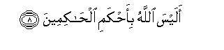

  
[Intangible Textual Heritage](../../index)  [Islam](../index) 
[Index](index)   
[Hypertext Qur'an](../htq/index)  [Unicode](../uq/095.htm#095_001) 
[Palmer](../sbe09/095)  [Pickthall](../pick/095.htm#095_001)  [Yusuf Ali
English](../yaq/yaq095)  [Rodwell](../qr/095)   
  
[Sūra XCV.: Tīn, or The Fig. Index](095)  
  [Previous](09401)  [Next](09601) 

------------------------------------------------------------------------

  
*The Holy Quran*, tr. by Yusuf Ali, \[1934\], at Intangible Textual
Heritage

------------------------------------------------------------------------

# Sūra XCV.: Tīn, or The Fig.

### Section 1

1. Wa**al**tteeni wa**al**zzaytoon**i**

1\. By the Fig  
And the Olive,

------------------------------------------------------------------------

2. Wa<u>t</u>oori seeneen**a**

2\. And the Mount  
Of Sinai,

------------------------------------------------------------------------

3. Wah<u>atha</u> albaladi al-ameen**i**

3\. And this City  
Of security,—

------------------------------------------------------------------------

4. Laqad khalaqn<u>a</u> al-ins<u>a</u>na fee a<u>h</u>sani
taqweem**in**

4\. We have [indeed](errata.htm#7) created man  
In the best of moulds,

------------------------------------------------------------------------

5. Thumma radadn<u>a</u>hu asfala s<u>a</u>fileen**a**

5\. Then do We abase him  
(To be) the lowest  
Of the low,—

------------------------------------------------------------------------

6. Ill<u>a</u> alla<u>th</u>eena <u>a</u>manoo waAAamiloo
a**l**<u>ssa</u>li<u>ha</u>ti falahum ajrun ghayru mamnoon**in**

6\. Except such as believe  
And do righteous deeds:  
For they shall have  
A reward unfailing.

------------------------------------------------------------------------

7. Fam<u>a</u> yuka<u>thth</u>ibuka baAAdu bi**al**ddeen**i**

7\. Then what can,  
After this, contradict thee  
As to the Judgment  
(To come)?

------------------------------------------------------------------------

8. Alaysa All<u>a</u>hu bi-a<u>h</u>kami al<u>ha</u>kimeen**a**  

8\. Is not God  
The wisest of Judges?

------------------------------------------------------------------------

[Next: Section 1 (1-19)](09601)

