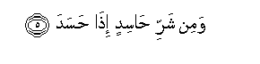

  
[Intangible Textual Heritage](../../index)  [Islam](../index) 
[Index](index)   
[Hypertext Qur'an](../htq/index)  [Unicode](../uq/113.htm#113_001) 
[Palmer](../sbe09/113)  [Pickthall](../pick/113.htm#113_001)  [Yusuf Ali
English](../yaq/yaq113)  [Rodwell](../qr/113)   
  
[Sūra CXIII: Falaq, or The Dawn. Index](113)  
  [Previous](11201)  [Next](11401) 

------------------------------------------------------------------------

  
*The Holy Quran*, tr. by Yusuf Ali, \[1934\], at Intangible Textual
Heritage

------------------------------------------------------------------------

# Sūra CXIII: Falaq, or The Dawn.

### Section 1

1. Qul aAAoo<u>th</u>u birabbi alfalaq**i**

1\. Say: I seek refuge  
With the Lord of the Dawn,

------------------------------------------------------------------------

2. Min sharri m<u>a</u> khalaq**a**

2\. From the mischief  
Of created things;

------------------------------------------------------------------------

3. Wamin sharri gh<u>a</u>siqin i<u>tha</u> waqab**a**

3\. From the mischief  
Of Darkness as it overspreads;

------------------------------------------------------------------------

4. Wamin sharri a**l**nnaff<u>a</u>th<u>a</u>ti fee alAAuqad**i**

4\. From the mischief  
Of those who practise  
Secret Arts:

------------------------------------------------------------------------

5. Wamin sharri <u>ha</u>sidin i<u>tha</u> <u>h</u>asad**a**

5\. And from the mischief  
Of the envious one  
As he practises envy.

------------------------------------------------------------------------

[Next: Section 1 (1-6)](11401)

