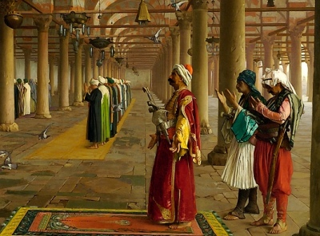

  
[Intangible Textual Heritage](../../index)  [Islam](../index)   
[Hypertext Qur'an](../htq/index)  [Unicode](../uq/index) 
[Palmer](../sbe06/index)  [Pickthall](../pick/index)  [Yusuf Ali
English](../yaq/index)  [Rodwell](../qr/index)   

------------------------------------------------------------------------

<table width="75%">
<colgroup>
<col style="width: 50%" />
<col style="width: 50%" />
</colgroup>
<tbody>
<tr class="odd">
<td width="50%" data-valign="TOP"></td>
<td width="50%" data-valign="CENTER"><h1 id="the-holy-quran" data-align="CENTER">The Holy Qur'an</h1>
<h4 id="arabic-text" data-align="CENTER">Arabic Text</h4>
<h5 id="arabic-pronunciation" data-align="CENTER">Arabic Pronunciation</h5>
<h4 id="english-text-by-a.-yusuf-ali" data-align="CENTER">English text by A. Yusuf Ali</h4></td>
</tr>
</tbody>
</table>

------------------------------------------------------------------------

[Contents](#contents)    [Start Reading](00101)

------------------------------------------------------------------------

This is the main Qur'an version at Intangible Textual Heritage. The
Arabic is presented as embedded graphics in the GIF format. To allow for
viewing on slower systems, each Surah is broken down into traditional
sections, which usually include about a dozen verses. Each verse is
presented in Arabic along with a pronunciation guide, and The Yusuf Ali
English text. The system used in the pronunciation guide can be viewed
in [this file](arabic.gif). This text is hyperlinked with other English
versions and transcriptions of the Qur'an at this site.

The Yusuf Ali English text is based on the 1934 book, The Holy Qur-an,
Text, Translation and Commentary, (published in Lahore, Cairo and
Riyadh). This version is widely used because it is a clear, modern and
eloquent translation by a well-respected Muslim scholar. The English
text was revised in 2009-10 to more closely match the source book. This
improved text is also available [here](../yaq/index), presented one
surah per file.

NOTICE. The English text presented here was free of copyright in the US
until 1996, at which point it had a pro-forma copyrighted status created
which will last until 2033. However in many countries, including its
original country of publication, Pakistan, this text is currently in the
public domain. Here's how this happened. Yusuf Ali died in 1952, and
Pakistan (his country of residence) has copyright rules of life+50. So
the Pakistan copyright expired in 2002. The Ali Qur'an English text was
first published in the US in 1946, but was never registered or renewed,
so it was never copyrighted in the US. The GATT copyright law granted US
copyrights to works not in the public domain in the country of
publication as of 1/1/1996, for a full term of 95 years from the date of
original publication. This includes works that were *never* copyrighted
in the US or whose US copyrights had already expired, in which category
this work falls. We are sure that Yusuf Ali labored on this work so that
the world could benefit from it, not to lock it up as someone's personal
intellectual property. However, if anyone can establish that they are
the copyright holder, we will promptly comply with their wishes.

------------------------------------------------------------------------

 [Sūra I.: Fātiḥa, or the Opening
Chapter.](001)  
[Sūra II.: Baqara, or the Heifer.](002)  
[Sūra III.: Āl-i-’Imrān, or The Family of ’Imrān.](003)  
[Sūra IV.: Nisāa, or The Women.](004)  
[Sūra V.: Māïda, or The Table Spread.](005)  
[Sūra VI.: An’ām, or Cattle.](006)  
[Sūra VII.: A’rāf, or the Heights](007)  
[Sūra VIII.: Anfāl, or the Spoils of War.](008)  
[Sūra IX.: Tauba (Repentance) or Barāat (Immunity).](009)  
[Sūra X.: Yūnus, or Jonah.](010)  
[Sūra XI.: Hūd (The Prophet Hūd).](011)  
[Sūra XII.: Yūsuf, or Joseph.](012)  
[Sūra XIII.: Ra’d, or Thunder.](013)  
[Sūra XIV.: Ibrāhīm, or Abraham.](014)  
[Sūra XV.: Al-Hijr, or The Rocky Tract.](015)  
[Sūra XVI.: Naḥl or The Bee.](016)  
[Sūra XVII.: Banī Isrā-īl, or the Children of Israel,](017)  
[Sūra XVIII.: Kahf, or the Cave.](018)  
[Sūra XIX.: Maryam, or Mary.](019)  
[Sūra XX.: Ṭā-Hā. (Mystic Letters, Ṭ. H.)](020)  
[Sūra XXI.: Anbiyāa, or The Prophets](021)  
[Sūra XXII.: Ḥajj, or The Pilgrimage.](022)  
[Sūra XXIII.: Mu-minūn, or The Believers.](023)  
[Sūra XXIV.: Nūr, or Light.](024)  
[Sūra XXV.: Furqān, or The Criterion.](025)  
[Sūra XXVI.: Shu‘arāa, or The Poets.](026)  
[Sūra XXVII.: Naml, or the Ants.](027)  
[Sūra XXVIII.: Qaṣaṣ, or the Narration.](028)  
[Sūra XXIX.: ‘Ankabūt, or the Spider](029)  
[Sūra XXX.: Rūm, or The Roman Empire.](030)  
[Sūra XXXI.: Luqmān (the Wise).](031)  
[Sūra XXXII: Sajda, or Adoration.](032)  
[Sūra XXXIII.: Aḥzāb, or The Confederates.](033)  
[Sūra XXXIV.: Sabā, or the City of Sabā](034)  
[Sūra XXXV.: Fāṭir, or The Originator of Creation; or Malāïka, or The
Angels.](035)  
[Sūra XXXVI.: Yā-Sīn (being Abbreviated Letters).](036)  
[Sūra XXXVII.: Ṣāffāt, or Those Ranged in Ranks.](037)  
[Sūra XXXVIII.: Ṣād (being one of the Abbreviated Letters).](038)  
[Sūra XXXIX.: Zumar, or the Crowds.](039)  
[Sūra XL.: Mū-min, or The Believer.](040)  
[Sūra XLI.: Ḥā-mīm (Abbreviated Letters), or Ḥā-Mīm Sajda, or
Fuṣṣilat](041)  
[Sūra XLII.: Shūrā, or Consultation.](042)  
[Sūra XLIII.: Zu<u>kh</u>ruf, or Gold Adornments.](043)  
[Sūra XLIV.: Du<u>kh</u>ān, or Smoke (or Mist.)](044)  
[Sūra XLV.: Ja<u>th</u>iya, or Bowing the Knee.](045)  
[Sūra XLVI.: Aḥqāf, or Winding Sand-tracts.](046)  
[Sūra XLVII.: Muḥammad (the Prophet).](047)  
[Sūra XLVIII.: Fat-ḥ or Victory.](048)  
[Sūra XLIX.: Ḥujurāt, or the Inner Apartments.](049)  
[Sūra L.: Qāf.](050)  
[Sūra LI.: Zāriyāt, or the Winds That Scatter.](051)  
[Sūra LII.: Ṭūr, or the Mount.](052)  
[Sūra LIII.: Najm, or the Star.](053)  
[Sūra LIV.: Qamar, or the Moon.](054)  
[Sūra LV.: Raḥmān, or (God) Most Gracious.](055)  
[Sūra LVI.: Wāqi‘a, or The Inevitable Event.](056)  
[Sūra LVII.: Ḥadīd, or Iron.](057)  
[Sūra LVIII.: Mujādila, or The Woman who Pleads.](058)  
[Sūra LIX.: Ḥa<u>sh</u>r, or The Gathering](059)  
[Sūra LX.: Mumtaḥana, or the Woman to be Examined.](060)  
[Sūra LXI.: Ṣaff, or Battle Array.](061)  
[Sūra LXII.: Jumu‘a, or the Assembly (Friday) Prayer.](062)  
[Sūra LXIII.: Munāfiqūn, or the Hypocrites.](063)  
[Sūra LXIV.: Tagābun, or Mutual Loss and Gain.](064)  
[Sūra LXV.: Ṭalāq, or Divorce.](065)  
[Sūra LXVI.: Taḥrīm, or Holding (something) to be Forbidden.](066)  
[Sūra LXVII.: Mulk, or Dominion.](067)  
[Sūra LXVIII.: Qalam, or the Pen, or Nūn.](068)  
[Sūra LXIX.: Ḥāqqa, or the Sure Reality.](069)  
[Sūra LXX.: Ma‘ārij, or the Ways of Ascent.](070)  
[Sūra LXXI.: Nūḥ, or Noah.](071)  
[Sūra LXXII.: Jinn, or the Spirits.](072)  
[Sūra LXXIII.: Muzzammil, or Folded in Garments.](073)  
[Sūra LXXIV.: Mudda<u>thth</u>ir, or One Wrapped Up.](074)  
[Sūra LXXV.: Qiyāmat, or the Resurrection.](075)  
[Sura LXXVI.: Dahr, or Time, or Insān, or Man.](076)  
[Sūra LXXVII.: Mursalāt, or Those Sent Forth.](077)  
[Sūra LXXVIII.: Nabaa, or The (Great) News.](078)  
[Sara LXXIX.: Nāzi’āt, or Those Who Tear Out.](079)  
[Sūra LXXX.: ’Abasa, or He Frowned.](080)  
[Sūra LXXXI.: Takwīr, or the Folding Up.](081)  
[Sūra LXXXII.: Infiṭār, or The Cleaving Asunder.](082)  
[Sūra LXXXIII.: Taṭfīf, or Dealing in Fraud.](083)  
[Sūra LXXXIV.: Inshiqāq, or The Rending Asunder.](084)  
[Sūra LXXXV.: Burūj, or The Zodiacal Signs.](085)  
[Sūra LXXXVI.: Ṭāriq, or The Night-Visitant.](086)  
[Sūra LXXXVII.: A’lā, or The Most High.](087)  
[Sūra LXXXVIII.: <u>G</u>āshiya, or The Overwhelming Event.](088)  
[Sūra LXXXIX.: Fajr, or The Break of Day.](089)  
[Sūra XC.: Balad, or The City.](090)  
[Sūra XCI.: Shams, or The Sun.](091)  
[Sūra XCII.: Lail, or The Night.](092)  
[Sūra XCIII.: <u>Dh</u>uhā, or The Glorious Morning Light.](093)  
[Sūra XCIV.: Inshirāḥ, or The Expansion.](094)  
[Sūra XCV.: Tīn, or The Fig.](095)  
[Sūra XCVI.: Iqraa, or Read! or Proclaim!](096)  
[Sūra XCVII.: Qadr, or The Night of Power (or Honour).](097)  
[Sūra XCVIII.: Baiyina, or The Clear Evidence.](098)  
[Sūra XCIX.: Zilzāl, or The Convulsion.](099)  
[Sūra C.: ’Adiyāt, or Those that run.](100)  
[Sūra CI.: Al-Qāri’a, or The Day of Noise and Clamour.](101)  
[Sūra CII.: Taka<u>th</u>ur or Piling Up.](102)  
[Sūra CIII.: ’Aṣr, or Time through the Ages.](103)  
[Sūra CIV.: Humaza, or the Scandal-monger.](104)  
[Sūra CV.: Fīl, or The Elephant.](105)  
[Sūra CVI.: Quraish or The Quraish, (Custodians of the Ka’ba).](106)  
[Sūra CVII.: Mā’ūn, or Neighbourly Needs.](107)  
[Sūra CVIII.: Kau<u>th</u>ar, or Abundance.](108)  
[Sūra CIX: Kāfirūn, or Those who reject Faith.](109)  
[Sūra CX.: Naṣr, or Help.](110)  
[Sūra CXI.: Lahab, or (the Father of) Flame.](111)  
[Sūra CXII.: I<u>kh</u>lāṣ, or Purity (of Faith).](112)  
[Sūra CXIII: Falaq, or The Dawn.](113)  
[Sūra CXIV.: Nās, or Mankind.](114)  
