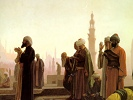

  
[Intangible Textual Heritage](../../index)  [Islam](../index) 
[Index](index)  [Previous](rok15)  [Next](rok17) 

------------------------------------------------------------------------

[Buy this Book at
Amazon.com](https://www.amazon.com/exec/obidos/ASIN/B00295RH82/internetsacredte)

------------------------------------------------------------------------

  
*The Religion of the Koran*, by Arthur N. Wollaston, \[1911\], at
Intangible Textual Heritage

------------------------------------------------------------------------

p. 61

### FASTING

CHAPTER II., Verse 179.—There is prescribed for you the fast as it was
prescribed for those before you; haply ye may fear. (180) A certain
number of days, but he amongst you who is ill or on a journey, then (let
him fast) another number of days. And those who are fit to fast may
redeem it by feeding a poor man; but he who follows an impulse to a good
work it is better for him; and if ye fast it is better for you, if ye
did but know.

The month of Ramazan, wherein was revealed the Koran, for a guidance to
men, and for manifestations of guidance, and for a discrimination. And
he amongst you who beholds this month then let him fast it; but he who
is sick or on a journey, then another number of days—God desires for you
what is easy, and desires not for you what is difficult—that ye may
complete the number and say, "Great is God," for that He has guided you;
haply ye may give thanks.

------------------------------------------------------------------------

[Next: Pilgrimage to Mecca](rok17)
