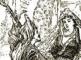
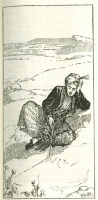

  
[Intangible Textual Heritage](../../index)  [Islam](../index) 
[Index](index)  [Previous](saab03)  [Next](saab05) 

------------------------------------------------------------------------

  
*Salaman and Absal*, by Jami, tr. Edward Fitzgerald, \[1904\], at
Intangible Textual Heritage

------------------------------------------------------------------------

p. 4

### II.

And yet how long, Jámi, in this Old House  
Stringing thy Pearls upon a Harp of Song?  
Year after Year striking up some new Song,  
The Breath of some Old Story? Life is gone,  
And yet the Song is not the Last; my Soul  
Is spent—and still a Story to be told!  
And I, whose Back is crookéd as the Harp  
I still keep tuning through the Night till Day!  
That Harp untun’d by Time—the Harper's hand  
Shaking with Age—how shall the Harper's hand  
Repair its cunning, and the sweet old Harp  
Be modulated as of old? Methinks  
’Tis time to break and cast it in the Fire;  
Yea, sweet the Harp that can be sweet no more,  
To cast it in the Fire—the vain old Harp  
That can no more sound Sweetness to the Ear,  
But burn’d may breathe sweet Attar to the Soul,  
And comfort so the Faith and Intellect,  
Now that the Body looks to Dissolution.  
My Teeth fall out—my two Eyes see no more  
Till by Feringhi Glasses turn’d to Four;  
Pain sits with me sitting behind my knees,

p. 5

From which I hardly rise unhelpt of hand;  
I bow down to my Root, and like a Child  
Yearn, as is likely, to my Mother Earth,  
With whom I soon shall cease to moan and weep,  
And on my Mother's Bosom fall asleep.

 

The House in Ruin, and its Music heard  
No more within, nor at the Door of Speech,  
Better in Silence and Oblivion  
To fold me Head and Foot, remembering  
What that Beloved to the Master
whisper’d:—  
"No longer think of Rhyme, but think of Me!"—  
Of Whom?—of Him whose Palace The Soul is,  
And Treasure-House—who notices and knows  
Its Income and Out-going, and *then* comes  
To fill it when the Stranger is departed.  
Whose Shadow being Kings—whose
Attributes  
The Type of Theirs—their Wrath and Favour His  
Lo! in the Celebration of His Glory.  
The King Himself come on me unaware,  
And suddenly arrests me for his own.  
Wherefore once more I take—best quitted else  
The Field of Verse, to chaunt that double Praise,  
And in that Memory refresh my Soul  
Until I grasp the Skirt of Living Presence.

p. 6

One who travel’d in the Desert  
Saw Majnún where he was sitting  
All alone like a Magician  
Tracing Letters in the Sand.  
"Oh distracted Lover! writing  
"What the Sword-wind of the Desert  
"Undecyphers soon as written,  
"So that none who travels after  
"Shall be able to interpret!"—  
Majnún answer’d, "I am writing  
"'Laili'—were it only 'Laili,'  
"Yet a Book of Love and Passion;  
"And, with but her Name to dote on,  
"Amorously I caress it  
"As it were Herself, and sip  
"Her Presence till I drink her Lip."

  [  
Click to enlarge](img/00600.jpg)

------------------------------------------------------------------------

[Next: III](saab05)
