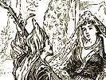

  
[Intangible Textual Heritage](../../index)  [Islam](../index) 
[Index](index)  [Previous](saab08)  [Next](saab10) 

------------------------------------------------------------------------

  
*Salaman and Absal*, by Jami, tr. Edward Fitzgerald, \[1904\], at
Intangible Textual Heritage

------------------------------------------------------------------------

p. 15

### VII.

The Sage his Satire ended; and The Shah  
With Magic-mighty Wisdom his pure Will  
Leaguing, its Self-fulfilment wrought from Heaven.  
And Lo! from Darkness came to Light A
Child,  
Of Carnal Composition Unattaint,—  
A Rosebud blowing on the Royal Stem,—  
A Perfume from the Realm of Wisdom wafted;  
The Crowning Jewel of the Crown; a Star  
Under whose Augury triumph’d the Throne.  
For whose Auspicious Name they clove the Words  
"Salámat"—Incolumity from Evil—  
And "Ausemán"—the Heav’n from which he
came  
And hail’d him by the title of Salámán.  
And whereas from no Mother Milk he drew,  
They chose for him a Nurse—her name Absál—  
Her Years not Twenty—from the Silver Line  
Dividing the Musk-Harvest of her Hair  
Down to her Foot that trampled Crowns of Kings,  
A Moon of Beauty Full; who thus elect  
Salámán of Auspicious Augury  
Should carry in the Garment of her Bounty,

p. 16

Should feed Him with the Flowing of her Breast.  
As soon as she had opened Eyes on him  
She closed those Eyes to all the World beside,  
And her Soul crazed, a-doting on her Jewel,  
Her Jewel in a Golden Cradle set;  
Opening and shutting which her Day's Delight,  
To gaze upon his Heart-inflaming Cheek,  
Upon the Darling whom, could she, she would  
Have cradled as the Baby of her Eye.  
In Rose and Musk she wash’d him—to his Lips  
Press’d the pure Sugar from the Honeycomb;  
And when, Day over, she withdrew her Milk,  
She made, and having laid him in, his Bed,  
Burn’d all Night like a Taper o’er his Head.

Then still as Morning came, and as he grew,  
She dress’d him like a Little Idol up;  
On with his Robe—with fresh Collyrium Dew  
Touch’d his Narcissus Eyes—the Musky Locks  
Divided from his Forehead—and embraced  
With Gold and Ruby Girdle his fine Waist.—

p. 17

So rear’d she him till full Fourteen his Years,  
Fourteen-day full the Beauty of his Face,  
That rode high in a Hundred Thousand Hearts;  
Yea, when Salámán was but Half-lance
high,  
Lance-like he struck a wound in every One,  
And burn’d and shook down Splendour like a Sun.

------------------------------------------------------------------------

[Next: VIII](saab10)
