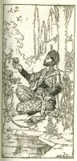

  
[Intangible Textual Heritage](../../index)  [Islam](../index) 
[Index](index)  [Previous](saab10)  [Next](saab12) 

------------------------------------------------------------------------

  
*Salaman and Absal*, by Jami, tr. Edward Fitzgerald, \[1904\], at
Intangible Textual Heritage

------------------------------------------------------------------------

p. 20

### IX.

Suddenly that Sweet Minister of mine  
Rebuked me angrily; "What Folly, Jámi,  
"Wearing that indefatigable Pen  
"In celebration of an Alien Shah  
"Whose Throne, not grounded in the Eternal World,  
"Yesterday was, To-day is not!" I answer’d;  
Oh Fount of Light!—under an Alien Name  
"1 shadow One upon whose Head the Crown  
"Both Was and Is To-day; to whose Firmán  
"The Seven Kingdoms of the World are subject,  
"And the Seas Seven but droppings of his Largess.  
"Good luck to him who under other Name  
"Taught us to veil the Praises of a Power  
"To which the Initiate scarce find open Door."

Sat a Lover solitary  
Self-discoursing in a Corner,  
Passionate and ever-changing  
Invocation pouring out;  
Sometimes Sun and Moon; and sometimes  
Under Hyacinth half-hidden  
Roses; or the lofty Cypress,  
And the little Weed below.  
Nightingaling thus a Noodle  
Heard him, and, completely puzzled,  
"What!" quoth he, "And you, a Lover,  
"Raving not about your Mistress,  
"But about the Moon and Roses!"  
Answer’d he; "Oh thou that aimest

  [  
Click to enlarge](img/02000.jpg)

p. 21

"Wide of Love, and Lover's Language  
"Wholly misinterpreting;  
"Sun and Moon are but my Lady's  
"Self, as any Lover knows;  
"Hyacinth I said, and meant her  
a Hair—her Cheek was in the Rose—  
"And I myself the wretched Weed  
"That in her Cypress Shadow grows."

------------------------------------------------------------------------

[Next: X](saab12)
