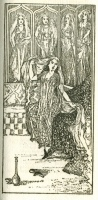

  
[Intangible Textual Heritage](../../index)  [Islam](../index) 
[Index](index)  [Previous](saab11)  [Next](saab13) 

------------------------------------------------------------------------

  
*Salaman and Absal*, by Jami, tr. Edward Fitzgerald, \[1904\], at
Intangible Textual Heritage

------------------------------------------------------------------------

### X.

Now was Salámán in his Prime of Growth,  
His Cypress Stature risen to high Top,  
And the new-blooming Garden of his Beauty  
Began to bear; and Absál long’d to gather;  
But the Fruit grew upon too high a Bough,  
To which the Noose of her Desire was short.  
She too rejoiced in Beauty of her own  
No whit behind Salámán, whom she now  
Began enticing with her Sorcery.  
Now from her Hair would twine a musky Chain,  
To bind his Heart—now twist it into Curls  
Nestling innumerable Temptations;  
Doubled the Darkness of her Eyes with Surma  
To make him lose his way, and over them  
Adorn’d the Bows that were to shoot him then;  
Now to the Rose-leaf of her Cheek would add  
Fresh Rose, and then a Grain of Musk lay there,  
The Bird of the Belovéd Heart to snare.

p. 22

Now with a Laugh would break the Ruby Seal  
That lockt up Pearl; or busied in the Room  
Would smite her Hand perhaps—on that pretence  
To lift and show the Silver in her Sleeve;  
Or hastily rising clash her Golden Anclets  
To draw the Crownéd Head under her Feet.  
Thus by innumerable Bridal wiles  
She went about soliciting his Eyes,  
Which she would scarce let lose her for a Moment;  
For well she knew that mainly by The
Eye  
Love makes his Sign, and by no other Road  
Enters and takes possession of the Heart.

Burning with Desire Zulaikha  
Built a Chamber, Wall and Ceiling  
Blank as an untarnisht Mirror,  
Spotless as the Heart of Yúsuf.  
Then she made a cunning Painter  
Multiply her Image round it;  
Not an Inch of Wall but echoed  
With the Reflex of her Beauty.  
Then amid them all in all her  
Glory sat she down, and sent for  
Yúsuf—she began a Tale  
Of Love—and Lifted up her Veil.  
From her Look he turn’d, but turning  
Wheresoever, ever saw her  
Looking, looking at him still.  
Then Desire arose within him—  
He was almost yielding—almost  
Laying Honey on her Lip—  
When a Signal out of Darkness  
Spoke to him—and he withdrew  
His Hand, and dropt the Skirt of Fortune.

  [  
Click to enlarge](img/02200.jpg)

------------------------------------------------------------------------

[Next: XI](saab13)
