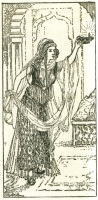

  
[Intangible Textual Heritage](../../index)  [Islam](../index) 
[Index](index)  [Previous](saab19)  [Next](saab21) 

------------------------------------------------------------------------

  
*Salaman and Absal*, by Jami, tr. Edward Fitzgerald, \[1904\], at
Intangible Textual Heritage

------------------------------------------------------------------------

### XVIII.

Unto the Soul that is confused by Love  
Comes Sorrow after Sorrow—most of all  
To Love whose only Friendship is Reproof,  
And overmuch of Counsel—whereby Love  
Grows stubborn, and increases the Disease.  
Love unreproved is a delicious food;  
Reproved, is Feeding on one's own Heart's Blood.

p. 31

  [  
Click to enlarge](img/03100.jpg)

Salámán heard; his Soul came to his
Lips;  
Reproaches struck not Absál out of him,  
But drove Confusion in; bitter became  
The Drinking of the sweet Draught of Delight,  
And wan’d the Splendour of his Moon of Beauty.  
His Breath was Indignation, and his Heart  
Bled from the Arrow, and his Anguish grew  
How bear it?—Able to endure one wound,  
From Wound on Wound no remedy but Flight;  
Day after Day, Design upon Design,  
He turn’d the Matter over in his Heart,  
And, after all, no Remedy but Flight.  
Resolv’d on that, he victuall’d and equipp’d  
A Camel, and one Night he led it forth,  
And mounted—he and Absál at his side,  
The fair Salámán and Absál the Fair,  
Together on one Camel side by side,  
Twin Kernels in a single Almond packt.  
And True Love murmurs not, however small  
His Chamber—nay, the straitest best of all.

When the Moon of Canaan Yúsuf  
Darken’d in the Prison of Ægypt,  
Night by Night Zulaikha went  
To see him—for her Heart was broken.  
Then to her said One who never  
Yet had tasted of Love's Garden:  
"Leavest thou thy Palace-Chamber  
"For the Felon's narrow Cell?"  
Answer’d She, "Without my Lover,  
"Were my Chamber Heaven's Horizon,  
"It were closer than an Ant's eye i  
"And the Ant's eye wider were  
"Than Heaven, my Lover with me there!"

------------------------------------------------------------------------

[Next: XIX](saab21)
