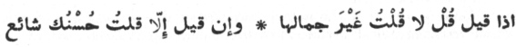

  
[Intangible Textual Heritage](../../index)  [Islam](../index) 
[Index](index)  [Previous](siim07)  [Next](siim09) 

------------------------------------------------------------------------

[Buy this Book at
Amazon.com](https://www.amazon.com/exec/obidos/ASIN/0548805903/internetsacredte)

------------------------------------------------------------------------

  
*Studies in Islamic Mysticism*, by Reynold A. Nicholson, \[1921\], at
Intangible Textual Heritage

------------------------------------------------------------------------

#### I. ESSENCE, ATTRIBUTE, AND NAME

The Absolute Essence (*Dhát*), or the Essence of God, is that to which
names and attributes belong in their real nature, not as they appear in
existence [1](#fn_247). It denotes the self
(*nafs*) of God whereby He exists, for He is self-subsistent. It is
endowed with all the names and ideas which His perfection demands.
Amongst these are infinity and incomprehensibility. No words can express
or hint what the Essence is, since it has no opposite or like. In its
absoluteness it annuls all the contradictions which, as the universal
ground of individualisation, it includes [2](#fn_248).

I am convinced that It (the Essence) is non-existence, since by
existence It was manifested [3](#fn_249).  
Thought hath beheld It from afar as a power exerting itself in
existence.  
It is not other than a wall, wherein is set for thee a store of
treasures. I am that wall, and It is the hidden treasure—hidden in order
that I may find it by digging.  
Take It then, to be a body in respect of an outward form (which It
assumes), while to that body It is a spirit, that thou mayst regard it
(the body).

p. 90

God made Its comeliness (*ḥusn*) complete [1](#fn_250), and by the beauty (*jamál*) of God It
became celebrated (known to all).  
It never subsisted (as an object) but in thee alone [2](#fn_251): perceive the Word (*Amr*) [3](#fn_252), that thou mayst see its diverse
forms [4](#fn_253).

I am the existent and the non-existent and the naughted and the
everlasting.  
I am the awared and the imagined and the snake and the charmer.  
I am the loosed and the bound and the wine and the cupbearer.  
I am the treasure, I am poverty, I am my creatures and my Creator.  
\*     \*     \*     \*     \*     \*  
Neither affirm my existence nor deny it, O immortal one!  
Do not suppose thyself different from me or deem thyself the eye of my
eye-corners.  
\*     \*     \*     \*     \*     \*  
And say, "That am I, yet in respect of my qualities and natural
dispositions That I am not [5](#fn_254)."

Jílí defines the attribute (*ṣifat*) of a thing as that which conveys
knowledge of its state to the understanding [6](#fn_255). The attributes of the Essence are the
forms of thought by which it is manifested and made known. In the world
of appearance we distinguish the forms from the reality underlying them,
but the distinction is not ultimate: the attributes in their real nature
are identical with the Essence which manifests itself as "other,"
*i.e.*, under the aspect of externality, to our perceptions [7](#fn_256). What is called in theology the creation
of the world is just this manifestation, accompanied by division and
plurality, of the Essence as the attributes, or of Being as the object
of thought; and in reality the Essence is the attributes (*al-Dhát ‘aynu
’l-ṣifát*). The universe is an idea—"such stuff as dreams are made on,"
although the idea cannot properly be differentiated from the
"thing-in-itself," except for convenience of understanding. Here let me
translate part of the

p. 91

\[paragraph continues\] 57th chapter,
"Concerning thought (*khayál*), how it is the material (*hayúlá*, ὕλη)
of the Cosmos [1](#fn_257)."

Thought is the life of the spirit of the universe: it is the foundation
of that life, and its (Thought's) foundation is Man.  
To him that knows Thought through the power of the Almighty, existence
is nothing but a thought.  
Sensation, before its appearance, is an object of thought to thee, and
if it goes it resembles a dream.  
And, similarly, the time during which it is felt inheres in our
consciousness upon a foundation (of thought).  
Be not deceived by sensation, for it is an object of thought
(*mukhayyal*), and so is the reality (which every form expresses) and
the whole universe,  
And likewise, to him that knows the truth, the worlds of *malakút* and
*jabarút*, and the divine nature (*láhút*) and the human nature
(*násút*).  
Do not despise the rank of Thought, for it is the very gist of the
notion [2](#fn_258) of the Being who disposes
all.

Know that Thought is the origin of existence and is
the essence wherein God is manifested perfectly. Consider your own
belief in God and in His having the attributes and names which belong to
Him. Where is the locus (*maḥall*) of this belief, in which God is made
manifest to you? It is Thought. Therefore we said that Thought is the
essence wherein He becomes manifest in perfection. If you recognise
this, it will be plain to you that Thought is the origin of the whole
universe, because God is the origin of all things, and their most
perfect manifestation occurs nowhere but in a locus which is the origin
(of His manifestation); and that locus is Thought. Mark how the Prophet
considered the sensible world to be a dream—and dream is a thought—and
said, "Mankind are asleep, and when they die, they awake," *i.e.*, the
reality in which they were during their earthly life is manifested to
them, and they

p. 92

perceive that they were asleep. Not that death
brings a complete awakening. Forgetfulness (*ghaflat*) of God prevails
over those in the intermediate state (*barzakh*) and those in the place
of Judgment and those in Hell and Paradise, until God reveals Himself to
them on the Hill to which the inhabitants of Paradise go forth and
behold Him. This forgetfulness is the sleep (mentioned by the Prophet).
The universe, then, has its origin in a thought, and for this reason
Thought determines the individuals therein: all, whatever their sphere
of existence, are determined by Thought. For example, the people of this
world are determined by thought of their life as it is now or as it
shall be hereafter; in either case, they are forgetful of presence with
God (*al-ḥuḍúr ma‘ Allah*): they are asleep. He that is present with God
is awake according to the measure of his presence.…The sleep of the
inhabitants of the next world is lighter, but although they are with God
in respect that He is with all beings and says (in the Koran), "He is
with you wheresoever ye be," yet are they with Him in sleep, not in
waking. One that, by divine predestination, enjoys in this world what
shall at last be shown on the Hill to the people of Paradise, so that
God reveals Himself to him and he knows God—that man is (truly) awake.
If you perceive that those in every world are judged to be asleep, then
judge that all those worlds are a thought, inasmuch as Sleep is the
world of Thought.

 

The comparison with dream-experience does not imply that the universe is
unreal, but that it is reality as *presented to itself through and in
the cosmic consciousness of the Perfect Man*, which holds all the
attributes of reality together. This, we have already noted, is the
central doctrine of the work before us. Other men lack such
consciousness: they regard the sum of attributes constituting the
"material" world as something different from the Essence and from
themselves.

In the unitive state there is immediate perception of the Essence, but
no mystic perceives the attributes as they really are: you can feel
intuitively that you are He, that the Divine essence is consubstantial
(*‘ayn*) with your own, and thereby attain to knowledge of the Essence;
you cannot, however, perceive and know the attributes of the Essence any
more than you can perceive and know the qualities latent in yourself,

p. 93

which are only visible in their effects. Consequently it may be said
that the Essence is imperceptible, in the sense of its being identical
with the attributes [1](#fn_259).

The name (*ism*) objectifies the named (*musammá*) in the understanding,
pictures it in the mind, presents it to the judgment, moves it in
reflection and keeps it in memory [2](#fn_260).
It serves to make unknown things known; therefore, its relation to the
named is that of the outward to the inward, and in this respect it is
identical with the named. Some things exist in name and not otherwise;
thus, the existence of the *‘Anqá* [1](#fn_259)
is entirely nominal: the "named" in this case is not-being. God, on the
contrary, is real Being; and just as our knowledge of the *‘Anqá* is
derived from its name, so we reach knowledge of God through the name
Allah, in which all the Divine names and attributes are comprised [3](#fn_261).

God made this name a mirror for man, so that when he
looks in it, he knows the true meaning of "God was and there was naught
beside Him," and in that moment it is revealed to him that his hearing
is God's hearing, his sight God's sight, his speech God's speech, his
life God's life, his knowledge God's knowledge, his will God's will, and
his power God's power, and that God possesses all these attributes
fundamentally; and then he knows that all the aforesaid qualities are
borrowed and metaphorically applied to himself, whereas they really
belong to God [4](#fn_262).

The Divine names are either names of the Essence, *e.g.*, *al-Aḥad* (the
One), or names of the attributes, *e.g.*, *al-Raḥmán* (the Merciful),
*al-‘Alím* (the Knowing). Each of them—except *al-Aḥad*, which
transcends relationship—brings forth the effect (*athar*) inherent in
that particular aspect of the Essence of which it is, so to speak, the
embodiment. Good and evil, faith and infidelity, all mundane life,
thought, feeling, and action proceed inevitably from the Divine
names [5](#fn_263).

------------------------------------------------------------------------

### Footnotes

[89:1](siim08.htm#fr_247) K I. 18.

[89:2](siim08.htm#fr_248) Cf. the passage (I.
20, 23 foll.) translated on p. 83.

[89:3](siim08.htm#fr_249) The concept of
existence involves non-existence as its logical complement. God, in
virtue of His name, "the Outward" (*al-Ẓáhir*), is identical with all
existing objects, while in virtue of His name, "the Inward" (*al-Báṭin*)
He is non-existent externally. Cf. the saying of Hegel, "Being and
not-Being are identical," *i.e.*, no distinctions are absolute.

[90:1](siim08.htm#fr_250) Jamál denotes the
attribute of Divine Beauty, *ḥusn* its outward manifestation. Cf. Jílí's
verse (in his *‘Ayniyya*):

 

[90:2](siim08.htm#fr_251) In Man, the
microcosm.

[90:3](siim08.htm#fr_252) *I.e.* the Logos.

[90:4](siim08.htm#fr_253) K I. 8, 18 foll.

[90:5](siim08.htm#fr_254) K I. 9, 11 foll.

[90:6](siim08.htm#fr_255) K I. 27, 26.

[90:7](siim08.htm#fr_256) Cf. K I. 81, 2 foll.

[91:1](siim08.htm#fr_257) K II. 32, last line.
*Khayál* is imaginal thought (phantasy). It includes all that is
perceived by the mind in an ideal or material form. Mystics hold that
God reveals Himself in five planes (*ḥaḍarát*): (1) the plane of the
Essence, (1) the plane of the Attributes, (3) the plane of the Actions,
(4) the plane of Similitudes and Phantasy (*khayál*), (5) the plane of
sense and ocular vision. Each of these is a copy of the one above it, so
that whatever appears in the sensible world is the symbol of an unseen
reality. Cf. *Fuṣúṣ*, 110.

[91:2](siim08.htm#fr_258) *Ḥaqíqa*, *i.e.*, the
attributes by which Pure Being is individualised.

[93:1](siim08.htm#fr_261) K I. 28, 21 foll.

[93:2](siim08.htm#fr_260) K I. 21, 4 fr. foot.

[93:3](siim08.htm#fr_262) Cf. the theory and
practice of *dhikr*. The doctrine that the "named" is revealed by means
of the name, which is its obverse or outward self, has played a great
part in Ṣúfism.

[93:4](siim08.htm#fr_263) K I. 22, 20 foll.

[93:5](siim08.htm#fr_264) Cf. Ibnu ’l-‘Arabí's
definition of *ism* (*Ta‘rífát* of Jurjání, ed. by Flügel, p. 293) as
"the Divine name that rules a passing state of mystical feeling p. 94 (*ḥál*)," and the definitions of terms like
*‘abdullah*, *‘abdu ’l-Raḥím*, *‘abdu ’l-Malik*, etc., in the
*Iṣṭiláḥátu ’l-Ṣúfiyya* of ‘Abdu ’l-Razzáq al-Káshání, ed. by Sprenger,
p. 91 foll.

------------------------------------------------------------------------

[Next: II. The Descent of the Absolute](siim09)
