  
[Intangible Textual Heritage](../../index)  [Islam](../index) 
[Index](index)  [Previous](siim14)  [Next](siim16) 

------------------------------------------------------------------------

[Buy this Book at
Amazon.com](https://www.amazon.com/exec/obidos/ASIN/0548805903/internetsacredte)

------------------------------------------------------------------------

[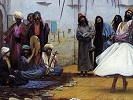](index)  
*Studies in Islamic Mysticism*, by Reynold A. Nicholson, \[1921\], at
Intangible Textual Heritage

------------------------------------------------------------------------

p. 143

### APPENDIX I

### JÍLÍ'S ‘AYNIYYA

Mention has been made ([p. 99](siim10.htm#page_99), note
[2](siim10.htm#fn_288) *supra*) of Jílí's ode entitled al-Nawádiru ’l-‘
ayniyya fi ’l-bawádiri ’l-ghaybiyya. In the *Insánu ’l-Kámil* he cites
36 of its 534 verses (I. 30, 3; 39, 6 fr. foot; 52, 17; 66, 19; and 76,
15) and describes it as a magnificent and unique composition, too
sublime to be fully understood. It is, however, little more than a
versified summary of matter set forth in the *Insánu ’l-Kámil*, though
in some instances the author expresses himself with a freedom and
boldness which would hardly be tolerated in a prose treatise. As a poem,
apart from its ungraceful style, it suffers from expounding a theory of
mystical philosophy and cannot bear comparison with Ibnu ’l-Fáriḍ's
*Tá’iyya*—the poetry of pure mysticism. The extracts given below have
been copied from a manuscript in the British Museum (Or. 3684; Rieu's
Suppl. to the Catalogue of Arabic MSS. No. 245) containing the text
together with a commentary by ‘Abdu ’l-Ghaní al-Nábulusí.

  [  
Click to enlarge](img/14300.jpg)  
1 (f. 130 b)  

*v*. ٢. Instead of "there is no god but Allah" the poet says, "there is
nothing but Absolute Beauty (*jamál*) and phenomenal beauty (*ḥusn*),"
these being the inward and outward aspects of the Beloved.

p. 144

  [  
Click to enlarge](img/14400.jpg)  
2 (f. 139 b)  

*vv*. ٧–٦. The individualisations of the Divine Essence are named "the
creatures of God," but in reality they are no other than the Essence
itself.

*v*. ١١. K (1. 76, 16):  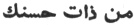.

*v*. ١٣. The MS. and K read 
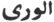.

p. 145

  [  
Click to enlarge](img/14500.jpg)  
3 (f. 146 b)  

*v*. ١٦. The MS. reads  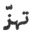
for  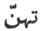.

*v*. ٢٠. The rhyme in this poem is *muqayyad*. Even Jílí could not have
written  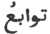 here, or  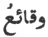, (4, *v*. ٢٢). He neglects the
rule that in this form of Ṭawíl the third foot of the second hemistich
should be   ̆  ̄  ̆ (not   ̆  ̄  ̄).

p. 146

  [  
Click to enlarge](img/14600.jpg)  
4 (f. 156 a)  

*v*. ١,  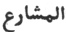 variant  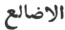.

*v*. ٦. MS.  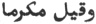. Cf. [p.
123](siim12.htm#page_123) *supra*.

*v*. ٨ foll. The terms "ascent" and "descent" are improperly applied to
the spirit, which has its being in God (
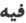 in *v*. ١. means 
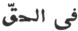). In order to distinguish it from God, we say that it
is particularised and individualised, *i.e.* created; and we give the
name of "spirit" to this individualisation, by means of which God
displays Himself as in a mirror.

*v*. ١٤.  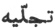 is a correction
of the MS. reading  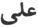.

p. 147

  [  
Click to enlarge](img/14700.jpg)  
4 (f. 156 a) (cont.)  

  [  
Click to enlarge](img/14701.jpg)  
5 (f. 161 b)  

*v*. ٢١ MS.  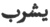.

*v*. ٢ foll. Cf. [p. 151](siim16.htm#page_151) *infra*.

*v*. ١٢ foll. Cf. [p. 126](siim13.htm#page_126) *supra*.

p. 148

  [  
Click to enlarge](img/14800.jpg)  
5 (f. 161 b) (cont.)  

  [  
Click to enlarge](img/14801.jpg)  
6 (f. 170 b)  

------------------------------------------------------------------------

[Next: Appendix II. Some Notes On The *Fuṣúṣu ’l-Ḥikam*](siim16)
