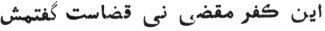

  
[Intangible Textual Heritage](../../index)  [Islam](../index) 
[Index](index)  [Previous](siim15)  [Next](siim17) 

------------------------------------------------------------------------

[Buy this Book at
Amazon.com](https://www.amazon.com/exec/obidos/ASIN/0548805903/internetsacredte)

------------------------------------------------------------------------

  
*Studies in Islamic Mysticism*, by Reynold A. Nicholson, \[1921\], at
Intangible Textual Heritage

------------------------------------------------------------------------

p. 149

### APPENDIX II

### SOME NOTES ON THE FUṢÚṢU ’L-ḤIKAM [1](#fn_461)

I have already referred to the work of Ibnu ’l-‘Arabí, bearing a title
which may be rendered "The Bezels of Divine Wisdom," and have pointed
out that its subject-matter coincides, to a large extent, with that of
the *Insánu ’l-Kámil*, while both writers are not only inspired by the
same mystical philosophy but use similar methods in order to develop
their ideas [2](#fn_462). The following notes,
inadequate as they are, will at least show the magnitude of Jílí's debt
to his predecessor, besides making clearer some fundamental principles
which in the *Insánu ’l-Kámil* are assumed rather than expounded. The
*Fuṣúṣ* purports to be a treatise on the nature of God as manifested
through prophecy, each of its 27 chapters being attached to the logos
(*kalima*) of a prophet typifying a particular Divine attribute. Since
God does not reveal Himself completely except in Man, the first chapter
treats of Adam as the microcosm, the Perfect Man, the absolute mirror of
Divinity. Often Ibnu ’l-‘Arabí takes a text of the Koran and elicits his
doctrine from it in a fashion well known to students of Philo and
Origen. The theories set forth in the *Fuṣúṣ* are difficult to
understand and even more difficult to explain. Many years ago I
translated the greater part of the work, with the commentary by ‘Abdu
’l-Razzáq al-Káshání, for my own use, but the author's language is so
technical, figurative, and involved that a literal reproduction would
convey very little. On the other hand, if we reject his terminology, we
shall find it impossible to form any precise notion of his ideas. By
collecting and arranging illustrative passages and by availing myself of
the commentator's aid I may, perhaps, throw some light on a peculiarly
recondite phase of mystical scholasticism.

p. 150

The Divine Essence, which is all that exists, may be regarded from two
aspects: (*a*) as a pure, simple, attributeless essence; (*b*) as an
essence endowed with attributes. God, considered absolutely, is beyond
relation and therefore beyond knowledge—the Neoplatonic One,
inconceivable and ineffable. From this point of view God, in a sense, is
not God. "Some philosophers and Abú Ḥámid (al-Ghazálí) have asserted
that God is known without reference to the universe, but they are
mistaken. An eternal Essence is known, but it is not known to be a god,
*i.e.*, an object of worship (*iláh*), until the *ma’lúh* (the logical
complement of *iláh*) is known [1](#fn_463)."
Here we are introduced to a dialectic which dominates the *Fuṣúṣ*. While
God is independent of created beings in respect of His essence, He
requires them in respect of His divinity [2](#fn_464). His existence is absolute, theirs is
relative, *i.e.*, it is Real Being limited and individualised by
appearing as a relation of Reality. Hence all things are attributes of
God. As such, they are ultimately identical with God, apart from whom
they are nothing [3](#fn_465). Regarded
externally, they depend on the universals of which they are the
particulars. Thus, a "living" person is not judged to be "living "
unless he have in him the universal " life " which, though as a
universal it exists only in the mind, has an external existence in so
far as it is attached to phenomena. Universals, being mental concepts,
imply a subject and an object. As the universal, knowledge, necessarily
predicates of any one endowed with it that he is "knowing," so the
person endowed therewith necessarily predicates of the knowledge that it
is originated in relation to himself, eternal

p. 151

in relation to God [1](#fn_466). The Divine
Essence, in knowing itself, knows all things in itself and distinguishes
them from itself as objects of its knowledge. The difference, of course,
does not impair the essential unity of knowledge, knower, and known, but
is none the less inherent in the nature of things, *i.e.*, in Reality as
manifested to us. "Triplicity (*tathlíth*) is the foundation of
becoming [2](#fn_467)." God is single (*fard*),
but according to Ibnu ’l-‘Arabí the first single (odd) number is 3, not
I. "One" is the object of numeration, whence all numbers from 2 upwards
are derived. Creation depends on knowledge and therefore involves
*tathlíth*. That which is brought into existence is a correlate [3](#fn_468), which already exists ideally and
contains in itself the potentiality of existing objectively, inasmuch as
it must correspond with the knowledge and will of God concerning it;
otherwise, it would not exist either potentially or actually [4](#fn_469). The essences (*a‘yán*) of things are
eternally known to God and "give" His knowledge to Him in virtue of
their being that which He knows of them. His creative Word (*Kun*,
"Be!") actualises their existence, but properly they bring themselves
into existence, because He only wills what they have it in them to
become. From the proposition that "knowledge is a relation depending on
the object known (*al-‘ilm nisbatun tábi‘atun li
’l-ma‘lúm*), and the object known is thou and all appertaining to
thee [5](#fn_470)," Ibnu ’l-‘Arabí infers that
human actions are logically self-determined [6](#fn_471). The fate of every individual is his
*‘ayn thábita* or essential character as it exists from eternity in the
Divine knowledge. Men receive of good and evil just what the necessity
of their natures demands. The verse, "Had God willed, He would have
guided you all aright" (Koran, 6, 150), means that God could not will
the impossible. His wisdom requires that the infinite diversity of His
attributes should be matched by infinitely diverse capacities in the
objects wherein these attributes are displayed [7](#fn_472).

p. 152

Mystics see that God is One and All, and One in All.

Sublimity (*‘uluww*) belongs to God alone. The essences (*a‘yán*) of
things are in themselves non-existent, deriving what existence they
possess from God, who is the real substance (*‘ayn*) of all that exists.
Plurality consists of relations (*nisab*), which are nonexistent things.
There is really nothing except the Essence, and this is sublime
(transcendent) for itself, not in relation to anything, but we predicate
of the One Substance a relative sublimity (transcendence) in respect of
the modes of being attributed to it: hence we say that God is (*huwa*)
and is not (*lá huwa*). Kharráz [1](#fn_473),
who is a mode of God and one of His tongues, declared that God is not
known save by His uniting all opposites in the attribution of them to
him (Kharráz) [2](#fn_474): He is the First,
the Last, the Outward, the Inward; He is the substance of what is
manifested and the substance of what remains latent at the time of
manifestation; none sees Him but Himself, and none is hidden from Him,
since He is manifested to Himself and hidden from Himself; and He is the
person named Abú Sa‘íd al-Kharráz and all the other names of originated
things. The inward says "No" when the outward says "I," and the outward
says "No " when the inward says "I," and so in the case of every
contrary, but the speaker is One, and He is substantially identical with
the hearer.…The Substance is One, although its modes are different. None
can be ignorant of this, for every man knows it of himself [3](#fn_475), and Man is the image of God.

Thus things became confused and numbers appeared, by means of the One,
in certain degrees [4](#fn_476). The One
brought number into being, and number analysed the One, and the relation
of number was produced by the object of numeration.…He that knows this
knows that the Creator who is declared to be incomparable (*munazzah*)
is the creatures which are compared (*mushabbah*) with Him—by reason of
His manifesting Himself in their forms—albeit the creatures have been
distinguished from the Creator. The

p. 153

\[paragraph continues\] Creator is the creature, and the creature is the Creator:
all this proceeds from One Essence; nay, He is the One Essence and the
many (individualised) essences.…Who is Nature and Who is all that is
manifested from her [1](#fn_477)? We did not
see her diminished by that which was manifested from her, or increased
by the not-being of aught manifested that was other than she. That which
was manifested is not other than she, and she is not identical with what
was manifested, because the forms differ in respect of the predication
concerning them: this is cold and dry, and this is hot and dry: they are
united by dryness but separated by cold and heat. Nay, the Essence is
(in reality) Nature. The world of Nature is many forms in One Mirror;
nay, One Form in diverse mirrors [2](#fn_478).
Bewilderment arises from the difference of view, but those who perceive
the truth of what I have stated are not bewildered [3](#fn_479).

We do not find in the *Fuṣúṣ* any systematic scheme of Plotinian
emanation or process of self-propulsive thought such as Jílí ascribes to
the Absolute [4](#fn_480). Ibnu ’l-‘Arabí
indicates the relation of the One to the Many by means of metaphors,
*e.g.*, *tajallí* (self-unveiling), *fayḍ* (overflowing), *takhallul*
(permeation) [5](#fn_481), and *ta’thír*
(producing an effect or impression) [6](#fn_482). Contingent Being resembles a shadow
cast by a figure (Real Being), falling on a place (the forms of
phenomena), and made visible by a light (the Divine Name *al-Ẓáhir*,
"the Outward"). The universe is imaginary if we deem it external to God
and self-subsistent; it is real only as an aspect of the Real [7](#fn_483). It is "the breath of the Merciful"
(*nafasu ’l-Raḥmán*). God exhales, as it were, the essences and forms of
things which are contained potentially in His nature, and unites the
active and passive elements in one medium of self-expression, just as
words and letters are united in the breath of man [8](#fn_484).

p. 154

\[paragraph continues\] Phenomena are
perpetually changing and being created anew [1](#fn_485), while God remains as He ever was, is,
and shall be. The whole infinite series of individualisations is in fact
one eternal and everlasting *tajallí* which never repeats itself. Ibnu
’l-‘Arabí observes that his doctrine agrees superficially with that of
the Ash‘arite atomists, who held the universe to be homogeneous in
substance but dissimilar in quality. On the other hand, he points out
that instead of identifying the substance with God, and the sum of those
forms and relations which they call "accidents," with the universe, the
Ash‘arites postulate certain monads: these, although by definition they
are composed of accidents, are regarded (he says) as having an
independent existence, as a reality (*ḥaqq*) but not essentially *the*
Reality (*al-Ḥaqq*) [2](#fn_486). To our minds
the atoms, which have extension neither in space nor in time, seem
insubstantial enough. But Ibnu ’l-‘Arabí will brook no *secundum quid*,
not even one that only endures for a moment. God is both the spirit and
the form of the universe. We must not say that the universe is a form of
which He is the spirit [3](#fn_487).

What has been said in the foregoing essay regarding the nature and
function of Man was first put forth by Ibnu ’l-‘Arabí. A few quotations
will make this clear.

When God willed in respect of His Beautiful Names
(attributes), which are beyond enumeration, that their essences
(*a‘yán*)—or if you wish, you may say " His essence (*‘aynuhu*)"—should
be seen, He caused them to be seen in a microcosmic being (*kawn jámi‘*)
which, inasmuch as it is endowed with existence [4](#fn_488), contains the whole object of vision,
and through which the inmost consciousness (*sirr*) of God becomes
manifested to Him. This He did, because the vision that consists in a
thing's seeing itself by means of itself is not like its vision of
itself in something else that serves as a

p. 155

mirror for it: therefore God appears to Himself in a form given by the
place in which He is seen (*i.e.*, the mirror), and He would not appear
thus (objectively) without the existence of this place and His epiphany
to Himself therein. God had already brought the universe into being with
an existence resembling that of a fashioned soulless body, and it was
like an unpolished mirror [1](#fn_489). Now, it
belongs to the Divine decree (of creation) that He did not fashion any
place but such as must of necessity receive a Divine soul, which God has
described as having been breathed into it; and this denotes the
acquisition by that fashioned form of capacity to receive the emanation
(*fayḍ*), *i.e.*, the perpetual self-manifestation (*tajallí*) which has
never ceased and never shall. It remains to speak of the recipient (of
the emanation). The recipient proceeds from naught but His most holy
emanation, for the whole affair (of existence) begins and ends with Him:
to Him it shall return, even as from Him it began [2](#fn_490).

The Divine will (to display His attributes) entailed the polishing of
the mirror of the universe. Adam (the human essence) was the very
polishing of that mirror and the soul of that form, and the angels are
some of the faculties of that form, *viz*., the form of the universe
which the Ṣúfís in their technical language describe as the Great Man,
for the angels in relation to it are as the spiritual and corporeal
faculties in the human organism [3](#fn_491).…The aforesaid microcosmic being is
named a Man (*insán*) and a Vicegerent (*khalífa*). He is named a Man on
account of the universality of his

p. 156

organism and because he comprises all realities [1](#fn_492). Moreover, he stands to God as the pupil
(*insán*), which is the instrument of vision, to the eye; and for this
reason he is named a Man. By means of him God beheld His creatures and
had mercy on them [2](#fn_493). He is Man, the
originated (in his body), the eternal (in his spirit); the organism
everlasting (in his essence), the Word that divides and unites. The
universe was completed by his existence, for he is to the universe what
the bezel is to the seal—the bezel whereon is graven the signature that
the King seals on his treasuries [3](#fn_494).
Therefore He named him a Vicegerent, because he guards the creatures (of
God) just as the King guards his treasuries by sealing them; and so long
as the King's seal remains on them, none dares to open them save by his
leave. God made him His Vicegerent in the guardianship of the universe,
and it continues to be guarded whilst this Perfect Man is there. Dost not thou see that
when he shall depart (to the next world) and his seal shall be removed
from the treasury of this world, there shall no more remain in it that
which God stored therein, but the treasure shall go forth, and every
type shall return to its (ideal) antitype, and all existence shall be
transferred to the next world and sealed on the treasury of the next
world for ever and ever [4](#fn_495)?

This was the knowledge of Seth, and it is his knowledge that replenishes
every spirit that discourses on such a theme except the spirit of the
Seal (the Perfect Man), to whom replenishment comes from God alone, not
from any spirit; nay, his spirit replenishes all other spirits. And
though he does not apprehend that of himself during the time of his
manifestation in the body, yet in respect of his real nature and rank he
knows it all essentially, just as he is ignorant thereof in respect of
his being compounded of elements. He is the knowing one and the
ignorant, for as the Origin (God) is capable of endowment with contrary
attributes—the Majestical, the Beautiful, the Inward, the Outward, the
First, the Last—so is he capable thereof, since he is identical (*‘ayn*)
with God, not other

p. 157

than He [1](#fn_496).
Therefore he knows and knows not, perceives and perceives not, beholds
and beholds not [2](#fn_497).

Mohammed is the Logos who unites the Essence, the Attributes, and the
Names in his single nature (*fardiyya*) [3](#fn_498).

His wisdom is singular (*fardiyya*), because he is
the most perfect being in the human species: therefore existence was
begun and ended with him, for he was a prophet whilst Adam was water and
clay [4](#fn_499).

We have seen whither these principles lead when applied in the sphere of
positive religion [5](#fn_500). ibnu
’l-‘Arabí's doctrine that knowledge is sequent to the object known [6](#fn_501) enables him formally to assert men's
individual responsibility for their actions.

Fate (*Qaḍá*)," he says, "is the decree of God
concerning things, which is conditioned by His knowledge of them; and
His knowledge of them depends on what they give Him of their essential
nature. Determination (*Qadar*) is the temporal limitation of a thing's
essential nature. Whatsoever Fate decrees concerning a thing is decreed
(not by an external agent, but) by means of the thing itself. This is
the essence of the mystery of Determination (*sirru ’l-Qadar*) [7](#fn_502)."

In other words, God's knowledge of His essence is His knowledge of all
individual souls: the soul as a mode of Divine being determines its own
destiny. Every one's portion in this world is that which God knows he
will receive, and which is all that he is capable of receiving. God
Himself cannot alter it [8](#fn_503). The true
believer here and now was a true believer when his soul existed only as
an idea in God, the infidel of to-day has been an infidel from eternity.
Hence God says in the Koran (50, 28): "I am not unjust to My servants,"
*i.e.*, "I did not ordain the unbelief which dooms them to misery and

p. 158

then demand of them what lay not in their power to perform. …If there be
injustice, they are the unjust [1](#fn_504)."
"Therefore do not praise any one but yourself or blame any one but
yourself. All that remains to God is praise for having given you
existence, for that (existence) is His, not yours [2](#fn_505)."

Ibnu ’l-‘Arabí makes the same distinction as Ḥalláj [3](#fn_506) between the Divine uncreated will
(*mashí’a*), which decrees nothing that does not come to pass, and the
mediate command (*amr*), which is the religious law (*shar‘*) and is
often disobeyed. God decrees the establishment of the law, but not the
practice of what is enjoined by the law. "Sin" is disobedience to the
law: it cannot be disobedience to the Divine will.

In reality the Divine will decrees only the coming
into existence of the act itself and is not directed towards the agent
in whom the act is manifested. That the act should not occur is
impossible, but in the individual who is its locus (*i.e.*, the
particular agent) it is sometimes named "obedience to the Divine
command" and sometimes "disobedience to the Divine command," and is
followed by praise or blame accordingly [4](#fn_507).

\[paragraph continues\] Thus, although the
sinner violates God's law, the act named "sin" by us is necessitated by
the Divine nature, which reveals itself in acts of various quality
corresponding with the variety of its attributes. Reward and punishment
in the future life may be regarded as effects of obedience or
disobedience, *i.e.*, Divine manifestations determined by the state of
the individual soul, but it is a more profound view that God Himself
feels the pleasure and the pain [5](#fn_508).

p. 159

The finite God of religion is contrasted with the infinite God of
mysticism in many passages, *e.g.*:

The believer praises the God who is in his form of
belief and with whom he has connected himself. He praises none but
himself, for his God is made by himself, and to praise the work is to
praise the maker of it: its excellence or imperfection belongs to its
maker. For this reason he blames the beliefs of others, which he would
not do, if he were just. Beyond doubt, the worshipper of this particular
God shows ignorance when he criticises others on account of their
beliefs. If he understood the saying of Junayd, "The colour of the water
is the colour of the vessel containing it [1](#fn_509)," he would not interfere with the
beliefs of others, but would perceive God in every form and in every
belief. He has opinion, not knowledge: therefore God said, "I am in My
servant's opinion of Me," *i.e.*, "I do not manifest Myself to him save
in the form of his belief." God is absolute or restricted, as He
pleases; and the God of religious belief is subject to limitations, for
He is the God who is contained in the heart of His servant. But the
absolute God is not contained by any thing, for He is the being of all
things and the being of Himself, and a thing is not said either to
contain itself or not to contain itself [2](#fn_510).

It may be noted that while Ibnu ’l-‘Arabí admits the immutability of the
Koranic revelation, he claims for Moslem saints the right to modify by
abrogation or addition the religious code that is based on *ijtihád*,
*i.e.*, on non-Prophetic authority, and to put aside any *ḥadíth* in
which their inner light detects a flaw [3](#fn_511).

Like Jílí, he is confident that all souls will be saved at last, and
argues it in his own scholastic way:

Every one whom Mercy remembers is blessed, and there
is

p. 160

nothing that Mercy has not remembered. Mercy's
remembrance (*dhikr*) of things is identical with her bringing them into
existence [1](#fn_512): therefore every
existent thing is an object of mercy. Do not let thy perception of what
I say be hindered by the doctrine of everlasting punishment. Know,
first, that Mercy's bringing into existence comprises all, so that the
pains of Hell were brought into existence by Mercy. Then, secondly,
Mercy has an effect in two ways: (1) an essential effect, which is her
bringing into existence every *‘ayn* (individual idea) without regard to
purpose or absence of purpose, or to what is congruous or incongruous,
for she was beholding every *‘ayn* as it existed in the knowledge of God
before its actual existence, and therefore she saw the reality (*ḥaqq*),
created in men's beliefs, as a potentially existent *‘ayn*, and showed
mercy to it by bringing it into existence (in their beliefs).
Accordingly, we have said that the reality created in men's beliefs was
the first object of mercy, after mercy was shown by bringing into
existence the individual believers. (2) An effect produced by asking
(*su’ál*): those who are veiled from the truth ask God [2](#fn_513) to have mercy upon them in their belief,
but the mystics ask God that Mercy may subsist in them [3](#fn_514), and they ask for mercy in God's name,
saying, "O God, have mercy upon us!" That which has mercy upon them is
the subsistence of Mercy in them [4](#fn_515).

The remainder of this passage, though one can readily see its drift, is
too abstruse and technical to bear translation. Ibnu ’l-‘Arabí agrees
with Jílí that the damned, even if they remain in Hell-fire, ultimately
cease to suffer pain [5](#fn_516). Religious
intolerance appeals as little to the pantheist who says "All is God" as
to the freethinking pessimist who cries out that all is vanity; but here
Ibnu ’l-‘Arabí feels more deeply and pleads more earnestly than Ma‘arrí.
What God created in His own

p. 161

image let none take upon himself to destroy except by God's command. Men
are not blameworthy in their real nature: their actions are praised or
blamed, but all action belongs to God. As regards those who legally
deserve death—infidels and idolaters—God rebuked David for slaying them,
and when he said, "For Thy sake, O Lord," God answered and said, "Yea,
but are not they My servants?" It is right to be indignant on God's
behalf, yet "compassion towards His servants has the greater claim [1](#fn_517)." Love is the highest form in which God
is worshipped [2](#fn_518). Ibnu ’l-‘Arabí
anticipates Wordsworth [3](#fn_519) in a
reasoned tribute to the heavenly influence of children.

The child affects the father's disposition, so that
he descends from his authority and plays with him and prattles to him
and brings his mind down to the child's, for unconsciously he is under
his sway; then he becomes engrossed with educating and protecting his
child and with seeking what is good for him and amusing him, that he may
not be unhappy. All this is the work of the child upon the father and is
owing to the power of his state, for the child was with God a short
while ago (*ḥadíthu ‘ahdin bi-rabbihi*) since he is newly
come into the world, whereas the father is further away; and one that is
further from God is subject to one that is nearer to Him [4](#fn_520).

------------------------------------------------------------------------

### Footnotes

[149:1](siim16.htm#fr_463) The edition used is
that published at Cairo in a.h. 1321.

[149:2](siim16.htm#fr_464) See p. 88.

[150:1](siim16.htm#fr_465) *Fuṣúṣ*, 74.

[150:2](siim16.htm#fr_466) This mode of thought
leads Ibnu ’l-‘Arabí to indulge in daring paradoxes, *e.g.*, "He praises
me (by manifesting my perfections and creating me in His form), and I
praise Him (by manifesting His perfections and obeying Him). How can He
be independent when I help and aid Him? (because the Divine attributes
derive the possibility of manifestation from their correlates). For that
cause God brought me into existence, and I know Him and bring Him into
existence (in my knowledge and contemplation of Him)." *Fuṣúṣ*, 78.

[150:3](siim16.htm#fr_467) God is the *‘ayn*
(identity) of the attributes, in the sense that they are not superadded
to His Essence but are relations of the Essence as subject to itself as
object (*Fuṣúṣ*, 226). The universe is the objectified sum of these
relations.

[151:1](siim16.htm#fr_468) *Fuṣúṣ*, 16 fol.

[151:2](siim16.htm#fr_469) *Ibid*. 142.

[151:3](siim16.htm#fr_470) *Mújad* (the thing
brought into existence) implies *mújid* (one who brings it into
existence).

[151:4](siim16.htm#fr_471) *Fuṣúṣ*, 139 foll.

[151:5](siim16.htm#fr_472) *Ibid*. 76.

[151:6](siim16.htm#fr_473) *Ibid*. 77. The
determining "self" is really an individualisation (*ḥaqíqa*) of God.

[151:7](siim16.htm#fr_474) *Ibid*. 75-6.

[152:1](siim16.htm#fr_475) Abú Sa‘íd al-Kharráz
(*ob*. a.d. 890) was a well-known Ṣúfí of
Baghdád. See *Kashf al-Maḥjúb*, translation, [p.
241](siim23.htm#page_241) foll.

[152:2](siim16.htm#fr_476) The mystic cannot
know God unless he is illuminated by all the Divine attributes, so that
he becomes a *ḥaqq*. See [p. 128](siim13.htm#page_128).

[152:3](siim16.htm#fr_477) Every individual is
conscious of having different faculties and qualities.

[152:4](siim16.htm#fr_478) One in the first
degree is one, in the second ten, in the third a hundred, in the fourth
a thousand, and each of these degrees comprises simple and complex
numbers, just as species comprise individuals and genera species.

[153:1](siim16.htm#fr_479) Real Being, when
limited by a universal individualisation, is Nature, from which are
manifested secondary and tertiary individualisations, *viz*., natural
bodies of various kinds.

[153:2](siim16.htm#fr_480) Nature may be
regarded either as all the particular forms in which Reality reveals
itself or as the universal form of Reality revealing itself in all
particular forms.

[153:3](siim16.htm#fr_481) *Fuṣúṣ*, 63 foll.

[153:4](siim16.htm#fr_482) See p. 94.

[153:5](siim16.htm#fr_483) *Fuṣúṣ*, 72 fol.

[153:6](siim16.htm#fr_484) *Ibid*. 230 fol.

[153:7](siim16.htm#fr_485) *Ibid*. 113 foll.

[153:8](siim16.htm#fr_486) *Ibid*. 182.

[154:1](siim16.htm#fr_487) But there is no
moment of not-being between the successive acts of creation (*Fuṣúṣ*,
196 fol.). The author compares this with the Ash‘arite *tajdídu
’l-a‘ráḍ*

[154:2](siim16.htm#fr_488) *Fuṣúṣ*, 553 foll.,
239. Cf. Macdonald, *Development of Muslim Theology*, p. 201 foll.

[154:3](siim16.htm#fr_489) *Fuṣúṣ*, 46, 132.
The attributes are really latent in the Essence and identical with it.
Cf. [p. 90](siim08.htm#page_90) *supra*.

[154:4](siim16.htm#fr_490) *I.e.*, relative
existence, wherein Absolute Being is reflected.

[155:1](siim16.htm#fr_491) The world of things
was brought into existence before the creation of Man, in so far as
every Divine attribute (universal) logically implies the existence of
its corresponding particular, which is the Essence individualised by
that relation, whereas Man alone is the Essence individualised by all
relations together. Since the universe could not manifest the unity of
Being until Man appeared in it, it was like an unpolished mirror or a
body without a soul.

[155:2](siim16.htm#fr_492) The "most holy
emanation" (*al fayḍu ’l-aqdas*) is the eternal manifestation of the
Essence to itself. This emanation is received by the essences of things
(*al-a‘yánu ’l-thábita*) in the plane of unity-in-plurality
(*wáḥidiyya*), *i.e.*, in the Divine knowledge where no distinctions
exist. From one point of view, God is never revealed except to Himself;
from another, He is revealed to "recipient" modes of Himself, to each in
accordance with its "capacity."

[155:3](siim16.htm#fr_493) I have omitted a few
lines here, to the effect that Man unites all aspects of God—the oneness
of the Essence, the plurality of the Divine attributes, and the world of
Nature. This truth, the author adds, cannot be apprehended save by
mystical perception.

[156:1](siim16.htm#fr_494) *I.e.*, the
etymological explanation of the name *insán* is that Man *yu’nis* or
*yu’ánis* (knows or is familiar with) all things: the three Arabic words
are derived from the same root.

[156:2](siim16.htm#fr_495) By bringing them
into existence. Cf. [p. 98](siim10.htm#page_98) *supra*.

[156:3](siim16.htm#fr_496) Man's heart (*qalb*)
bears the impression of the Greatest Name of God (*i.e.*, the Essence)
together with all the other Divine Names.

[156:4](siim16.htm#fr_497) *Fuṣúṣ*, 8 foll.

[157:1](siim16.htm#fr_498) Man is Absolute
Being limited by individualisation (*ta‘ayyun*). This limitation,
however, is negative and unreal: it consists in failure to receive all
individualisations, to be endowed with all attributes, to be named with
all names. In so far as Man is a reality (*ḥaqq*) he is not a human
creature (*khalq*).

[157:2](siim16.htm#fr_499) *Fuṣúṣ*, 39 fol.

[157:3](siim16.htm#fr_500) "Single" is
equivalent to "threefold." Cf. [p. 151](#page_151) *supra*.

[157:4](siim16.htm#fr_501) *Fuṣúṣ*, 267.

[157:5](siim16.htm#fr_502) P. 130 foll.

[157:6](siim16.htm#fr_503) See [p.
151](#page_151) *supra*.

[157:7](siim16.htm#fr_504) *Fuṣúṣ*, 161.

[157:8](siim16.htm#fr_505) Jílí denies this.
See [p. 102](siim10.htm#page_102).

[158:1](siim16.htm#fr_506) *Fuṣúṣ*, 159.

[158:2](siim16.htm#fr_507) *Ibid*. 77.

[158:3](siim16.htm#fr_508) See [p.
54](siim05.htm#page_54), note [5](siim05.htm#fn_159).

[158:4](siim16.htm#fr_509) *Fuṣúṣ*, 206 fol.
Cf. 108-9.

[158:5](siim16.htm#fr_510) *Ibid*. 105-6. Job's
prayer that God might relieve his pain is justified on the ground that
in praying God to remove it he really removed it from God, inasmuch as
man is the outward form of God. Such prayer does not evince a want of
submission to the Divine decree (*qaḍá*), but dissatisfaction with the
thing decreed (*al-maqdí bihi*), which—as explained above—is decreed by
means of the individual soul, *i.e.*, a particular mode of God, not the
absolute God (*ibid*. 218-9). All particular modes, together with the
effects attached to them, are (as such) relations devoid of reality.
"Effect (*athar*) belongs to the non-existent" (*ibid*. 224). This
distinction appears in p. 159 a verse by
Jalálu’ddin Rúmi, which has puzzled Mr Whinfield:   "I said to him, 'Infidelity is
the thing decreed, not the decree'" (*Masnavi-i Ma‘naví*, tr. and
abridged by E. H. Whinfield, 2nd ed., p. 125).

[159:1](siim16.htm#fr_511) *I.e.*, God is
revealed in different forms of belief according to the capacity of the
believer. The mystic alone sees that He is One in all forms, for the
mystic's heart (*qalb*) is all-receptive: it assumes whatever form God
reveals Himself in, as wax takes the impression of the seal (*Fuṣúṣ*,
145).

[159:2](siim16.htm#fr_512) *Fuṣúṣ*, 282. Cf.
135.

[159:3](siim16.htm#fr_513) *Ibid*. 205.

[160:1](siim16.htm#fr_514) Cf. p. 98 fol.

[160:2](siim16.htm#fr_515) *I.e.*, the finite
Lord (*rabb*) who stands in a special and different relation to every
object of lordship (*marbúb*). Cf. *Fuṣúṣ*, 95.

[160:3](siim16.htm#fr_516) *I.e.*, the true
mystic prays that he may be "illumined" with the Divine attribute of
Mercy so as to become a *ráḥim* (ἐλεῶν), which necessarily involves a
*marḥúm* (ἐλεούμενος), and to know himself as a mode of the absolute God
who is in reality both the *ráḥim* and the *marḥúm*.

[160:4](siim16.htm#fr_517) *Fuṣúṣ*, 225.

[160:5](siim16.htm#fr_518) *Ibid*. 212. Cf.
100. They may experience a positive pleasure like that of the
inhabitants of Paradise (*ibid*. 137).

[161:1](siim16.htm#fr_519) *Ibid*. 209 fol.

[161:2](siim16.htm#fr_520) *Ibid*. 245.
Elsewhere (272) he remarks that God is never seen immaterially and that
the vision of Him in women is the most perfect of all.

[161:3](siim16.htm#fr_521) "Heaven lies about
us in our infancy."

[161:4](siim16.htm#fr_522) *Fuṣúṣ*, 250.

------------------------------------------------------------------------

[Next: Introduction](siim17)
