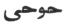

  
[Intangible Textual Heritage](../../index)  [Islam](../index) 
[Index](index)  [Previous](siim26)  [Next](siim28) 

------------------------------------------------------------------------

[Buy this Book at
Amazon.com](https://www.amazon.com/exec/obidos/ASIN/0548805903/internetsacredte)

------------------------------------------------------------------------

  
*Studies in Islamic Mysticism*, by Reynold A. Nicholson, \[1921\], at
Intangible Textual Heritage

------------------------------------------------------------------------

p. 267

### INDEX I

### NAMES AND TITLES

Arabic names to which the definite article al- is prefixed will be found
under their initial letter. Titles of books and poems are printed in
italics.

‘Abdu ’l-Karím, Khwája, [47](siim04.htm#page_47),
[67](siim06.htm#page_67)

‘Abdu ’l-Qádir al-Jílí (Jílání, Gílání), [81](siim07.htm#page_81),
[115](siim11.htm#page_115), [141](siim14.htm#page_141)

‘Abdu ’l-Raḥmán, son of Ibnu ’l-Fáriḍ, [165](siim17.htm#page_165)

‘Abdu ’l-Raḥmán, Ustád, [65](siim05.htm#page_65)

‘Abdu ’l-Ṣamad, [14](siim04.htm#page_14)

‘Abdu ’l-Walí, Mawlaví, [48](siim05.htm#page_48)

Abíward, [17](siim04.htm#page_17)

Abraham, [132](siim14.htm#page_132), [133](siim14.htm#page_133),
[137](siim14.htm#page_137), [173](siim17.htm#page_173),
[201](siim19.htm#page_201), [214](siim20.htm#page_214),
[253](siim24.htm#page_253)

Abú ’l-‘Abbás Bashshár, [55](siim05.htm#page_55)

Abú ’l-‘Abbás Qaṣṣáb, [11](siim04.htm#page_11),
[17](siim04.htm#page_17), [21](siim04.htm#page_21),
[22](siim04.htm#page_22), [23](siim04.htm#page_23),
[24](siim04.htm#page_24), [66](siim06.htm#page_66)

Abú ‘Alí, Sayyid, [27](siim04.htm#page_27)

Abú ‘Alí   (?),
[18](siim04.htm#page_18)

Abú ‘Alí Daqqáq, [29](siim04.htm#page_29), [24](siim04.htm#page_24)

Abú ‘Alí Ẓáhir, [6](siim04.htm#page_6), [7](siim04.htm#page_7),
[8](siim04.htm#page_8)

Abú Bakr Isḥáq Karrámí,
[29](siim04.htm#page_29)-[32](siim04.htm#page_32)

Abú ’l-Faḍl Ḥasan, of Sarakhs, [7](siim04.htm#page_7),
[8](siim04.htm#page_8)-[12](siim04.htm#page_12),
[14](siim04.htm#page_14), [15](siim04.htm#page_15),
[17](siim04.htm#page_17),
[23](siim04.htm#page_23)-[25](siim04.htm#page_25),
[62](siim05.htm#page_62)

Abú ’l-Khayr, father of Abú Sa‘íd, [3](siim03.htm#page_3),
[4](siim04.htm#page_4)

Abú Naṣr al-Sarráj, of Ṭús, [10](siim04.htm#page_10),
[58](siim05.htm#page_58). *See* *Kitáb al-Luma‘*

Abú Sa‘íd ibn Abi ’l-Khayr,
[1](siim03.htm#page_1)-[76](siim06.htm#page_76). *See* Index of Subjects

Abú Sa‘íd, Shaykhu ’l-Islám, grandson of Abú Sa‘íd ibn Abi ’l-Khayr,
[25](siim04.htm#page_25), [59](siim05.htm#page_59)

Abú Ṣáliḥ Dandání, Pír, [47](siim04.htm#page_47)

Abú Ṭáhir, eldest son of Abú Sa‘íd ibn Abi ’l-Khayr,
[15](siim04.htm#page_15), [24](siim04.htm#page_24),
[35](siim04.htm#page_35), [36](siim04.htm#page_36),
[43](siim04.htm#page_43), [44](siim04.htm#page_44),
[70](siim06.htm#page_70)

Abú Zayd of Sarúj, [198](siim18.htm#page_198),
[257](siim25.htm#page_257)

Adam, [54](siim05.htm#page_54), [78](siim07.htm#page_78),
[79](siim07.htm#page_79), [80](siim07.htm#page_80),
[87](siim07.htm#page_87), [97](siim09.htm#page_97),
[106](siim11.htm#page_106), [109](siim11.htm#page_109),
[111](siim11.htm#page_111), [112](siim11.htm#page_112),
[113](siim11.htm#page_113),
[119](siim11.htm#page_119)-[122](siim12.htm#page_122),
[124](siim12.htm#page_124), [130](siim13.htm#page_130),
[136](siim14.htm#page_136), [140](siim14.htm#page_140),
[149](siim16.htm#page_149), [155](siim16.htm#page_155),
[186](siim17.htm#page_186), [187](siim17.htm#page_187),
[198](siim18.htm#page_198), [205](siim19.htm#page_205),
[206](siim19.htm#page_206), [223](siim21.htm#page_223),
[229](siim22.htm#page_229), [240](siim23.htm#page_240),
[242](siim23.htm#page_242), [245](siim23.htm#page_245),
[252](siim24.htm#page_252), [255](siim25.htm#page_255),
[265](siim26.htm#page_265)

Aḥmad, a name of the Prophet, [204](siim19.htm#page_204),
[229](siim22.htm#page_229). *See* Mohammed

Aḥmad, son of Abú ’l-Ḥasan Kharaqání, [43](siim04.htm#page_43)

Aḥmad ‘Alí Nasawí, [19](siim04.htm#page_19)

Aḥmad Najjár, [17](siim04.htm#page_17)

Aḥmad Naṣr, Shaykh, [19](siim04.htm#page_19)

Ahriman, [163](siim17.htm#page_163), [242](siim23.htm#page_242)

‘Alí, grandson of Ibnu ’l-Fáriḍ, [264](siim26.htm#page_264),
[165](siim17.htm#page_165)

‘Alí ibn Abí Ṭálib, the Prophet's son-in-law, [10](siim04.htm#page_10),
[226](siim21.htm#page_226)

‘Álij, [182](siim17.htm#page_182)

Ámul, [11](siim04.htm#page_11), [17](siim04.htm#page_17),
[21](siim04.htm#page_21), [23](siim04.htm#page_23),
[28](siim04.htm#page_28), [66](siim06.htm#page_66)

Andrae, Tor, [111](siim11.htm#page_111)

Angelo, Michael, [262](siim26.htm#page_262)

‘Anqá, the, [83](siim07.htm#page_83), [93](siim08.htm#page_93)

Aṅra Mainyu, [263](siim26.htm#page_263)

‘Aqíq, valley of, [170](siim17.htm#page_170)

‘Arafát, [222](siim21.htm#page_222)

Arnold, Matthew, [9](siim04.htm#page_9)

Ash‘arites, the, [254](siim25.htm#page_254)

Asia Minor, [72](siim06.htm#page_72)

Asmá, [113](siim11.htm#page_113)

*Asráru ’l-tawḥíd fí maqámáti ’l-Shaykh Abí Sa‘íd*, by Muḥammad ibnu
’l-Munawwar, [1](siim03.htm#page_1)-[3](siim03.htm#page_3)

*Átháru ’l-bilád*, by Qazwíní, [76](siim06.htm#page_76)

‘Aṭṭár, Farídu'ddín, [3](siim03.htm#page_3), [42](siim04.htm#page_42),
[262](siim26.htm#page_262)

Avicenna, [42](siim04.htm#page_42)

*‘Ayniyya*, the, by Jílí, [90](siim08.htm#page_90),
[143](siim15.htm#page_143) foll. *See* *al-Nawádiru ’l-‘ayniyya fi
l-bawádiri ’l-ghaybiyya*

‘Ayyárí, Abú Muḥammad, [4](siim04.htm#page_4)

‘Ayyárí, Abú Sa‘íd, [4](siim04.htm#page_4)

‘Azázíl, [120](siim11.htm#page_120). *See* Iblís

al-Azhar, mosque, [165](siim17.htm#page_165)

Azrael, the Angel of Death, [111](siim11.htm#page_111),
[116](siim11.htm#page_116), [117](siim11.htm#page_117),
[123](siim12.htm#page_123)

‘Azza, [113](siim11.htm#page_113), [222](siim21.htm#page_222),
[223](siim21.htm#page_223)

 

Bábá, Kúhí, of Shíráz, [48](siim05.htm#page_48)

Badr, in the Ḥijáz, [174](siim17.htm#page_174)

Badru’ddín al-Shahíd, [113](siim11.htm#page_113)

Baghdád, [10](siim04.htm#page_10), [66](siim06.htm#page_66),
[105](siim11.htm#page_105), [252](siim24.htm#page_252),
[162](siim17.htm#page_162)

Bákú, [57](siim05.htm#page_57)

Balkh, [65](siim05.htm#page_65)

Bashkhwán, [74](siim06.htm#page_74), [75](siim06.htm#page_75)

p. 268

Bashkhwání, Bú ‘Amr, [74](siim06.htm#page_74), [75](siim06.htm#page_75)

Basra, [10](siim04.htm#page_10)

Báward, [17](siim04.htm#page_17)

Báyazíd-i Bisṭámí, [44](siim04.htm#page_44), [76](siim06.htm#page_76).
*See* al-Bisṭámí

Bigg, C., [142](siim14.htm#page_142)

Bishr-i Yásín, Abú ’l-Qáṣim, [4](siim04.htm#page_4),
[5](siim04.htm#page_5)

Bisṭám, [44](siim04.htm#page_44), [76](siim06.htm#page_76)

al-Bisṭámí, Abú Yazíd, [77](siim07.htm#page_77). *See* Báyazíd-i Bisṭámí

Black, J. S., [163](siim17.htm#page_163)

Blake, W., [167](siim17.htm#page_167) Blochet, E.,
[195](siim17.htm#page_195)

Böhme, Jacob, [94](siim09.htm#page_94), [103](siim10.htm#page_103)

Bousset, W., [86](siim07.htm#page_86), [87](siim07.htm#page_87)

Brockelmann, C., [99](siim10.htm#page_99)

Browne, Prof. E. G., [61](siim05.htm#page_61),
[165](siim17.htm#page_165), [170](siim17.htm#page_170)

Bú ‘Abdallah Bákú, Shaykh, [57](siim05.htm#page_57),
[58](siim05.htm#page_58)

Bú ‘Alí Turshízí, [36](siim04.htm#page_36)

Bú ‘Amr, [40](siim04.htm#page_40)

Bu ’l-Khayr, Bábú. *See* Abú ’l-Khayr

Bu ’l-Qásimak, [31](siim04.htm#page_31)

Bú Ṭáhir. *See* Abú Ṭáhir

Bukhárá, [66](siim06.htm#page_66)

Bulghár, [124](siim12.htm#page_124)

al-Búríní, Ḥasan, [162](siim17.htm#page_162),
[168](siim17.htm#page_168), [186](siim17.htm#page_186)

Buthayna, [223](siim21.htm#page_223), [224](siim21.htm#page_224)

 

Caird, E., [96](siim09.htm#page_96)

Cairo, [164](siim17.htm#page_164), [165](siim17.htm#page_165)

Caspian, the, [81](siim07.htm#page_81)

Catherine of Siena, St, [167](siim17.htm#page_167)

Christ, [87](siim07.htm#page_87), [104](siim11.htm#page_104),
[135](siim14.htm#page_135), [140](siim14.htm#page_140),
[187](siim17.htm#page_187). *See* Jesus

 

al-Daḥdáḥ, Rushayyid b. Ghálib, [162](siim17.htm#page_162)

Dajjál, [135](siim14.htm#page_135)

Dámghán, [44](siim04.htm#page_44)

Dandání, Pír Abú Ṣáliḥ, [47](siim04.htm#page_47)

Dante, [191](siim17.htm#page_191)

Ḍárij, [183](siim17.htm#page_183)

Darra-i Gaz, [17](siim04.htm#page_17)

David, [123](siim12.htm#page_123), [137](siim14.htm#page_137),
[161](siim16.htm#page_161)

Dáwud Ṭá’í, [10](siim04.htm#page_10), [11](siim04.htm#page_11)

De Lagrange, Grangeret, [165](siim17.htm#page_165),
[166](siim17.htm#page_166)

*De return natura*, [191](siim17.htm#page_191)

De Sacy, Silvestre, [165](siim17.htm#page_165)

De Slane, Baron, [164](siim17.htm#page_164), [168](siim17.htm#page_168)

Deussen, Paul, [103](siim10.htm#page_103)

Di Matteo, Sac. Ignazio, [162](siim17.htm#page_162)

Diḥya al-Kalbí, [219](siim21.htm#page_219), [225](siim21.htm#page_225)

*Díván-i Shams-i Tabríz*, by Jalálu’ddín Rúmí, [80](siim07.htm#page_80),
[168](siim17.htm#page_168), [233](siim23.htm#page_233),
[259](siim25.htm#page_259)

Dozy, R., [29](siim04.htm#page_29)

 

Eckhart, [51](siim05.htm#page_51), [212](siim20.htm#page_212)

Egypt, [165](siim17.htm#page_165), [181](siim17.htm#page_181)

Elijah, [73](siim06.htm#page_73)

Ethé, H., [4](siim04.htm#page_4), [48](siim05.htm#page_48)

Eve, [223](siim21.htm#page_223)

 

Farídu’ddín ‘Aṭṭár. *See* ‘Aṭṭár

Fawcett, E. D., [94](siim09.htm#page_94)

Flügel, G., [93](siim08.htm#page_93), [195](siim17.htm#page_195)

Furátí, Abú ’l-Faḍl, [41](siim04.htm#page_41)

*Fuṣúṣu ’l-ḥikam*, by Ibnu ’l-‘Arabí, [77](siim07.htm#page_77),
[83](siim07.htm#page_83), [88](siim07.htm#page_88),
[91](siim08.htm#page_91), [96](siim09.htm#page_96),
[100](siim10.htm#page_100), [115](siim11.htm#page_115),
[130](siim13.htm#page_130), [134](siim14.htm#page_134),
[136](siim14.htm#page_136), [141](siim14.htm#page_141),
[149](siim16.htm#page_149)-[161](siim16.htm#page_161)

*al-Futúḥátu ’l-Makkiyya*, by Ibnu ’l-‘Arabí, [77](siim07.htm#page_77),
[82](siim07.htm#page_82), [88](siim07.htm#page_88)

 

Gabriel, [111](siim11.htm#page_111), [116](siim11.htm#page_116),
[219](siim21.htm#page_219), [225](siim21.htm#page_225)

Gairdner, W. H. T., [111](siim11.htm#page_111)

Gaz, valley, [17](siim04.htm#page_17)

Gerson, [51](siim05.htm#page_51)

Ghazálí, [80](siim07.htm#page_80), [111](siim11.htm#page_111),
[150](siim16.htm#page_150)

Ghazna, [29](siim04.htm#page_29), [33](siim04.htm#page_33)

Ghiyáthu’ddín Muḥammad ibn Sám, Ghúrid prince, [1](siim03.htm#page_1)

al-Ghuwayr, [183](siim17.htm#page_183)

Ghuzz, the, a Turcoman tribe, [2](siim03.htm#page_2),
[20](siim04.htm#page_20), [27](siim04.htm#page_27),
[45](siim04.htm#page_45), [73](siim06.htm#page_73)

Gibb, E. J. W., [62](siim05.htm#page_62), [111](siim11.htm#page_111)

Gílán, [81](siim07.htm#page_81)

Goldziher, Prof. I., [81](siim07.htm#page_81), [82](siim07.htm#page_82)

Gospel, the, [137](siim14.htm#page_137)-[140](siim14.htm#page_140),
[240](siim23.htm#page_240), [263](siim26.htm#page_263)

*Gulshani ráz*, by Maḥmúd Shabistarí, [263](siim26.htm#page_263)

 

Ḥabíb-i ‘Ajamí, [10](siim04.htm#page_10), [11](siim04.htm#page_11)

Hafiz, [162](siim17.htm#page_162)

Ḥájir, [182](siim17.htm#page_182)

*Ḥálát ú Sukhunán-i Shaykh Abú Sa‘íd ibn Abi ’l-Khayr*,
[1](siim03.htm#page_1)-[3](siim03.htm#page_3)

Ḥalláj, Ḥusayn ibn Manṣúr, [32](siim04.htm#page_32),
[54](siim05.htm#page_54), [79](siim07.htm#page_79),
[80](siim07.htm#page_80), [88](siim07.htm#page_88),
[107](siim11.htm#page_107), [121](siim11.htm#page_121),
[158](siim16.htm#page_158), [193](siim17.htm#page_193),
[230](siim22.htm#page_230). See *Kitáb al-Ṭawásín*

Hammer-Purgstall, Joseph, [162](siim17.htm#page_162). *See* Von Hammer

Ḥanafites, the, [29](siim04.htm#page_29)

Haneberg, D., [195](siim17.htm#page_195)

Ḥarírí, [198](siim18.htm#page_198), [257](siim25.htm#page_257),
[258](siim25.htm#page_258)

Hartmann, Richard, [34](siim04.htm#page_34), [53](siim05.htm#page_53),
[73](siim06.htm#page_73), [220](siim21.htm#page_220),
[238](siim23.htm#page_238), [256](siim25.htm#page_256)

Ḥasan of Basra, [10](siim04.htm#page_10), [11](siim04.htm#page_11)

Ḥasan-i Mu’addib, [27](siim04.htm#page_27), [29](siim04.htm#page_29),
[30](siim04.htm#page_30), [32](siim04.htm#page_32),
[35](siim04.htm#page_35)-[40](siim04.htm#page_40),
[42](siim04.htm#page_42)

Hegel, [89](siim07.htm#page_89), [94](siim09.htm#page_94),
[118](siim11.htm#page_118)

Ḥijáz, the, [36](siim04.htm#page_36), [164](siim17.htm#page_164),
[181](siim17.htm#page_181), [182](siim17.htm#page_182)

Hind, [113](siim11.htm#page_113)

Hippolytus, [77](siim07.htm#page_77)

Ḥírí, Abú ‘Uthmán, [19](siim04.htm#page_19)

Hirschfeld, H., [110](siim11.htm#page_110)

Holofernes, [177](siim17.htm#page_177)

Ḥubbí, Pír, [47](siim04.htm#page_47)

Hujwírí, [3](siim03.htm#page_3), [22](siim04.htm#page_22),
[34](siim04.htm#page_34), [58](siim05.htm#page_58),
[79](siim07.htm#page_79). See *Kashf al-maḥjúb*

al-Ḥuṣrí, Abú ‘Abdallah, [6](siim04.htm#page_6)

p. 269

Iblís, [54](siim05.htm#page_54), [72](siim06.htm#page_72),
[112](siim11.htm#page_112), [117](siim11.htm#page_117),
[119](siim11.htm#page_119), [120](siim11.htm#page_120),
[121](siim11.htm#page_121), [124](siim12.htm#page_124). *See* Satan

Ibnu ’l-‘Arabí, [77](siim07.htm#page_77), [82](siim07.htm#page_82),
[83](siim07.htm#page_83), [88](siim07.htm#page_88),
[93](siim08.htm#page_93), [99](siim10.htm#page_99),
[10](siim04.htm#page_10)I, [102](siim10.htm#page_102),
[103](siim10.htm#page_103), [107](siim11.htm#page_107),
[115](siim11.htm#page_115), [119](siim11.htm#page_119),
[134](siim14.htm#page_134), [136](siim14.htm#page_136),
[138](siim14.htm#page_138), [141](siim14.htm#page_141),
[142](siim14.htm#page_142),
[149](siim16.htm#page_149)-[161](siim16.htm#page_161),
[164](siim17.htm#page_164), [169](siim17.htm#page_169),
[184](siim17.htm#page_184), [193](siim17.htm#page_193),
[257](siim25.htm#page_257), [263](siim26.htm#page_263)

Ibnu ’l-Fáriḍ, [119](siim11.htm#page_119),
[162](siim17.htm#page_162)-[266](siim26.htm#page_266)

Ibn Khallikán, [164](siim17.htm#page_164), [168](siim17.htm#page_168)

Ibn Síná, [42](siim04.htm#page_42)

Ibn Surayj, [6](siim04.htm#page_6)

Idrís, the prophet, [123](siim12.htm#page_123)

*Iḥyá*, the, of Ghazálí, [80](siim07.htm#page_80)

Ikhwánu ’l-Ṣafá, [139](siim14.htm#page_139)

India, [81](siim07.htm#page_81)

Inge, W. R., [128](siim13.htm#page_128)

al-*Insánu ’l-kámil*, by Jílí, [77](siim07.htm#page_77) foll.,
[149](siim16.htm#page_149), [194](siim17.htm#page_194)

Iqbál, Dr Muḥammad, [77](siim07.htm#page_77), [94](siim09.htm#page_94)

Íshí Nílí, [69](siim06.htm#page_69), [70](siim06.htm#page_70)

Ismá‘ílak-i Daqqáq, [35](siim04.htm#page_35)

Ismá‘ílís, the, [61](siim05.htm#page_61)

Israelites, the, [179](siim17.htm#page_179)

Isráfíl, [115](siim11.htm#page_115), [123](siim12.htm#page_123). *See*
Seraphiel

*Iṣṭiláḥátu ’l-Ṣúfiyya*, by ‘Abdu ’l-Razzáq al-Káshání,
[94](siim09.htm#page_94)

 

al-Jabartí, Sharafu’ddín, Ismá‘íl ibn Ibráhím, [81](siim07.htm#page_81),
[87](siim07.htm#page_87), [105](siim11.htm#page_105),
[118](siim11.htm#page_118)

Jacob, the prophet, [201](siim19.htm#page_201),
[253](siim24.htm#page_253)

Jalálu’ddín Rúmí, [80](siim07.htm#page_80), [159](siim16.htm#page_159),
[162](siim17.htm#page_162), [167](siim17.htm#page_167),
[168](siim17.htm#page_168), [180](siim17.htm#page_180). See *Díván-i
Shams-i Tabríz* and *Masnaví-i ma‘naví*

Jámí, [3](siim03.htm#page_3), [162](siim17.htm#page_162)

Jamíl, [224](siim21.htm#page_224)

Jerusalem, [66](siim06.htm#page_66)

Jesus, [25](siim04.htm#page_25), [110](siim11.htm#page_110),
[123](siim12.htm#page_123), [137](siim14.htm#page_137),
[139](siim14.htm#page_139), [140](siim14.htm#page_140),
[141](siim14.htm#page_141), [253](siim24.htm#page_253),
[255](siim25.htm#page_255). *See* Christ

Jílán, [81](siim07.htm#page_81)

Jílí, ‘Abdu ’l-Karím, author of the *Insánu ’l-kámil*,
[77](siim07.htm#page_77)-[148](siim15.htm#page_148),
[149](siim16.htm#page_149), [153](siim16.htm#page_153),
[157](siim16.htm#page_157), [160](siim16.htm#page_160),
[193](siim17.htm#page_193), [263](siim26.htm#page_263)

Jílí (Jílání, Gílání), ‘Abdu ’l-Qádir, [81](siim07.htm#page_81),
[115](siim11.htm#page_115), [141](siim14.htm#page_141)

Job, [158](siim16.htm#page_158), [201](siim19.htm#page_201)

John, the Baptist, [25](siim04.htm#page_25)

John, St, [88](siim07.htm#page_88)

Jonah, [245](siim23.htm#page_245)

Jones, Sir William, [49](siim05.htm#page_49), [165](siim17.htm#page_165)

Joseph, the prophet, [123](siim12.htm#page_123)

Junayd, of Baghdád, [10](siim04.htm#page_10), [11](siim04.htm#page_11),
[159](siim16.htm#page_159)

Jurjání, [93](siim08.htm#page_93), [118](siim11.htm#page_118)

Juwayní, Abú Muḥammad, [73](siim06.htm#page_73)

 

Ka‘ba, the, [15](siim04.htm#page_15), [25](siim04.htm#page_25),
[36](siim04.htm#page_36), [44](siim04.htm#page_44),
[62](siim05.htm#page_62), [213](siim20.htm#page_213),
[214](siim20.htm#page_214), [222](siim21.htm#page_222),
[238](siim23.htm#page_238)

Kalím (Kalímu’llah), [229](siim22.htm#page_229). *See* Moses

Kamálu’ddín Muḥammad, son of Ibnu ’l-Fáriḍ, [165](siim17.htm#page_165)

Karrámís, the, [28](siim04.htm#page_28)

Káshání, ‘Abdu ’l-Razzáq, [94](siim09.htm#page_94),
[149](siim16.htm#page_149), [162](siim17.htm#page_162),
[193](siim17.htm#page_193), [194](siim17.htm#page_194),
[199](siim18.htm#page_199) foll.

*Kashf al-maḥjúb*, by Hujwírí, [3](siim03.htm#page_3),
[22](siim04.htm#page_22), [24](siim04.htm#page_24),
[34](siim04.htm#page_34), [61](siim05.htm#page_61),
[79](siim07.htm#page_79), [152](siim16.htm#page_152),
[208](siim19.htm#page_208), [221](siim21.htm#page_221),
[226](siim21.htm#page_226), [244](siim23.htm#page_244),
[254](siim25.htm#page_254), [262](siim26.htm#page_262)

*Kashfu ’l-sirri ’l-ghámiḍ fí sharḥi Díwán Ibni ’l-Fáriḍ*, by ‘Abdu
’l-Ghaní al-Nábulusí, [162](siim17.htm#page_162)

*Kashfu ’l-wujúhi ’l-ghurr li-ma‘ání naẓmi ’l-durr*, by ‘Abdu ’l-Razzáq
al-Káshání, [162](siim17.htm#page_162)

Káẓima, [182](siim17.htm#page_182)

Khaḍir, the prophet, [13](siim04.htm#page_13), [66](siim06.htm#page_66),
[82](siim07.htm#page_82), [124](siim12.htm#page_124),
[141](siim14.htm#page_141)

*Khamriyya*, the, of Ibnu ’l-Fáriḍ, [165](siim17.htm#page_165),
[183](siim17.htm#page_183)-[188](siim17.htm#page_188)

Khánaqáh-i Saráwí, at Nasá, [19](siim04.htm#page_19)

Kharaqán, [26](siim04.htm#page_26),
[42](siim04.htm#page_42)-[44](siim04.htm#page_44)

Kharaqání, Abú ’l-Ḥasan, [26](siim04.htm#page_26),
[42](siim04.htm#page_42)-[44](siim04.htm#page_44),
[76](siim06.htm#page_76)

al-Kharráz, Abú Sa‘íd, [152](siim16.htm#page_152)

Kháwarán, [3](siim03.htm#page_3)

al-Khayf, [181](siim17.htm#page_181)

Khoten, [66](siim06.htm#page_66)

Khurásán, [2](siim03.htm#page_2), [3](siim03.htm#page_3),
[19](siim04.htm#page_19), [20](siim04.htm#page_20),
[38](siim04.htm#page_38), [76](siim06.htm#page_76)

Khurqán. *See* Kharaqán

Khurqání, Abú ’l-Ḥasan. *See* Kharaqání

*Kitáb al-Luma‘*, by Abú Naṣr al-Sarráj, [34](siim04.htm#page_34),
[61](siim05.htm#page_61), [96](siim09.htm#page_96),
[200](siim19.htm#page_200), [220](siim21.htm#page_220),
[230](siim22.htm#page_230), [238](siim23.htm#page_238),
[244](siim23.htm#page_244), [254](siim25.htm#page_254)

*Kitáb al-Ṭawásín*, by Ḥalláj, [54](siim05.htm#page_54),
[79](siim07.htm#page_79), [80](siim07.htm#page_80),
[107](siim11.htm#page_107), [121](siim11.htm#page_121),
[136](siim14.htm#page_136), [139](siim14.htm#page_139),
[142](siim14.htm#page_142), [193](siim17.htm#page_193)

*Koran*, the, [4](siim04.htm#page_4), [8](siim04.htm#page_8),
[13](siim04.htm#page_13), [15](siim04.htm#page_15),
[16](siim04.htm#page_16), [17](siim04.htm#page_17),
[25](siim04.htm#page_25), [28](siim04.htm#page_28),
[32](siim04.htm#page_32), [37](siim04.htm#page_37),
[43](siim04.htm#page_43), [46](siim04.htm#page_46),
[51](siim05.htm#page_51), [56](siim05.htm#page_56),
[59](siim05.htm#page_59), [60](siim05.htm#page_60),
[62](siim05.htm#page_62), [64](siim05.htm#page_64),
[75](siim06.htm#page_75), [78](siim07.htm#page_78),
[79](siim07.htm#page_79), [82](siim07.htm#page_82),
[87](siim07.htm#page_87), [92](siim08.htm#page_92),
[104](siim11.htm#page_104), [107](siim11.htm#page_107),
[109](siim11.htm#page_109), [110](siim11.htm#page_110),
[111](siim11.htm#page_111), [113](siim11.htm#page_113),
[120](siim11.htm#page_120), [123](siim12.htm#page_123),
[126](siim13.htm#page_126), [130](siim13.htm#page_130),
[131](siim14.htm#page_131), [132](siim14.htm#page_132),
[135](siim14.htm#page_135), [136](siim14.htm#page_136),
[138](siim14.htm#page_138), [139](siim14.htm#page_139),
[140](siim14.htm#page_140), [149](siim16.htm#page_149),
[151](siim16.htm#page_151), [157](siim16.htm#page_157),
[159](siim16.htm#page_159), [173](siim17.htm#page_173),
[179](siim17.htm#page_179), [197](siim18.htm#page_197),
[200](siim19.htm#page_200), [201](siim19.htm#page_201),
[205](siim19.htm#page_205), [206](siim19.htm#page_206),
[209](siim19.htm#page_209), [223](siim21.htm#page_223),
[225](siim21.htm#page_225), [226](siim21.htm#page_226),
[228](siim22.htm#page_228), [230](siim22.htm#page_230),
[231](siim22.htm#page_231), [235](siim23.htm#page_235),
[237](siim23.htm#page_237), [239](siim23.htm#page_239),
[240](siim23.htm#page_240), [241](siim23.htm#page_241),
[242](siim23.htm#page_242), [245](siim23.htm#page_245),
[253](siim24.htm#page_253), [256](siim25.htm#page_256),
[259](siim25.htm#page_259), [261](siim26.htm#page_261),
[263](siim26.htm#page_263), [264](siim26.htm#page_264),
[265](siim26.htm#page_265)

Kúshí, [81](siim07.htm#page_81)

Kuthayyir, [222](siim21.htm#page_222)-[224](siim21.htm#page_224)

 

La‘la‘, [182](siim17.htm#page_182)

Lane, E., [94](siim09.htm#page_94)

Law, H. D. Graves, [48](siim05.htm#page_48)

Laylá, [127](siim13.htm#page_127), [222](siim21.htm#page_222)

Le Strange, G., [26](siim04.htm#page_26)

Lees, Nassau, [3](siim03.htm#page_3), [19](siim04.htm#page_19)

Loosen, Paul, [6](siim04.htm#page_6)

Loth, O., [77](siim07.htm#page_77), [81](siim07.htm#page_81)

Lubná, [222](siim21.htm#page_222), [223](siim21.htm#page_223)

Lucretius, [191](siim17.htm#page_191)

*al-Luma‘*, by Abú Naṣr al-Sarráj. *See* *Kitáb al-Luma‘*

Luqmán, of Sarakhs, [6](siim04.htm#page_6), [7](siim04.htm#page_7)

Lyall, Sir C., [163](siim17.htm#page_163)

p. 270

Ma‘arrí, Abú ’l-‘Alá, [160](siim16.htm#page_160),
[162](siim17.htm#page_162)

Macdonald, Prof. D. B., [28](siim04.htm#page_28),
[57](siim05.htm#page_57), [73](siim06.htm#page_73),
[79](siim07.htm#page_79), [119](siim11.htm#page_119),
[129](siim13.htm#page_129), [154](siim16.htm#page_154),
[188](siim17.htm#page_188), [233](siim23.htm#page_233),
[236](siim23.htm#page_236)

Mackail, J. W., [167](siim17.htm#page_167)

al-Madaní, Aḥmad ibn Muḥammad, [77](siim07.htm#page_77)

Maḥmúd-i Muríd, Khwája, [27](siim04.htm#page_27)

Maḥmúd Shabistarí, [263](siim26.htm#page_263)

Majnún, [222](siim21.htm#page_222)

Malámatís, the, [208](siim19.htm#page_208)

Maqám Ibráhím, [214](siim20.htm#page_214)

*Maqámát*, of Ḥarírí, the, [257](siim25.htm#page_257)

Ma‘rúf Karkhí, [10](siim04.htm#page_10)

Marwa, [239](siim23.htm#page_239)

Mary, the mother of Jesus, [140](siim14.htm#page_140)

*Masnaví-i ma‘naví*, by Jalálu’ddín Rúmí, [159](siim16.htm#page_159),
[168](siim17.htm#page_168), [259](siim25.htm#page_259)

Massignon, L., [54](siim05.htm#page_54), [79](siim07.htm#page_79),
[80](siim07.htm#page_80), [81](siim07.htm#page_81),
[107](siim11.htm#page_107), [121](siim11.htm#page_121),
[136](siim14.htm#page_136), [139](siim14.htm#page_139),
[142](siim14.htm#page_142), [193](siim17.htm#page_193)

Mas‘úd, Amír, [41](siim04.htm#page_41), [42](siim04.htm#page_42)

Mayhana, [2](siim03.htm#page_2), [3](siim03.htm#page_3),
[4](siim04.htm#page_4), [5](siim04.htm#page_5), [8](siim04.htm#page_8),
[11](siim04.htm#page_11), [12](siim04.htm#page_12),
[14](siim04.htm#page_14), [15](siim04.htm#page_15),
[17](siim04.htm#page_17), [18](siim04.htm#page_18),
[20](siim04.htm#page_20), [24](siim04.htm#page_24),
[26](siim04.htm#page_26)-[29](siim04.htm#page_29),
[43](siim04.htm#page_43), [45](siim04.htm#page_45),
[65](siim05.htm#page_65), [69](siim06.htm#page_69),
[72](siim06.htm#page_72), [73](siim06.htm#page_73),
[74](siim06.htm#page_74). *See* Mihna

Mecca, [25](siim04.htm#page_25), [43](siim04.htm#page_43),
[44](siim04.htm#page_44), [61](siim05.htm#page_61),
[62](siim05.htm#page_62), [66](siim06.htm#page_66),
[74](siim06.htm#page_74), [164](siim17.htm#page_164),
[165](siim17.htm#page_165), [174](siim17.htm#page_174),
[179](siim17.htm#page_179), [181](siim17.htm#page_181),
[183](siim17.htm#page_183), [222](siim21.htm#page_222),
[239](siim23.htm#page_239)

Medina, [66](siim06.htm#page_66), [170](siim17.htm#page_170),
[174](siim17.htm#page_174)

Meleager, [167](siim17.htm#page_167)

Merv, [6](siim04.htm#page_6), [12](siim04.htm#page_12),
[17](siim04.htm#page_17), [65](siim05.htm#page_65)

Mesopotamia, [257](siim25.htm#page_257)

Michael, [111](siim11.htm#page_111), [118](siim11.htm#page_118),
[123](siim12.htm#page_123)

Mihna, [2](siim03.htm#page_2), [18](siim04.htm#page_18). *See* Mayhana

al-Miná, [181](siim17.htm#page_181)

*Mishkátu ’l-anwár*, by Ghazálí, [111](siim11.htm#page_111)

Mohammed, the Prophet, [5](siim04.htm#page_5), [6](siim04.htm#page_6),
[9](siim04.htm#page_9), [11](siim04.htm#page_11),
[15](siim04.htm#page_15), [19](siim04.htm#page_19),
[25](siim04.htm#page_25), [29](siim04.htm#page_29),
[47](siim04.htm#page_47), [50](siim05.htm#page_50),
[59](siim05.htm#page_59), [67](siim06.htm#page_67),
[78](siim07.htm#page_78), [79](siim07.htm#page_79),
[86](siim07.htm#page_86), [87](siim07.htm#page_87),
[88](siim07.htm#page_88), [91](siim08.htm#page_91),
[92](siim08.htm#page_92), [94](siim09.htm#page_94),
[104](siim11.htm#page_104), [105](siim11.htm#page_105),
[106](siim11.htm#page_106), [109](siim11.htm#page_109),
[110](siim11.htm#page_110),
[112](siim11.htm#page_112)-[120](siim11.htm#page_120),
[123](siim12.htm#page_123), [129](siim13.htm#page_129),
[130](siim13.htm#page_130), [132](siim14.htm#page_132),
[135](siim14.htm#page_135)-[139](siim14.htm#page_139),
[141](siim14.htm#page_141), [157](siim16.htm#page_157),
[168](siim17.htm#page_168), [172](siim17.htm#page_172),
[174](siim17.htm#page_174), [187](siim17.htm#page_187),
[188](siim17.htm#page_188), [194](siim17.htm#page_194),
[195](siim17.htm#page_195), [198](siim18.htm#page_198),
[206](siim19.htm#page_206), [219](siim21.htm#page_219),
[223](siim21.htm#page_223), [225](siim21.htm#page_225),
[226](siim21.htm#page_226), [227](siim21.htm#page_227),
[229](siim22.htm#page_229), [239](siim23.htm#page_239),
[240](siim23.htm#page_240), [241](siim23.htm#page_241),
[245](siim23.htm#page_245), [248](siim24.htm#page_248),
[252](siim24.htm#page_252)-[255](siim25.htm#page_255),
[264](siim26.htm#page_264). *See* Index of Subjects

Moses, [123](siim12.htm#page_123), [137](siim14.htm#page_137),
[139](siim14.htm#page_139), [141](siim14.htm#page_141),
[200](siim19.htm#page_200), [226](siim21.htm#page_226),
[229](siim22.htm#page_229), [243](siim23.htm#page_243),
[253](siim24.htm#page_253), [263](siim26.htm#page_263)

al-Mudabbir, angel, [111](siim11.htm#page_111)

al-Mufaṣṣil, angel, [111](siim11.htm#page_111)

Muḥammad, the Prophet. *See* Mohammed

Muḥammad, Ḥájib, [38](siim04.htm#page_38), [39](siim04.htm#page_39)

Muḥammad (ibn) ‘Alí (Ulayyán) al-Nasawí, [19](siim04.htm#page_19)

Muḥammad Faḍl, [17](siim04.htm#page_17)

Muḥammad ibnu ’l-Munawwar, I, [25](siim04.htm#page_25)

Muḥyi’ddín Ibnu ’l-‘Arabí. *See* Ibnu ’l-‘Arabí

*Mu‘jamu ’l-buldán*, by Yáqút, [6](siim04.htm#page_6)

Munro, H. A. J., [192](siim17.htm#page_192)

Muqaṭṭam, Mt, [164](siim17.htm#page_164)

Murta‘ish, of Baghdád, [10](siim04.htm#page_10)

Musil, A., [139](siim14.htm#page_139)

Mutanabbí, [162](siim17.htm#page_162), [166](siim17.htm#page_166)

Muẓaffar, Khwája, son of Abú Sa‘íd ibn Abi ’l-Khayr,
[44](siim04.htm#page_44)

 

al-Nábulusí, ‘Abdu ’l-Ghaní, [162](siim17.htm#page_162),
[164](siim17.htm#page_164), [168](siim17.htm#page_168),
[172](siim17.htm#page_172), [184](siim17.htm#page_184),
[187](siim17.htm#page_187), [199](siim18.htm#page_199) foll.

*Nafaḥátu ’l-Uns*, by Jámí, [3](siim03.htm#page_3),
[19](siim04.htm#page_19)

Najd, [182](siim17.htm#page_182)

Najjár, Khwája, [47](siim04.htm#page_47)

Nallino, Prof. C. A., [162](siim17.htm#page_162),
[164](siim17.htm#page_164), [168](siim17.htm#page_168),
[177](siim17.htm#page_177), [186](siim17.htm#page_186),
[200](siim19.htm#page_200), [207](siim19.htm#page_207),
[214](siim20.htm#page_214), [221](siim21.htm#page_221),
[238](siim23.htm#page_238), [260](siim25.htm#page_260)

al-Naqá, [182](siim17.htm#page_182)

Nasá, [4](siim04.htm#page_4),
[17](siim04.htm#page_17)-[19](siim04.htm#page_19)

al-Nasawí, Aḥmad ‘Alí, [19](siim04.htm#page_19)

al-Nasawí, Muḥammad (ibn) ’Ulayyán, [19](siim04.htm#page_19)

al-Naṣrábádí, Abú ’l-Qásim, [14](siim04.htm#page_14)

*al-Nawádiru ’l-‘ ayniyya fi ’l-bawádiri ’l-ghaybiyya*, by Jílí,
[99](siim10.htm#page_99), [143](siim15.htm#page_143). *See* *‘Ayniyya*

*Naẓmu ’l-sulúk*, by Ibnu ’l-Fáriḍ, [165](siim17.htm#page_165),
[169](siim17.htm#page_169), [188](siim17.htm#page_188). *See*
*al-Tá’iyyatu ’l-kubrá*

Newman, Cardinal, [163](siim17.htm#page_163)

Níshápúr, [14](siim04.htm#page_14), [22](siim04.htm#page_22),
[26](siim04.htm#page_26), [27](siim04.htm#page_27),
[28](siim04.htm#page_28), [33](siim04.htm#page_33),
[34](siim04.htm#page_34), [36](siim04.htm#page_36),
[37](siim04.htm#page_37), [38](siim04.htm#page_38),
[41](siim04.htm#page_41)-[45](siim04.htm#page_45),
[57](siim05.htm#page_57), [59](siim05.htm#page_59),
[65](siim05.htm#page_65), [66](siim06.htm#page_66),
[69](siim06.htm#page_69), [70](siim06.htm#page_70),
[71](siim06.htm#page_71), [73](siim06.htm#page_73)

Niẓámu ’l-Mulk, [27](siim04.htm#page_27)

Noah, [201](siim19.htm#page_201), [253](siim24.htm#page_253)

Nöldeke, Prof. Th., [163](siim17.htm#page_163)

Nu‘m, [183](siim17.htm#page_183), [187](siim17.htm#page_187)

al-Nún, angel, [111](siim11.htm#page_111)

Nyberg, H. S., [94](siim09.htm#page_94), [104](siim11.htm#page_104),
[110](siim11.htm#page_110), [111](siim11.htm#page_111),
[121](siim11.htm#page_121), [122](siim12.htm#page_122),
[123](siim12.htm#page_123)

 

Omar Khayyam, I, [77](siim07.htm#page_77)

Origen, [149](siim16.htm#page_149)

Ormuzd, [163](siim17.htm#page_163), [242](siim23.htm#page_242)

 

Pascal, [9](siim04.htm#page_9)

*Pentateuch*, the,
[137](siim14.htm#page_137)-[139](siim14.htm#page_139). *See* Torah

Petrarch, [167](siim17.htm#page_167)

Philo, [77](siim07.htm#page_77), [82](siim07.htm#page_82),
[138](siim14.htm#page_138), [142](siim14.htm#page_142),
[149](siim16.htm#page_149)

Plato, [22](siim04.htm#page_22), [137](siim14.htm#page_137),
[174](siim17.htm#page_174), [223](siim21.htm#page_223),
[259](siim25.htm#page_259), [265](siim26.htm#page_265)

Plotinus, [153](siim16.htm#page_153)

Prophet, the. *See* Mohammed

Psalms, the, [137](siim14.htm#page_137)

Púshangán, [41](siim04.htm#page_41)

 

al-Qaffál, Abú Bakr, [6](siim04.htm#page_6)

Qá’in, [60](siim05.htm#page_60)

Qá’iní, Muḥammad, Khwája, [60](siim05.htm#page_60),
[61](siim05.htm#page_61)

Qays, [222](siim21.htm#page_222), [224](siim21.htm#page_224)

Qazwíní, [76](siim06.htm#page_76)

Qushayrí, Abú ’l-Qásim, [26](siim04.htm#page_26),
[33](siim04.htm#page_33)-[36](siim04.htm#page_36),
[58](siim05.htm#page_58), [73](siim06.htm#page_73),
[77](siim07.htm#page_77). *See* Hartmann

 

Rayy, [44](siim04.htm#page_44)

*Republic*, of Plato, the, [223](siim21.htm#page_223)

p. 271

*al-Risálatu ’l-Qushayríyya fí ‘ilmi ’l-taṣawwuf*,
[33](siim04.htm#page_33), [77](siim07.htm#page_77)

Ribáṭ-i Kuhan, [12](siim04.htm#page_12), [13](siim04.htm#page_13)

Rúm, [72](siim06.htm#page_72)

Russell, Bertrand, [82](siim07.htm#page_82)

Ruysbroeck, [55](siim05.htm#page_55)

 

Ṣábúní, Ismá‘íl, [73](siim06.htm#page_73)

Ṣaddá, [226](siim21.htm#page_226)

Sa‘dí, [162](siim17.htm#page_162)

Ṣafá, [239](siim23.htm#page_239)

Ṣá‘id, Qáḍí, [29](siim04.htm#page_29)-[32](siim04.htm#page_32)

Sal‘, [182](siim17.htm#page_182)

Sale, G., [174](siim17.htm#page_174)

Salmá, [113](siim11.htm#page_113)

Sam‘ání, [18](siim04.htm#page_18)

Saná’í, [162](siim17.htm#page_162)

Sarakhs, [6](siim04.htm#page_6), [7](siim04.htm#page_7),
[10](siim04.htm#page_10), [11](siim04.htm#page_11),
[12](siim04.htm#page_12), [14](siim04.htm#page_14),
[17](siim04.htm#page_17), [23](siim04.htm#page_23),
[24](siim04.htm#page_24), [62](siim05.htm#page_62)

Sarí Saqaṭí, [10](siim04.htm#page_10)

al-Sarráj, Abú Naṣr, of Ṭús, [10](siim04.htm#page_10),
[58](siim05.htm#page_58). *See* *Kitáb al-Luma‘*

Sarúj, [257](siim25.htm#page_257)

Satan, [131](siim14.htm#page_131), [223](siim21.htm#page_223). *See*
Iblís

Schopenhauer, [94](siim09.htm#page_94)

Sellar, W. Y., [192](siim17.htm#page_192)

Seraphiel, [111](siim11.htm#page_111), [115](siim11.htm#page_115). *See*
Isráfíl

Seth, [156](siim16.htm#page_156)

*Shadharátu ’l-dhahab*, [164](siim17.htm#page_164)

al-Shádhilí, Abú ’l-Ḥasan, [210](siim19.htm#page_210). *See* Haneberg

Sháfi‘ites, the, [29](siim04.htm#page_29)

Shah Mayhana, [17](siim04.htm#page_17), [18](siim04.htm#page_18)

Sháhína, [18](siim04.htm#page_18)

Shám-i kúchak, a name given to Nasá, [18](siim04.htm#page_18)

Shámína, [18](siim04.htm#page_18)

Shelley, [176](siim17.htm#page_176)

Shi‘b ‘Ámir, [183](siim17.htm#page_183)

Shiblí, Shaykh, [66](siim06.htm#page_66), [105](siim11.htm#page_105)

Shí‘ites, the, [29](siim04.htm#page_29)

Shíráz, [48](siim05.htm#page_48)

Shirwán, [57](siim05.htm#page_57), [74](siim06.htm#page_74)

Shirwání, Bú Naṣr, [73](siim06.htm#page_73), [74](siim06.htm#page_74)

Sidney, Sir Philip, [175](siim17.htm#page_175)

Siegfried, C., [138](siim14.htm#page_138)

Sinai, Mt, [200](siim19.htm#page_200), [226](siim21.htm#page_226),
[228](siim22.htm#page_228), [245](siim23.htm#page_245)

Solomon, [123](siim12.htm#page_123), [253](siim24.htm#page_253)

*Song of Solomon*, the, [168](siim17.htm#page_168)

Sparrow, John, [103](siim10.htm#page_103)

Spenta Mainyu, [163](siim17.htm#page_163)

Sprenger, A., [94](siim09.htm#page_94) Subkí, [6](siim04.htm#page_6)

al-Suhrawardí, Shihábu’ddín Abú Ḥafṣ ‘Umar, [165](siim17.htm#page_165)

al-Sulamí, Abú ‘Abú *al-Raḥmán*, of Níshápúr, [14](siim04.htm#page_14),
[19](siim04.htm#page_19), [22](siim04.htm#page_22),
[57](siim05.htm#page_57)

Sulaymá, [182](siim17.htm#page_182), [183](siim17.htm#page_183)

Syria, [18](siim04.htm#page_18), [139](siim14.htm#page_139)

 

*Ṭabaqátu ’l-Sháfi‘iyya al-kubrá*, by Subkí, [6](siim04.htm#page_6)

*Ṭabaqátu ’l-Súfiyya*, by Abú ‘Abd al-Raḥmán al-Sulamí,
[14](siim04.htm#page_14), [19](siim04.htm#page_19)

Ṭabaristán, [17](siim04.htm#page_17)

*Tadhkiratu ’l-Awliyá*, by Farídu’ddín ‘Aṭṭár, [3](siim03.htm#page_3),
[42](siim04.htm#page_42)

*al-Tá’iyyatu ’l-kubrá*, by Ibnu ’l-Fáriḍ, [119](siim11.htm#page_119),
[162](siim17.htm#page_162), [165](siim17.htm#page_165),
[168](siim17.htm#page_168), [180](siim17.htm#page_180),
[187](siim17.htm#page_187),
[188](siim17.htm#page_188)-[266](siim26.htm#page_266)

*al-Tá’iyyatu ’l-ṣughrá*, by Ibnu ’l-Fáriḍ, [165](siim17.htm#page_165)

Tarasúsí, Abú ‘Alí, [27](siim04.htm#page_27)

*Ta‘rífát*, the, by Jurjání, [93](siim08.htm#page_93),
[118](siim11.htm#page_118)

*Tarjumán al-ashwáq*, by Ibnu ’l-‘Arabí, [99](siim10.htm#page_99),
[138](siim14.htm#page_138), [164](siim17.htm#page_164),
[257](siim25.htm#page_257), [260](siim25.htm#page_260)

Ṭayyi’, tribe, [164](siim17.htm#page_164)

Teignmouth, Lord, [165](siim17.htm#page_165)

*Torah*, the, [240](siim23.htm#page_240), [263](siim26.htm#page_263).
*See* *Pentateuch*

Turshízí, Bú ‘Alí, [36](siim04.htm#page_36)

Ṭús, [27](siim04.htm#page_27), [70](siim06.htm#page_70)

 

al-‘Udhayb, [171](siim17.htm#page_171), [182](siim17.htm#page_182)

Uḥud, [15](siim04.htm#page_15)

‘Umar ibnu ’l-Fáriḍ, Sharafu’ddín, [164](siim17.htm#page_164). *See*
Ibnu ’l-Fáriḍ

Underhill, Evelyn, [167](siim17.htm#page_167)

 

Valerga, P., [165](siim17.htm#page_165)

Von Hammer, Joseph,
[188](siim17.htm#page_188)-[190](siim17.htm#page_190),
[259](siim25.htm#page_259). *See* Hammer-Purgstall

Von Hartmann, [94](siim09.htm#page_94)

Vullers, J. A., [113](siim11.htm#page_113)

 

al-Wa’sá, [182](siim17.htm#page_182)

Wensinck, A. J., [225](siim21.htm#page_225)

Whinfield, E. H., [159](siim16.htm#page_159), [263](siim26.htm#page_263)

Wordsworth, [161](siim16.htm#page_161)

Wüstenfeld, F., [76](siim06.htm#page_76)

 

Yaḥyá ibn Zakariyyá, [25](siim04.htm#page_25)

Yáqút, [6](siim04.htm#page_6), [18](siim04.htm#page_18)

Yaysama, [19](siim04.htm#page_19)

Yemen, [67](siim06.htm#page_67), [81](siim07.htm#page_81)

Yúḥ, [82](siim07.htm#page_82)

Yúnus ibn Mattá, [245](siim23.htm#page_245)

 

Zabíd, [81](siim07.htm#page_81), [105](siim11.htm#page_105)

Zhukovski, V., [1](siim03.htm#page_1), [2](siim03.htm#page_2),
[4](siim04.htm#page_4)

------------------------------------------------------------------------

[Next: II. Subjects](siim28)
