  
[Intangible Textual Heritage](../../index)  [Islam](../index) 
[Index](index)  [Previous](spa06)  [Next](spa08) 

------------------------------------------------------------------------

[Buy this Book on
Kindle](https://www.amazon.com/exec/obidos/ASIN/B002JTWQM0/internetsacredte)

------------------------------------------------------------------------

*Selections from the Poetry of the Afghans*, by H.G. Raverty,
\[1868\], at Intangible Textual Heritage

------------------------------------------------------------------------

p. 56

### THE POEMS

###### OF

## MĪRZĀ KHAN, ANSĀRĪ.

#### I.

O Thou, in heart ignorant concerning
thine own soul!  
O man, seek thou the nature of it, from the reality itself!

From the refulgence of religion, acquire thou comprehension:  
Bear away, unto the desert, this darkness of infidelity!

Sin abandon; and set out towards devotion and piety!  
This is the road, without anxiety, and from danger free.

This secret praise is the lamp of truth and orthodoxy;  
Therefore, from the Immaculate's hand, the lighted lamp take.

Should perception's light become enkindled in thine heart,  
Thou wilt, altogether, acquire life's happiness and felicity.

The penetrating, and the enlightened, are spectators of both worlds;  
But the bat flieth about in the dark, without seeing.

What do I, blind that I am, know of the state of the sublime?  
How wilt thou, from the deaf, ask the import of sound?

Thou wilt comprehend, forthwith, the language of all things,  
Shouldst thou, sagacious one! make thine heart's ear to hear.

Err not, regarding the amount of attributes and properties;  
And unto the source of the essence, bear the essence itself.

p. 57

About their own materiality, the enlightened are in torment;  
But there can be no dread of mortality from corruption itself.

Every attainer [\*](#fn_75) who hath passed
beyond this nature frail,  
Assuredly discovereth the signification of immortality.

He wandereth about in the boundlessness of infinity:  
He arrived even unto his home, that he might unity behold.

That fruit, which on its own branch acquired ripeness,  
This brief claim of its own perfection, made to the parent tree—

"Notwithstanding there is not much excess in thy greatness;  
Still, within this body of mine, do I see thee, entirely, O tree!

From the first, thy root germinated from me, and flourished:  
The development of thy purpose devolved, wholly, on me."

Answer, to this effect, on the part of the tree, proceeded—  
"Colour and flavour, O fruit! whence didst thou acquire?

From one fruit, naught but a single tree is produced;  
And the fruit of that tree is renewed, year by year."

The reply from the tree, however, is here sound and wise,  
Though the observation of its fruit is, of attention, worthy.

From that, which possesseth no kernel, no corn groweth:  
It is not advisable that any one should sow husked seed.

The reputation of the servant lieth with his master;  
And without the servant, the master's dignity is not.

Invoke, then, within thine heart, the sayings of Mīrzā,  
If the page of thy mind be unblotted, and unstained.

p. 58

#### II.

When, with the mind, I examined the shoulder-bone of prediction, [\*](#fn_76)  
I saw that, within unity's area, the community of plenitude dwelleth.

In what manner shall I describe the infiniteness of the Omniscient,  
When all that's inscrutable, He hath drawn, like a veil, over His face?

I behold, floating upon the surface of the waters, the ship of the
earth; [†](#fn_77)  
And on all sides, I perceive, cones of stone have protruded therefrom.

For how long shall the heavenly bodies, in the firmament, revolve?  
By what art, profound, hath the Great Sage suspended them therein?

The conception of the intellect of the wise is unable to penetrate  
Unto where the hand of, "Let it be," and "It was," [‡](#fn_78) hath reached.

These unadorned heavens became arrayed with embellishments,  
Which He, with the diamonds of omnipotence, carved out.

The lamp of the sun and the moon became enkindled therein—  
He assented not that, unrevealed, His own skill should remain.

From the clouds, He caused the genial rain to descend on earth;  
And herbs and plants of every kind he disseminated thereon.

p. 59

On its face, the phenomena of spring and autumn, so admirable, arose;  
And the gradations of heat and cold were diffused throughout.

From the whole achromatism of colour, that manifesteth itself,  
The face of nature is with every tint and hue emblazoned.

On all sides, where’er I cast mine eyes, of every tinge and dye,  
The chequered carpet of the Great Chamberlain is spread out.

The countless creatures that, in all directions, meet the eye,  
Are the army of this great chess-board, in order arranged.

Here, the destiny of every one, whatever he may be, is fulfilled—  
From the game's commencement, the knights are mounted, the footmen on
foot.

And mankind themselves, originally, are of one origin and race;  
Yet some rule empires, whilst others beg from door to door!

Though the beasts of the field exist, from inconvenience free,  
The whole burden of "Do" and "Refrain" is laid upon mankind.

Unto every man his own private interests are the most agreeable;  
But the decrees of the Great Judge are separately meted unto all.

The mercy of the All-merciful is equally extended to all men;  
Though some have chosen to deny Him, whilst others have obeyed.

For the use of mankind were all living creatures produced;  
And man himself created, to acquire knowledge of the truth.

He, who in this life, acquireth not a perception of the nature divine,  
Hath naught of humanity in him; and ’tis just to term him a beast.

Whosoever giveth ear unto the inordinate promptings of carnality,  
Though, in outward appearance, he liveth, yet his soul is annihilated.

p. 60

Wherefore doth he give himself airs about this short existence;  
Since, without an aim, he is standing like a sign-post in the path?

Like unto the hare, with eyes wide open, he for ever sleepeth:  
In what manner, as though entranced, shall the sleep-overcome awake?

He hath abandoned the path at the counsel of the Accursed:  
His mind is misled by hypocrisy's manifold deceits.

The poor, ignorant creature is accounted a demon, and beast of prey:  
Even worse still—he is amongst decayed carcasses numbered.

His dark, confined heart is as a tomb, for his soul is dead:  
His decked-out body, a grave, on which the mould is beaten down.

His distressed and distracted mind is the emblem of the worm:  
His sepulchre is intact: it is his soul that is devoured.

He hath no peace nor tranquillity: nought else save torment:  
Every moment overwhelmed in misery: driven away as one unclean.

He possesseth not strength sufficient, the human form to support—  
He took the deposit on his head, without calculating its weight. [\*](#fn_79)

Like unto the mule, it is expelled from its own kindred race,  
That, which being one by nature, hath become, with another, mixed.

Tyrant and fool that he was, he should have acted in this way—  
He should have cried with piercing cries, and have dashed his
head. [†](#fn_80)

Such a ponderous load, as neither Heaven nor earth could bear,  
By what strength could the weak, helpless, ignorant, sustain

p. 61

It behoveth to call for aid, with all speed, unto the perfect,  
That they may consign the burden into the hands of the Master.

Unto every wise man, who hath become released from the debt,  
Therefrom, the hereditary gift of knowledge divine hath fallen.

The gravity and importance of such knowledge the saints know;  
Since they have sought it in the mind, and unto the world's limits.

His laws and His edicts go out upon every person and thing:  
He hath built up a wall from this crude and untempered dust.

He made the inanimate to be counted among the living,  
When He, the Immaculate, with His own breath, breathed on them.

He will live for ever and ever, and death shall affect him not,  
Through whom the Eternal hath drawn the thread of vitality.

What blessed one became purified from ungodliness and scepticism?  
He, whom the Lord of Holiness hath, with sanctity's water, cleansed.

Upon the face of the waters, his lamp effulgent burneth;  
And, like straws, infidelity and mistrust consume thereon.

At his entreaty, from the stars, was ill-presage wholly removed;  
And, thro’ his good offices, no hour is accounted portentous.

O MĪRZĀ! of the praises due unto the perfections of the saints,  
Who, commensurate with their infinity, hath a tittle rendered?

#### III

 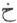 is the vanity [\*](#fn_81) of thine own doubt and mistrust;  
And, thro’ scepticism, thou sustainest injury exceeding.

p. 62

Fall not into error, concerning thy outward appearance;  
Since, after spring passeth away, the autumn cometh.

Set out in pursuit of the great object of solicitude,  
Whilst thou thy command upon the bridle retainest.

The Omnipotent is, by no means, distant from thee;  
For He is nearer unto thee, than even thine own self.

Whether on the earth, or whether in the heavens,  
The Omniscient there also is present in the midst.

He became, in unity and individuality, unique:  
In immensity, and in infinitude, He is diffused.

From His divinity, He departed and advanced towards it;  
And now, throughout the whole universe, He moveth.

The limits of His boundless infinity cannot be discovered;  
And in mankind is His abode, and His place of sojourn.

He himself inflicteth, and He himself performeth;  
And man He hath made, the motive and the plea.

From every saint that hath commenced his mission,  
Some sign, or some indication becometh manifest.

The scepticism of Mīrzā hath vanished,
and is no more;  
But whatever is by him spoken, Mī’ān Ro<u>s’h</u>ān [\*](#fn_82) speaketh.

p. 63

#### IV.

 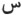 standeth for the
pilgrim [\*](#fn_83)—in this path let him
proceed:  
Let him, in all sincerity, become a seeker after Him.

From the sleep of negligence and remissness awake!  
Follow now in pursuit of thy well-wisher and friend!

Tho’ the object thou seekest be obscure and invisible,  
Ride lightly, and without baggage, in following it.

Its acquirement is attended with much trouble and toil:  
Determine thou, therefore, a dauntless spirit to show.

Since the lamp of love and affection is become lighted,  
Like the moth, to-day, become thou the sacrifice thereon.

He hath bestowed upon thee the cup of vitality;  
Then let the largess be upon the cupbearer scattered! [†](#fn_84)

Seek not to discover the faults and failings of others;  
But become the mirror of thine own acts and ways.

The desired object of thy attainment is near unto thee:  
Then, in sincerity and piety, towards it draw near!

Thou art, from the beginning, one and indivisible:  
Become now, therefore, the narrator of those hidden things!

God is one—without partner, and without associate:  
Forbear thou, then, from all, contrary thereto.

In this, O Mīrzā! the choice lieth with
thee, entirely;  
Therefore, in the qualities of the tranquil, be thou stedfast!

p. 64

#### V.

 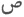 is significant of
faith's straight and narrow path; [\*](#fn_85)  
And, after much terror and danger, its goal is attained.

The artifices and deceits of the Devil are manifold in number;  
But far, far worse than those, is that enemy the flesh.

Follow thou not, in pursuit of the lusts of the world:  
The state is evil, and their promptings are pernicious.

The Devil spread out for man, the snare of posterity;  
And wealth, and various pleasures, are the baits thereon.

Distinction, and fame, one of its ramparts became,  
Whilst another of its attractions were silver and gold.

He layeth out separate snares quietly, and with caution;  
But the whole are like unto embroidery upon the carpet.

He will neither be prosperous nor happy, in this world,  
Who giveth ear unto the temptations of the Accursed.

Though a whole region should fall beneath his sway;  
Still, that man's heart will long, another to acquire.

They who give way unto the promptings of the flesh,  
For them, especially, there is torment excruciating.

But they who have passed safely this dread ordeal,  
For them are the perfect gifts of the patient and the meek.

Unto Mīrzā, His beneficence and His
kindness are vouchsafed;  
For He alone, is the All-merciful, and the Accepter of penitence.

p. 65

#### VI.

 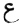 signifieth the great
evil [\*](#fn_86) of mistrust, and scepticism,  
Through which, all the world is, in bewilderment plunged.

That mind cannot rest assured, or be at peace,  
Which is constantly distracted in pursuit of nothingness.

It cannot partake of the advantages of unity;  
For it is in the infiniteness of infinity dispersed.

The elaboration of its counsels and reflections is great;  
But ’tis like unto a cloud, that containeth no rain.

Verily, he will not be able to attain unto perfection,  
Whose looks are directed unto detriment and defect.

The ignorant wreaketh tyranny, merely upon himself,  
Who is the sponsor of the onerous deposit of faith. [†](#fn_87)

p. 66

A worshipper of himself, sunk in egotism and vanity,  
He is, like the first Adam, in amazement and perplexity lost.

The soul contained in the human form, is like unto Joseph;  
And the body's nature and disposition are its prison-house.

When it hath become, from this thraldom, liberated,  
It is then in safety, and Heaven is its dwelling-place.

With transports filled, and mounted upon the steed of love,  
Enraptured, it is come forth unto the <u>Ch</u>oukan [\*](#fn_88) of its desire.

Draw near, O Mīrzā, and lift up thine
eyes!  
See! this is the ball, and this is the arena too!

#### VII.

 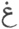—All that may be contrary
to nature change: [†](#fn_89)  
Make the soul king, and wisdom its minister.

Give not ear unto the flesh, for it is ignorant;  
And with wisdom, understanding regard.

The deceits of the Devil are without number;  
Therefore, consider as a fetter each of his spells.

There are five robbers [‡](#fn_90) in thine own
house,  
Each of which, in separate places, chain up.

p. 67

Deprive them of all evil appetites and desires;  
And, in thy heart, give place to reliance on God.

Draw thou near unto truthfulness and piety;  
And from thee, drive all deceit and guile.

I have spoken unto thee without disguise;  
Therefore, guide all thy actions accordingly.

Shouldst thou seek to be with these gifts endowed,  
Then go, seek the society of thy spiritual guide.

Guard well the heart from the Evil One;  
And upon it, register the remembrance of God.

The mundane things of this world are a dream:  
Now give thou the interpretation of the truth.

Subtile and profound are the words of Mīrzā:  
In their elucidation, do thou thy perception show!

#### VIII.

The loved-one is not concealed from thee,  
O thou obstruction, round about thy soul!

Thou thyself hast become thine own veil,  
Standing obdurate, in scepticism's path.

Thou becamest visible—the beloved, invisible;  
But like unto thee, a perfect counterpart.

Spotless and pure, on every side and surface—  
A simple lineament, but substance without.

Shouldst thou behold her, thou art blest:  
How long, then, O forlorn! wilt thou gaze upon thyself?

p. 68

When doth grain shoot up and flourish  
In arid soil? O thou, of hard earth, a clod!

When a clan pitcheth its tents upon a plain,  
Forthwith the grass thereon entirely disappeareth.

The black bee [\*](#fn_91) buzzeth lightly
around the lotus;  
Whilst thou, O beetle! hast sunk under thy load.

The flame, full soon, consumeth the straw;  
But thou burnest, clumsy block! with many groans.

From love alone, is the heart's existence:  
What were the callow brood, without the parent bird?

O Mīrzā! the compact of affection and
love,  
The moth, with the lamp, hath adjusted.

#### IX.

The anguish of love, alas! is incalculable.  
It is, alas! without antidote, without cure.

Without its thorns, the rose will never be;  
And friendship, alas! is with absence coupled.

The beloved, happy, and in her own heart, at peace,  
Is, alas! unconcerned—a ravisher of hearts!

He will undergo the pangs and agonies of love,  
Who may be, alas! reckless and regardless of life.

I live but in the remembrance of my dear one:  
Alas! indeed, I cannot exist, without my life.

p. 69

The only regret of the ascetic MĪRZĀ, alas! is this—  
That his passion's object is without indication.

#### X.

How amazing is the sublimity of the mind of the adorer!  
Unto whose throne, there was no access, even for the giant Æūd. [\*](#fn_92)

This stage of it is more contracted than Ṣarāt's narrow bridge: [†](#fn_93)  
How, then, did the army of love accomplish its ascent?.

His passion became like unto a vast and boundless ocean,  
Which, by its first swell, o’erwhelmed him in the billows.

The sword of unity, from between, He removed altogether; [‡](#fn_94)  
And upon infinitude, He conferred the name of spouse.

The boundless ocean, O Mīrzā! hath
encompassed all things;  
But the Ganges merely floweth to <u>Sh</u>amsābād and Kanouj.

p. 70

#### XI.

If it be thy wish to pass through life, from hatred and malice free,  
From the longings of covetousness deliver this spotless breast.

Thro’ heedlessness of heart, like what wilderness art thou grown?  
Account the Devil's temptations a monster, not a gnat!

The expecting heart is one only—its cares and anxieties many:  
The term, too, of thy existence, long or short, is nothingness.

The spiritual guest is an inestimable one: cherish him carefully—  
Broken rice possesseth not the fitness for the tables of kings.

Covetousness tottereth like one with ophthalmia stricken;  
But by perfect reliance upon the Almighty, cure thou the disease.

Change sinful arrogance for meekness and humility;  
And the sword of thy vanity and pride return unto its sheath.

Become pliant, and bending, like unto the tender twig;  
Not of thine own accord, like a hard, dry log of wood.

The five fingers once had an astonishing dispute together,  
At which time the little finger acknowledged its own littleness.

There is dignity, in the very insignificance of form;  
Hence fitness for the ring went unto the little finger.

Outwardly, become the spectator of the heart's internal things,  
O thou, from truth's source, great—by scepticism, contemptible!

O Mīrzā! behold thou the infinite
greatness of unity;  
Since such delicious honey, is from the bee produced.

p. 71

#### XII.

Thou art the vitality of my soul, O Thou, than soul itself, more
precious to me!  
Thou art the whole universe's existence, O Thou, than the world, more
precious to me!

Thy comprehension hath embraced all things; yet all things have not
comprehended Thee:  
Thou hast possessed Thyself of the seat of faith, O Thou, than faith,
more precious to me!

Whence shall there be aught of bliss in Heaven, if that sight of Thee,
be not for me?  
My heart is carried away in yearnings for Thee, O Thou, than Heaven,
more precious to me!

Wherefore should I rehearse the world's praises? unto whom repeat them,
when Thou art not?  
Thou, nightingale! gayest me hue and fragrance, O Thou, than the
parterre, more precious to me!

The bower is the hearts of the worshippers, and the heavenly Paradise of
the recluse;  
And the beholding of Thee, The Inscrutable, beyond all indication,
precious to me!

Thou art without similitude; infinite; indubitable; without ambiguity:  
And hence, the mine of all things, O Thou, than every mine, more
precious to me!

Thou art, moreover, the vitality of the universe; the breath of every
living creature:  
Thou art the inspiration of this Adam, O Thou, than inspiration, more
precious to me!

p. 72

Thou art the repository of vitality, that hast pervaded all and every
living thing:  
At times invisible, at others visible; but whether hidden or apparent,
precious to me!

Thou art a voice, after many kinds; encompassing all things; without
indication:  
Thou art without lineament in every respect; but, in every way, precious
to me!

Thou art wholly inscrutable in all things: the invisible in the
manifest:  
Thou art the signification in description, O Thou, beyond description,
precious to me!

Concerning the soul, what shall I say? verily, it is an attribute of
unity itself:  
Mīrzā, without the soul cannot exist, O
Thou, than soul even, more precious to me!

#### XIII.

Shouldst thou once become an inmate of the house of God's love,  
Thou wilt, forthwith, become a stranger unto the world, entirely.

From out of entity, nonentity will come upon thee;  
Thou, by this inexistent, in all existent, shalt unique become.

This perfect knowledge will be with thee, entirely;  
But thou wilt be mad in the sight of the weak-minded.

The whole arrows of calumny will be poured upon thee;  
And thus, thou wilt become the butt of great and small.

p. 73

From the world's unworthy, thou shalt the heart's concerns withdraw:  
Thou wilt be like a hidden treasure in a wilderness.

Shouldst thou change this, thy well-being, for misfortune,  
Thou wilt become the whole prosperity of all adversity.

Shouldst thou cast this heart of thine on that consuming flame,  
Thou wilt, the self-sacrificing moth become thereby.

A pure, unadulterated wine shall fill thy mouth;  
From the effect of which, thou shalt be ever inebriated.

Thou wilt not hold, in any consideration, either world,  
Shouldst thou grow rich from the treasury of contentment.

Thus thou wilt shower mercy's genial rain upon the world,  
And become the seed, through the universe disseminated.

The all-knowing, concerning thy condition shall speak;  
And by truth, thou wilt become the parable of the truthful.

On speaking, thou wilt give reply worthy of being spoken;  
And become, of every harp and every melody, the harmony.

The eloquent, who shall enter on the praises of the Almighty,  
Shall, like unto Mīrzā, be remembered
throughout all time.

#### XIV.

He, who placeth reliance on the lying and deceitful,  
Maketh firebrands out of nothing, by such utter folly.

It is the senselessness of fools, in opposition to wisdom,  
That, in the heat of summer, raiseth a tower of snow.

p. 74

His prosperity is trouble—he groweth down-hearted thereby:  
And his fresh adversity addeth twofold misery his sorrows unto.

Every man, who seeketh fidelity from the perfidious world,  
Taketh it, in lease, for much bitterness, and many woes.

Success and disaster good and evil—are with the act coupled;  
But fools suppose such things influenced by the stars.

I am amazed, beyond measure, at such like people,  
Who place any reliance upon the bubble's permanency.

The ocean's waves will, one day, dash against each other;  
And will, full speedily, the garment of the bubble rend.

When the pious and devout view this running stream,  
They perceive, in its flowing, the scene of their own existence.

The wise enter upon the search of the object of their desires:  
The beasts of the field, about food and sleep, themselves concern.

When the adorers awake from the slumber of remissness,  
They take due heed of the fleeting of every breath.

That the traveller may, from his sweet repose awaken,  
The warning bell of departure, tolleth at the dawn of day. [\*](#fn_95)

The delight of the Darwe<u>sh</u> is in fervour, and in study:  
The pleasure of Chieftains is in their banners and drums.

That country cannot be exempt from confusion and ruin,  
Whose army indulgeth in grossest tyranny and rapacity.

If a friend should lend ear unto the secret of the stranger,  
Friends will, themselves, ruin their own affairs, thereby.

p. 75

When the mandate of the All-powerful shall reach him,  
From whence shall Mīrza's strength a
remedy obtain?

#### XV.

How shall I define what thing I am  
Wholly existent, and non-existent, thro’ Him, I am.

Whatever becometh naught out of entity,  
The signification of that nothingness am I.

Sometimes a mote in the disc of the sun;  
At others, a ripple on the water's surface.

Now I fly about on the wind of association:  
Now I am a bird of the incorporeal world.

By the name of ice I also style myself:  
Congealed in the winter season am I.

I have enveloped myself in the four elements:  
I am the clouds on the face of the sky.

From unity I have come into infinity:  
Indeed, nothing existeth, that I am not.

My vitality is, from life's source itself;  
And I am the speech, every mouth within.

I am the hearing-sense within every ear;  
And also the sight of every eye am I.

I am the potentiality in every thing:  
I am the perception every one within.

My will and inclination are with all;  
With mine own acts, also, satisfied am I.

p. 76

Unto the sinful and vicious, I am evil;  
But unto the good beneficent am I.

In the lot of the devoted, I am the honey:  
In the soul of the impious, the sting.

I am with every one, and in all things.  
Without imperfection—immaculate I am.

’Tis by the mouth of Mīrzā that I
speak:  
An enlightened heart, without similitude, I am.

#### XVI.

The tresses of this impassioned loved-one, are all dishevelled:  
They are spread all around her face, like a shadow unto.

She hath prepared every separate hair as a snare—  
Each one laid for the capture of wounded hearts.

Within those hearts how can there be aught of tranquillity,  
When she hath held them in check, by the reins of love?

Since from such an abode of their own they are exiled,  
Where is the land of their sojourn, in which peace may be found?

They, who have their reason lost, thro’ such a charmer's love,  
Have now renounced both the rosary and the Brahmanical cord. [\*](#fn_96)

All things have happened through their own affection;  
And those without it, are useless, in all respects.

They have no place, either in the closet or the wine-shop:  
Neither in the Muslim's regard, nor the infidel's sympathy.

p. 77

With regard to such like eyes, what caution can I use,  
When their glances are prepared for piercing me?

Her lovely person she hath transformed to a sandal tree; [\*](#fn_97)  
And those tresses, like unto snakes, are around it fallen.

He, who nourisheth the desire of such a sight as this,  
On him, are the whole miseries of the universe heaped.

The hearts of lovers ever kindle, at the loved-one's glance;  
For ’tis a flame; and her eyes are like firebrands unto.

To-day she hath again lighted the lamp of her beauty;  
And her adorers’ hearts, like the moth, are oblations thereon.

The names, nightingale and wooer, are one and the same;  
And conscious hearts, in her praise, are melodious songsters. [†](#fn_98)

Her eyes are lotuses, and the pupils, they are black bees; [‡](#fn_99)  
And their gaze, like the gazelle's, is free and unrestrained.

Her eyebrows are bows, and her eyelashes, the arrows;  
And to launch upon her lover, she hath raised them.

The pure and sincere, in both worlds, enjoy liberty:  
’Tis a tower, whence to gain a good sight of the beloved.

Than this supreme felicity, what greater can there be,  
When, every moment, they expect the adored to behold?

This infinity, on the water-wheel [§](#fn_100)
of unity she placed;  
And each water-pot, in its own turn, cometh and departeth.

p. 78

She hath endowed every one with her own understanding;  
And every one's perception is, in proportion, according.

O Mīrzā! behold thou those languid,
sleepy eyes,  
That, for the love of the adored, beam with phrenzy ever!

#### XVII.

What inquiry makest thou concerning the lover's condition I  
No one hath hazarded a conjecture of the interminable road!

Wherefore had I been afflicted with misery such as this,  
Had I guarded the heart from hearing the sight's promptings?

How can there be any peace or tranquillity for them,  
Whose hearts, the ardent glances of the beloved have abducted?

Love, she hath made the chain of a distracted breast;  
And, by the power of her glance, draweth the bond unto her.

A wondrous state of affection hath come over them—  
Without seeing, they are disturbed, and in pursuit tired out.

Without any will of their own, they search for liberty:  
With such a death impending, the dead yearn after life.

When the ripe fruit falleth to the earth, in its perfection,  
The seed, with gladness, boweth its head to the ground.

This bubble, even now formed by the water, is by it again broken;  
But what is carried away by the flood, floateth, its surface, upon.

They of little sense, are at their good fortune perplexed;  
And this wind, like unto chaff, carrieth them before it.

One, here and there, comprehendeth the reality's purport—  
The lightly equipped travelleth, easily, along the narrow path.

p. 79

Cast, O Mīrzā, thine eyes upon the
burnished mirror!  
There is no particle of iron-dross in the steel thereof.

#### XVIII.

Upon them, that journey on the road of love,  
New assaults, incessantly, are made.

How can there be any peace in those hearts,  
That have beheld the splendour of the beloved?

Though, at first, she showed her face in its splendour,  
A part of her mantle is now drawn o’er it again.

She hath made each of those eyelashes an arrow;  
And her eyebrows are the ambush with bended bow.

The pilgrims, she hath ripened by separation's heat;  
And now her preparations are for the reaping of them.

Care and anxiety are the motives of existence;  
But what is life unto them, that before death die?

Since from sweet existence, they have, their hearts withdrawn,  
The world is a barleycorn in the sight of their resolve.

The truly beloved is, by no means, distant from thee:  
Thine own insensate scepticism is the abyss in thy front.

To that godly one, who entered the transient abode,  
The whole universe is God, and he followeth Him.

It behoveth to acquire love from both the eyes,  
That, apparently separate from each other, are but one sight.

Since thou wanderest not far from thy abode,  
Surely thy heart, O Mīrzā! is pledged
unto thy beloved.

p. 80

#### XIX.

When that rose, out of nothingness, a form assumed,  
The violet fell down, in adoration, at its feet.

Thou shalt drink from the cup of the perfect-one,  
If to the melody of flute and harp, thy intellect respond.

Make thine heart the pleasant meadow of Abraham!  
And become thou, as the scorching fire of Nimrūd therein! [\*](#fn_101)

Behold the fidelity and sincerity of the world!  
See how it deserted the tribes of Thamūd and Æād! [†](#fn_102)

Like as the rose bloometh, so it fadeth away;  
As its short life, so is mine also computed.

p. 81

Where is the rose, and where, too, is the thorn?  
For all things soever there is a purpose fixed.

Let the idea of a partner with God perish:  
The Indivisible is one only, and Omnipresent.

He hath entered into the emporium of infinity:  
He is the attestor, and He is the attested become.

The adored, from His countenance hath raised the veil;  
And the fortune of Mīrzā become
propitious and august.

#### XX.

How long wilt thou wander, O covetous one! in the world's pursuit?  
This very avarice, in itself, is an impediment in thy design!

For far fiercer than fire, is the flame of covetousness:  
As much more as its food may be, so much is its voracity.

New cares and anxieties about it, every moment increase:  
It hath taken all zest and pleasure from its bondsmen.

It coquets and toys, separately, with every one:  
To the whole creation it is the seller, and they its buyers are.

Neither did <u>Sh</u>addād, in his arrogance, enter his paradise, [\*](#fn_103)  
Nor did Ḳārūn [†](#fn_104) derive any profit
from its pursuit.

p. 82

It concealed religion from the children of profanity;  
And the straight-path, mere rites and ceremonies termed. [\*](#fn_105)

It hath spread out a great net in this universal road;  
And no wise man, save the contented, escapeth from it.

The pious and devout, thro’ contentment, peace of mind acquire,  
When unto the Consoler, they their distressed hearts turn.

From head to foot, the devout shall become illumined,  
When they, thro’ their hearts' courage, to the Creator draw nigh.

He, who hath died unto the world, obtaineth all things—  
This is the great axiom of the Sower of bygone times.

The advantages he will acquire, will exceed all computation,  
Who, in his necessities, becometh the acquirer of the Giver of Good.

Both states of being he vieweth, upon every respiration:  
In truth, he is absorbed into the Shining Bright.

On the foot of the spirit, he ever soareth upon them,  
However sublime the highest heaven, or the empyrean boundless.

His ice-like scepticism becometh thawed, by unity's sun:  
He neither speaketh, nor acteth, save with the Creator's assent.

The felicity of the wise is after this manner recounted—  
That its signification relateth unto the reality itself.

p. 83

If adoration unto the Almighty is a divine command,  
Bow thine head, unto the good and perfect too.

How long wilt thou have occasion for Mīrzā, as the medium?  
Distinguish thou thyself, O auditor, the speaker's voice!

#### XXI.

I continually call to mind this sweet and charming friend,  
Through this exalted name of whom, I acquire the heart's good.

How then can I be patient, severed from such a dear one,  
When I perceive no sign of resignation in my heart?

Through this anxiety about her, I am ever miserable,  
As to what remedy I shall devise; of whom, inquiry make.

In its eagerness for a look, it hath wholly left its seclusion:  
With what chains shall I restrain this incomparable heart?

Except I make a snare of the ringlets of the faces of the fair,  
And place for the bait, their musky moles therein.

I will put forth the whole wisdom of the enlightened,  
If I may, this wayward heart, by any means, entrap.

Verily, it is become so utterly scattered to the winds,  
That I find not the least vestige of it, in any direction.

It hath abandoned the universe, in search of the beloved:  
How then shall I quit the world, in the pursuit of it?

No tidings thereof can be obtained, in any quarter:  
I sit not down, abstaining, nor do I follow, in pursuit.

The body's vitality is the heart; and the heart's, the soul;  
Then, without heart, and without soul, how shall I exist?

p. 84

Of life, not even a dying breath remaineth unto me:  
Frantic and beside myself thereat, I beat my hands and feet.

Still, this my death, is far better for me, than life itself,  
Since, my soul I have abandoned, for the loved-one's love.

Regarding the putting off of mortality, Mīrzā thus testifieth—  
When from this being, I cease to be, I shall entity become.

------------------------------------------------------------------------

### Footnotes

[57:\*](spa07.htm#fr_75) One who has attained a
certain stage in the Ṣūfi mysticisms.

[58:\*](spa07.htm#fr_76)  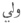, *walaey*, The shoulder-bone
of an animal, or more particularly that of a sheep, used by the
Af<u>gh</u>āns in divination.

[58:†](spa07.htm#fr_77) "The ship of the earth"
here referred to is the earth itself, and the "cones of stone" are the
mountains protruding from its surface. According to the ideas of
Muḥammadans, the earth is placed upon the waters, in the midst of which
it floats.

[58:‡](spa07.htm#fr_78)   *kun fa-yakūn*, "Be! then it
is," a phrase attributed to the Creator at the creation of the world.

[60:\*](spa07.htm#fr_79) The conditions which
Adam accepted from the Creator regarding the duties for which he was
created. See Mīrzā, Poem VI., second note.

[60:†](spa07.htm#fr_80) Referring to Adam.

[61:\*](spa07.htm#fr_81)  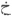 *<u>kh</u>*, is the first
letter of  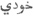
*<u>kh</u>ūdī*, vanity, pride, etc.

[62:\*](spa07.htm#fr_82) Mī’ān or Pīr
Ro<u>sh</u>ān, the founder of the Roshāniān doctrine, and ancestor of
Mīrzā. See page [51](spa06.htm#page_51).

[63:\*](spa07.htm#fr_83)  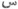 stands for  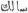, of which it is the first
letter, signifying a pilgrim, a traveller, and, metaphorically, a
devotee.

[63:†](spa07.htm#fr_84) A custom of scattering
money, by way of largess, amongst the people on festive occasions.

[64:\*](spa07.htm#fr_85)  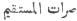—the direct and narrow path—the
way of religion and orthodoxy.

[65:\*](spa07.htm#fr_86) The first letter of
 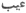, sin, evil, fault,
infirmity, etc.

[65:†](spa07.htm#fr_87) By faith is understood
here, entire obedience to the will of God, on the observance or neglect
of which, no less than eternal happiness, or misery depends; and so
difficult in the performance, that when God proposed it to the vaster
parts of creation, on the conditions annexed, they declined to undertake
as a duty, that, the failing wherein must be attended with such terrible
consequences. God made the proposal to the heavens, earth, and
mountains, which, at their first creation, were endued with reason; and
made known to them that he had made a law, and created Paradise for the
recompense of such as were obedient to it, and Hell for the punishment
of the disobedient; to which they answered, they were content to be
obliged to perform the services for which they were created, but would
not undertake to fulfil the divine law on these conditions, and
therefore desired neither reward nor punishment. When Adam was created,
the same offer was made to him, and he accepted it, notwithstanding
man's weaknesses, and the infirmities of his nature. Jellāl-ud-Dīn, al
Beidāwi's Commentary on the Kur’ān.

[66:\*](spa07.htm#fr_88) <u>Ch</u>oukān or
<u>Ch</u>ougān is the Persian name of a game resembling tennis or
cricket, but played on horseback by many Asiatic tribes. It also
signifies the crooked bat used therein.

[66:†](spa07.htm#fr_89)  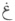 the first letter of  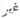, contrary, different, etc.

[66:‡](spa07.htm#fr_90) The five robbers or
enemies here referred to, as in the house of the body, are the five
senses—hearing, seeing, touch, taste, and smell.

[68:\*](spa07.htm#fr_91) A bee enamoured of the
lotus.

[69:\*](spa07.htm#fr_92) Æūd is the Arabian name
of Og, the son of Anak, concerning whose enormous stature, his escaping
the Flood, and the manner of his being slain by Moses, the Muḥammadans
relate numerous fables. See Numbers, xxi.
34, 35.

[69:†](spa07.htm#fr_93) The bridge over the
infernal fire, and over which those who are to be admitted into
Paradise, as well as those who are destined to Hell-fire, must pass. It
is described as finer than the thread of a famished spider, and sharper
than the edge of a sword.

[69:‡](spa07.htm#fr_94) "In remotest time, the
sword was emblematic of chastity. When the Emperor Maximilian married
Maria of Burgundy by proxy, he enjoins the knight, who is to be his
representative, to lay him down in the bridal bed, to which he is to
lead the princess, in full armour, and to place a drawn sword between
himself and her."—Chambers' Journal, Vol.
XI. From this it would appear to have been also practised by the nations
of the East.

[74:\*](spa07.htm#fr_95) It is usual to ring a
bell at the dawn of day, to arouse the people of a caravan to prepare to
set out.

[76:\*](spa07.htm#fr_96) See note at page
[18](spa05.htm#page_18).

[77:\*](spa07.htm#fr_97) The sandal-wood tree is
said to be the favourite haunt of black serpents.

[77:†](spa07.htm#fr_98) The mūsīkār is a bird,
said to have numerous holes in its beak, from which as many melodious
sounds issue.

[77:‡](spa07.htm#fr_99) A species of bee,
enamoured of the lotus.

[77:§](spa07.htm#fr_100) The Persian wheel is a
contrivance for drawing water for irrigation, etc., round the rim of
which a string of earthen pots revolves.

[80:\*](spa07.htm#fr_101) The commentators on
the Ḳur’ān relate, that by Nimrūd's (or Nimrod's) order, a large space
was enclosed at Kūtha, and filled with a vast quantity of wood, which
being set on fire, burned so fiercely that no one dared to venture near
it. Then they bound Abraham, and putting him into an engine (which some
suppose to have been the Devil's invention) shot him into the midst of
the lire, from which he was preserved by the angel Gabriel, who was sent
to his assistance; the fire burning only the cords with which he was
bound. They add, that the fire having miraculously lost its heat, in
respect to Abraham, became an odoriferous air, and that the pile changed
to a pleasant meadow; though it raged so furiously otherwise, that,
according to some writers, about two thousand of the idolaters were
consumed by it.—Sale’s Kur’ān, note to
page 269.

[80:†](spa07.htm#fr_102) "And unto the tribe of
Thamūd *we sent* their brother Sāliḥ. He said, Oh my people, worship
God: ye have no God besides him. Now hath a manifest proof come
unto you from your Lord. \* \* \* Those
who were elated with pride replied, Verily, we believe not in that
wherein ye believe. And they cut off the feet of the camel, and
insolently transgressed the command of their Lord, and said, Oh Sāliḥ, cause that to come
upon us which thou hast threatened us with, if thou art *one* of those
who have been sent *by God*. Whereupon a terrible noise from Heaven
assailed them; and in the morning they were found in their dwellings
prostrate on their breasts, *and dead*."—Al
Kur’ān.

[81:\*](spa07.htm#fr_103) Shaddād and Shaddīd,
the two sons of Æād, who reigned shortly after the death of their
father, and extended their power over the greater part of the world; but
the latter dying, his brother became sole monarch; who having heard of
the *celestial paradise*, made a garden in imitation thereof, in the
deserts of Aden, and called it Irem, after the name of his
great-grandfather. When it was finished, he set out, with a great
attendance, to take a view of it; but when they were come within a day's
journey of the place they were all destroyed by a terrible noise from
heaven. Sale's Kur’ān, page 488, and
note.

[81:†](spa07.htm#fr_104) Kārūn, the son of
Ye<u>sh</u>ar (or Izhar), the uncle of Moses, and consequently p. 82 the same with Korah of the Scriptures. Ile
surpassed every one in opulence, so much so, that the riches of Ḳārūn
have become a proverb. God directed Moses to punish him; and the earth
having opened under him, he was swallowed up, along with his palace, his
riches, and his confederates.

[82:\*](spa07.htm#fr_105) That is to say, that
the sacred book of the Lawgiver Muḥammad has been called a mere
collection of rites and ceremonies.

------------------------------------------------------------------------

[Next: Introduction](spa08)
