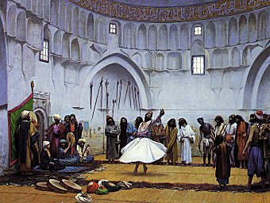

  
[Intangible Textual Heritage](../../index)  [Islam](../index) 

------------------------------------------------------------------------

[Buy this Book on
Kindle](https://www.amazon.com/exec/obidos/ASIN/B002KKCSCQ/internetsacredte)

------------------------------------------------------------------------

<table width="75%">
<colgroup>
<col style="width: 50%" />
<col style="width: 50%" />
</colgroup>
<tbody>
<tr class="odd">
<td width="50%" data-valign="TOP"> 
Whirling Dervishes, by Jean-Leon Gerome [19th c.] (Public Domain Image)</td>
<td width="50%" data-valign="CENTER"><h1 id="the-secret-rose-garden" data-align="CENTER">The Secret Rose Garden</h1>
<h4 id="of-sad-ud-din-mahmud-shabistari" data-align="CENTER">of Sa'd Ud Din Mahmud Shabistari</h4>
<h2 id="by-florence-lederer" data-align="CENTER">by Florence Lederer</h2>
<h4 id="section" data-align="CENTER">[1920]</h4></td>
</tr>
</tbody>
</table>

------------------------------------------------------------------------

[Contents](#contents)    [Start Reading](srg00)    [Page
Index](pageidx)    [Text \[Zipped\]](srg.txt.gz)

------------------------------------------------------------------------

|                                                                                                                           |
|---------------------------------------------------------------------------------------------------------------------------|
|  |

Sa'd ud Din Mahmud Shabistari was born in Persia, in Shabistar, near
Tabriz, about 1250 CE. His best known work, The Secret Rose Garden was
written as a reply to questions by a Sufi doctor of Herat. This set of
verses uses the rich Sufi allegorical language to explore the path to
God.

------------------------------------------------------------------------

 [Title Page](srg00)  
[Contents](srg01)  
[Editorial Note](srg02)  
[Introduction](srg03)  
[Acknowledgment](srg04)  
[Part I. The Perfect Face of the Beloved](srg05)  
[Part II. Beauty](srg06)  
[Part III. The Sea and its Pearls](srg07)  
[Part IV. The Journey](srg08)  
[Part V. Time and This Dream-World](srg09)  
[Part VI. Reflections](srg10)  
[Part VII. Divine Inebriation](srg11)  
[Part VIII. Reason and Free-Will](srg12)  
[Part IX. Man: His Capabilities and His Destiny](srg13)  
[Part X. The One](srg14)  
[Part XI. The Self](srg15)  
[Part XII. Idols, Girdles, and Christianity](srg16)  
[Part XIII. Thoughts](srg17)  
[Part XIV. The Light Manifest](srg18)  
[Epilogue](srg19)  
