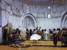

  
[Intangible Textual Heritage](../../index)  [Islam](../index) 
[Index](index)  [Previous](srg16)  [Next](srg18) 

------------------------------------------------------------------------

[Buy this Book on
Kindle](https://www.amazon.com/exec/obidos/ASIN/B002KKCSCQ/internetsacredte)

------------------------------------------------------------------------

  
*The Secret Rose Garden*, by Florence Lederer, \[1920\], at Intangible
Textual Heritage

------------------------------------------------------------------------

p. 82

# PART XIII

## THOUGHTS

### CIRCLES

BEHOLD the world mingled together,  
Angels with demons, Satan with the archangel.  
All mingled like seed and fruit,  
Infidel with faithful, and faithful with infidel.  
At the point of the present are gathered  
All cycles and seasons, day, month, and year.  
World at beginning is world without end. [1](#fn_5)

. . . From every point in this circle  
A thousand forms are drawn;  
Every point as it revolves in a circle  
Is now a circle, now a circling circumference.

p. 83

### DEATH

DEATH occurs to man in three ways:  
First he dies every moment by his earthly nature;  
Then, when his will perishes, he dies again;  
And lastly at the separation of soul and body.

### THE HEAVENS

LET not the prison of nature detain you,  
But come forth and view the art of the Divine,  
Contemplate the appearance of the heavens,  
So that praise and wonder for the Truth will be thine.

The arch of the high heavens enclosing both worlds  
Is called "The Throne of the Merciful,"  
And like the heart of man is ever moving,  
Never resting for a moment.  
Perchance man's heart is the central point  
And heaven the circumference.

Within a day and a night  
Heaven outspans your circuits, O dervish!

p. 84

The other heavenly spheres are circling too,  
Remember they all move in one direction,  
From east to west like a water wheel,  
Rushing on without food or sleep.

When the astrologer is an unbeliever,  
He sees not that these circulating lights of heaven  
Are dominated and controlled by The Truth.

### NO COMPLETE HAPPINESS HERE

WHOM have you seen in the whole world  
Who ever once acquired pleasure without pain?  
Who, in attaining all his desires,  
Has remained at his height of perfection?

### THE ATOMS

TAKE one atom away from its place  
And the whole world will fall to pieces;  
The world is whirling dizzily, yet no one part  
Moves from the limit of its place.  
Each atom, held in bondage,  
Despairs at its separation from the whole;  
So though imprisoned, yet moves,

p. 85

Though unclothed, yet is clothed again,  
Though at rest, yet is always wandering,  
Never beginning and never ending;  
Each possessing self-knowledge, and so  
Hurrying towards the throne on high.

Each atom hides beneath its veil  
The soul-amazing beauty of the Beloved's Face.

### THE PRAISE OF THE ATOMS

CONTINUALLY dwelling in all mystic lore,  
Continually singing the song of praise  
The atoms of the world will seem to you  
Drunken and heavy with wine.

. . . When you have carded self  
Like the wool-carder, you will raise a cry.  
Oh! take the cotton of illusion from your ears,  
And hearken to the call of the One, the Almighty.

. . . Why tarry till the last day  
When now, in the valley of peace,  
The very bush will say to you, "I am Allah"?

p. 86

### THINKING

THINKING is passing from the false to the true  
And seeing the Absolute Whole in the part.  
When the idea enters the mind,  
It is a reminiscence of a former state,  
And passes on to interpretation.

. . . He who sees by illumination  
Discerns God first in everything,  
But he who sees by logic only,  
And seeks to prove the necessary,  
Is bewildered and sometimes travels  
Backward in a circle, or is imprisoned  
In a chain of proofs.  
Fool! he seeks the dazzling sun  
By the dim light of a candle in the desert.

### THOUGHTS ON CREATION

THE heavens revolve day and night  
Like a potter's wheel,  
And every moment the Master's wisdom  
Creates a new vessel. For all that exists  
Comes from one hand, one workshop.

p. 87

Why do the stars set?  
Going from perfection to defection?  
Why do they change position,  
Place, circuit, colour, and form?  
Or why is heaven fretted by fire  
Always whirling through desire?  
Why are the planets revolving,  
Above or beneath the earth?  
The elements which are below the heavens  
Serve in their appointed place  
Ever united together.  
From them is born the threefold  
Kingdom of Nature;  
Minerals, then plants and animals,  
Waiting in their places as He wills.  
Minerals, low in the dust, plants standing upright,  
Animals, by their natural passions,  
Preserving, continuing their races and species.

All, bowing to their Master's commands,  
Fulfil His will day and night.

------------------------------------------------------------------------

### Footnotes

[82:1](srg17.htm#fr_5) There is no past or
present with God, but an eternal Now.

------------------------------------------------------------------------

[Next: Part XIV. The Light Manifest](srg18)

