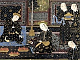

  
[Intangible Textual Heritage](../../index)  [Islam](../index) 
[Index](index)  [Previous](taa29)  [Next](taa31) 

------------------------------------------------------------------------

  
*The Tarjuman al-Ashwaq*, by Ibn al-Arabi, tr. Reynold A. Nicholson,
\[1911\], at Intangible Textual Heritage

------------------------------------------------------------------------

### XXVII

1\. O ancient temple, there hath risen for you a light that gleams in
our hearts.

2\. I complain to thee of the deserts which I crossed, where I let my
tears flow unchecked,

3\. Taking no joy in rest at dawn or dusk, continuing from morn to morn
and passing from eve to eve.

4\. Truly, the camels, even if they suffer from footsoreness, journey by
night and make haste in their journey.

5\. These beasts of burden carried us to you with eager desire, though
they did not hope to attain thereby.

6\. They traversed wildernesses and wellnigh rainless lands, impelled by
passion, but they did not therefore complain of fatigue.

7\. They die; not complain of the anguish of love, and ’tis I who
complain of fatigue. Indeed, I have claimed something absurd.

#### COMMENTARY

1\. 'O ancient temple,' i.e. the gnostic's heart which contains the
reality of the Truth.

p. 104

'There hath risen for you,' etc., i.e. the light in the heart (which is
the centre of the body) seeks to rise from its source and convey to the
members of the body the Divine realities. In this station a man sees by
God, hears by God, speaks by God, and moves by God.

2\. 'The deserts which I crossed,' i.e. the mortifications and
austerities which I suffered.

4\. 'The camels,' i.e. the aspirations. He means that they do not cease
from seeking, although exhausted by the difficulty of their quest. They
are exhausted because the proofs supplied by the understanding are
unable to lead them to the Divine reality.

7\. 'I have claimed something absurd,' i.e. I pretend to love God, while
complaining of distress and fatigue, yet these 'beasts of burden', viz.
my acts and thoughts which I control and govern, make no complaint.

------------------------------------------------------------------------

[Next: XXVIII](taa31)

