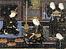

  
[Intangible Textual Heritage](../../index)  [Islam](../index) 
[Index](index)  [Previous](taa54)  [Next](taa56) 

------------------------------------------------------------------------

  
*The Tarjuman al-Ashwaq*, by Ibn al-Arabi, tr. Reynold A. Nicholson,
\[1911\], at Intangible Textual Heritage

------------------------------------------------------------------------

### LII

1\. I am content with Raḍwá as a meadow and a lodging-place, for it has
a pasture in which is cool water.

2\. May be, those whom I love will hear of its fertility, so that they
will take it as an abode and lodging-place.

3\. For lo, my heart is attached to them and listens silently whenever
the camel-driver urges them on with his chant.

4\. And if they call to one another to set out and cross the desert,
thou wilt hear its wailing behind their camels.

5\. And if they make for az-Zawrá, it will be in front of them, and if
they are bound for al-Jar‘á, it will alight there.

6\. No fortune is found except where they are and where they encamp, for
the bird of Fortune has fledglings in their tribe.

7\. Fear for myself and fear for her sake battled with each other, and
neither gave way to its adversary.

8\. When her splendours dazzle mine eyes, the sound of my sobbing
deafens her ears.

p. 139

#### COMMENTARY

1\. 'Raḍwá,' with reference to the station of Divine satisfaction
(\#\#\#).

'A pasture,' i.e. spiritual nourishment.

2\. 'Those whom I love,' i.e. gnostics like himself.

4\. 'The desert,' i.e. the stations of abstraction (\#\#\#).

'Their camels,' i.e. the aspirations journeying away from the body.

5\. 'Az-Zawrá,' i.e. the presence of the Quṭb.

'In front of them': he means that he anticipates them in his thoughts
and wishes.

'Al-Jar‘á,' i.e. a place where they suffer painful self-mortification.

6\. The gnostic seeks only that which is akin to himself.

7\. 'Fear for myself,' i.e. fear lest my eyes should be dazzled by the
manifestation of my Beloved's glory.

'Fear for her sake,' i.e. fear lest her ears should be deafened by the
noise of my sobbing.

------------------------------------------------------------------------

[Next: LIII](taa56)

