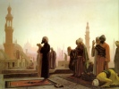

  
[Intangible Textual Heritage](../../index)  [Islam](../index) 
[Index](index)   
[Hypertext Quran](../htq/index)  [Unicode Quran](../uq/064) 
[Pickthall](../pick/064)  [Palmer Part II (SBE09)](../sbe09/064)  [Yusuf
Ali/Arabic](../quran/06401)  [Rodwell](../qr/064)   
[Previous](yaq063)  [Next](yaq065) 

------------------------------------------------------------------------

  
*The Holy Quran*, tr. by Yusuf Ali, \[1934\], at Intangible Textual
Heritage

------------------------------------------------------------------------

p. 1555

### Sūra LXIV.

### *Tagābun*, or Mutual Loss and Gain.

*In the name of God, Most Gracious,  
Most Merciful.*

1\. Whatever is  
In the heavens and  
On earth, doth declare  
The Praises and Glory  
Of God: to Him belongs  
Dominion, and to Him belongs  
Praise: and He has power  
Over all things.

2\. It is He Who has  
Created you; and of you  
Are some that are  
Unbelievers, and some  
That are Believers:  
And God sees well  
All that ye do.

3\. He has created the heavens  
And the earth  
In just proportions,  
And has given you shape,  
And made your shapes  
Beautiful: and to Him  
Is the final Goal.

p. 1556

4\. He knows what is  
In the heavens  
And on earth;  
And He knows what  
Ye conceal and what  
Ye reveal: yea, God  
Knows well the (secrets)  
Of (all) hearts.

5\. Has not the story  
Reached you, of those  
Who rejected Faith aforetime?  
So they tasted the evil  
Result of their conduct;  
And they had  
A grievous Penalty.

6\. That was because there  
Came to them apostles  
With Clear Signs,  
But they said:  
"Shall (mere) human beings  
Direct us?" So they rejected  
(The Message) and turned away.  
But God can do without (them):  
And God is  
Free of all needs,  
Worthy of all praise.

7\. The Unbelievers think  
That they will not be

p. 1557

Raised up (for Judgment).  
Say: "Yea, by my Lord,  
Ye shall surely be  
Raised up: then shall ye  
Be told (the truth) of  
All that ye did.  
And that is easy for God."

8\. Believe, therefore, in God  
And His Apostle, and  
In the Light which We  
Have sent down. And God  
Is well acquainted  
With all that ye do.

9\. The Day that He assembles  
You (all) for a Day  
Of Assembly,—that will be  
A day of mutual loss  
And gain (among you).  
And those who believe  
In God and work righteousness,—  
He will remove from them  
Their ills, and He will admit  
Them to gardens beneath which

p. 1558

Rivers flow, to dwell therein  
For ever: that will be  
The Supreme Achievement.

10\. But those who reject Faith  
And treat Our Signs  
As falsehoods, they will be  
Companions of the Fire,  
To dwell therein for aye:  
And evil is that Goal.

##### SECTION 2.

11\. No kind of calamity  
Can occur, except  
By the leave of God:  
And if any one believes  
In God, (God) guides his  
Heart (aright): for God  
Knows all things.

12\. So obey God, and obey  
His Apostle: but if  
Ye turn back, the duty  
Of Our Apostle is but  
To proclaim (the Message)  
Clearly and openly.

13\. God! There is no god  
But He: and on God,  
Therefore, let the Believers  
Put their trust.

14\. O ye who believe!  
Truly, among your wives

p. 1559

And your children are (some  
That are) enemies to  
Yourselves: so beware  
Of them! But if ye  
Forgive and overlook,  
And cover up (their faults),  
Verily God is  
Oft-Forgiving, Most Merciful.

15\. Your riches and your children  
May be but a trial:  
But in the Presence of God,  
Is the highest Reward.

16\. So fear God  
As much as ye can;  
Listen and obey;  
And spend in charity  
For the benefit of  
Your own souls.  
And those saved from  
The covetousness of their own

p. 1560

Souls,—they are the ones  
That achieve prosperity.

17\. If ye loan to God  
A beautiful loan, He  
Will double it to  
Your (credit), and He  
Will grant you Forgiveness:  
For God is most Ready  
To appreciate (service)  
Most Forbearing,—

18\. Knower of what is hidden  
And what is open,  
Exalted in Might,  
Full of Wisdom.

p. 1561

------------------------------------------------------------------------

[Next: Sūra LXV. Ṭalāq, or Divorce.](yaq065)

