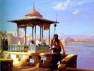

  
[Intangible Textual Heritage](../../index)  [Islam](../index) 
[Index](index)  [Previous](zun00)  [Next](zun02) 

------------------------------------------------------------------------

[Buy this Book on
Kindle](https://www.amazon.com/exec/obidos/ASIN/B002K8Q1Q2/internetsacredte)

------------------------------------------------------------------------

  
*The Diwan of Zeb-un-Nissa*, by Magan Lal and Jessie Duncan Westbrook,
\[1913\], at Intangible Textual Heritage

------------------------------------------------------------------------

p. 5

### CONTENTS

|                                                           |                           |
|-----------------------------------------------------------|---------------------------|
| Dedication                 | [6](zun02.htm#page_6)     |
| Introduction               | [7](zun03.htm#page_7)     |
| Diwan-i-Makhfi—The Ghazals | [25](zun04.htm#page_25)   |
| Notes                      | [109](zun05.htm#page_109) |

------------------------------------------------------------------------

[Next: Dedication](zun02)
