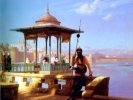

  
[Intangible Textual Heritage](../../index)  [Islam](../index) 
[Index](index)  [Previous](zun01)  [Next](zun03) 

------------------------------------------------------------------------

[Buy this Book on
Kindle](https://www.amazon.com/exec/obidos/ASIN/B002K8Q1Q2/internetsacredte)

------------------------------------------------------------------------

  
*The Diwan of Zeb-un-Nissa*, by Magan Lal and Jessie Duncan Westbrook,
\[1913\], at Intangible Textual Heritage

------------------------------------------------------------------------

p. 6

Thy pleasaunce, Princess, now is desolate;  
Where once the gleaming water-courses traced  
Their paths among the cypresses, a waste  
Stretches beyond thy ruined garden-gate;  
The rose is dead, the bulbul flown away,  
And Zeb-un-Nissa but a memory.

But where the rapt faquirs God's praises tell,  
Where at the shrine the pious pilgrims meet,  
Thy verses, Makhfi, holy tongues repeat,  
Thy name is honoured and remembered well:  
For through thy words they win a fleeting gleam  
Of the Divine Belovèd of their dream.

So might we, even in an alien tongue,  
Bring from thy mystic garden, where, apart,  
Thou dwelt communing with thy burning heart,  
These echoes of the songs that thou hast sung,  
And catch thy vision of the Soul's Desire,  
The immortal Phœnix with its wings of fire.  
                                          J. D. W.

------------------------------------------------------------------------

[Next: Introduction](zun03)
