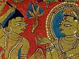

  
[Intangible Textual Heritage](../../index)  [Jainism](../index) 
[Index](index)  [Previous](sbe2261)  [Next](sbe2263) 

------------------------------------------------------------------------

[Buy this Book at
Amazon.com](https://www.amazon.com/exec/obidos/ASIN/B002CQU47O/internetsacredte)

------------------------------------------------------------------------

  
*Jaina Sutras, Part II (SBE22)*, tr. by Hermann Jacobi, \[1884\], at
Intangible Textual Heritage

------------------------------------------------------------------------

#### SECOND LESSON.

If, on board, the boatman should say to the mendicant, 'O long-lived
*S*rama*n*a! please, take this umbrella, pot, &c. (see II, 2, 3, § 2),
hold these various dangerous instruments [1](#fn_405), let this boy or girl drink,' he should
not comply with his request, but look on silently. (1)

If, on board, the boatman should say to another of the crew, 'O
long-lived one! this *S*rama*n*a is only a heavy load for the boat, take
hold of him with your arms and throw him into the water!' hearing and
perceiving such talk, he should, if he wears clothes, quickly take them
off or fasten them or put them in a bundle on his head. (2)

Now he may think: These ruffians, accustomed to violent acts, might take
hold of me and throw me from the boat into the water. He should first
say to them: 'O long-lived householders! don't take hold of me with your
arms and throw me into the water! I myself shall leap from the boat into
the water!' If after these words the other, by force and violence, takes
hold of him with his arms and throws him into the water, he should be
neither glad nor sorry, neither in high nor low spirits, nor should he
offer

p. 142

violent resistance to those ruffians; but undisturbed, his mind not
directed to outward things, &c. (see II, 3, 1, § 21), he may
circumspectly swim in the water. (3)

A monk or a nun, swimming in the water, should not touch (another
person's or their own?) hand, foot, or body with their own hand, foot,
or body; but without touching it they should circumspectly swim in the
water. (4)

A monk or a nun, swimming in the water, should not dive up or down, lest
water should enter into their ears, eyes, nose, or mouth; but they
should circumspectly swim in the water. (5)

If a monk or a nun, swimming in the water, should be overcome by
weakness, they should throw off their implements (clothes, &c.), either
all or a part of them, and not be attached to them. Now they should know
this: If they are able to get out of the water and reach the bank, they
should circumspectly remain on the bank with a wet or moist body. (6)

A monk or a nun should not wipe or rub or brush or stroke [1](#fn_406) or dry or warm or heat (in the sun)
their body. But when they perceive that the water on their body has
dried up, and the moisture is gone, they may wipe or rub, &c., their
body in that state; then they may circumspectly wander from village to
village. (7)

A monk or a nun on the pilgrimage should not wander from village to
village, conversing with householders; they may circumspectly wander
from village to village. (8)

If a monk or a nun on the pilgrimage come

p. 143

across a shallow water [1](#fn_407), they
should first wipe their body from head to heels, then, putting one foot
in the water and the other in the air, they should wade through the
shallow water in a straight line [2](#fn_408).
(9)

If a monk or a nun on the pilgrimage come across a shallow water, they
should wade through it in a straight line, without being touched by or
touching (another person's or their own?) hand, foot, or body with their
own hand, foot, or body. (10)

A monk or a nun, wading through shallow water in a straight line, should
not plunge in deeper water for the sake of pleasure or the heat; but
they should circumspectly wade through the shallow water in a straight
line. Now they should know this: If one is able to get out of the water
and reach the bank, one should circumspectly remain on the bank with a
wet or moist body. (11)

A monk or a nun should not wipe or rub, &c. (all as in § 7). (12)

A monk or a nun on the pilgrimage, with their feet soiled with mud,
should not, in order that the grass might take off the mud from the
feet, walk out of the way and destroy the grass by cutting, trampling,
and tearing it. As this would be sinful, they should not do so. But they
should first inspect a path containing little grass; then they may
circumspectly wander from village to village. (13)

If a monk or a nun on the pilgrimage come upon walls or ditches or
ramparts or gates or bolts

p. 144

or holes to fit them, or moats or caves, they should, in case there be a
byway, choose it, and not go on straight. (14)

The Kevalin says: This is the reason: Walking there, the mendicant might
stumble or fall down; when he stumbles or falls down, he might get hold
of trees, shrubs, plants, creepers, grass, copsewood, or sprouts to
extricate himself. He should ask travellers who meet him, to lend a
hand; then he may circumspectly lean upon it and extricate himself; so
he may circumspectly wander from village to village. (15)

If a monk or a nun perceive in their way (transports of) corn, waggons,
cars, a friendly or hostile army [1](#fn_409),
some encamped troops, they should, in case there be a byway,
circumspectly choose it, and not walk on straight. One trooper might say
to another: 'O long-lived one! this *S*rama*n*a is a spy upon the army;
take hold of him with your arms, and drag him hither!' The other might
take hold of the mendicant with his arms and drag him on. He should
neither be glad nor sorry for it, &c. (see § 3); then he may
circumspectly wander from village to village. (16)

If on his road travellers meet him and say, 'O long-lived *S*rama*n*a!
how large is this village or scot-free town, &c.? how many horses,
elephants, beggars, men dwell in it? is there much food, water,
population, corn? is there little food, water, population, corn?' he
should not answer such questions if asked, nor ask them himself.

This is the whole duty, &c.

Thus I say. (17)

------------------------------------------------------------------------

### Footnotes

[141:1](sbe2262.htm#fr_411) Sattha*g*âya =
*s*astra*g*âta. About *s*astra, see I, 1, 2.

[142:1](sbe2262.htm#fr_412) The original has
six words for different kinds of rubbing, which it would be impossible
to render adequately in any other language.

[143:1](sbe2262.htm#fr_413)
*G*a*m*ghâsa*m*târime udae, literally, a water which is to be crossed by
wading through it up to the knees; or perhaps water to be crossed on
foot.

[143:2](sbe2262.htm#fr_414) Ahâriya*m* = yathâ
*rig*u bhavati. It might also mean, in the right way. Another
explanation is yathâtâryam.

[144:1](sbe2262.htm#fr_415) Sva*k*akrâ*n*i vâ
para*k*akrâ*n*i vâ. My translation is merely a guess.

------------------------------------------------------------------------

[Next: Book II, Lecture 3, Lesson 3](sbe2263)
