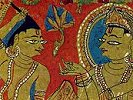

  
[Intangible Textual Heritage](../../index)  [Jainism](../index) 
[Index](index)  [Previous](sbe2284)  [Next](sbe2286) 

------------------------------------------------------------------------

[Buy this Book at
Amazon.com](https://www.amazon.com/exec/obidos/ASIN/B002CQU47O/internetsacredte)

------------------------------------------------------------------------

  
*Jaina Sutras, Part II (SBE22)*, tr. by Hermann Jacobi, \[1884\], at
Intangible Textual Heritage

------------------------------------------------------------------------

#### Life of Mahâvîra, Lecture 5

In that night in which the Venerable Ascetic Mahâvîra was born, there
was a divine lustre originated by many descending and ascending gods and
goddesses, and in the universe, resplendent with one light, the conflux
of gods occasioned great confusion and noise. (97) [3](#fn_591)

In that night in which the Venerable Ascetic Mahâvîra was born, many
demons in Vai*s*rama*n*a's

p. 252

service belonging to the animal world, rained down on the palace of king
Siddhârtha one great shower of silver, gold, diamonds, clothes,
ornaments, leaves, flowers, fruits, seeds, garlands, perfumes, sandal,
powder, and riches. (98) [1](#fn_592)

After the Bhavanapati, Vyantara, *G*yotishka, and Vaimânika gods had
celebrated the feast of the inauguration of the Tîrthakara's birthday,
the Kshatriya Siddhârtha called, at the break of the morning, together
the town policemen and addressed them thus: (99)

'O beloved of the gods, quickly set free all prisoners in the town of
Ku*nd*apura, increase measures and weights, give order that the whole
town of Ku*nd*apura with its suburbs be sprinkled with water, swept, and
smeared (with cowdung, &c.) that in triangular places, in places where
three or four roads meet, in courtyards, in squares, and in
thoroughfares, the middle of the road and the path along the shops be
sprinkled, cleaned, and swept; that platforms be erected one above the
other; that the town be decorated with variously coloured flags and
banners, and adorned with painted pavilions [2](#fn_593); that the walls bear impressions in
Go*s*îrsha, fresh red sandal, and Dardara [3](#fn_594) of the hand with outstretched fingers;
that luck-foreboding vases be put on the floor, and pots of the same
kind be disposed round every door and arch; that big, round, and long
garlands, wreaths, and festoons be hung low

p. 253

and high; that the town be furnished with offerings, &c. (see § 32, down
to) smelling box; that players, dancers, rope-dancers, wrestlers,
boxers, jesters, story-tellers, ballad-singers, actors [1](#fn_595), messengers [2](#fn_596), pole-dancers, fruit-mongers,
bag-pipers, lute-players, and many Tâlâ*k*aras [3](#fn_597) be present. Erect and order to erect
thousands of pillars and poles, and report on the execution of my
orders.' (100)

When the family servants were thus spoken to by king Siddhârtha,
they--glad, pleased, and joyful, &c. (see § 58)--accepted the words of
command, saying, 'Yes, master!'

Then they set free all prisoners, &c. (see § 100, down to) pillars and
poles. Having done this, they returned to king Siddhârtha, and laying
their hands on their heads, reported on the execution of his orders.
(101 )

The king Siddhârtha then went to the hall for gymnastic exercises, &c.
(see §§ 60 and 61 [4](#fn_598)). (After having
bathed) the king accompanied by his whole seraglio 4, and adorned with
flowers, scented robes, garlands, and ornaments, held during ten days
the festival in celebration of the birth of a heir to his kingdom; (it
was held) under the continuous din and sound of trumpets, with great
state and splendour, with a great train of soldiers, vehicles, and
guests, under the sound, din, and noise of conches,

p. 254

cymbals, drums, castanets, horns, small drums, kettle drums, Mura*g*as,
M*ri*daṅgas, and Dundubhis [1](#fn_599), which
were accompanied at the same time by trumpets [2](#fn_600). The customs, taxes, and confiscations
were released, I buying and selling prohibited, no policemen were
allowed to enter houses, great and small fines were remitted, and debts
cancelled. Numberless excellent actors performed [3](#fn_601) and many Tâlâ*k*aras were present, drums
sounded harmoniously, fresh garlands and wreaths were seen everywhere,
and the whole population in the town and in the country rejoiced and was
in full glee. (102)

When the ten days of this festival were over, the king Siddhârtha gave
and ordered to be gives hundreds and thousands and hundred-thousands of
offerings to the gods, gifts, and portions (of goods); he received and
ordered to be received hundreds, thousands, and hundred-thousands of
presents. (103) [4](#fn_602)

The parents of the Venerable Ascetic Mahâvîra celebrated the birth of
their heir on the first day, on the third day they showed him the sun
and the moon, on the sixth day they observed the religious vigil; after
the eleventh day, when the impure operations and ceremonies connected
with the birth of a child had been performed, and the twelfth day had
come, they prepared plenty of food, drink, spices, and sweetmeats,
invited their friends, relations, kinsmen, agnates, cognates, and
followers, together with I the *Gñ*ât*ri*ka Kshatriyas. Then they
bathed, made

p. 255

offerings (to the house-gods), and performed auspicious rites and
expiatory acts, put on excellent, lucky, pure court-dress, and adorned
their persons with small but costly ornaments. At dinner-time they sat
down on excellent, comfortable chairs in the dining-hall, and together
with their friends, relations, kinsmen, agnates, cognates and followers,
and with the *Gñ*ât*ri*ka Kshatriyas they partook, ate, tasted, and
interchanged (bits) of a large collation of food, drink, spices, and
sweetmeats. (104)

After dinner they went (to the meeting hall [1](#fn_603)) after having cleansed their mouths and
washed; when perfectly clean, they regaled and honoured their friends,
&c. (see § 104, down to) *Gñ*ât*ri*ka Kshatriyas with many flowers,
clothes, perfumes, garlands, and ornaments. Then they spoke thus to
their friends, &c.: (105)

'Formerly, O beloved of the gods, when we had begotten this our boy, the
following personal, reflectional, desirable idea occurred to our mind:
"From the moment that this our boy has been begotten, our silver
increased, our gold increased, &c. (see § 91, down to) Vardhamâna. Now
our wishes have been fulfilled, therefore shall the name of our boy be
Vardhamâna."' (106, 107) [2](#fn_604)

The Venerable Ascetic Mahâvîra belonged to the Kâ*s*yapa gotra. His
three names have thus been recorded: by his parents he was called
Vardhamâna; because he is devoid of love and hate, he is called
*S*rama*n*a (i.e. Ascetic); because he stands fast in midst of dangers
and fears, patiently bears hardships and calamities, adheres to the
chosen rules of

p. 256

penance, is wise, indifferent to pleasure and pain, rich in control, and
gifted with fortitude, the name Venerable Ascetic Mahâvîra has been
given him by the gods. (108) [1](#fn_605)

The Venerable Ascetic Mahâvîra's father belonged to the Kâ*s*yapa gotra;
he had three names: Siddhârtha, *S*reyâ*m*sa, and *G*asa*m*sa, &c. (see
Â*k*ârâṅga Sûtra II, 15, § 15, down to) *S*eshavatî and Ya*s*ovatî.
(109)

The Venerable Ascetic Mahâvîra--clever, with the aspirations of a clever
man, of great beauty, controlling (his senses), lucky, and modest; a
*Gñ*ât*ri* Kshatriya, the son of a *Gñ*ât*ri* Kshatriya; the moon of the
clan of the *Gñ*ât*ri*s; a Videha, the son of Videhadattâ, a native of
Videha, a prince of Videha--had lived thirty years in Videha when his
parents went to the world of the gods (i.e. died), and he with the
permission of his elder brother and the authorities of the kingdom [2](#fn_606) fulfilled his promise. At that moment
the Laukântika gods, following the established custom, praised and
hymned him with these kind, pleasing, &c. (see § 47, down to) sweet, and
soft words: (110)

'Victory, victory to thee, gladdener of the world! Victory, victory to
thee, lucky one! Luck to thee, bull of the best Kshatriyas! Awake,
reverend lord of the world! Establish the religion of the law which
benefits all living beings in the whole universe! It will bring supreme
benefit to all living beings in all the world!'

Thus they raised the shout of victory. (111)

p. 257

Before the Venerable Ascetic Mahâvîra had adopted the life of a
householder (i.e. before his marriage) he possessed supreme,
unlimited [1](#fn_607), unimpeded knowledge and
intuition. The Venerable Ascetic Mahâvîra perceived with this his
supreme unlimited knowledge and intuition that the time for his
Renunciation [2](#fn_608) had come. He left his
silver, he left his gold, he left his riches, corn, majesty, and
kingdom; his army, grain, treasure, storehouse, town, seraglio, and
subjects; he quitted and rejected his real, valuable property, such as
riches, gold, precious stones, jewels, pearls, conches, stones, corals,
rubies, &c.; he distributed presents through proper persons, he
distributed presents among indigent persons. (112) [3](#fn_609)

In that period, in that age, in the first month of winter, in the first
fortnight, in the dark (fortnight) of Mârga*s*iras, on its tenth day,
when the shadow had turned towards the east and the (first)
Paurushî [4](#fn_610) was full and over, on the
day called Suvrata, in the Muhûrta called Vi*g*aya, in the palankin
*K*andraprabhâ, (Mahâvîra) was followed on his way [5](#fn_611) by a train of gods, men, and Asuras,
(and surrounded) by a swarm of shell-blowers, proclaimers, pattivallas,

p. 258

courtiers, men carrying others on the back, heralds, and bell bearers.
They praised and hymned him with these kind, pleasing, &c. (see § 47,
down to) sweet and soft words: (113)

'Victory, victory to thee, gladdener of the world! Victory to thee,
lucky one! Luck to thee! with undisturbed knowledge, intuition, and good
conduct conquer the unconquered Senses; defend the conquered Law of the
*S*rama*n*as; Majesty, conquering all obstacles, live in Perfection; put
down with thy devotion Love and Hate, the (dangerous) wrestlers;
vigorously gird thy loins with constancy and overcome the eight Karmans,
our foes, with supreme, pure meditation; heedful raise the banner of
content, O Hero! in the arena of the three worlds gain the supreme, best
knowledge, called Kevala, which is free from obscurity; obtain the
pre-eminent highest rank (i.e. final liberation) on that straight road
which the best *G*inas have taught; beat the army of obstacles! Victory,
victory to thee, bull of the best Kshatriyas! Many days, many
fortnights, many months, many seasons, many half-years, many years be
not afraid of hardships and calamities, patiently bear dangers and
fears; be free from obstacles in the practice of the law!'

Thus they raised the shout of victory. (114)

Then the Venerable Ascetic Mahâvîra--gazed on by a circle of thousands
of eyes [1](#fn_612), praised by a circle of
thousands of mouths, extolled by a circle of thousands of hearts, being
the object of many thousands of wishes, desired because of his
splendour, beauty, and virtues, pointed out by a circle of thousands of

p. 259

forefingers, answering with (a salam) of his right hand a circle of
thousands of joined hands of thousands of men and women, passing along a
row of thousands of palaces, greeted by sweet and delightful music, as
beating of time, performance on the Vî*n*â, Tûrya, and the great drum,
in which joined shouts of victory, and the low and pleasing murmur of
the people; accompanied by all his pomp, all his splendour, all his
army, all his train, by all his retinue, by all his magnificence, by all
his grandeur, by all his ornaments, by all the tumult, by all the
throng, by all subjects, by all actors, by all time-beaters, by the
whole seraglio; adorned with flowers, scented robes, garlands, and
ornaments, &c. (see § 102, down to) which were accompanied at the same
time by trumpets--went right through Ku*nd*apura to a park called the
Sha*nd*avana of the *Gñ*ât*ri*s and proceeded to the excellent tree
A*s*oka. (115) There under the excellent tree A*s*oka he caused his
palankin to stop, descended from his palankin, took off his ornaments,
garlands, and finery with his own hands, and with his own hands plucked
out his hair in five handfuls. When the moon was in conjunction with the
asterism Uttaraphalgunî, he, after fasting two and a half days [1](#fn_613) without drinking water, put on a divine
robe, and quite alone, nobody else being present, he tore out his hair
and leaving the house entered the state of houselessness. (116) [2](#fn_614)

The Venerable Ascetic Mahâvîra for a year and

p. 260

a month wore clothes; after that time he walked about naked, and
accepted the alms in the hollow of his hand. For more than twelve years
the Venerable Ascetic Mahâvira neglected his body and abandoned the care
of it; he with equanimity bore, underwent, and suffered all pleasant or
unpleasant occurrences arising from divine powers, men, or animals.
(117) [1](#fn_615)

Henceforth the Venerable Ascetic Mahâvîra was houseless,
circumspect [2](#fn_616) in his walking,
circumspect in his speaking, circumspect in his begging, circumspect in
his accepting (anything), in the carrying of his outfit and drinking
vessel; circumspect in evacuating excrements, urine, saliva, mucus, and
uncleanliness of the body; circumspect in his thoughts, circumspect in
his words, circumspect in his acts [3](#fn_617); guarding his thoughts, guarding his
words, guarding his acts, guarding his senses, guarding his chastity;
without wrath, without pride, without deceit, without greed; calm,
tranquil, composed, liberated, free from temptations [4](#fn_618), without egoism, without property; he
had cut off all earthly ties, and was not stained by any worldliness: as
water does not adhere to a copper vessel, or collyrium to mother of
pearl (so sins found no place in him); his course was unobstructed like
that of Life; like the firmament he wanted no support; like the wind he
knew no obstacles; his heart was pure like the water (of rivers or
tanks) in autumn; nothing could soil him like the leaf of

p. 261

a lotus; his senses were well protected like those of a tortoise; he was
single and alone like the horn of a rhinoceros; he was free like a bird;
he was always waking like the fabulous bird Bhâru*nd*a [1](#fn_619), valorous like an elephant, strong like
a bull, difficult to attack like a lion, steady and firm like Mount
Mandara, deep like the ocean, mild like the moon, refulgent like the
sun, pure like excellent gold [2](#fn_620);
like the earth he patiently bore everything; like a well-kindled fire he
shone in his splendour.

These words have been summarised in two verses:

A vessel, mother of pearl, life, firmament, wind, water in autumn, leaf
of lotus, a tortoise, a bird, a rhinoceros, and Bhâru*nd*a; I

An elephant, a bull, a lion, the king of the mountains, and the ocean
unshaken--the moon, the sun, gold, the earth, well-kindled fire. II

There were no obstacles anywhere for the Venerable One. The obstacles
have been declared to be of four kinds, viz. with regard to matter,
space, time, affects. With regard to matter: in

p. 262

things animate, inanimate, and of a mixed state; with regard to space:
in a village or a town or in a wood or in a field or a threshing-floor
or a house [1](#fn_621) or a court-yard; with
regard to time: in a Samaya [2](#fn_622) or an
Âvalikâ or in the time of a respiration or in a Stoka or in a Ksha*n*a
or in a Lava or in a Muhûrta or in a day or in a fortnight or in a month
or in a season or in a half year or in a year or in a long space of
time; with regard to affects: in wrath or in pride or in deceit or in
greed or in fear or in mirth or in love or in hate or in quarrelling or
in calumny or in tale-bearing or in scandal or in pleasure or pain or in
deceitful falsehood, &c. (all down to) [3](#fn_623) or in the evil of wrong belief. There
was nothing of this kind in the Venerable One. (118)

The Venerable One lived, except in the rainy season, all the eight
months of summer and winter, in villages only a single night, in towns
only five nights; he was indifferent alike to the smell of ordure and of
sandal, to straw and jewels, dirt and gold, pleasure and pain, attached
neither to this world nor to that beyond, desiring neither life nor
death, arrived at the other shore of the sa*m*sâra, and he exerted
himself for the suppression of the defilement of Karman. (119)

p. 263

With supreme knowledge, with supreme intuition, with supreme conduct, in
blameless lodgings, in blameless wandering, with supreme valour, with
supreme uprightness, with supreme mildness, with supreme dexterity, with
supreme patience, with supreme freedom from passions, with supreme
control, with supreme contentment, with supreme understanding, on the
supreme path to final liberation, which is the fruit of veracity,
control, penance, and good conduct, the Venerable One meditated on
himself for twelve years.

During the thirteenth year, in the second month of summer, in the fourth
fortnight, the light (fortnight) of Vai*s*âkha, on its tenth day, when
the shadow had turned towards the east and the first wake was over, on
the day called Suvrata, in the Muhûrta called Vi*g*aya, outside of the
town *Gri*mbhikagrâma on the bank of the river Ri*g*upâlika, not far
from an old temple, in the field of the householder Sâmâga [1](#fn_624), under a Sal tree, when the moon was in
conjunction with the asterism Uttaraphalgunî, (the Venerable One) in a
squatting position with joined heels, exposing himself to the heat of
the sun, after fasting two and a half days without drinking water, being
engaged in deep meditation, reached the highest knowledge and intuition,
called Kevala, which is infinite, supreme, unobstructed, unimpeded,
complete, and full. (120) [2](#fn_625)

When the Venerable Ascetic Mahâvîra had become a *G*ina and Arhat, he
was a Kevalin, omniscient and comprehending all objects; he knew and saw
all conditions of the world, of gods,

p. 264

men, and demons: whence they come, whither they go, whether they are
born as men or animals (*k*yavana) or become gods or hell-beings
(upapâda), the ideas, the thoughts of their minds, the food, doings,
desires, the open and secret deeds of all the living beings in the whole
world; he the Arhat, for whom there is no secret, knew and saw all
conditions of all living beings in the world, what they thought, spoke,
or did at any moment. (121) [1](#fn_626)

In that period, in that age the Venerable Ascetic Mahâvîra stayed the
first rainy season in Asthikagrâma [2](#fn_627), three rainy seasons in *K*ampâ and
P*ri*sh*t*i*k*ampâ, twelve in Vai*s*âlî and Vâ*n*i*g*agrâma, fourteen in
Râ*g*ag*ri*ha and the suburb [3](#fn_628) of
Nâlandâ, six in Mithilâ, two in Bhadrikâ, one in Âlabhikâ, one in
Pa*n*itabhûmi [4](#fn_629), one in *S*râvastî,
one in the town of Pâpâ [5](#fn_630) in king
Hastipâla's office of the writers: that was his very last rainy season.
(122)

In the fourth month of that rainy season, in the seventh fortnight, in
the dark (fortnight) of Kârttika, on its fifteenth day, in the last
night, in the town of Pâpâ in king Hastipâla's office of the writers,
the Venerable Ascetic Mahâvîra died, went off, quitted the world, cut
asunder the ties of birth, old age, and death; became a Siddha, a
Buddha,

p. 265

a Mukta, a maker of the end (to all misery), finally liberated, freed
from all pains. (123)

This occurred in the year called *K*andra, the second (of the
lustrum) [1](#fn_631); in the month called
Prîtivardhana; in the fortnight Nandivardhana; on the day
Suvratâgni [2](#fn_632), surnamed Upa*s*ama; in
the night called Devânandâ, surnamed Nir*ri*ti; in the Lava called
Ar*k*ya; in the respiration called Mukta [3](#fn_633); in the Stoka called Siddha; in the
Kara*n*a called Nâga; in the Muhûrta called Sarvârthasiddha; while the
moon was in conjunction with the asterism Svâti he died, &c. (see above,
all down to) freed from all pains. (124) That night in which the
Venerable Ascetic Mahâvira died, &c. (all down to) freed from all pains,
was lighted up by many descending and ascending gods. (125)

In that night in which the Venerable Ascetic Mahâvîra died, &c. (all
down to) freed from all pains, a great confusion and noise was
originated by many descending and ascending gods. (126)

In that night in which the Venerable Ascetic Mahâvîra died, &c. (all
down to) freed from all pains, his oldest disciple, the monk Indrabhûti
of the Gautama gotra, cut asunder the tie of friendship which he had for
his master [4](#fn_634), and obtained the

p. 266

highest knowledge and intuition, called Kevala, which is infinite,
supreme, &c., complete, and full. (127)

In that night in which the Venerable Ascetic Mahâvîra died, &c. (all
down to) freed from all pains, the eighteen confederate kings of Kâ*s*î
and Ko*s*ala, the nine Mallakis and nine Li*kkh*avis [1](#fn_635), on the day of new moon, instituted an
illumination [2](#fn_636) on the Poshadha,
which was a fasting day; for they said: 'Since the light of intelligence
is gone, let us make an illumination of material matter!' (128)

In that night in which the Venerable Ascetic Mahâvîra died, &c. (all
down to) freed from all pains, the great Graha [3](#fn_637) called Kshudrâtma, resembling a heap of
ashes, which remains for two thousand years in one asterism, entered the
natal

p. 267

asterism of the Venerable Ascetic Mahâvîra. (129) From the moment in
which the great Graha, &c., entered the natal asterism of the Venerable
Ascetic Mahâvîra, there will not be paid much respect and honour to the
*S*rama*n*as, the Nirgrantha monks and nuns. (130) But when the great
Graha, &c., leaves that natal asterism, there will be paid much respect
and honour to the *S*rama*n*as, the Nirgrantha monks and nuns. (131)

In that night in which the Venerable Ascetic Mahâvîra died, &c. (all
down to) freed from all pains, the animalcule called Anuddharî was
originated: which when at rest and not moving, is not easily seen by
Nirgrantha monks and nuns who have not yet reached the state of
perfection, but which when moving and not at rest, is easily seen by
Nirgrantha monks and nuns who have not yet reached the state of
perfection. (132) On seeing this (animalcule) many Nirgrantha monks and
nuns must refuse to accept the offered alms.

'Master, why has this been said?' 'After this time the observance of
control will be difficult.' (133)

In that period, in that age the Venerable Ascetic Mahâvîra had an
excellent community [1](#fn_638) of fourteen
thousand *S*rama*n*as with Indrabhûti at their head; (134) thirty-six
thousand nuns with *K*andanâ at their head; (135) one hundred and
fifty-nine thousand lay votaries with *S*aṅkha*s*ataka at their head;
(136) three hundred and eighteen

p. 268

thousand female lay votaries with Sulasâ and Revatî at their head; (137)
three hundred sages who knew the fourteen Pûrvas, who though no *G*inas
came very near them, who knew the combination of all letters, and like
*G*ina preached according to the truth; (138) thirteen hundred sages who
were possessed of the Avadhi-knowledge and superior a,, qualities; (139)
seven hundred Kevalins who possessed the combined [1](#fn_639) best knowledge and intuition; (140)
seven hundred who could transform themselves, and, though no gods, had
obtained the powers (*ri*ddhi) of gods; (141) five hundred sages of
mighty intellect [2](#fn_640) who know the
mental conditions of all developed beings possessed of intellect and
five senses in the two and a half continents and two oceans; (142) four
hundred professors who were never vanquished in the disputes occurring
in the assemblies of gods, men, and Asuras; (143) seven hundred male and
fourteen hundred female disciples who reached perfection, &c. (all down
to) freed from all pains; (144) eight hundred sages in their last birth
who were happy as regards their station, happy as regards their
existence [3](#fn_641), lucky as regards their
future. (145)

p. 269

The Venerable Ascetic Mahâvîra instituted two epochs in his capacity of
a Maker of an end: the epoch relating to generations, and the epoch
relating to psychical condition; in the third generation ended the
former epoch, and in the fourth year of his Kevaliship the latter.
(146) [1](#fn_642)

In that period, in that age the Venerable Ascetic Mahâvîra lived thirty
years as a householder, more than full twelve years in a state inferior
to perfection, something less than thirty years as a Kevalin, forty-two
years as a monk, and seventy-two years on the whole. When his Karman
which produces Vedanîya (or what one has to experience in this world),
Âyus (length of life), name, and family, had been exhausted, when in
this Avasarpi*n*î era the greater part of the Du*h*shamasushamâ period
had elapsed and only three years and eight and a half months were left,
when the moon was in conjunction with the asterism Svâti, at the time of
early morning, in the town of Pâpâ, and in king Hastipâla's office of
the writers, (Mahâvîra) single and alone, sitting in the Samparyaṅka
posture, reciting the fifty-five lectures which detail the results of
Karman, and the thirty-six [2](#fn_643) unasked
questions, when he just explained the chief lecture (that of Marudeva)
he died, &c. (see § 124, all down to) freed from all pains. (147)

p. 270

Since the time that the Venerable Ascetic Mahâvira died, &c. (all down
to) freed from all pains, nine centuries have elapsed, and of the tenth
century this is the eightieth year. Another redaction has ninety-third
year (instead of eightieth) [1](#fn_644). (148)

\_\_\_\_\_\_\_\_\_\_\_\_\_\_\_\_\_\_\_\_\_\_\_

End of the Fifth Lecture.

\_\_\_\_\_\_\_\_\_\_\_\_\_\_\_\_\_\_\_\_\_\_\_

End of the Life of Mahâvîra.

------------------------------------------------------------------------

### Footnotes

[251:3](sbe2285.htm#fr_598) Cf. Â*k*ârâṅga
Sûtra II, 15, § 7.

[252:1](sbe2285.htm#fr_599) Cf. Â*k*ârâṅga
Sûtra II, 15, § 8.

[252:2](sbe2285.htm#fr_600) According to the
commentary this may also be translated: smeared (with cowdung) and
whitewashed.

[252:3](sbe2285.htm#fr_601) Dardara is sandal
brought from Dardara. All who have travelled in India will have noticed
on walls the impressions of the hand mentioned in the text.

[253:1](sbe2285.htm#fr_602) Lasakâ bhâ*nd*a.

[253:2](sbe2285.htm#fr_603) Ârakshakâs talârâ,
âkhyâyakâ vâ. The translation is conjectural.

[253:3](sbe2285.htm#fr_604) Tâlâ*k*aras are
those who by clapping the hands beat the time during a performance of
music.

[253:4](sbe2285.htm#fr_605) The text has down
to 'with his whole seraglio.' But as no such words occur in the passage
in question, they seem to point to the description in § 115, which
contains the latter part of this passage.

[254:1](sbe2285.htm#fr_606) Mura*g*as,
M*ri*daṅgas, Dundubhis are different kinds of drums.

[254:2](sbe2285.htm#fr_607)
Samaga-*g*amaga-turiya.

[254:3](sbe2285.htm#fr_608) This is the
translation of a varia lectio. The adopted text has: while courtezans
and excellent actors performed.

[254:4](sbe2285.htm#fr_609) Cf. Â*k*ârâṅga
Sûtra II, 15, § 11.

[255:1](sbe2285.htm#fr_610) This is an addition
of the commentator.

[255:2](sbe2285.htm#fr_611) Cf. Â*k*ârâṅga
Sûtra II, 15, § 1 2.

[256:1](sbe2285.htm#fr_612) See Â*k*ârâṅga
Sûtra II, 15, § 15.

[256:2](sbe2285.htm#fr_613) Guru-mahattara is
the original of the last words, which I have translated according to the
explanation of the commentary.

[257:1](sbe2285.htm#fr_614) Âbhogika. It is
inferior to the Avadhi knowledge. In a quotation it is said that (the
knowledge) of the Nairayikas, Devas, and Tîrthakaras does not reach the
Avadhi; it is total with them, but with others only partial.

[257:2](sbe2285.htm#fr_615) Nishkrama*n*a =
pravra*g*yâ.

[257:3](sbe2285.htm#fr_616) Cf. Â*k*ârâṅga
Sûtra II, 15, § 17.

[257:4](sbe2285.htm#fr_617) Yâma or time of
three hours.

[257:5](sbe2285.htm#fr_618)
Sama*n*ugammamâ*n*a-magge. The commentator divides samanugammamâ*n*am
agge, and explains the passage thus: him who was followed by, &c., and
surrounded by, &c, (agre pariv*ri*tam) they praised and hymned, and the
authorities spoke thus to him.

[258:1](sbe2285.htm#fr_619) Literally, by
thousands of circles of eyes, &c. &c.

[259:1](sbe2285.htm#fr_620) I.e. taking only
one meal in three days. He fasted therefore two continuous days and the
first part of the third.

[259:2](sbe2285.htm#fr_621) Cf. Â*k*ârâṅga
Sûtra II, 15, § 22.

[260:1](sbe2285.htm#fr_622) Cf. Â*k*ârâṅga
Sûtra II, 15, § 23.

[260:2](sbe2285.htm#fr_623) Circumspect is
samita, guarding gupta; the former relates to execution of good acts,
the latter to the abstinence from bad ones.

[260:3](sbe2285.htm#fr_624) This is the triad
man as mind, vâ*k* speech, kâya body.

[260:4](sbe2285.htm#fr_625) Âsrava.

[261:1](sbe2285.htm#fr_626) Each of these birds
has one body, two necks, and three legs.

[261:2](sbe2285.htm#fr_627) The last three
similes cannot be translated accurately, as they contain puns which must
be lost in the translation. The moon is somalese, of soft light, but
Mahâvîra has pure thoughts (le*s*yâ, manaso bahirvikâra); the sun is
dittateo of splendent light, Mahâvîra of splendent vigour; gold is
*g*âyarûva, a synonym of ka*n*aga gold, Mahâvîra always retains his own
nature. It is worthy of remark that only two regular puns (for the
second is but a common metaphor) occur in a passage in which a later
writer would have strained his genius to the utmost to turn every simile
into a pun. The difference of style is best seen on comparing this
passage with e. g. the description of the nun Sarasvatî and of autumn in
the Kâlakâ*k*ârya Kathânaka; see my edition, Zeitschrift der Deutschen
Morgenl. Gesellschaft, XXXIV, pp. 260, 263.

[262:1](sbe2285.htm#fr_628) Ghare vâ, omitted
in my edition.

[262:2](sbe2285.htm#fr_629) Different names of
divisions of time; a Stoka contains seven respirations, a Ksha*n*a many
(bahutara) respirations (according to another commentary a Ksha*n*a
contains six Nâ*d*ikâs, it is the sixth part of a Gha*t*î), a Lava
contains seven Stokas, and a Muhûrta seventy Lavas. This system of
dividing time differs from all other known; compare Colebrooke, Misc.
Essays, II2, pp. 540, 542. Wilson, Vish*n*u Purâ*n*a,
I2, p. 47, note 2.--Expunge pakkhevâ in my edition.

[262:3](sbe2285.htm#fr_630) The same passage
occurs in the Aupapâtika Sûtra (ed. Leumann, § 87), but without an
indication that it is not complete.

[263:1](sbe2285.htm#fr_631) Or Sâmâka.

[263:2](sbe2285.htm#fr_632) Cf. Â*k*ârâṅga
Sûtra II, 15, § 25.

[264:1](sbe2285.htm#fr_633) Cf. Â*k*ârâṅga
Sûtra II, 15, § 26.

[264:2](sbe2285.htm#fr_634) According to the
commentary it was formerly called Vardhamâna, but it has since been
called Asthikagrâma, because a Yaksha *S*ûlapâ*n*î had there collected
an enormous heap of bones of the people whom he had killed. On that heap
of bones the inhabitants had built a temple.

[264:3](sbe2285.htm#fr_635) Bâhirikâ?

[264:4](sbe2285.htm#fr_636) A place in
Va*g*rabhûmi according to the commentaries.

[264:5](sbe2285.htm#fr_637) Ma*ggh*imâ Pâpâ,
the middle town Pâpâ.

[265:1](sbe2285.htm#fr_638) The yuga or lustrum
contains five years; the third and fifth years are leap years, called
abhivardhita, the rest are common years of 354 days and are called
*k*andra. The day has 1262 bhâgas.

[265:2](sbe2285.htm#fr_639) Some MSS. and the
commentary have aggivesa.

[265:3](sbe2285.htm#fr_640) Or Supta.

[265:4](sbe2285.htm#fr_641) Indrabhûti was on a
mission to convert somebody when Mahâvîra died. Being aware that love
had no place in one who is free from passion, he suppressed his
friendship for his teacher and p. 266 became
a Kevalin; he died twelve years after, having lived fifty years as a
monk, and altogether ninety-two years.

[266:1](sbe2285.htm#fr_642) They were tributary
to *K*e*t*aka, king of Vai*s*âlî and maternal uncle of Mahâvîra. Instead
of Li*kkh*avi, which form is used by the Buddhists, the *G*ainas have
Le*kkh*akî as the Sanskrit form of the Prâkrit Le*kkh*aî, which may be
either.

[266:2](sbe2285.htm#fr_643) Pârâbhoya*m* or
vârâbhoya*m*. The meaning of this word is not clear, and the commentator
also did not know anything certain about it. He therefore tries three
different etymological explanations, which are all equally fanciful. I
have adopted one which makes vârâbhoya to stand for Sanskrit dvârâbhoga,
which is explained prâdîpa, lamp; for this best suits the meaning of the
whole passage. The *G*ainas celebrate the Nirvâ*n*a of Mahâvîra with an
illumination on the night of new moon in the month Kârttika.

[266:3](sbe2285.htm#fr_644) It is not clear
what is intended by this Graha, the thirtieth in the list of Grahas.
Stevenson supposes it to have been a comet appearing at that time. There
was a comet at the time of the battle of Salamis, as Pliny tells us,
Hist. Nat. II, 25, which would answer pretty well as regards chronology.
But it had the form of a horn and not that of a heap of ashes. We must
therefore dismiss the idea of identifying it with the Graha in question,
and confess that we are at a loss to clear up the mystery of this Graha.

[267:1](sbe2285.htm#fr_645) The original has:
ukkosiyâ sama*n*asa*m*payâ; ukkosiya is translated utk*ri*sh*t*a; in the
sequel I abridge the similar passages which are all constructed on the
same model as § 134. It is to be noticed that these numbers though
exaggerated are nevertheless rather moderate. Compare the note to the
List of the Sthaviras, § 1.

[268:1](sbe2285.htm#fr_646) Sambhinna.
According to the commentary this word has been explained in two opposite
ways. Siddhasena Divâkara makes it out to denote that knowledge and
intuition functionate at the same time, while *G*inabhadraga*n*i in the
Siddhântah*ri*daya says that in our case knowledge and intuition do
functionate alternately.

[268:2](sbe2285.htm#fr_647) This is that
knowledge which is called mana*h*paryâya or the knowledge which divines
the thoughts of all people.

[268:3](sbe2285.htm#fr_648) Station (gati) is
explained devagati, state of the gods, existence (sthiti), devasthiti,
devâyûrûpa, existence of the gods, having the length of life of the
gods.

[269:1](sbe2285.htm#fr_649) The meaning of this
rather dark passage is according to the commentary that after three
generations of disciples (Vîra, Sudharman, *G*ambûsvâmin) nobody reached
Nirvâ*n*a; and after the fourth year of Mahâvîra's Kevaliship nobody
entered the path which ends in final liberation, so that all persons who
before that moment had not advanced in the way to final liberation, will
not reach that state though they may obtain the Kevalam by their
austerities and exemplary conduct.

[269:2](sbe2285.htm#fr_650) This is the
Uttarâdhyayana Sûtra.

[270:1](sbe2285.htm#fr_651) To what facts the
two dates in this paragraph relate, is not certain. The commentators
confess that there was no fixed tradition, and bring forward the
following four facts, which are applied at will to either date:

1\. The council of Valabhi under the presidency of Devarddhi, who caused
the Siddhânta to be written in books.

2\. The council of Mathurâ under the presidency of Skandila, who seems
to have revised the Siddhânta.

3\. The public reading of the Kalpa Sûtra before king Dhruvasena of
Ânandapura, to console him on the death of his son. Ânandapura is
identified with Mahâsthâna by *G*inaprabhamuni, and with Ba*d*anagara by
Samayasundara. Some scholars have assumed, but not proved, that this
Dhruvasena is identical with one of the Valabhi kings of the same name.

4\. The removal of the Pa*gg*usan by Kâlakâ*k*ârya from the fifth to the
fourth Bhâdrapada.

------------------------------------------------------------------------

[Next: Life of Pâr*s*va](sbe2286)
