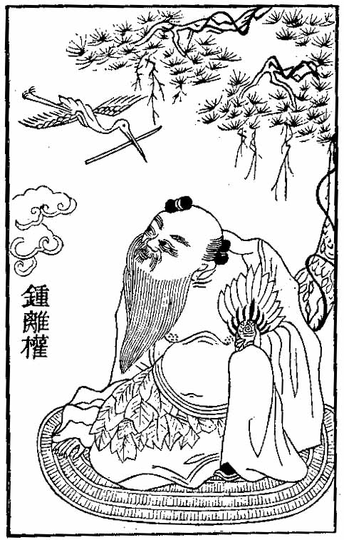
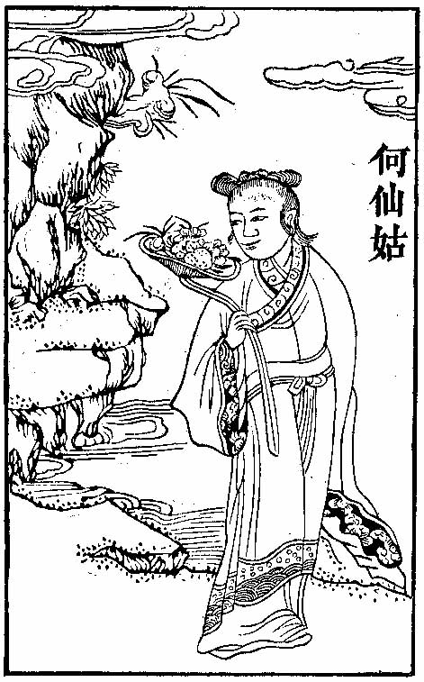
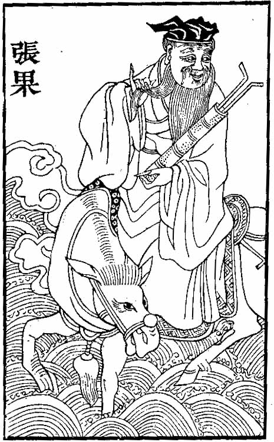
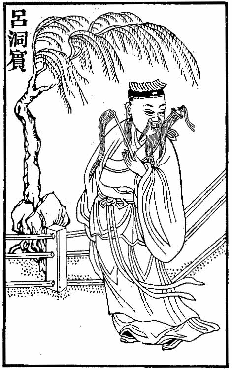
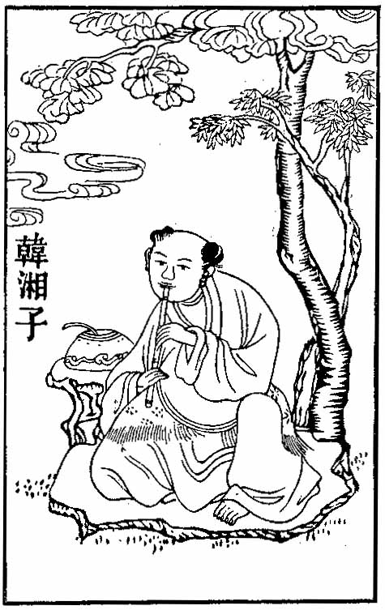
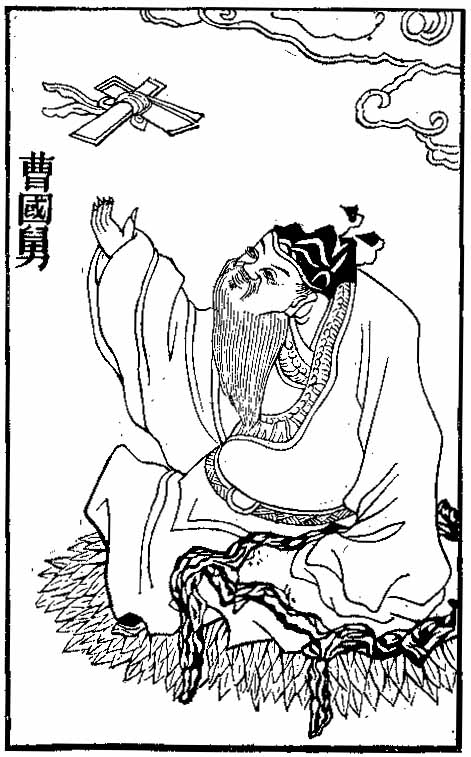
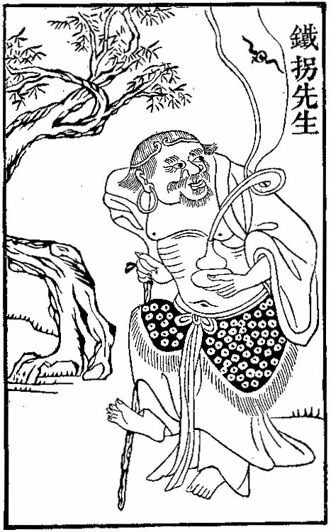
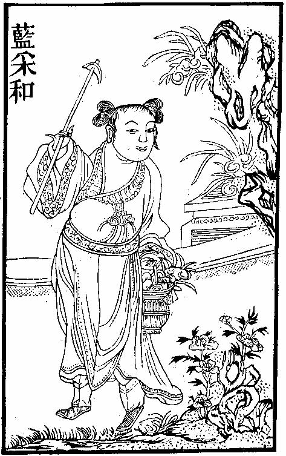

[Intangible Textual Heritage](../../index) [Journals](../index) [Chinese
Articles](../../cfu/etc/index)

------------------------------------------------------------------------

 

# THE EIGHT IMMORTALS

### By W. PERCEVAL YETTS

 

------------------------------------------------------------------------

##### THE

## JOURNAL

###### OF THE

# ROYAL ASIATIC SOCIETY

###### OF

#### GREAT BRITAIN AND IRELAND

###### FOR

# 1916

 

#### \[LONDON, 1916\]

###### {Reduced to HTML by Christopher M. Weimer, August 2002}

------------------------------------------------------------------------

p. 773

## XXI

## THE EIGHT IMMORTALS

By W. PERCEVAL YETTS

   ONE of the subjects beloved of Chinese artists is a venerable figure
in an attitude of profound reverie shown as part of a wild and romantic
scene of forest, crag, and torrent. Sometimes below his rocky hermitage
there stretches a plain with far-off shadowy outlines of ordinary mortal
habitations, of which the faint remoteness suggests the gulf separating
him from mundane cares and vanities. Looking at such a one, instinct
tells us that he feels, to use the words of Shelley, "as if his nature
were resolved into the surrounding universe, or as if the surrounding
universe were resolved into his being." He belongs to a strange race,
variously named by Western writers Fairies, Immortals, Genii, Rishi. And
here may it be remarked in parenthesis that neither "fairy" nor
"immortal" is a term that exactly fits them; nor, indeed, does Arabic
*jinn* or Sanskrit *ṛishi*. They are a race peculiarly Chinese and
apart. Hence it would seem most appropriate to call them by their native
name *hsien*, now commonly written \#\#\#, a pictogram representing
perfectly the essence of their cult—the primitive contact of man with
Nature typified by the mountains. *Hsien*, therefore, they will be
termed in these pages.

   The painter's motive in using this figure might be explained by
desire to symbolize the untarnished thought and feeling of early
Taoism—something near akin to that passionate love of Nature instinctive
in the Chinese mind. Perhaps he seeks thus to convey a hint of the
emotion that inspires his brush; yet maybe he is conscious of no loftier
purpose than to complete the scheme of composition. Whatever the reason,
the frequent presence p. 774 of this figure
in landscape as an integral part of the picture is a characteristic and
significant feature of a form of art adjudged the highest achievement of
the national genius.

   Now, while *hsien* may be depicted without personal attributes merely
as types of their kind, more often they appear as endowed with definite
individuality. They are made recognizable by some distinguishing emblem
(*pao pei*) or peculiarity, so that the place of each in the legendary
lore of Taoism can be identified. The number of *hsien* whose lives and
exploits are recorded in the standard works on the subject reaches a
formidable total; but for the purposes of popular representation a
comparatively small throng of several score has been selected by common
usage.[1](#page_774_note_1) Among these latter the
favourite and by far the most ubiquitous are the *pa hsien*, so well
known to Western students and collectors under the title of The Eight
Immortals. The purpose of this article is to give the generally accepted
tradition surrounding this group of eight as exemplified in the works of
Chinese artists and craftsmen. To do so within the space of a few pages
it seems best to combine the writer's notes upon a large number of
objects of art with extracts from some single widely known and
representative book. Such a book is the *Lieh hsien chuan*. Its title is
the same as that of a famous collection of short biographies attributed
to the statesman, author, and magician Liu Hsiang[2](#page_774_note_2) of the first century
B.C. p. 775 The
book translated here was compiled by a Taoist called Huan-ch‘u, probably
towards the end of the Yüan period (A.D.
1206-1368). Unlike its older namesake it is illustrated, the fifty-five
*hsien* whose lives it contains being portrayed in a corresponding
number of woodcuts. The quality of the illustrations suggests that they,
like the text, were derived from different sources, for they are of
unequal merit. Some show skill and imagination, while others are poor
affairs. The text is carelessly put together; many passages that can be
traced to their origin are found to be misquoted or mutilated, and
typographical errors are frequent. Perhaps these are sufficient reasons
why it is not included among the 1,464 works comprising the official
canon described by Wieger.[1](#page_775_note_1) What is most important
for our purpose is the fact that this *Lieh hsien chuan* seems to have
provided a sort of handbook of Taoist mythology to which reproducers of
such themes have turned for information. Its convenient size, small
price, frequent editions, and many illustrations explain its popularity
and wide circulation.[2](#page_775_note_2)

   The names of The Eight Immortals, according to the generally accepted
version, are as follows: Chung-li Ch‘üan, Ho Hsien-ku, Chang Kuo, Lü
Tung-pin, Han Hsiang Tzŭ, Ts‘ao Kuo-chiu, Li T‘ieh-kuai, and Lan
Ts‘ai-ho. It should be mentioned, however, that one or two in the list
are occasionally replaced by other *hsien*.

   Just when the Eight came first to be grouped together seems to be as
great a mystery as the reason why these particular *hsien* should have
been picked out for special honour. According to a passage quoted by
Mayers, the tradition that establishes them as a definite unit is
traceable to no higher antiquity than the Yüan period.[3](#page_775_note_3) One of them, p. 776 Ts‘ao Kuo-chiu, is said to have lived as
late as the Sung. On the other hand, it seems certain that some group of
*pa hsien* was recognized at a much earlier date, for in the dictionary
*P‘ien tzŭ lei pien* there is mention of a T‘ang book entitled \#\#\#;
and besides, the famous, "Eight Immortals of the Wine Cup" belong to the
same period. It is a fact that single members of the group were painted
as early as the T‘ang—witness the masterly ninth century drawing of Lü
Tung-pin reproduced in the first volume of *Ars Asiatica*, of which the
authors remark that the date of the picture warrants the supposition
that here we have an actual authentic portrait. At the present day it is
rare to find representations of our group that can be attributed beyond
doubt to a period earlier than the Ming; certainly I have never seen
one.

 

### CHUNG-LI CH‘ÜAN

   This *hsien* is generally bearded and corpulent, and is often shown
half-naked. Artists do not as a rule attempt to reproduce all the
curious physical features attributed to him in the following biography.
He is to be recognized by his distinctive emblem, a fan, which may be
one made of feathers, as in the accompanying woodcut, or one roughly
quadrangular with rounded corners and concave edges, made from the leaf
of the fan-palm. The latter type of fan is often combined with a
fly-whisk fixed to its distal end. Occasionally he appears with a
two-edged sword, the *pao pei* of his pupil Lü Tung-pin (see [p.
789](#page_789)).

 

   Biography from *Lieh hsien chuan*, i, 34 seq.:—

   Chung-li Ch‘üan was a native of Yen T‘ai. In later life he assumed
the name (*ming*) of Chüeh. He p. 777 was
also known by the style (*tzŭ*) of The Taoist Hermit, and by the
pseudonyms (*hao*) The Philosopher Wang-yang and The Master Yün-fang.

   His father was one of the small princelings of the second rank, and
he ruled his fief from the town of Yün-chung.[1](#page_777_note_1)

   The birth of this sage was accompanied with strange phenomena in the
shape of rays of light, scores of feet in length, whereat all those in
attendance were much amazed.

   The babe had a high dome-like top to his head, a massive brow, large
ears, elongated eyebrows, deep-set eyes, a prominent nose, a
square-shaped mouth, a large jaw, and lips and cheeks the colour of
cinnabar. His nipples were set far apart, and his arms were as long as
those of a three-year-old child.[2](#page_777_note_2)

p. 778

   Day and night he never uttered a sound till he was seven days old,
when, springing to his feet, he exclaimed:

<table data-align="center" data-cellpadding="10">
<colgroup>
<col style="width: 100%" />
</colgroup>
<tbody>
<tr class="odd">
<td>"My feet have wandered in the purple palace of the <em>hsien</em><a href="#page_778_note_1">1</a>, 
My name is recorded in the capital of the Jade Emperor<a href="#page_778_note_2">2</a>."</td>
</tr>
</tbody>
</table>

   On reaching man's estate, he was given command of an expedition sent
by the Han Emperor against the Tibetans; but, having suffered defeat, he
became a fugitive riding alone through wild and mountainous country.
Lost in a dense forest, he came upon a foreign priest with unkempt locks
hanging over his face and garments made of straw. The priest led the way
for several *li* till they came within sight of a village. "This is the
abode," he said, "of The Master Tung-hua, who has attained *Tao*.[3](#page_778_note_3) You can get a lodging
here." Then, making a bow, he departed. Chung-li Ch‘üan did not venture
to knock on a door for fear of startling the villagers, but after some
time he heard someone say, "This must be due to the blabbing of that
blue-eyed foreigner."

p. 779

   Then there appeared an aged man, clad in white deer-skins and leaning
upon a blackthorn staff, who addressed him in a loud voice. "Are you not
the Han General Chung-li Ch‘üan?" cried he, "and why have you not found
a lodging with the foreign priest?" Hearing these words Chung-li Ch'üan
was amazed, and recognized that this was no ordinary man. He reflected
that having made his escape from deadly perils (lit. from the lairs of
tigers and wolves), now was the time to direct his thoughts to the
mysteries of immortality (lit. ideas of the *luan*[1](#page_779_note_1) and crane[2](#page_779_note_2)).

p. 780

   And so his heart returned to the contemplation of *Tao*. He earnestly
begged for the secret of transcending mortal limitations from the old
man, who thereupon imparted to him not only an infallible magic process
for attaining longevity, but also the degree of heat required to produce
the "Philosopher's Stone", and the Green Dragon[1](#page_780_note_1) method of
sword-play.[2](#page_780_note_2) As Chung-li Ch‘üan was
about to depart, having taken leave of the old man, he turned round for
a last look at the village, and lo! it had vanished.

   By and by he came across the Taoist adept Hua-yang,[3](#page_780_note_3) and received from him a
pinch of the Great Monad[4](#page_780_note_4), a fire charm, and some
of the spiritual drug of immortality.

p. 781

   Chung-li Ch‘üan wandered about in haphazard fashion till he reached
the State of Lu[1](#page_781_note_1), and dwelt for a while
in the city of Tsou. Later on he retired to the K‘ung-t‘ung
Mountains,[2](#page_781_note_2) and took up his abode on
the Red-gold Peak, where the Four Grey-heads[3](#page_781_note_3) had lived. There he
found a jade casket containing the arcana of Taoism, and, having
attained hsienship, departed this world.

 

### HO HSIEN-KU

   Ho Hsien-ku is shown as a comely girl sometimes dressed in elaborate
robes, but more often wearing over a simple garment the leafy cape and
skirt affected by the *hsien*. A large ladle is her recognized emblem.
Its bowl, made of bamboo basketwork, is often filled with several
objects associated with Taoist immortality, e.g., the magic fungus[4](#page_781_note_4) and peach[5](#page_781_note_5); sprigs of bamboo and
p. 782 of pine[1](#page_782_note_1); and flowers of the
narcissus[2](#page_782_note_2). The place of the ladle
may be taken by the more picturesque long-stalked lotus bloom; and
sometimes she holds just a fly-whisk or the basket of wild fruit and
herbs gathered for her mother.

 

   Biography from *Lieh hsien chuan*, ii, 32, 33:—

   Ho Hsien-ku was the daughter of Ho T‘ai, of the town of Tsêng-ch‘êng,
in the prefecture of Canton.

   At birth she had six long hairs on the crown of her head. When she
was about 14 or 15 a divine personage appeared to her in a dream and
instructed her to eat powdered mica, in order that her body might become
etherealized and immune from death. So she swallowed it, and also vowed
to remain a virgin.

   Up hill and down dale she used to flit just like a creature with
wings. Every day at dawn she sallied forth, to return at dusk, bringing
back mountain fruits she had gathered for her mother.

   Later on by slow degrees she gave up taking ordinary food.[4](#page_782_note_4)

p. 783

   The Empress Wu[1](#page_783_note_1) dispatched a messenger
to summon her to attend at the palace, but on the way thither she
disappeared.[2](#page_783_note_2)

   In the *ching lung* period (about A.D.
707) she ascended on high in broad daylight,[3](#page_783_note_3) and became a *hsien*. In
the ninth year of the *t‘ien pao* period (A.D. 750) Ho Hsien-ku reappeared, standing amidst
rainbow clouds over a shrine dedicated to Ma Ku. Again, in the *to li*
period (about A.D. 772) she appeared in the
flesh on the Hsiao-shih Tower at Canton.

p. 784

 

### CHANG KUO

   This member of the group is easily recognized by his *pao pei*, a
curious object which to Western eyes resembles a diminutive golfer's bag
containing two clubs. Actually it is a kind of musical instrument called
a "fish-drum", composed of a cylinder, often of bamboo, over one end of
which is stretched a piece of prepared fish or snake skin. What look
like two projecting golf clubs are the ends of long slips of bamboo used
as castanets. They may be carried in his hand. Another attribute,
distinctive of this *hsien*, is the white donkey upon whose back he
rides. The association existing between the two is so close that
frequently when Chang Kuo is represented unmounted (his ass presumably
being tucked away in his cap-box), a miniature image of the animal may
be seen amid a curling wreath of vapour emitted from the open end of his
drum, or from the mouth of the calabash that forms part of the outfit of
every *hsien*.

 

   Biography from *Lieh hsien chuan*, ii, 28 seq.:—

   Chang Kuo lived the life of a hermit on Mount Chung-t‘iao in Hêng
Chou[1](#page_784_note_1), and used to wander, to
and fro, between the River Fen[2](#page_784_note_2) and the Chin[3](#page_784_note_3) territory.

   He acquired the magic art of prolonging life. It was his custom to
ride a white ass, travelling tens of thousands of *li* a day. Whenever
he stopped to rest, he folded his donkey up, when it was no thicker than
paper, and slipped it into his cap-box. Then as soon p. 785 as he wished to ride again he squirted water
from his mouth over it, and transformed it back into a donkey.

   The Emperors T‘ai Tsung (A.D. 627-49) and
Kao Tsung (A.D. 650-83) of the T‘ang summoned
him to Court, but he refused to go.[1](#page_785_note_1) The Empress Wu[2](#page_785_note_2) also sent for him to
leave his mountain retreat, but he feigned death in front of the Tu-nü
Shrine. The season then being blazing hot, in a very short while his
body gave forth the odour of putrefaction and begot worms, whereupon the
Empress was convinced that he was really dead. Subsequently someone saw
him again on the Hêng Chou mountain.

   In the twenty-third year of the *k‘ai yüan* period (A.D. 735) the Emperor Ming Huang[3](#page_785_note_3) commissioned a eunuch
secretary, by name P‘ei Wu, to ride post haste to Hêng Chou to fetch
him. Chang Kuo went to the Eastern capital,[4](#page_785_note_4) where he was installed
in the Chi-hsien Palace, and treated with all possible courtesy and
respect. The Emperor plied him with questions about the *hsien*, but he
gave no reply.

   He was an adept at regulating the breath[5](#page_785_note_5), p.
786 and for days together would go without food, drinking
frequent potions of wine. The Emperor having bestowed upon him some
wine, he declined it, saying, "Your servant is able to drink no more
than two pints, but he has a disciple who can manage ten." Ming Huang
was pleased and gave orders for him to be summoned. All of a sudden a
small Taoist priest flew down from the roof of the palace. Aged about 15
or 16, he had a handsome face and an engaging personality. The Emperor
having ordered him to be seated, Chang Kuo protested, "My disciple
should remain standing while in attendance upon Your Majesty." This
pleased the Emperor still more, and he presented some wine to the
disciple, who managed to drink off a small *tou*[1](#page_786_note_1) of it. Chang Kuo then
called a halt, exclaiming, "Pray give him no more, or it will exceed his
limit." Nevertheless, Ming Huang insisted upon presenting him with more,
the result being that he became drunk, and the wine welled up out
through the crown of his head, dislodging his cap, which fell to the
ground. Instantly he was transformed into a golden wine-cup. The Emperor
and the imperial concubines alike were amazed and amused to see the
Taoist disappear and nothing left in his place but a golden cup. On
examination it proved to be one belonging to the Chi-hsien Palace, and
just capable of holding a single *tou* of wine.[2](#page_786_note_2)

   The Emperor addressed Kao Li-shih[3](#page_786_note_3), saying: p. 787 "I have heard it said that he who can drink
aconite[1](#page_787_note_1) without suffering harm
is a marvellous being. Since the weather now is cold, let Chang Kuo have
some in his wine." They did so, and having drunk three lots Kuo
collapsed, exclaiming, "This wine is not good." He then lay down to
sleep. Presently his teeth were observed to grow black and to recede
into the gums; whereupon he looked round, and, taking a *ju-i*[2](#page_787_note_2) from one of the
bystanders, he knocked them out and wrapped them up in his girdle. Then
he brought out some ointment which he rubbed upon his gums, and slowly a
new set of teeth appeared as white and glistening as jade.

   Whilst the Emperor was hunting at Hsien-yang[3](#page_787_note_3) he killed a large deer,
and was about to tell his chief steward to have it cooked, when Chang
Kuo said: "This is a supernatural deer; it is fully a thousand years
old. Long ago in the fifth year of the period *yüan shou* (B.C. 118), during the reign of the Han Emperor
Wu,[4](#page_787_note_4) I was with the imperial
retinue when they were p. 788 hunting in the
Shang-lin Park. We caught this deer and let it go again." The Emperor
remarked: "Deer are plentiful, and it was a long while ago. How could it
possibly have survived such a long succession of ages?" Chang Kuo
replied, "At the time when Wu Ti had the deer released he caused an
inscribed bronze plate to be attached to the base of its left antler."
Thereupon an examination of the deer was ordered; and, indeed, it did
have a bronze plate, more than two inches long, only the characters had
become obliterated.

   The Emperor inquired of Yeh Fa-shan[1](#page_788_note_1) whether he knew who
Chang Kuo was. "I do know," he replied, "but death might be the penalty
of my telling, therefore I dare not speak. If Your Majesty is willing to
protect me (by pleading on my behalf) with your cap doffed and your feet
bared,[2](#page_788_note_2) then I will venture to
tell you." The Emperor having consented, Fa-shan said, "At the time when
cosmos was being evolved from chaos, the spiritual essence of a white
bat . . ."; the sentence was broken off unfinished, for blood gushed
from his seven channels of sense, and he fell prostrate upon the ground.
The Emperor hurried to Chang Kuo's abode, where he removed his cap and
bared his feet, and declared that he himself was the one to blame. Chang
Kuo calmly replied: "That young fellow talks too much. If I allowed him
to go without punishment, I fear he might divulge the secret of the
universe." The Emperor having again and again implored forgiveness,
Chang Kuo squirted water from his mouth over the face of Fa-shan, who
forthwith came to life again.

   After that the Emperor treated Chang Kuo with still greater honour,
and decreed that his portrait should be p.
789 placed in the Chi-hsien Palace. He also conferred upon him
the title Master of Taoist Mysteries. But Chang Kuo repeatedly submitted
that he was old and in failing health, and at length his prayers led to
his being sent back to Hêng Chou.

   At the beginning of the *t'ien pao* period (about A.D. 742) Ming Huang sent a messenger to summon him
to the capital again, but immediately on receiving the news he died. His
disciples buried him. Subsequently, when the coffin was opened it was
found to be quite empty.[1](#page_789_note_1)

   The Emperor had a shrine built, called the Ch‘i-hsia Kuan, in which
votive offerings were made in his honour.

 

### LÜ TUNG-PIN

   The Patriarch of Hsien, best known as Lü Tung-pin, is represented a
dignified elderly man generally clothed in the dress worn by the
scholarly class. His emblem is the magic two-edged sword, which he
carries in his hand or slung on his back. He is the literary member of
our group; and, while in some localities regarded as the patron saint of
jugglers and magicians,[2](#page_789_note_2) he is more widely looked
upon by barbers as their special protector.[3](#page_789_note_3) In the last capacity he
is called in Peking the Patriarch Lo[4](#page_789_note_4). So far as my
observation goes this *hsien* occupies the place of chief importance and
popularity among The Eight Immortals. He is portrayed more frequently
than any other single member of the group; and, in addition p. 790 to innumerable notices of him to be found in
general Taoist literature, there are at least two large works entirely
devoted to his life and doings. Shrines in his honour are to be found
all over China—a statement that does not apply to any of the other
seven.

 

   Biography from *Lieh hsien chuan*, ii, 22 seq.:—

   Lü Yen, whose literary name (*tzŭ*) was Tung-pin, lived under the
T‘ang dynasty, and was a native of the town of Yung-lê, in the
prefecture of P‘u-chou[1](#page_790_note_1). He was also called
(*hao*) Shun-yang.

   At the moment when his mother gave him birth an unearthly perfume
pervaded the house, and strains of celestial music were wafted from the
sky, and a white crane from heaven flew down between the curtains of her
bed and was seen no more. Even when a newly-born infant his frame was
strong as metal, and his muscles hard as wood. The crown of his head
formed a high dome resembling a crane's; his back was arched like that
of a tortoise; his eyes were as brilliant as those of a phœnix; and his
eyebrows extended on either side to meet the hair round the
temples.[2](#page_790_note_2)

   While still a child he was very quick at learning, being able to
memorize thousands of lines a day. His language was fluent and couched
in classical terms. In height 8 ft. 2 in.,[3](#page_790_note_3) he resembled Chang
Tzŭ-fang[4](#page_790_note_4). At the age of 20 he had
not yet taken unto himself a wife.[5](#page_790_note_5)

p. 791

   The Patriarch Ma[1](#page_791_note_1) saw him at the beginning
of his career, when he was still in swaddling-clothes, and exclaimed:
"His bodily frame is that of no ordinary mortal. Eccentric in character,
he will hold aloof from worldly affairs; whatever hovel he happens upon
he will make it his home; whenever he sees a goblet of wine he will
partake of it. Mark well my words."

   By-and-by Tung-pin wandered to the Lu Range[2](#page_791_note_2), and there met by chance
the Taoist adept Huo-lung, who instructed him in acquiring supernatural
invisibility by the magic sword method.

   During the *hui ch‘ang* period (A.D.
841-6) of the T‘ang he went up twice for the third or doctor's degree,
but failed. At that time he was 64 years of age.

   Once having wandered into a tavern at Ch‘ang-an[3](#page_791_note_3), he watched a Taoist
priest, dressed in a black cap and white gown, scribbling without
apparent effort the following stanza upon the wall:—

<table data-align="center" data-cellpadding="10">
<colgroup>
<col style="width: 100%" />
</colgroup>
<tbody>
<tr class="odd">
<td>"<em>Whenever I would rest I grasp a cup of wine, 
Oblivious of all else in this great capital. 
So vast are heaven and earth that I remain unknown, 
An old man wandering by himself among mankind.</em>"</td>
</tr>
</tbody>
</table>

   Impressed and attracted by his strange appearance and extreme old
age, as well as by the grace and spontaneity of his poem, Tung-pin made
him a bow and inquired his name. The old Taoist replied: "I am The
Master Yün-fang (*alias* Chung-li Ch‘üan, q.v.), and my home is upon the
Crane Ridge, of the Chung-nan Mountains. Can you accompany me in my
wanderings?"

p. 792

   Without actually agreeing to this proposal, Tung-pin put up at the
same inn with Yün-fang. Now, while the latter was with his own hands
attending to the cooking of a meal, Tung-pin, reclining on a pillow,
soon became oblivious of his surroundings and fell into a deep
sleep.[1](#page_792_note_1) He dreamt he went up to
the capital as a candidate at the triennial examination and passed at
the top of the list. Starting his career as a junior secretary to one of
the Boards, he rapidly gained promotion to the Censorate and the Han-lin
College, and eventually reached the position of Privy Councillor, having
occupied in the course of his unbroken success all the most sought-after
and important official posts. Twice he was married, and both wives
belonged to families of wealth and position. Children were born to him;
and he witnessed his sons take to themselves wives, and his daughters
leave the paternal roof for their husband's homes. And all these
multitudinous events had happened before he reached the age of 40. Next
he found himself Prime Minister for the space of ten years, wielding
immense power, and it corrupted him. Then suddenly, without warning, he
was accused of a grave crime. His home and all his possessions were
confiscated, and his wife and children separated. He himself, a solitary
outcast, wandering towards his place of banishment beyond the mountains,
found his horse brought to a standstill in a snow-storm, and no longer
able to continue the journey.

   At this juncture Tung-pin with a heavy sigh waked out of his dream,
and lo! the meal was still being prepared. With a laugh Yün-fang sang
these words:—

<table data-align="center" data-cellpadding="10">
<colgroup>
<col style="width: 100%" />
</colgroup>
<tbody>
<tr class="odd">
<td>"The yellow millet simmers yet uncooked 
While you have journeyed to the Realm of Dreams."<a href="#page_792_note_2">2</a></td>
</tr>
</tbody>
</table>

p. 793

Whereat Tung-pin was much astonished. "Sir," asked he, "pray, what can
you know about my dream?" The other replied: "In that dream or yours
just now you climbed not only up but also down every rung in the ladder
of worldly glory; you both plumbed the uttermost depths of misery and
scaled the dizziest heights of splendour. Fifty years were past and gone
in the twinkling of an eye. What you gained was not worth rejoicing
over, what you lost was not worth grieving about. Some day there will be
a Great Awakening, and then we shall know the truth."

   From a pedlar of copper ware Lü Tung-pin once brought some pots,
which when he had taken home he found all to be made of gold; yet such
was his unworldliness that he went in search of the pedlar in order to
return them to him.

   \[During the period of probation as to his fitness to become a
*hsien* Tung-pin underwent a number of ordeals or tests.\] Of these the
eighth[1](#page_793_note_1) in order of time
occurred when he bought some magic drugs from a crazy professor of
*Tao*, who used to wander about selling them in the streets, muttering
to himself that whoever partook of his wares would instantly die, but
would attain *Tao* in some future existence. The Taoist warned him: "The
only thing for you to do now is to make speedy preparation for your
death." Yet Tung-pin swallowed the stuff without more ado, and no harm
befell him.

   The ninth ordeal to which Tung-pin was subjected happened one
spring-time when all the country round was flooded, and he in company
with the rest of the inhabitants were seeking safety in boats. Just as
they reached the middle of the waters a violent storm burst upon them,
and the waves rose high, lashed into fury by p.
794 the wind. All were in a panic except Tung-pin, who remained
in his seat calm and unconcerned.

   On the tenth occasion Tung-pin was sitting alone in his house, when
without warning there appeared to him an innumerable host of demons in
weird and terrifying shapes, all seemingly determined to beat him to
death. Yet he was not in the least dismayed. Then a sharp word of
command came from the sky, and the whole crowd of devils vanished. The
voice was followed by some one who, descending from above, clapped his
hands and laughed with delight. This turned out to be Yün-fang. "I have
subjected you to ten ordeals," said he, "all of which have left you
unscathed. There can be no doubt you will succeed in attaining *Tao*. I
will now disclose to you the mysteries of alchemy, in order that the
knowledge may enable you to benefit mankind. When for 3,000 years you
shall have carried out this meritorious work for the sake of others and
thus completed your period of probation, and shall have spent in
addition eight centuries in researches on your own behalf, then, and not
till then, will come your salvation." Tung-pin asked: "Pray, when[1](#page_794_note_1) will my conversion take
place?" "Only after 3,000 years shall have passed," the other replied,
"will you be restored to the state of your original physical purity." At
which Tung-pin coloured up with vexation and exclaimed: "Alas! with the
prospect of having to wait 3,000 years, how can I maintain my zeal all
those ages?" "Your courage," Yün-fang rejoined with a smile, "will carry
you not only over 3,000 years but 3,800."

   Next he took Tung-pin to the Crane Ridge, and imparted to him there
the profoundest truths and mysteries of Taoism, including the secret of
supernatural p. 795 power. Also he presented
him with a small quantity of the "Philosopher's Stone". While these two
were thus engaged there arrived upon the scene two *hsien*, each
reverently bearing in both hands a golden tablet, the emblem of his
office. They announced to Yün-fang an edict of the Supreme Ruler of the
Universe, nominating him guardian of the Golden Gate of the Ninth
Heaven; and they added that the world of mortals was but one vast dream
(i.e. illusory and impermanent).

   Impressed by this incident, spiritual enlightenment came to Tung-pin.
So, falling on his knees before Yün-fang, he entreated him for the magic
secret of transcending the limitations of this earthly sphere. To try
him still further Yün-fang answered: "Your character is not yet fully
established. Before you can bring salvation to mankind, many generations
shall come and pass away." And having uttered these words he straightway
vanished.

   After that Tung-pin abandoned his semi-official position as one of
the literati for a life of retirement, and it was during this period
that Yün-fang subjected him to the ten ordeals.

   The first occurred when Tung-pin had returned home after a long
journey to find all his household stricken with mortal sickness.
Nevertheless, instead of giving himself up to vain sorrow, manfully he
set about making preparation on a lavish scale for the funeral, when lo!
and behold! they all rose up alive and well.

   The second time Tung-pin was put on his trial he was negociating the
sale of some of his belongings, and had come to a definite agreement
about the price. This notwithstanding, the dealer wished to cancel the
bargain and pay only half the stipulated sum. Tung-pin acquiesced, and
handing over the goods, walked away, without showing anger or even
engaging in dispute.

   The third ordeal took place at the time of the New Year. As Tung-pin
was leaving his house he was accosted p. 796
by a beggar demanding alms, to whom he handed both coin and gifts in
kind. But the beggar remained dissatisfied, with threats demanding more
and making use of the most abusive terms; yet Tung-pin with a smiling
face again and again gave him what he asked.

   The fourth time Tung-pin was put to the test, he was looking after
some sheep in the mountains. A hungry tiger came upon them, with the
result that the flock scattered in all directions. But Tung-pin
interposed his own person between the tiger and the terrified sheep. The
tiger gave up the chase, and slunk away.

   The fifth ordeal took place while Tung-pin had retired to a mountain
retreat to study books, with no other home than a simple hut of reeds.
One day there came to his door a very paragon of feminine grace and
loveliness, who scintillated with such beauty that she was positively
dazzling. She explained she was a newly married bride on the way to
visit her parents, but had lost the road. Would he allow her to rest a
short while in his hut? Tung-pin granted her request, and she then tried
in endless ways to tempt him from the path of virtue; but all in vain.

   Tung-pin's character was put to a test the sixth time when on
returning home from a walk in the country he found that during his
absence thieves had carried away all his goods and chattels, and left
the house bare. Not even then was his equanimity disturbed. He just set
himself to earn a livelihood by tilling the ground, and one day when at
work with his hoe he unearthed gold pieces to the number of several
score. Yet he took not a single one, but quickly covered them all up
again.

   The seventh trial of Tung-pin was on the occasion of his meeting the
*hsien* Yün-fang, who addressed him thus: "In obedience to the summons
of the Supreme Ruler of the Universe I am on the way to present myself
before his throne. If you behave virtuously during your abode p. 797 among men, and thus acquire merit, you will
in time reach a plane similar to mine." Bowing again Tung-pin answered:
"My aim is not only to emulate you, sir, but to bring salvation to every
living creature in this world. Only when this end has been achieved
shall I be willing to ascend on high." Yün-fang then gradually rose in
the air till he passed out of sight among the clouds.

   After Tung-pin had succeeded in mastering *Tao* as taught by
Yün-fang, and the magic sword method of becoming invisible as practised
by Huo-lung Chên-jên, he took to wandering along the banks of the Rivers
Yangtse and Huai, and testing the power of his magic two-edged sword in
order to rid the country of the evil wrought by the *chiao* dragon[1](#page_797_note_1), at times becoming
invisible to mortal eyes. During the constant journeyings of his last
400 years of life on earth he visited, without being recognized, places
so far apart as Hsiang-t‘an[2](#page_797_note_2), Yo[3](#page_797_note_3), O[4](#page_797_note_4), Liang-chê[5](#page_797_note_5), P‘ien[6](#page_797_note_6), and Ch‘iao. He used to
call himself Hui Tao-jên, "the man who reverted to *Tao*."[7](#page_797_note_7)

   During the *chêng-ho* period of the Sung (A.D. 1111-17) there appeared in the palace demons
even in broad daylight, who plundered the treasury of gold and silver,
and also kidnapped some of the imperial concubines.

   The Emperor purified himself by fasting, and humbly offered
supplications to heaven for the space of sixty days without ceasing. One
day he fell asleep and saw in his dream standing outside the Tung-hua
Gate of the palace a Taoist adept, wearing upon his head p. 798 a green lotus-cap,[1](#page_798_note_1) and upon his back a dark
crane's-down robe. In his hand he carried a crystal *ju-i*.[2](#page_798_note_2) Bowing to the Emperor,
he said: "Your servant has been sent by the Supreme Ruler of the
Universe to control these demons." Then he summoned an officer
resplendent in golden armour, who seizing the demons tore them in pieces
and swallowed them till none were left. In answer to the Emperor's query
as to the identity of this gallant warrior the Taoist replied: "He is no
other than Kuan Yü[3](#page_798_note_3), whom Your Majesty
invested with the title Revered and Immortal Prince." The Emperor
thanked the officer repeatedly, and then asked him where was Chang
Fei[4](#page_798_note_4). Kuan Yü replied: "Every
generation Chang Fei becomes reincarnate in the person of some male
child. At the present time, in order to serve Your Majesty, he is being
reborn in a family called Yo, living at Hsiang Chou[5](#page_798_note_5)."

   Asked by the Emperor what was his name, the Taoist replied: "Your
servant is called Yang, and was born on the 14th day of the 4th
month."[6](#page_798_note_6)

   The Emperor awoke from his dream, and having looked up the records,
knew that the Taoist was really Tung-pin. Henceforth the demons remained
permanently expelled from the palace. An imperial edict ordered that in
all the shrines dedicated to Tung-pin throughout China he should be
known by the title The Pure One of Subtle Intellect.

p. 799

   To enumerate all the supernatural powers and magic deeds of Tung-pin
is an impossibility.

   Some years later the father of the future Yo Wu-mu[1](#page_799_note_1) had a vivid dream, in
which he learnt that it would fall to the lot of this son to be the
reincarnation of Chang Fei, and therefore he afterwards named him Fei.

 

### HAN HSIANG TZŬ

   The recognized *pao pei* of The Philosopher Han Hsiang is a flute.
Sometimes he is represented carrying a pair of long castanets, and
sometimes a small furnace or crucible in token of his skill as an
alchemist. Pictures often show him garbed in the leafy cap and deer-skin
kilt worn by *hsien*; and generally near by is to be seen the peach-tree
from which he fell and so ended his mortal existence. With obvious
desire to keep on good terms with the Confucianists, Taoist writers and
painters have made the most of his relationship with Han Yü, and it is
not uncommon to find the famous scholar depicted in close proximity to
The Eight Immortals, holding a scroll on which is written his protest
against the extravagant honours paid to one of the Buddha's bones by the
T‘ang Emperor Hsien Tsung.

 

   Biography from *Lieh hsien chuan*, i, 27 seq.:—

   The Philosopher Han Hsiang, also known (*tzŭ*) as The Pure Sage, was
the nephew of Han Wên Kung[2](#page_799_note_2). His disposition was
wild and irresponsible. He used to wander about in company with The
Master Shun-yang.[3](#page_799_note_3)

p. 800

   It was through a fall from a peach-tree that his mortal body died,
and he was freed from the bonds of earthly existence (that is to say,
became a *hsien*).

   When he paid his uncle a visit, and the latter urged him to apply
himself to study, Han Hsiang replied, "You and I have different ideas of
study." And in order to make his meaning clear he composed the following
lines:—

<table data-align="center" data-cellpadding="10">
<colgroup>
<col style="width: 100%" />
</colgroup>
<tbody>
<tr class="odd">
<td>"<em>In a cave mid mists and torrents by green-clad peaks I live; 
I sip the dew at midnight that stars the earth like gems, 
I make my food the rosy clouds that flush the coming dawn. 
I play the Green Jade Melody upon a seven-stringed lute, 
And melt in fiery alembics fine-powdered pearls and white; 
Within my Precious Cauldron the Golden Tiger dwells; 
I grow the Magic Fungus to feed the Snow-white Crows, 
With Nature's creative powers my bottle-gourd is stored, 
I slay the evil demons with my magic three-foot blade; 
Wine fills the empty goblet when I speak the wizard word, 
And flowers spring up and bloom in the twinkling of an eye; 
Show me the man who doth these things in the way that I have told, 
And I will gladly talk with him of the <em>hsien</em> who ne'er grow old.</em>"<a href="#page_800_note_1">1</a></td>
</tr>
</tbody>
</table>

p. 801

   Having read the poem Wên Kung exclaimed, "What! can you usurp the
creative powers of Nature?" and then handed him an empty goblet, which
Han Hsiang successfully caused to become full of excellent wine. Next, a
small heap of earth having been scraped together, in a very short time
there shot out from it a cluster of blue flowers, from the midst of
which was extruded this couplet written in characters of gold:—

<table data-align="center" data-cellpadding="10">
<colgroup>
<col style="width: 100%" />
</colgroup>
<tbody>
<tr class="odd">
<td>"<em>Lost on the far Ch‘in Mountains, I cannot find my way; 
Snowdrifts cover the Lan Pass and my horse can do no more</em>."</td>
</tr>
</tbody>
</table>

To Wên Kung, who read it without understanding its meaning, Han Hsiang
remarked, "Some day you will find these words come true."

   Not long afterwards Wên Kung was banished to a post at
Ch‘ao-chou[1](#page_801_note_1), in punishment for the
violent remonstrance he addressed to the Emperor about the Buddha's
bone.[2](#page_801_note_2) While on the road
thither a snow-storm overtook him. All at once someone approached,
struggling through the storm, who turned out to be Han Hsiang Tzŭ. "Do
you remember the couplet in the flowers?" asked he. Wên Kung then
inquired what the name of the place was, and was told "the Lan Pass".
This struck him p. 802 dumb with
astonishment; and after a while he exclaimed, "I will complete that poem
for you."

   Han Yü's lines run thus;—

"*At dawn a sealed memorial presented to the throne, . . . etc., etc.*"

   They may be found in the published collection of his works.[1](#page_802_note_1)

   That night they both stayed at an inn beside the Pass, and Wên Kung
satisfied himself that Han Hsiang was no charlatan. At parting Han
Hsiang handed the other a calabash full of a drug, one single grain of
which, he declared, would, when swallowed, counteract the malarious
vapours of the place to which he was journeying. Wên Kung appeared
downhearted, so to cheer him up Han Hsiang told him, "You will soon be
back again, not only in good health, but also reinstated in your former
office." Wên Kung asked, "Shall we two ever meet again after this?"
"That I cannot foretell," replied Han Hsiang Tzŭ.

 

### TS‘AO KUO-CHIU

   Ts'ao Kuo-chiu is represented as an old bearded man wearing a cap,
and, as a rule, carrying a pair of clapper castanets, his distinctive
attribute. The tradition that credits him with royal birth and allots
him to p. 803 the eleventh century is
considered to be of doubtful authenticity.[1](#page_803_note_1)

 

   Biography from *Lieh hsien chuan*, ii, 36:—

   Ts‘ao Kuo-chiu was the younger brother of the mother[2](#page_803_note_2) of one of the Sung
emperors. He was so deeply ashamed of the conduct of his younger brother
in illegally putting people to death that he sought concealment in a
mountain cavern, where he engaged in spiritual meditation and the study
of Taoist principles. He wore rustic clothing and a cap of grass-cloth.
Frequently he would go without food for ten days at a time.

   Once he happened to meet the two *hsien* Chung-li and Shun-yang,[3](#page_803_note_3) who questioned him,
saying: "Sir! we have heard you are going in for cultivation. What is it
you are cultivating?" He replied: "I am cultivating *Tao*." They asked:
"Where is *Tao*?" Kuo-chiu pointed up to heaven. "Where is heaven?" they
said. Kuo-chiu pointed to his heart. The two *hsien* remarked, laughing:
"Your heart is one with heaven, and heaven is one with *Tao*. You have
indeed arrived at a profound understanding." Then they imparted to him
the secret of reverting to a condition in perfect harmony with nature,
and induced him to join the company of *hsien*.

 

### LI T‘IEH-KUAI

   The Master with the Iron Crutch offers a striking contrast to the
other members of the group. Hideous, hairy, deformed, and scantily clad
in filthy rags, p. 804 he is the type of that
repulsive legion haunting to the present day every city in China, and
preying upon a long-suffering public, which is moved to the giving of
alms not so much by pity as by feelings of horror and fear. His
recognized emblem is the bottle-gourd or calabash that forms part of the
equipment of every *hsien*; and to the gourd is generally added a more
distinctive object, his crutch. A mysterious vapour—a kind of *fata
Morgana*—floats upwards from the mouth of the gourd, and in its midst is
seen the image of the sage's *hun*, which may appear in nondescript
shape as in our woodcut, or in the guise of a miniature double of his
bodily self. Sometimes the *hun* is replaced by a spherical object
representing the "Philosopher's Stone".

 

   Biography from *Lieh hsien chuan*, i, 12:—

   In the form with which nature endowed him, the sage Li T‘ieh-kuai was
a fine man of imposing presence.

   While yet of tender age he heard *Tao*. Choosing a mountain cave for
his abode, he set himself to the cultivation of mental and physical
purity as taught by the Taoists. Li Lao Chün (Lao Tzŭ) and The Master
Wan Ch‘iu used often to come down from heaven to visit his rocky
hermitage in order to instruct him in the subject of his studies.

   One day T‘ieh-kuai was going to meet Lao Chün by appointment on Hua
Shan[1](#page_804_note_1), and so he gave a pupil
of his the following instructions: "My *p‘o*," said he, will remain here
while my *hun*[2](#page_804_note_2) goes upon a journey.
p. 805 If by chance in seven days' time my
*hun* has not returned, you may then burn the *p‘o*."

   The pupil received an urgent message to visit his sick mother, and,
impatient of delay, burnt his master's body on the sixth day. The
following day in due course T‘ieh-kuai returned to find his *p‘o* gone,
and no habitation left for his *hun*,[1](#page_805_note_1) till he spied lying near
by the corpse of one who had died of starvation. Into it the wandering
soul entered, giving it new life; and that is the reason why Li
T‘ieh-kuai, instead of his original handsome appearance, has now the
loathsome shape of a cripple.

 

### LAN TS‘AI-HO

   Legend relating to this *hsien* is so uncertain that even the
question of sex seems to be left to the fancy of the artist. Lan
Ts‘ai-ho is variously portrayed as a youth, an aged man, or a girl; in
modern pictures generally as a girl. The accompanying woodcut seems
hardly consistent with the biography it iliustrates; for the text
suggests a male, and such, therefore, we will call him. His distinctive
emblem is a flower-basket, often carried slung on a hoe over his
shoulder. The basket contains various flora associated with ideas of
longevity, e.g., the magic fungus[2](#page_805_note_2); sprigs of bamboo, of
pine,[3](#page_805_note_3) and of flowering p. 806 and leafless plum;[1](#page_806_note_1) chrysanthemums;[2](#page_806_note_2) and a red-berried
plant[3](#page_806_note_3) called "myriad years
green". Sometimes Lan Ts‘ai-ho is drawn as described in the *Lieh hsien
chuan*—a ragged unkempt being with one foot bare,[4](#page_806_note_4) carrying castanets and a
string of cash.

 

   Biography from *Lieh hsien chuan*, ii, 16 seq.:—

   Where Lan Ts‘ai-ho came from is not known. His usual garb was a
single ragged gown with six black wooden buttons and a waist-belt more
than 3 inches wide; on one foot he wore a boot, while the other went
bare.[5](#page_806_note_5) In summer he had his
gown padded with cotton-wool, and in the winter he used to sleep in the
snow, and from him there arose clouds of vapour like steam.

   Whenever he begged for alms in the public thoroughfares he carried
hanging by a string a large pair of castanets more than 3 feet long.
When he was drunk he used to sing and caper, so that old and young alike
followed to watch him. In a half-crazy way he sang songs, which he
improvised as he went along, all of which p.
807 had meanings relating to hsienship, and were therefore
unintelligible to ordinary mortals. On receiving money he used to string
the cash upon a piece of cord, which he trailed behind him as he walked.
At times the cash would get scattered and lost, leaving the cord bare;
but he paid no heed. Sometimes he gave his money to the poor, sometimes
he spent it with fellow-tipplers.

   He roamed all over China. People when they reached hoary old age
noticed that his face and general appearance remained just the same as
when they had seen him in their childhood.

   Many years had passed, and Lan Ts‘ai-ho was drinking wine in a tavern
at Hao-liang, when suddenly the sound of reed-organ and flute was heard,
and in a trice he soared up into the sky mounted upon a crane. Having
dropped down his shoe, gown, girdle, and castanets, he gradually rose
till he passed out of sight.

------------------------------------------------------------------------

[Journals](../index) [Chinese Articles](../../cfu/etc/index)

------------------------------------------------------------------------

### Footnotes

p. 774

[1](#page_774_fr_1) Study of this
still sufficiently numerous body in its relation to Chinese art has for
many years pleasantly occupied the writer's leisure hours. What follows
is a fragment of the results, publication of which has of necessity been
postponed owing to the War. The exigencies of military service would
have rendered revision of even this short article impossible but, for
the help of my friend Dr. Lionel Giles, who, though faced with similar
difficulties, has kindly found time to make many valuable corrections. I
wish also to acknowledge indebtedness to Mr. Chu Ch‘i with whose aid
some time since in Peking the translation of Chinese texts was first
made.

[2](#page_774_fr_2) See Giles, *Biog.
Dict.*, No. 1300.

p. 775

[1](#page_775_fr_1) *Taoïsme*, vol. i.

[2](#page_775_fr_2) A translation by
Dr. Laloy of nearly all the first *chüan* was published in the *Bulletin
de l'Association amicàle franco-chinoise*, vol. v, No. 4, 1913.

[3](#page_775_fr_3) *Chinese Reader's
Manual*, pt. ii, No. 251.

p. 777

[1](#page_777_fr_1) Now Ta-t‘ung Fu,
in Shansi.

[2](#page_777_fr_2) Instances are
numerous of distinguished persons exhibiting strange abnormalities at
birth. The peculiarities credited to Lao Tzŭ, for example, make a
formidable list. Obviously several of them refer to the aged appearance
he presented when born. "His hair was white; his complexion yellow; his
ears long; his eyes large and wide" (probably \#\#\# used for \#\#\# or
\#\#\#); "his nose had a double bridge, and each ear three orifices; he
had a fine beard and a broad forehead; his teeth had gaps between them;
and his mouth was square-shaped. The soles of his feet were inscribed
with characters, three on one and five on the other, and the palm of
each hand had ten \#\#\#" (*Lieh hsien chuan*, i, 1 seq.). Compare also
the account of Lü Tung-pin ([p. 790](#page_790)), and this passage from
the book *Shui ching chi*: "Li T‘ai-po had a figure like a tortoise on
the soles of his feet. On the breast of Confucius were inscribed the
characters \#\#\#, and on that of Śākyamuni a swastika."

The fact that several parallels to the above are to be found among the
"Eighty Lesser Points of Beauty" possessed by a Buddha perhaps points to
an Indian influence in these Taoist tales. For instance: "A massive
brow, round and full; ears thick and long; a prominent nose; arms
reaching to the knees; hands, feet, and breast marked with lucky
emblems" (see De Harlez, *Vocabulaire p.
778 Bouddhique Sanscrit-Chinois*, p. 15 seq.). It might be as
well to remark that in oriental iconography the term "long ears" refers
specially to the size of the lower part of the pinna. The Chinese have a
proverb: "Ears hanging to the shoulders, a most illustrious person."

[1](#page_778_fr_1) The celestial
abode of good Taoists. "The purple mansion is the same as 'the palace of
the Genii'."—Lockhart, *Manual of Chinese Quotations*, p. 471.

[2](#page_778_fr_2) The supreme deity
in the pantheon of later Taoism.

[3](#page_778_fr_3) \#\#\# or \#\#\#
is an expression often occurring in these biographies. It is also used
in Buddhist literature for attainment to that most exalted plane of
enlightenment which constitutes Buddhahood. To quote Chuang Tzŭ, "*Tao*
is without beginning and without end," and hence it follows that those
who become one with *Tao* attain immortality, in other words become
*hsien*. This is no place to attempt a discussion of the meaning of
*Tao*, even if there had been anything left unsaid by the many
distinguished sinologues who have dealt with the subject. The reader is
referred to the writings of Rémusat, Julien, Chalmers, Watters, Legge,
H. A. and L. Giles, Balfour, Parker, and De Groot. To indicate the
elusive nature of *Tao* it is sufficient to quote the well-known words
attributed to Lao Tzŭ himself: "Those who know about it do not speak,
those who speak about it do not know."

p. 779

[1](#page_779_fr_1) This fabulous bird
seems to be interchangeable with the phœnix, *fêng*, both in pictures
and literature. It combines the physical characteristics of the pheasant
and peacock. The *luan* is associated in Taoist lore with ideas of
immortality. It figures among the retinue of the mysterious fairy queen
Hsi Wang Mu, and some accounts describe an azure *luan* as heralding her
approach to the Emperor Wu Ti of the Han, when she brought him the gift
of seven magic peaches of immortality.—Pétillon, *Allusions
Littéraires*, pp. 178, 510. See also H. A. Giles, *Adversaria Sinica*,
i, p. 9 seq. Mei Fu, one of the *hsien*, was carried up to heaven on the
back of a *luan*.—*Lieh hsien chuan*, ii, p. 10.

[2](#page_779_fr_2) Regarded as the
patriarch among birds, for according to popular tradition it lives to a
fabulous age. It is not surprising, therefore, that the crane is
associated with *hsien*, and constantly makes its appearance in pictures
with Taoist motives. Indeed, it is often called \#\#\#. Tung Wang Kung
and the God of Longevity are seldom portrayed without one in attendance;
and a frequent theme is Wang Tzŭ-ch‘iao being carried heavenwards upon
the back of a white crane. See also Lan Ts‘ai-ho ([p. 807](#page_807)).
Perhaps the commonest representation of the crane in the class of
picture we are considering shows the bird holding in its beak a rod or
tally, as, for example, it does in the accompanying woodcut of Chung-li
Ch‘üan. Such a combination is usually described by the phrase \#\#\#,
which means "Heaven lengthens the span of life". An explanation of how
it comes to have this meaning involves several classical allusions. In
the first place a crane may be regarded as synonymous with heaven on
account of this passage in the *Canon of Poetry*: \#\#\#. Then the idea
of longevity conveyed by \#\#\# is derived partly from the structure of
the character itself, and partly from a well-known anecdote illustrating
the endless life of *hsien*. This little tale has several variations,
but the one in the *Ch‘ou ch‘ih pi chi* p.
780 is expressed in as picturesque terms as any. Thus: "Once upon
a time there were three ancient men met together, and someone asked of
them how old they were. One replied: 'My memory fails me in counting the
years, but this I do remember, that in my youth I had duties to perform
under the direction of P‘an Ku.'" (A mythical being concerned in the
creation of the world. See Mayers, *Chinese Reader's Manual*, No. 558).
"Another said: 'Each time the sea has turned into a mulberry orchard I
have thrown down a slip of bamboo to mark the event, and now I have ten
rooms full of these tallies.'" (The sea turned into a mulberry orchard
is a metaphor for cataclysms vast enough to change the configuration of
the world, and hence for measureless epochs of time. Cf. *Lieh hsien
chuan*, ii, 21.) "The third said: 'My tutor ate one of the peaches of
immortality, and threw the stone down to the foot of the K‘un-lun
Mountains.' (in other words, the peach came from the gardens of Hsi Wang
Mu), 'and now the tree that has sprung from it is as tall as the
mountain itself.'"

[1](#page_780_fr_1) The Green Dragon
is one of the Four Supernatural Creatures, and is associated with the
eastern quadrant of the vault of heaven. Perhaps here it has some
astrological significance.

[2](#page_780_fr_2) The two-edged
sword still forms part of every Taoist magician's equipment.

[3](#page_780_fr_3) A sobriquet of the
famous Taoist magician T‘aü Hung-ching. See Mayers, *Chinese Reader's
Manual*, pt. i, No. 711, and Giles, *Biog. Dict.*, No. 1896. The fact
that historically he lived A.D. 451-536 in no
way convicts the author of the *Lieh hsien Chuan* of an anachronism; for
*hsien*, of course, are independent of time.

[4](#page_780_fr_4) "A cosmogonical
term alluding to the condition of all things as *one*, before the
evolution of the *Yin* and the *Yang*, the interaction of which gave
birth to the phenomena of nature."—Giles, *Dict.*, No. 5341.

p. 781

[1](#page_781_fr_1) In modern
Shantung. Famous as the birth-place of Confucius.

[2](#page_781_fr_2) "In
Kansuh."—Giles, *Dict.*, No. 6597.

[3](#page_781_fr_3) Four worthies who,
to escape the troublous times at the end of the third century B.C., retired to a hermit life. See Mayers,
*Chinese Reader's Manual*, pt. ii, No. 83.

[4](#page_781_fr_4) This, the most
ubiquitous object in Chinese art, has received various botanical names.
(See Bretschneider, *Botanicum Sinicum*, Journ. Chin. Br. R.A.S., vol.
xxv, p. 40, and vol. xxix, p. 418.) Its branches expand into flattened
umbilicated extremities with scolloped edges. It is probably largely
because of the resistance its wood-like substance offers to decay that
it has been adopted as the emblem par excellence of immortality. There
are records of its supernatural qualities having been recognized as
early as the third century B.C. (see
Chavannes, *Mém. Hist.*, vol. ii, p. 176 seq.), and to the present day
it is sold by native apothecaries as a drug capable of prolonging life.

[5](#page_781_fr_5) Any representation
of the magic peach is a covert allusion to that enigmatical figure, Hsi
Wang Mu, the Queen of Taoist Fairyland. See [note, p.
779](#page_779_note_1). Among the wonders of her mountain domain was the
tree that bore but once in 3,000 years peaches the taste of which gave
immortality.

p. 782

[1](#page_782_fr_1) Bamboo and pine,
being evergreen, are emblems of longevity.

[2](#page_782_fr_2) The name the
narcissus bears is sufficient reason why it should be included in this
category.

[3](#page_782_fr_3) For the meaning of
\#\#\#: see note by Dr. Laufer in *T‘oung Pao*, vol, xvi, p. 192.
Perhaps a parallel may be found here between the alchemy of China and
the West. Talc, a mineral often confused with mica, figures prominently
in the writings of mediæval alchemists, and as late as 1670 it was
advocated as a mysterions preservative of youth and beauty by the
Apothecary in Ordinary to the English Royal Honsehold, N. le Febure by
name, in his *Compleat Body of Chymistry*, pt. ii, p. 106 seq.

[4](#page_782_fr_4) One of the first
steps on the road to hsienship. Taoists are often said to have given up
the ordinary diet of cereals. Some gradually reduce their food till they
die of starvation. So emaciated is their condition that their bodies
after death become mummified, and thus they p.
783 do actually attain a kind of corporeal immortality.
Particulars of this aspect of Chinese eschatology are to be found in an
article by the writer in JRAS. for July, 1911.

[1](#page_783_fr_1) The notorious
woman who, through the possession of an extraordinary personality and a
genius for intrigue, rose from obscurity to become the supreme ruler of
China during the latter part of the seventh century. See Mayers,
*Chinese Reader's Manual*, pt. i, No. 862; and Giles, *Biog. Dict.*, No.
2331.

[2](#page_783_fr_2) i.e. Ho Hsien-ku
eluded the envoy. Chinese legend abounds in instances of summonses to
Court being sent to hermit sages and others who had cut themselves off
from worldly affairs. The recipients have almost invariably shown a
consistent contempt for mundane honours by refusing to comply, and
imperial curiosity as to their reputed wisdom or powers of magic has
remained unsatisfied.

[3](#page_783_fr_3) The actual period
of the day or night when emancipation from earthly ties takes place and
the final stage in becoming a *hsien* is completed is considered in
Taoist lore to have a determining influence upon the subsequent career
of the *hsien*. See, for example, the following passage from the *Chi
hsien lu*: "When (after death) the body remains like that of a living
man, the condition is that of release from the flesh, *shih chieh*; when
the legs do not become discoloured nor the skin wrinkled—that is *shih
chieh*; when the eyes remain bright and unsunken, in no respect
differing from those of a living man—that is *shih chieh*; when
resuscitation follows death—that is *shih chieh*; when the corpse
vanishes before it is encoffined, and when the hair falls off before the
mortal body soars (to heaven)—both of these are *shih chieh*. Most
perfect is the release that takes place in broad daylight, but less
complete is the release that occurs at midnight. When it takes place at
dawn or at dusk, then the persons concerned are relegated to a
terrestrial abode" (i.e. they will not reach the celestial paradise, but
remain in haunts of the *hsien* on earth, such as the K‘un-lun
Mountains, the Isles of the Blest, and the Five Sacred Hills).

p. 784

[1](#page_784_fr_1) Corresponding to
part of the modern prefecture of Ta-t‘ung Fu, in Shansi.

[2](#page_784_fr_2) The chief river of
Shansi.

[3](#page_784_fr_3) A state, which
ceased to exist about the middle of the fifth century B.C., comprising parts of the modern provinces of
Shansi, Honan, and Chihli. It is still used as a literary name for
Shansi.

p. 785

[1](#page_785_fr_1) See [note, p.
783](#page_783_note_2).

[2](#page_785_fr_2) See [note, p.
783](#page_783_note_1).

[3](#page_785_fr_3) Sixth Emperor of
the T‘ang dynasty, during whose reign from 712 to 756 there figured many
characters famous in Chinese history. At first a beneficent ruler and
patron of arts and literature, later he neglected affairs of state to
indulge in dissipation, becoming a mere tool in the hands of his
concubines and eunuchs.

[4](#page_785_fr_4) Lo-yang, the
modern Ho-nan Fu.

[5](#page_785_fr_5) Breathing
exercises form an important part of the physical training followed by
Taoists in their quest for longevity. As described to the writer by a
certain aged man, who certainly bore in his person testimony to their
efficacy, they consist in a series of deep inspirations alternating with
periods during which the air is held in the lungs. The old Taoist
explained how the air followed a route comprising the entire circuit of
the body. The practice of regulating the breath is, of course, not
peculiar to the cult of *Tao*, and it may have been borrowed from
Buddhism, or at any rate from India. For a note on this subject
containing references to Buddhist literature, see R. F. Johnston,
*Buddhist China*, pp. 245-6.

p. 786

[1](#page_786_fr_1) The *tou* is a
measure containing 10 pints.

[2](#page_786_fr_2) This magical
performance on the part of our *hsien* was doubtless intended to have an
allegorical significance, and goes to prove that he was tactful enough
to adapt himself to his surroundings. Considered in the light of his
bibulous history it suggests an interesting feature of the Taoist cult.

[3](#page_786_fr_3) Chief of the
palace eunuchs. He was given the post of Prime Minister by the dissolute
monarch. Kao Li-shih appears as frequently in pictorial art as he does
in historical anecdote. He was the high official whom the Emperor
compelled to go down on his knees and pull the boots off Li T‘ai-po,
after the poet had delighted the Court with some verses penned in a fit
of alcoholic inspiration. And he it was who, p. 787 at the time of the Emperor's
downfall, had the lot assigned him of strangling the famous beauty and
chief imperial concubine, Yang Kuei-fei.

[1](#page_787_fr_1) \#\#\# is written
here in error for \#\#\#.

[2](#page_787_fr_2) The real history
and significance of this object remains shrouded in mystery. The
earliest known representations of the type so familiar to all acquainted
with Chinese art are to be found in paintings of the T‘ang period. In
modern times the *ju-i* has been used as a gift in token of good will,
conveying the wish that the recipient may realize all his desires.
Professor H. A. Giles considers that the *ju-i* was originally a kind of
blunt sword (*Chinese Pictorial Art*, p. 159; *Adversaria Sinica*, vol.
i, pp. 320, 321, 328). Dr. Laufer has written a comprehensive survey of
the subject (*Jade*, p. 335 seq.), and suggests that the *ju-i* may have
grown out of one of the early emblems of the Chou period, and that in
the beginning it was a symbol of light, generative power, and fertility.
Of the three *ju-i* appearing in plate lxviii of Dr. Laufer's book, fig.
1 has its handle decorated with the emblems of our Eight Immortals; and
the object described by the author as "the sacrificial vase *tsun*" is
surely no other than the "fish-drum" of Chang Kuo.

[3](#page_787_fr_3) A *hsien* city in
the prefecture of Hsi-an Fu, capital of the empire under the T‘ang, and
now the capital of Shensi.

[4](#page_787_fr_4) Notoriously
credulous and easily imposed upon by Taoist cranks and magicians. A keen
sportsman, he enlarged the Shang-lin Hunting Park, which had been begun
in the third century B.C.

p. 788

[1](#page_788_fr_1) One of the
magicians largely patronized by this emperor.

[2](#page_788_fr_2) The notion that on
an important occasion the hair should hang loose and the feet should be
bare is possibly based on the fear that any knot or constriction,
whether on the head or feet, might impede the attainment of success. Cf.
Frazer, *Golden Bough*, 3rd ed., pt. ii, p. 310 seq.

p. 789

[1](#page_789_fr_1) Chang Kuo being
immortal, death of course was merely feigned as a subterfuge to escape
returning to Court.

[2](#page_789_fr_2) Grube, *Zur
Pekinger Volkskunde*, p. 68.

[3](#page_789_fr_3) See De Groot, *Les
Fêtes Annuelles à Émoui*, vol. i, p. 170, for some interesting rernarks
on this subject.

[4](#page_789_fr_4) Grube, loc. cit.

p. 790

[1](#page_790_fr_1) In Shansi.

[2](#page_790_fr_2) Cf. the following
from *Shui ching chi*: "The Patriarch Lü's eyebrows stretched back as
far as the hair round the temples, and his cheek-bones were high and
prominent."

[3](#page_790_fr_3) The foot of
ancient China is reckoned to have been about eight of our inches.

[4](#page_790_fr_4) Another name for
Chang Liang, a prominent figure in the history of China of the third
century B.C. In his latter years he renounced
the world and became a Taoist. See Giles, *Biog. Dict.*, No. 88.

[5](#page_790_fr_5) The customary age
for men to get married being 19.

p. 791

[1](#page_791_fr_1) See Giles, *Biog.
Dict.*, No. 1485.

[2](#page_791_fr_2) These beautiful
mountains are close to the Treaty Port of Kiukiang on the Yangtse.

[3](#page_791_fr_3) At that time the
capital of China.

p. 792

[1](#page_792_fr_1) Here follows the
famous Yellow Millet Dream. A similar story is related of Lu Shêng. See
Giles, *Biog. Dict.*, No. 1429.

[2](#page_792_fr_2) This is an
allusion to the fabulous land visited by King Mu of Chou as described in
the third book of Lieh Tzŭ; see L. Giles, [*Taoist Teachings*, p.
58](../../tao/tt/tt06.htm#page_58) seq.

p. 793

[1](#page_793_fr_1) The order in which
they appear in the text of the *Lieh hsien chuan* is adhered to in this
translation, though their sequence is perplexing. The first test is
described below, [p. 795](#page_795).

p. 794

[1](#page_794_fr_1) The text has
\#\#\#. These two \#\#\# serve as time marks to denote the season when
the element metal starts its annual reign, i.e. the beginning of autumn.
See Forke, *Lun-hêng*, ii, p. 467.

p. 797

[1](#page_797_fr_1) In causing
inundations.

[2](#page_797_fr_2) Now the capital of
Hunan.

[3](#page_797_fr_3) Yo-chou Fu, at the
entrance of the Tung-t‘ing Lake, Hunan.

[4](#page_797_fr_4) Now the capital of
Hupeh, on the bank of the Yangtse, just opposite Hankow.

[5](#page_797_fr_5) Now the province
of Chehkiang.

[6](#page_797_fr_6) Now the capital of
Honan.

[7](#page_797_fr_7) This is a pun, the
character \#\#\# being composed of the same two elements that make up
the first character of his name, Lü.

p. 798

[1](#page_798_fr_1) A kind of small
coronet made to represent a lotus-bloom.

[2](#page_798_fr_2) See [note, p.
787](#page_787_note_2).

[3](#page_798_fr_3) The most renowned
of China's military heroes. Died in A.D. 219.
Countless shrines exist in his honour throughout the country, where he
is worshipped as God of War. See Giles, *Biog. Dict.*, No. 1009.

[4](#page_798_fr_4) He, together with
Liu Pei, shared many of the exploits of Kuan Yü. See Giles, *Biog.
Dict.*, No. 51.

[5](#page_798_fr_5) In Honan.

[6](#page_798_fr_6) This day is still
kept as the anniversary of Lü Tung-pin.—Grube, *Zur Pekinger
Volkskunde*, p. 68.

p. 799

[1](#page_799_fr_1) Posthumous name of
Yo Fei, another famous soldier. See Giles, *Biog. Dict.*, No. 2501.

[2](#page_799_fr_2) Prince of
Literature, the posthumous title of canonization given to Han Yü.

[3](#page_799_fr_3) One of the names
of Lü Tung-pin, q.v.

p. 800

[1](#page_800_fr_1) This poem
resembles in many ways the writings of mediaeval alchemists. Both
schools, Eastern and Western, use the same fantastic jargon, and I
venture to think that it is as difficult, perhaps as impossible, to give
an adequate rendering of Han Hsiang as to unravel the mysteries of—say
Paracelsus. Having made this statement I offer the following remarks for
what they are worth. The pearl is closely associated with *yin*, the
female principle in nature, because of the well-known relationship
existing between the pearl and the moon—an ancient idea not contined to
the Chinese. See De Groot, *Les Fétes Annuelles à Émoui*, p. 127 seq. It
is for that reason that the pearl is chosen as a talisman against fire,
for fire is merely an active display of the opposing principle *yang*.
Pearls, as well as jade and gold, taken internally are said to confer
immortality. See De Groot, *Religious System of China*, vol. iv, pp.
331, 332. The Precious Cauldron is said to represent the mortal human
body. The Golden Tiger perhaps stands for the male or creative principle
in nature. Gold is p. 801
associated with the sun as opposed to pearls with the moon, and of
course the transmutation of other metals into gold was the chief aim of
alchemystical researches in China as elsewhere. Tiger, the King of
Beasts, is an emblem full of significance. "He is seven feet in length,
because seven is the number appertaining to *Yang*, the masculine
principle, and for the same reason his gestation endures for seven
months."—Mayers, *Chinese Reader's Manual*, pt. i, No. 182. It is rather
disconcerting to find, however, that the sister pseudo-science of
*fêng-shui* regards the tiger as representing *yin*. The three-legged
crow is an ancient symbol for the sun.

[1](#page_801_fr_1) Near Swatow.

[2](#page_801_fr_2) This polemic,
famous as a literary composition, is called *Fo ku piao*.

p. 802

[1](#page_802_fr_1) The complete poem,
included in many anthologies of Chinese verse, is as follows:—

<table data-align="center" data-cellpadding="10">
<colgroup>
<col style="width: 100%" />
</colgroup>
<tbody>
<tr class="odd">
<td><em>At dawn a sealed memorial presented to the Throne, 
At eve condemned to banishment eight thousand <em>li</em> away. 
To end an evil practice for the Emperor's sake I tried, 
Nor did I treasure dearly my few remaining years. 
Lost on the far Ch‘in Mountains, I cannot find my way, 
Snow-drifts cover the Lan Pass, and my horse can do no more. 
Thoughtful was the motive that brought you from afar, 
To bear my body homewards from these malarious streams.</em></td>
</tr>
</tbody>
</table>

p. 803

[1](#page_803_fr_1) Mayers, *Chinese
Reader's Manual*, pt. i, No. 763.

[2](#page_803_fr_2) The empress
referred to is famous as one of the women who ruled China successfully.
She acted as regent during the illness of her son, the fifth emperor of
the line (A.D. 1064-7).

[3](#page_803_fr_3) See pp.
[776](#page_776), [790](#page_790).

p. 804

[1](#page_804_fr_1) In Shensi. The
western one of the Five Sacred Hills.

[2](#page_804_fr_2) These are the two
parts which the Chinese believe together constitute every person's soul.
The *p‘o* is the visible personality indissolubly attached to the body,
while the *hun* is its more ethereal complement also interpenetrating
the body, but not of necessity always tied to it. The *hun* in its
wanderings may be either visible or invisible; if the former, it appears
in the guise of its original body, which actually may be far away lying
in a trance-like state tenanted by the *p‘o*. And not only is p. 805 the body duplicated under these
conditions, but also the garments that clothe it. Should the *hun* stay
away permanently, death results. This subject was discussed in a most
interesting paper by Professor H. A. Giles, read before the China
Society in 1907, and published in *Adversaria Sinica*, vol. i, pp.
145-62. See also De Groot, *Religious System of China*, vol. iv.

[1](#page_805_fr_1) This story has
many points of resemblance with that of Hemotimus of Clazomenae. See
Pliny, *Natural History*, vii, 52.

[2](#page_805_fr_2) See [note, p.
781.](#page_781_note_4)

[3](#page_805_fr_3) See [note, p.
782](#page_782_note_1).

p. 806

[1](#page_806_fr_1) Because it shows
extraordinary vitality in producing in early spring flowers from
apparently lifeless branches.

[2](#page_806_fr_2) Being one of the
last flowers to flourish in late autumn they are credited with unusual
vitality. Chrysanthemum seeds enter into the composition of several
Taoist nostrums.

[3](#page_806_fr_3) Other plants with
red berries also used in this connexion are the "heavenly bamboo" and
*kou-ch‘i*, the former because of the spiritual significance conveyed by
its name, the latter because it is used as a drug for the prolongation
of life.

[4](#page_806_fr_4) In view of
possible confusion it may be mentioned that a popular representation of
the Buddhist patriarch Bodhidharma shows him also with one foot bare.
The patriarch, however, has curly hair and beard indicating his Indian
origin.

[5](#page_806_fr_5) Possibly there is
here something more than a mere record of the careless ways and
disregard for ordinary conventions characteristic of *hsien*. The
statement may have a hidden and symbolic meaning. Bare feet may have
been regarded as helping in some magic way towards freedom of the Soul—a
parallel to the motive underlying a custom in ancient Greece, described
by Sir J. G. Frazer, *Golden Bough*, 3rd ed., pt. ii, p. 310 seq.

 

 

 

 

 

 

 

 

 

 

 

 

 

 

 
