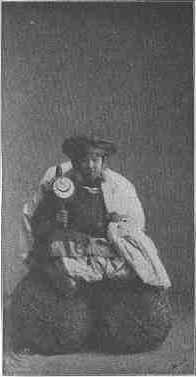
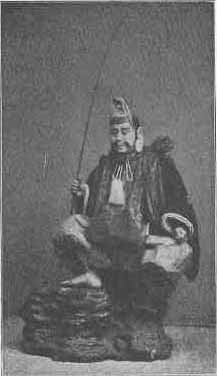
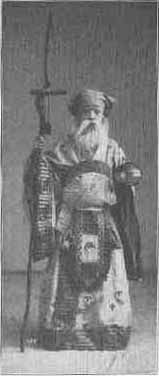
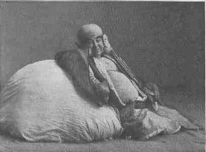
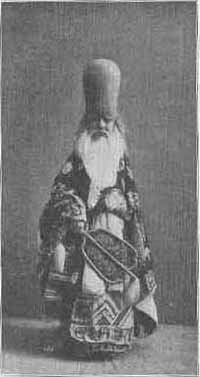
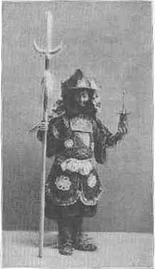

[Intangible Textual Heritage](../../index) [Journals](../index) 

------------------------------------------------------------------------

 

# THE SEVEN GODS OF BLISS

### BY TEITARO SUZUKI

 

------------------------------------------------------------------------

# THE OPEN COURT

 

A MONTHLY MAGAZINE

 

### Devoted to the Science of Religion, the Religion of Science, and the Extension of the Religious Parliament Idea.

 

 

#### Volume XXI

 

#### CHICAGO

##### THE OPEN COURT PUBLISHING COMPANY

##### 1907

###### {Reduced to HTML by Christopher M. Weimer, July 2002}

------------------------------------------------------------------------

p. 397

## THE SEVEN GODS OF BLISS.

BY TEITARO SUZUKI.

 

   THERE is in Japanese folklore a group of supernatural beings
popularly known as the seven gods of bliss, who in the order of their
popularity are as follows: Daikok (The Great Black One), Ebis (The
Stranger), Benzaiten (Goddess of Eloquence), Bishamonten (Vaishravana),
Hotê (Linen-bag), Jurôjin (Old Man), and Fukrokju (Wealth and Long
Life), or Kisshôten (goddess of Good). One of them only (Ebis) is of
native origin; four others have been introduced from India and the three
last mentioned from China. But their real birthplaces have long been
forgotten by the people, and the gods have become thoroughly
naturalized.

 

DAIKOK.

   The first three, Daikok, Ebis, and Benzaiten, are almost equally
popular, and it is difficult to give any one of them a preference over
the other two. In Daikok we perceive a very peculiar and at the same
time a very interesting example of the development, or rather
transformation, of human fancy. Daikok is Mahâkâla of the Hindus and as
such he is far from being a god of bliss. He is one of the most
destructive and awe-inspiring deities in the Hindu pantheon. But we can
understand the paradox by what might be called the law of opposition
whereby two extremes frequently become interchangeable.

   The Japanese Daikok is usually represented as either sitting or
standing on rice sacks, with a "hammer of plenty" in his right hand and
with a large bag on his left shoulder. He commonly wears a flat cap like
those which we occasionally see on the heads of little American girls.
He is always smiling as if ready to shake out any earthly treasure from
his hammer according to the wishes of his devotees. His color is black,
as is indicated by his name (*dai* = p. 398
"great," *kok* = "black"), but in his physiognomy there is not a single
sign that betrays his original nature as the god of destruction.

   The Hindu god Mahâkâla Deva is a manifestation of Shiva, he Hindu
Chronos, for Kâla means in Sanskrit "time." The following passage as
quoted in Moor's *Hindu Pantheon* (p. 33) from Paterson (*As. Res.*,
Vol. VIII., p. 61) gives us a vivid image of this all-destroying god:

   "Mahâkâla as represented in the caverns of Elephanta had eight arms.
In one he holds a human figure; in another a sword or sacrificial axe;
in a third he holds a basin of blood; and with a fourth he rings over it
the sacrificial bell. Two other arms are broken off; with the two
remaining he is drawing behind him a veil, which extinguished the sun
and involves the whole universe in one undistinguished ruin. One of the
titles of this tremendous deity is Bhavara, the terrific; but his
principal designation is Kâla (time), Agni (fire), Rudra (fate)."

   How then did this awe-inspiring deity come to be known as the Great
Black One and revered as a god of bliss br the Japanese? On account of
the lack of authentic records, we have at present no means of
historically ascertaining the process of this singularly interesting
transformation. It seems to have already taken place in India, before
the time of I-Tsing's pilgrimage (A.D. 671-695). From his work,
*Correspondence from the Southern Seas*, we epitomize the following
accounts:

   "In all the great Western (Indian) monasteries there stands by the
kitchen pillar or post, or in front of a large store-room, a wooden
image of a god, two or three feet in height, carrying a golden bag, and
sitting on a small stool with one leg hanging down toward the floor. He
is constantly smeared with oil which gives him a blackish appearance,
and so he is called Mahâkâla, that is, Great Black God. According to
tradition he belongs to the group of Mahâdevas. He is very kindly
disposed toward the Three Treasures (*triratna*) and protects the five
multitudes (of Buddhists) against destruction. Whoever asks his favor is
sure to be gratified in his wishes. At meal time incense and fire are
offered by the cooks, and also all kinds of food and drink are displayed
on his altar."

   I-Tsing concludes his remarks with the words: "All this was
personally observed by myself."

   Then the Chinese traveler relates the following story by way of an
explanation of the foregoing. At a certain monastery about one p. 399 hundred monks used to be fed, but one time
in the spring or fall, when one of the great festivals was about to take
place, there arrived quite unexpectedly a multitude of monks numbering
five hundred. It was then found to the great dismay of the cooks that
the provision prepared for the occasion was utterly insufficient, and
they were at a loss to know how to meet the emergency. At that time here
was among the crowd the old mother of a Brahmacharin, who

|                                    |                                                                                        |
|------------------------------------|----------------------------------------------------------------------------------------|
|                    |                                                                        |
| DAIKOK. | EBIS.[\*](#page_399_note_*) |

said to them, "This is nothing unusual. Do not trouble yourselves." he
burned incense and fire on the altar of Mahâkâla and made him some
offerings, and prayed thus: "The great sage (Buddha) entered Nirvana,
but his followers are still here. Monks coming from all quarters are
desirous to pay homage to the holy places. Through thy grace let them
not suffer from want of provision." She bade p.
400 the people proceed as usual to distribute all the food they
had at the time among the multitudes, and they found that it was more
than sufficient to feed every one of the new comers.

   It is strange to observe that Mahâkâla, the god of time, has here
entirely lost his original significance, and that *Kâla* is understood
to mean "black" instead of "time." Coleman in his *Hindu Mythology* says
that Mahâkâlî, the female counterpart of Mahâkâla, was commonly painted
black or dark blue. Might it not then be possible that the original
meaning of the god having been forgotten, he came to be known only by
his conspicuously dark complexion and that later generations gave him
their own interpretation?

 

EBIS.

   Ebis—in spite of his name which means "foreigner" or "stranger"—is a
thoroughly indigenous production of Japan. He belongs to the mythical
age of Japanese history. He was the third child of Izanagi-no-Mikoto,
the first mythical hero of Japan, and was the younger brother of the
famous sun-goddess Amateras. He somehow incurred the displeasure of his
elders and was expelled to the Western sea, where he spent his remaining
life as a fisherman. Accordingly, he always wears an ancient Japanese
court dress, with a fishing rod in his right hand and with a large
reddish braize under his left arm. This fish, which is zoologically
known as *pagrus cardinalis* or *major*, is considered by the Japanese
the most delicious provision on the table, and as indispensable at all
important festivals as is turkey at an American Thanksgiving dinner.

   Ebis and Daikok are usually in the company of each other; Daikok may
be said principally to be a patron of farmers, and Ebis of merchants and
tradesmen. The birthday of Ebis which falls in November, is celebrated
by the commercial people, especially the dry-goods dealers, by offering
the public a special sale. Some think that any fancy needle work made of
the material bought on Ebis day brings the owner good luck. One of the
largest Japanese brewing companies is named after this god and uses his
picture for a trade mark.

 

BENZAITEN.

   Benzaiten's Sanskrit name is Sarasvatî Devî, which means: "flowing
water" or "eloquence," and her character has remained the same in Japan;
only the Japanese paint her in their own fashion, for so far as the
outside appearance goes, the identity between Sarasvatî p. 401 and Benzaiten is hardly recognizabie. Muir
in his *Original Sanskrit Texts*, V. 339, says of her:

   "Sarasvatî is a goddess of some though not of any great importance in
the Vedas. She is celebrated both as a river and a goddess. She was
primarily a river deity, as her name 'watery' clearly denotes; and in
this capacity she is celebrated in a few separate passages . . . . The
Sarasvatî thus appears to have been to the early Indians what the Ganges
is to their descendants."

|                                       |                                     |
|---------------------------------------|-------------------------------------|
|                       |                     |
| BENZAITEN. | JURÔJIN. |

   The tradition of Sarasvatî or Benzaiten as water goddess is not lost
sight of in Japan, for we see her temples very frequently in isolated
islands or in caverns on the sea-coast.

   That she was also the goddess of eloquence, learning, writing, in
short of general culture, is told by Sir W. Jones who says (*Works*,
vol. XIII, p. 315):

   "Sarasvati Devî is adored as the patroness of the fine arts,
especially of music and rhetoric, as the inventress of the Sanskrit
language, p. 402 of the Devanâgari
characters, and of the sciences which writing perpetuates; so that her
attitudes correspond with those of Minerva Musica in Greece or Italy,
who invented the flute and presided over literature. In this character
she is addressed in the ode; and particularly as the goddess of harmony,
since the Hindus usually paint her with a musical instrument in her
hand. The seven notes, an artful combination of which constitutes music
and variously affects the passions, are feigned to be her earliest
production."

   Benzaiten in Japan is also the popular goddess of beauty. In stories
of ancient Japan we read that when a mother wished to have handsome
daughters, she went to the temple of Benzaiten, and confining herself in
a special room or cave, she fasted and prayed with all her heart,
generally for a period of seven days. In case her urgent wish was
granted, the goddess manifested herself in a dream, and the child thus
favored always surpassed all others in beauty and wisdom.

   As Benzaiten is associated with water, she is often represented as
standing or sitting on a dragon or sea-serpent, and sometimes assumes
the shape of her sacred animal. In Hindu mythology she is pictured as
riding on a peacock. In Japan as well as in India she holds a musical
instrument in her hand, but the Japanese common sense hesitated to let
her have more than two arms, while the fertile Indian imagination
depicts her with four arms, though she looks more human than some other
Hindu deities.

 

BISHAMON.

   Bishamonten, or Bishamon, was also originally a Hindu god, whose
Sanskrit name is Vaishravana. He is the god of wealth and one of the
guardians of the four cardinal points of the universe. He is the
guardian of the North. His other name is Kuvera. We read in Griffith's
*Râmayana*, II, 20:

<table data-align="center" data-cellpadding="10">
<colgroup>
<col style="width: 100%" />
</colgroup>
<tbody>
<tr class="odd">
<td>"May he whose hands the thunder wield [Indra], 
Be in the East thy guard and shield: 
May Yama's care the South befriend, 
Varuna's arm the West defend: 
And let Kuvera, Lord of Gold, 
The North with firm protection hold."</td>
</tr>
</tbody>
</table>

   In Buddhism the four guardian-gods are differently named: East,
Dhrtârashtra; West, Virûpâksha; Soutb, Virûdhaka; and North,
Vaishravana. Some Hindu scholars say that this last-mentioned god did
not play a very important part in the Hindu pantheon, and in spite of
being Lord of Gold, no images or pictures p.
403 are to be had of him. As a Buddhist god he is well known and
in Buddhist countries his pictures and images are plentiful.

   In the Japanese group of the seven gods Bishamon has lost his
qualification as god of wealth. He is known only as the patron of
knowledge, and it is in this capacity that he is sometimes called by the
Japanese the God of Great Learning. Some of the great men in the history
of Japan are believed to have been incarnations of this guardian of the
North. Perhaps the Sanskrit name Vaishravana, which would be interpreted
as being a derivative of the root *shru*, "to hear," might have
suggested the rendering of his name by "much hearing," that is, "great
learning."

   Bishamon is not so popular as the preceding three, though many
temples are dedicated to him and annual festivals are celebrated in his
honor. In pictures and images he appears as holding a miniatare tower or
castle in his left hand and a spear in his right, which evidently
symbolizes his function as guardian warrior-god.

   It is not exactly known when all these Hindu deities were introduced
into the Island Empire. The probability is that when Vajrabodhi, Amogha,
and other representatives of the Mantra sect came from India to China in
the eighth century, they brought along all these gods with many others.
As this sect is a sort of hybrid of Buddhist and Tantric beliefs, it
incorporated a great number of Hindu deities. When it was imported to
Japan soon after its establishment in China, these wonderful creations
of the Hindu mind proved very attractive to the popular conception of
the masses.

 

HOTÊ.

   Hotê, or Pu Tai in Chinese, was a wandering hermit of China who is
believed to have lived in the latter part of the Tung dynasty (620-905
A.D.) One legend considers him an incarnation of Maitreya Buddha. He
carries a large linen bag on his shoulders, and, a Japanese Santa Claus,
is a great favorite with children, and wherever he appears they flock
around him. Occasionally he may be seen among them distributing gifts
dear to their hearts. He has no special name of his own. He is called
Hotê, which is "linen bag," because the large bag on his back is very
conspicuous and he is never seen without it. Aside from these meager
accounts, the history of this Buddhist saint is lost in oblivion, and
nobody now knows how it came to pass that he was admitted to our group
of the seven gods of bliss. Probably, he signifies, the spiritual bliss
of lovingkindness and childlike cheer.

p. 404

   Properly speaking, Hotê is not a god at all, and I do not believe the
Japanese regard him as such. Nobody worships him, nobody prays to him
for special favors, spiritual or material. Most likely it is as a jolly
old fellow who is able to impart something humorous

|                                 |
|---------------------------------|
|                 |
| HOTÊ |

to the severity of our daily struggle for existence, that he has been
initiated into the congregation of the seven gods.

 

JURÔJIN.

   Next comes Jurôjin which means "old venerable man." He symbolizes
longevity and stands for the star Canopus which is called by the Chinese
the star of longevity. We do not know at present how the luminary came
to signalize the bliss of longevity. Jurôjin is thus of Chinese origin.
The popular conception of him is to depict him as carrying a long staff
made of natural wood and accompanied by a white stag,—the staff and the
animal being symbols of holiness. Like Hotê just preceding, he is not
really a god.

 

FUKROKJU.

   The seventh god of bliss according to one tradition is Fukrokju, and
according to another Kisshoten (Shridevî). Fukrokju is not p. 405 a historical figure nor is he a Hindu deity.
He is simply a personification of the combined ideas, *fuk*, *rok* and
*ju*, that is, Bliss, Wealth and Longevity,—these three being considered
by the Chinese the most desirable things in the world. The most
prominent physical mark of this mythical personage, as pictured by the
Japanese, is his extraordinarily long head, as if our ordinary-sized
cranium was not large enough to hold all his virtues, knowledge, and
happiness,

|                                     |                                      |
|-------------------------------------|--------------------------------------|
|                     |                      |
| FUKROJU. | BISHAMON. |

which were added to him as he advanced in age. Other than as a mere
symbol of bliss, he plays no interesting rôle in Japanese popular
belief.

 

KISSHÔTEN.

   Kisshôten is a goddess borrowed from India, her Sanskrit name being
Shridevî. According to a Hindu scholar, she was the wife of Daksha by
whom she had one hundred and one daughters. One of them was given her in
answer to her earnest prayer to have a child p.
406 exactly like herself. This her duplicate named Sati was
married to Mahâdeva. In Japan as in India she has done nothing important
or significant. She is sometimes represented as scattering gems of luck,
and people who own any one of them may use it, like Aladdin's lamp, to
procure at their request all kinds of earthly treasures.

\*      \*      \*

   All these seven gods or genii travel on board a ship called
*Takara-buné*, "boat of treasure," and pictures of it are sold on New
Year's Eve. For there is an ancient custom in which superstitious people
(and perhaps others also) are wont to indulge—to place the picture under
their pillows at night in the hope that a pleasant dream will disclose
all the good luck which the new year has in store for them. When the
voice of the picture peddler rings through the cold clear night of
December, many Japanese youths tremble with excitement to enjoy a
glimpse at their future fortune, and the old feel rejuvenated by the
festive sentiment that prevails. It is a night full of romantic
imaginings—so dear to the Japanese of all classes.

------------------------------------------------------------------------

[Journals](../index)

------------------------------------------------------------------------

### Footnotes

p. 399

[\*](#page_399_fr_*) The illustrations
in the text are from photographs of actors who impersonate these
national gods in a mythological drama. The [frontispiece](ts-sgbfp) of
this number of The Open Court is a Japanese artist's idea of the same
characters painted according to the traditional interpretations.

 

 

 

 

 

 

 

 

 

 

 

 

 

 

 
