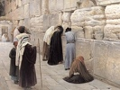

  
[Intangible Textual Heritage](../../index)  [Judaism](../index) 
[Index](index)  [Previous](ajp12)  [Next](ajp14) 

------------------------------------------------------------------------

[Buy this Book at
Amazon.com](https://www.amazon.com/exec/obidos/ASIN/B002DEM9V4/internetsacredte)

------------------------------------------------------------------------

  
*Ancient Jewish Proverbs*, by Abraham Cohen, \[1911\], at Intangible
Textual Heritage

------------------------------------------------------------------------

p. 113

### CHAPTER IX

#### COLLOQUIALISMS

284\. Cut off his head and shall he not die? (Shab. 75a and
often; D. 576).

Used of an act which is followed by unavoidable consequences. A man
cannot protest that he did not intend such results as must inevitably
follow from his acts. There is a Hebrew saying to the same effect:
"Break the cask but preserve the wine!" (B. B. 16a).

285\. How can a barren ass pay me back? (B. B. 91a; D. 339).

Used of a man from whom nothing can be expected.

286\. They make an elephant pass through the eye of a needle (B. M.
38b; D. 509).

Applied to subtle dialecticians. The figure is also used in the New
Testament: "It is easier for a camel to go through a needle's eye," etc.
(Matt. xix. 24).

287\. Man is never shown a golden date-palm

p. 114

or an elephant passing through the eye of a needle (Ber.
55b).

Proverbial for things which are impossible.

288\. When you will have eaten a *Kor* of salt with it (Shab.
4a; Erub. 36a and often; D. 442).

Parallel to the saying: "Putting a thing off to the Greek Kalends,"
which never occur. On *Kor* see no. 168.

289\. As much as a fox carries off from a ploughed field (Nid.
65b; Jom. 43b; D. 334).

Spoken of a project which yielded very trifling results.

290\. Thy guarantee needs a guarantee (Suc. 26a; Git.
28b; D. 566).

Applied to an unreliable authority. Maimonides quotes this saying as
being "well known among the Arameans," for which there is a variant
"Arabs" (*Guide for the* *Perplexed*, Part I. ch. lxxiv.).

291\. A basket full of books (Meg. 28b; D. 582).

Said of a man possessed of much learning, but ill-arranged and devoid of
method. There is a mediæval expression, "An ass carrying books"
(Ds. 44), which is applied to an ignorant man who has a
library.

292\. This is an arrow in Satan's eye (Suc. 38a; Kid.
30a, 81a; D. 215).

Descriptive of a good act or an act which is a preventive against
wrong-doing.

p. 115

293\. Smell at his flask (Shab. 108a; B. B. 22a;
D. 653).

Others translate: "Strike on his flask," to hear how it rings. In either
case the meaning is the same: Test his intelligence.

294\. White pitchers full of ashes (Ber. 28a).

Applied in the first instance to bad pupils. But generally it refers to
dignified posts unworthily filled.

295\. White geese who strip men of their cloaks (Git. 73a).

Men in responsible positions—vested with the *white* mantles of
honour—who abuse their office for their selfish ends.

\*296. Like a *Zuz* above and like a *Stater* below (Suc.
22b; D. p. 15).

The origin of the proverb and its primary application are alike obscure.
In its context it refers to the sun's rays penetrating through a hole as
small as a *Zuz* and leaving on the background a circle of light as
large as a *Stater* (see on no. 92). Perhaps the general meaning is:
Small causes have large results (cf. no. 246).

297\. Of what use is a torch at midday? (Ḥul. 60b; cf. Shab.
63a; D. 642).

Proverbial of something superfluous. Cf. Young's "Hold a farthing candle
to the sun."

298\. The sun sets of itself (Naz. 64b; Pes. 90b;
D. 638).

p. 116

Said of things which occur on their own account and need no human
assistance.

299\. The pitchers \[go\] to the stream; where \[go\] the potsherds?
(Ber. 58a; D. 298).

Said of one who aims at something of which he can make no use. The
proverb is well illustrated by the following: "A hen and a night-owl
were once awaiting the dawn. Said the hen to the night-owl, "The light
is for me; of what use is it to you?" (Sanh. 98b).

300\. May thy strength be firm! (Ds. 20).

This expression is found very frequently in Hebrew and Aramaic. and is
still used by Jews as the equivalent of "Thank you!"

301\. Am I then fastened to you by a *Kab* of wax? (Sanh.
29a; Ds. 5).

An assertion of independence. On *Kab* see no. 21.

\*302. He went to Cæsarea and he still had \[some of\] his victuals with
him (Gen. R. ch. lxviii. § 8; D. 248).

Proverbial for a quickly accomplished task.

303\. Like \[a fish\] from the sea into the frying-pan (Kid.
44a; D. 401).

Proverbial of extraordinary promptness in performing a matter.

\*304. He was involved in a lawsuit, but he had not the standing of a
foot (Jalkut to Gen. § 6).

p. 117

Exactly like the English saying, "He hadn't a leg to stand on."

305\. Go and teach it outside (Erub. 9a; Jom.
43b).

We cannot accept your version. Cf. the common saying, "Tell it to the
marines."

\*306. Carry vegetables to the town of vegetables! (Menaḥ.
85a; D. 447).

Used sarcastically. Similar to the English proverb, "Carry coals to
Newcastle." It is also said, "Thou art carrying straw to Ephraïm"
(*ibid.*), "They carry brine to Apamæa and fish to Acco" (Ex. R. ch. ix.
§ 6). This proverb is put into the mouth of Pharaoh's magicians when
Moses threatened to work his wonders in Egypt, the land of wonders.

307\. Thou hast added water, add flour also (Gen. R. ch. lxx. § 7; D.
29).

Used of a person who is constantly asking questions, but rarely ventures
to add anything more substantial to the conversation or discussion.

308\. He made him ride upon two horses (B. B. 152a; Keth.
55b; D. 121).

"He made assurance doubly sure."

309\. A raven flew by! (Bets. 21a; Ḥul. 124b;
Ds. 127).

A colloquialism used when asked a perplexing question which you wish to
evade.

p. 118

310\. A raven that brings fire to its nest (Gen. R. ch. lxv. § 19; D.
554).

Based on the fable of the raven that brought fire to its nest to warm
its young, but the fire burnt them all. The proverb is thus used of a
man who injures others with the best of intentions.

311\. A mouse lying on *denars* (Sanh. 29b; D. 556).

Descriptive of a miser. The "*denar*" (= denarius) is both a silver and
a gold coin.

312\. He threw a hatchet at it (R. H. 13a; D. 628).

He shattered his arguments.

313\. You all expectorate with the same spittle (Shab. 99b;
Nid. 42a; D. 342).

You have all obtained your opinions from the same source.

314\. Like a log for an image (Keth. 86a; B. K.
98b; D. 348).

Proverbial for something that is exactly suitable for the purpose in
view.

315\. Like taking a hair out of milk (Ber. 8a; Moed K.
28a; D. 402).

Descriptive of something extremely easy to perform.

316\. Like a blind man at a window (B. B. 12b; Nid.
20b; D. 403).

Used of a man who just hits on the right thing by chance.

p. 119

317\. Like warm water on a bald head (Keth. 39b).

Proverbial of something pleasant.

318\. Dust into the mouth of Job! (B. B. 16a).

An exclamatory remark, meaning "Hold your tongue!"

319\. I see here a *Yod* \[enlarged into\] a city (Kid. 16b).

The *Yod* is the smallest letter in the Hebrew alphabet, and is thus
used proverbially for something diminutive, as in the phrase "One jot or
tittle" (Matt. v. 18). With the proverb may be compared "They make a
mountain out of a molehill."

320\. I kindled a fire before thee (Erach. 31b).

My claim is prior to thine, inasmuch as I have previously done something
to establish it.

321\. I ate vegetables before thou didst (Erach. 31b).

I am older than thou.

------------------------------------------------------------------------

[Next: Chapter X: Miscellaneous](ajp14)
