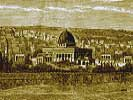

  
[Intangible Textual Heritage](../../index)  [Judaism](../index) 
[Index](index)  [Previous](bar058)  [Next](bar060) 

------------------------------------------------------------------------

[Buy this Book at
Amazon.com](https://www.amazon.com/exec/obidos/ASIN/B001W0Z4K8/internetsacredte)

------------------------------------------------------------------------

  
*The Talmud*, by Joseph Barclay, \[1878\], at Intangible Textual
Heritage

------------------------------------------------------------------------

### CHAPTER III.

1\. A palm branch stolen or withered is disallowed. One from an
idolatrous grove, or from a city withdrawn to idolatry, [2](#fn_245) is disallowed. If the point be broken
off, or the leaves torn off, it is disallowed. If they be only parted,
it is allowed. R. Judah says, "it must be tied together at the top."
Short-leaved palms from the Iron Mount [3](#fn_246) are allowed. A palm branch measuring
three hands, sufficient to shake it by, is allowed.

2\. A myrtle bough stolen, or withered, is disallowed. One from an
idolatrous grove, or from a city withdrawn to idolatry, is disallowed.
If the point be broken off, or the leaves torn off, or if it have more
berries than leaves, it is disallowed. But if the berries be lessened it
is allowed; but they must not diminish them on the festival.

3\. A willow of the brook stolen, or withered, is disallowed. One from
an idolatrous grove, or from a town withdrawn to idolatry, is
disallowed. If the point be broken off, or the leaves torn off, or if it
be a mountain willow, it is disallowed.

p. 141

\[paragraph continues\] One faded, or from
which some leaves have dropped off, or which has grown on dry ground, is
allowed.

4\. R. Ishmael says, "three myrtle boughs, two willows, one palm branch,
and one citron, even if two out of the three myrtle boughs have their
points broken off." R. Tarphon says, "even if three have their points
broken off." R. Akivah says, "even as there is one citron and one palm
branch, so there is one myrtle bough and one willow."

5\. A citron stolen or withered is disallowed. One from an idolatrous
grove, or from a city withdrawn to idolatry, is disallowed. One off an
uncircumcised tree [1](#fn_247) is disallowed.
One from an unclean heave-offering [2](#fn_248)
is disallowed. From the clean heave-offering one is not to take a
citron, but if it be taken, it is allowed. "One from what is doubtful as
to payment of tithe?" The school of Shammai "disallow it," but the
school of Hillel "allow it." One is not to take a citron from the second
tithe in Jerusalem, but if it be taken it is allowed.

6\. If a stain spread over the greater part (of the citron), if it have
lost its crown, or its rind be peeled off, or if it be split, or bored,
or if ever so little be wanting, it is disallowed. If a stain be spread
over the smaller part of it, if it have lost its stalk, or if it be
bored so that no part however small be wanting, it is allowed. A dusky
citron is disallowed. A leek green one R. Meier "allows," but R. Judah
"disallows it."

7\. "What is the (legal) size of a small citron?" R. Meier says "like a
nut." R. Judah says "like an egg." "And of a large citron?" "That one
can hold two in his hand." The words of R. Judah. But R. José says, "One
if (it must be held) in two hands."

8\. "They must only tie the palm-branch with its own kind." The words of
R. Judah. But R. Meier says "even with twine." R. Meier said, "it
happened that the men of Jerusalem tied their palm-branches with gold
thread." The Sages said to him, "underneath they tied them with their
own kind."

9\. "When did they shake the palm-branch?" “At the

p. 142

beginning and ending of “O give thanks unto the Lord,” [1](#fn_249) and at “Save now, I beseech Thee, O
Lord.” [2](#fn_250) The words of the school of
Hillel. But the school of Shammai say, "also at 'O Lord, I beseech
Thee,' send now prosperity." [3](#fn_251) R.
Akivah said, "I watched Rabban Gamaliel and R. Joshua; and when all the
people shook their palm-branches, they only shook theirs at 'Save now, I
beseech Thee.'" If one be on the road, and have no palm-branch with him,
he must, when he gets home, shake it at his table. If he have not done
it in the morning, he must do it towards evening, as the whole day is
allowed for the palm-branch.

10\. If the hymns [4](#fn_252) be read to a man
by a slave, or a woman, or a child, [5](#fn_253) he must repeat after gem what they read,
but it is a disgrace [6](#fn_254) to him. If a
grown-up man read it to him, he must repeat after him, Hallelujah.

11\. In a place where it is the custom to repeat, [7](#fn_255) a man must repeat; to simply read, a man
must simply read; to bless after the palm-branch, a man must bless. In
every case according to the custom of the country. If a person buy a
palm-branch from his neighbour during the Sabbatical year, he must give
him a citron as a gift, for it is not permitted to buy a citron during
the Sabbatical year.

12\. At first the palm-branch was used in the Sanctuary seven days, and
in the country one day. But after the Sanctuary was destroyed, R.
Jochanan the son of Zachai decreed, "that in the country the palm-branch
should be used seven days, in memory of the Sanctuary." He at the same
time also decreed, "that on the day of the wave-sheaf [8](#fn_256) it should be unlawful to eat new grain."

13\. If the first day of the feast fall on a Sabbath, all the people are
to bring their palm-branches (beforehand) to the Synagogue. In the
morning they come early, and each man must distinguish his own
palm-branch, and take it, for the

p. 143

\[paragraph continues\] Sages say, "that a
man cannot discharge his duty on the first day of the feast by means of
his neighbour's palm-branch, but on the other days of the feast he may
discharge his duty by means of his neighbour's palm-branch."

14\. R. José says, "if the first day of the feast fall on the Sabbath,
and a man forget, and carry his palm-branch out on the public common, he
is absolved, because he carried it out with permission." [1](#fn_257)

15\. A woman may receive the palm-branch from the hand of her son, or of
her husband, and put it back into water on the Sabbath. R. Judah says,
"on the Sabbath they may put it back; on the feast they may add water;
and on the middle days they may change the water." A child who knows how
to shake, is bound to shake the palm-branch.

------------------------------------------------------------------------

### Footnotes

[140:2](bar059.htm#fr_249) Deut. xiii. 13.

[140:3](bar059.htm#fr_250) Supposed to be the
mountain east of the Dead Sea above Callirrhoe.

[141:1](bar059.htm#fr_251) Lev. xix. 23.

[141:2](bar059.htm#fr_252) Num. xviii. 11, 12.

[142:1](bar059.htm#fr_253) Psalm cxviii. 1.

[142:2](bar059.htm#fr_254) Psalm cxviii. 25.

[142:3](bar059.htm#fr_255) Psalm cxviii. 25.

[142:4](bar059.htm#fr_256) Psalms cxiii. to
cxviii. inclusive.

[142:5](bar059.htm#fr_257) These not being
legally bound to this duty cannot act as deputies for another.

[142:6](bar059.htm#fr_258) His ignorance of
reading.

[142:7](bar059.htm#fr_259) "I will praise
thee," etc.—Psalm cxviii. 21 to end.

[142:8](bar059.htm#fr_260) Lev. xxiii. 10, 11.

[143:1](bar059.htm#fr_261) Permission arising
out of his intention to fulfil the law.

------------------------------------------------------------------------

[Next: Chapter IV](bar060)
