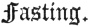

  
[Intangible Textual Heritage](../../index)  [Judaism](../index) 
[Index](index)  [Previous](bar065)  [Next](bar067) 

------------------------------------------------------------------------

[Buy this Book at
Amazon.com](https://www.amazon.com/exec/obidos/ASIN/B001W0Z4K8/internetsacredte)

------------------------------------------------------------------------

  
*The Talmud*, by Joseph Barclay, \[1878\], at Intangible Textual
Heritage

------------------------------------------------------------------------

p. 158

## TREATISE VIII.

 

When Rain is to be prayed for—Proclamations for
Fasting—Ceremonial of Fasting—Prayers—Blowing of Trumpets—R. Gamaliel
and R. Meier—Sign of Famine—Partial Rain—Pestilence—Story of Hone
Hammeagal—Lifting up of Hands—Deputies—Bringing Wood—Five things
happened in Tammuz and five in Ab—Mortifications—Rejoicings.

### CHAPTER I.

1\. When do we remember in prayer the
heavy rain?" Rabbi Eleazar said, "from the first holiday of the feast
(of tabernacles)," Rabbi Joshua said "from the last holiday of the
feast." To him said Rabbi Joshua, "when the rain is no mark of blessing
in the feast, why should one remember it?" Said Rabbi Eleazar to him,
"even I did not say to ask for it, but to remember the blowing of the
wind, and the descent of the rain in its season." He replied to him, "if
so, one can remember it always."

2\. We ask for rain only near to the season of rains. Rabbi Judah
said, [1](#fn_311) "he who passes last before
the ark on the last holiday of the feast of tabernacles remembers it;
the first does not remember it. On the first holiday of the passover the
first remembers it, the last does not remember it." How long do we ask
for rain? Rabbi Judah said, "till the pass-over be ended." Rabbi Meier
said, "till Nisan depart, [2](#fn_312) as is
said, [3](#fn_313) 'And He will cause to come
down for you the rain, the former rain, and the latter rain in the first
*month*.'"

3\. On the third day of Marchesvan [4](#fn_314)
we ask for the rain. Rabban Gamaliel said, "on the seventh, fifteen days
after the

p. 159

feast, that the last Israelite returning home from the feast may reach
the river Euphrates."

4\. If the seventeenth day of Marchesvan arrive, and the rain does not
come down?" "Men of eminence begin to fast for three days. They may eat
and drink by night. And they may work, and wash, and anoint themselves,
and put on their sandals, and use their couches."

5\. "If the first day of the month Chislev [1](#fn_315) arrive, and the rain does not come
down?" "The tribunal proclaims three fast-days [2](#fn_316) for the congregation. Persons may,
however, eat and drink by night. And they may work, and wash, and anoint
themselves, and put on their sandals, and use their couches."

6\. "If these days pass over, and there be no answer?" "The tribunal
proclaims three other fast-days for the congregation. Persons may,
however, eat and drink while it is still day. But they are forbidden
work, and washing, and anointing, and putting on sandals, and the use of
the couch. And the baths are locked up." "If these days pass over, and
there be no answer?" "The tribunal proclaims for them seven more; these
are altogether thirteen fast-days for the congregation." "And what are
these fast-days more than the first six?" "Because during them men blow
with the trumpets and lock up their shops." On Monday they can half open
them at dark. But on Thursday they may open them for honour to the
approaching Sabbath.

7\. "If these days pass over, and there be no answer?" "People diminish
business, building, planting, betrothals and marriages, and salutations
of peace between man and his friend, as children of men ashamed before
OMNIPRESENCE." The men of eminence have again recourse to fasting, till
Nisan be ended. If Nisan be ended, and the rain comes down, it is a mark
of cursing, as is said, [3](#fn_317) "Is it not
wheat harvest to-day?" etc.

------------------------------------------------------------------------

### Footnotes

[158:1](bar066.htm#fr_315) *i.e.* The Chazan
that prays Musaph.

[158:2](bar066.htm#fr_316) Nisan corresponded
partly to March and April.

[158:3](bar066.htm#fr_317) Joel ii. 23.

[158:4](bar066.htm#fr_318) Marchesvan
corresponded partly to October and November.

[159:1](bar066.htm#fr_319) Part of November and
part of December.

[159:2](bar066.htm#fr_320) The fast-days of
strict Pharisees were Mondays and Thursdays, because on a Thursday Moses
went up to Mount Sinai, and returned on a Monday with the second Tables
of the Law.

[159:3](bar066.htm#fr_321) 1 Sam. xii. 17.

------------------------------------------------------------------------

[Next: Chapter II](bar067)
