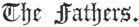

  
[Intangible Textual Heritage](../../index)  [Judaism](../index) 
[Index](index)  [Previous](bar088)  [Next](bar090) 

------------------------------------------------------------------------

[Buy this Book at
Amazon.com](https://www.amazon.com/exec/obidos/ASIN/B001W0Z4K8/internetsacredte)

------------------------------------------------------------------------

  
*The Talmud*, by Joseph Barclay, \[1878\], at Intangible Textual
Heritage

------------------------------------------------------------------------

p. 218

## TREATISE XII.

 

The Oral Law—Its Transmission—Names of the
"Receivers"—Maxims—Apothegms—Wisdom of the Wise.

### CHAPTER I.

1\. Moses received the Oral Law from
Sinai and delivered it to Joshua, and Joshua delivered it to the elders,
and the elders to the prophets, and the prophets to the men of the great
synagogue. [1](#fn_461) They said three things,
"be deliberate in judgment, raise up many disciples, and make a fence
for the law."

2\. Simon the Just was one of the last of the men of the great
synagogue. He used to say that the world stood on three things—"on the
law, the service, and the acts of the pious."

3\. Antigonus of Soco received (the law) from Simon the Just. He used to
say, "be not as servants, who serve their master for the sake of
receiving a reward, but be like servants who serve their master without
the view of receiving a reward; and let the fear of heaven be upon you."

4\. José, son of Joezer of Zeredah, and José, son of Jochanan of
Jerusalem, received (the oral law) from him. José, son of Joezer of
Zeredah, said, "let thy house be a house of

p. 219

assembly for the wise, and dust thyself with the dust of their feet, and
drink their words in thirstiness."

5\. José, son of Jochanan of Jerusalem, said, "let thy house be wide
open, and let the poor be thy children. Discourse not much with women,
not even with thy wife, much less with thy neighbour's wife." Hence the
wise men say, "whoever converses much with women brings evil on himself,
neglects the study of the law, and at last will inherit hell."

6\. Joshua, son of Perechiah, and Natai the Arbelite received the oral
law from them. Joshua, son of Perechiah, said, "get thyself a master,
and obtain a companion, and judge all mankind with favour."

7\. Natai the Arbelite said, "withdraw from an evil neighbour, and
associate not with the wicked, neither flatter thyself to escape
punishment."

8\. Judah, son of Tabia, and Simon, son of Shetach, received it of them.
Judah, son of Tabai, said, "consider not thyself as the arranger of the
law, and when the parties are before thee in judgment, consider them as
guilty; but when they are departed from thee, consider them as innocent,
when they have acquiesced in the sentence."

9\. Simon, son of Shetach, said, "be extremely careful in the
examination of witnesses, and be cautious in thy words, lest they from
thence should learn to utter a falsehood."

10\. Shemaiah and Abtalyon [1](#fn_462)
received it from them. Shemaiah said, "love thy business and hate
dominion, and be unknown to government."

11\. Abtalyon said, "ye Sages, be cautious of your words, lest ye be
doomed to captivity, and carried captive to a place of bad waters, and
the disciples who follow you should drink of them, by which means the
name of God may be profaned."

12\. Hillel and Shamai received it of them. Hillel said, "be thou of the
disciples of Aaron, who loved peace, and pursued peace, so that thou
love mankind, and allure them to the study of the law."

p. 220

13\. He used to say, "whoever aggrandises his name, destroys his name,
and he who does not increase his knowledge in the law, shall be cut off,
and he who does not study the law, is deserving of death, and he who
serves himself with the crown of the law, will perish."

14\. He also said, "if I perform not good works myself, who can do them
for me?" and "when I consider myself, what am I?" and "if not now, when
shall I?"

15\. Shamai said, "let thy study of the law be fixed, say little and do
much, and receive all men with an open, pleasant face."

16\. Rabban Gamaliel said, "procure thyself an instructor, that thou
mayest not be in doubt, and accustom not thyself to give tithes by
conjecture."

17\. Simon, his son, said, "I have all my life been brought up among
wise men, and never found anything so good for the body as silence,
neither is the study of the law the principal thing, but its practice,"
and "whoever multiplies words causes sin."

18\. Rabban Simon, son of Gamaliel, said, "the duration of the world
depends on three things, justice, truth, and peace, as is said, "judge
truth, and justice, and peace in your gates."

------------------------------------------------------------------------

### Footnotes

[218:1](bar089.htm#fr_467) The men of the great
synagogue were the "Scribes" who flourished from the return out of
Babylon till the Græco-Syrian persecution, B.C. 220. Their object was to
preserve the sacred text with scrupulous minuteness, and make a "fence"
for the law. They added numberless directions for the better observance
of the old precepts. The Scribes were succeeded by the "learners," the
"repeaters," and the "master builders," who continued from B.C. 220 till
A.D. 220. In their time fall the Maccabean revolution, the birth of
Christ, the overthrow of the temple by Titus, the rebellion or
Barchochba, the complete destruction of Jerusalem, and the dispersion of
the Jews.

[219:1](bar089.htm#fr_468) Supposed by some to
be the Sameas and Pollio of Josephus. Though others try to identify
Sameas with Simon, son of Shetach.—Antiq. xiv. ix. 4, etc.

------------------------------------------------------------------------

[Next: Chapter II](bar090)
