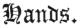

  
[Intangible Textual Heritage](../../index)  [Judaism](../index) 
[Index](index)  [Previous](bar132)  [Next](bar134) 

------------------------------------------------------------------------

[Buy this Book at
Amazon.com](https://www.amazon.com/exec/obidos/ASIN/B001W0Z4K8/internetsacredte)

------------------------------------------------------------------------

  
*The Talmud*, by Joseph Barclay, \[1878\], at Intangible Textual
Heritage

------------------------------------------------------------------------

p. 324

## TREATISE XVII.

 

Pouring Water—Vessels—Water—Who may pour—How it is
to be poured—Hindrances to Cleanness—Doubting—Primary
Uncleanness—Secondary Uncleanness—Derived Uncleanness—Rabban Simeon, Son
of Gamaliel—Straps of Phylacteries—Rolls of the Law—Holy
Scriptures—Canticles and Ecclesiastes—Foot-baths—Ammon and
Moab—Discussion between Rabbis Eleazar, Ishmael, and Tarphon—Weeping of
R. Eleazar—An Ammonite Proselyte—Chaldee Writing—Assyrian Writing—The
Sadducees—The Books of Homer—The Pharisees—Writing the Name.

### CHAPTER I.

1\. A Quarter log [1](#fn_659) of water is poured on the hands of one
person; also on the hands of two persons. Half a log on three or four.
From a log for five, ten, or even one hundred (persons.) R. José says,
"provided there be not less for the last than a quarter log." Men may
add (water) for the second washing, [2](#fn_660) but they must not add it for the first.

2\. They may put water for hands in all vessels, even in vessels of
dung, or vessels of stone, or vessels of earth. But they must not pour
it on hands out of the (broken) sides of vessels, or the bottom of a
tub, or the bung of a cask. Nor may one give it to his neighbour out of
the hollow of his hand: because they must not draw or consecrate, or
sprinkle the water of purification, or put it on hands, except it be in
a vessel. They can only preserve vessels by the covering bound [3](#fn_661) upon them. Nor can they preserve from

p. 325

uncleanness water in open earthen vessels, [1](#fn_662) only in (covered) vessels.

3\. Water which is unfit for animals to drink, is unfit (for washing) in
vessels; but on the ground it is fit. If ink, gum, or vitriol black drop
into it, and its colour be changed, it is unfit. If one made use of it,
or soaked his bread in it, it is unfit. Simeon the Temanite said, "even
if he intended to soak it in one vessel and it dropped into another, it
is fit."

4\. If one rinsed vessels in it, or rinsed out measures, it is unfit. If
one rinsed in it vessels already washed, or new ones, it is fit. R. José
"disallows it for new vessels."

5\. Water in which the baker has dipped rolls, is unfit; but if he only
dipped in his hands, it is fit. All are allowed to pour water on hands,
even one deaf, an idiot, or a minor. A man may rest a cask between his
knees and pour it. He may incline the barrel on its side and pour it. An
ape may pour water on hands. R. José "disallows these two cases."

------------------------------------------------------------------------

### Footnotes

[324:1](bar133.htm#fr_666) A log is about half
a pint.

[324:2](bar133.htm#fr_667) Before eating
ordinary food the hands must be washed once. Before eating consecrated
food they must be washed twice.

[324:3](bar133.htm#fr_668) Num. xix. 15.

[325:1](bar133.htm#fr_669) *i.e.* From the
uncleanness of a dead reptile.

------------------------------------------------------------------------

[Next: Chapter II](bar134)
