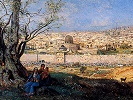

  
[Intangible Textual Heritage](../../index)  [Judaism](../index) 
[Index](index)  [Previous](bata01)  [Next](bata03) 

------------------------------------------------------------------------

[Buy this Book on
Kindle](https://www.amazon.com/exec/obidos/ASIN/B0031574IW/internetsacredte)

------------------------------------------------------------------------

  
*The Babylonian Talmud in Selection*, by Leo Auerbach, \[1944\], at
Intangible Textual Heritage

------------------------------------------------------------------------

p. 7

# THE STORY OF THE TALMUD

### Introduction

THE word Talmud means study. The *Talmud* is a record of about a
thousand years of accumulated Jewish learning and wisdom in all fields
of endeavor: Law, religion, ethics, history, science and folklore.

This lore is called Oral Law, in contra-distinction to the *Bible*,
which is the Written Law. Tradition has it that this Oral Law was
indicated to Moses and handed down by him to future generations; in each
generation the great teachers of the period in turn handed it down,
amplified but still in oral form, to the next generation.

Early in the history of the Jewish people it was found necessary to
expound and interpret the laws as given by Moses; this law-giver himself
appointed judges throughout Israel for this very purpose. Particularly
true was this after the return of the Jews from Babylonian captivity,
when, through the effort of Ezra, the *Torah* became the law and the
guiding spirit of all the people. Its reading in public three times a
week, with explanations and translations into Aramaic (the vernacular of
the people), was at this time made mandatory.

p. 8

The transgression of the laws was severely punished by the court or by
"death at the hands of the Lord". However, life in this new Jewish
society was more complex than in the olden days. Some of the laws became
obsolete, while others had to be reinterpreted to conform to new
conditions.

The *Torah*, however, was the Law, which could not be altered. Therefore
the scribes and the members of the Great Assembly busied themselves in
probing and searching every sentence and every word of the Scriptures,
to find solutions to the vexing problems by interpretations of each law.
This method of analysis and exposition was called from the Hebrew word
*darash*, to search, to probe, *Midrash*.

The *Midrashim* are of two kinds. Some are concerned with the strict and
terse interpretation of the laws and statutes as found in the
Scriptures, mainly in *Exodus*, *Leviticus*, and *Deuteronomy*. These
are called *Halachoth*. The others, called *Haggadoth*, are homiletic in
style; they took as their topic the narrative parts of the Bible and
used them as vehicles for the expounding of ethical precepts, proverbs,
parables, and history.

It was the custom to recite a passage of the Scriptures, which served as
a thread upon which the expounder could string all sorts of
interpretations, and by skillful and often dialectic argumentation, make
the law serve new essential purposes. Thus the Law was kept effective in
the life of the community, its scope widened as society grew complex.

Particularly popular with the people were the *Haggadic Midrashim*.
These were especially adaptable to preaching in the Synagogues or the
great open-air gatherings.

p. 9

\[paragraph continues\] On several
occasions, however, the sages voiced opposition to the *Haggadah*,
particularly to those parts that are given to exaggeration and
triviality; nonetheless, they also recognized its charm for the masses
and its great moral force, and accorded it to the same importance as the
*Halachah*.

The great teachers of antiquity among the Hebrews were the scribes, to
whom many of the earlier *Midrashic* interpretations could probably be
traced. They flourished for some two centuries after 500 B.C. and were
followed by the Pharisees who headed the Sanhedrin. The Pharisees were
more lenient and liberal in their interpretations of the laws than the
Saducees, the aristocrats who adhered to a more literal and strict
interpretation of the Scriptures, and therefore the Pharisees were more
popular with the people and exerted a greater influence as the
dominating force in the life of Jewry. Their influence became even
greater as the government and the degenerating
[aristocracy](errata.htm#0) became corrupt and oppressed the people.

The first chapter of the tractate *Aboth*, Fathers of the Mishnah,
traces the chronological order of these great teachers. The most
prominent of them was Hillel, the Prince. He headed the contingent of
the Sages who were known as the House of Hillel. These were opposed by
Shamai and his colleagues. Their strife evoked a great interest in the
contemporary Jewish world, but, as the rivalry was purely intellectual,
it spurred them on to greater activity, and fostered learning.

Hillel, who advocated a wider and more liberal application of laws, was
invariably successful in having his laws adopted. He was the author of
the law known as

p. 10

\[paragraph continues\] *Prosbul* (before
the court). According to the "Law of the Seventh year" Deuteronomy XV,
all indebtedness became automatically cancelled in the sabbatical year.
Because of this law, the rich refused to lend money to the traders and
that brought stagnation to business. By a very ingenious interpretation
of the passages in the Scriptures referring to this law, Hillel was able
to devise the enactment of the *Prosbul*, by which a document was
executed transferring the debt to the court, thus making the law of the
seventh year not applicable to the specified loan. In a similar manner
he enacted a law by which a man who sold his house in a walled city
could redeem it from the buyer before one year was over, by depositing
its value with the court.

Hillel also inaugurated the seven standard methods of scriptural
analysis, which were later, by Rabbi Ishmael, increased to thirteen.
These methods served as a scientific basis for the study and analysis of
the *Torah*. Hillel is also credited with being the first one to make an
attempt to collect and arrange the laws in a systematic order.

With the domination of foreign powers and the consequent decline of the
government, the Jews rallied more and more around the Sages and their
academies. It was with Hillel that the presidency of the Sanhendrin was
made hereditary.

Toward the end of the 1st Century B.C. the country was in a deplorable
condition, under a weak and decadent government. The puppet kings were
tools of the Roman leaders, who through them manipulated the election
and controlled the office of the high priests.

The population was torn by the strife of many warring parties within and
an enemy from without. The Jews

p. 11

fought bravely, many of their illustrious Sages and the flower of their
youth fell on the fields of battle, but they were no match for the
powerful and well organized Roman armies. The great Master of this
period was Rabbi Yohanan ben Zakai. Foreseeing the tragic end of the
struggle against the Romans, he counselled submission, but his advice
was unheeded.

One night, smuggled out of the city by his disciples, he presented
himself before the Roman commander to ask for permission to establish
his academy in Yabneh, and to plead for the safety of its disciples.
Upon the fall of Jerusalem, Rabbi Yohanan re-established the Sanhedrin
in Yabneh, to which city and its academy the center of Jewish law and
thought was transferred.

The Sages realized that with the Temple gone and the Hebrews leaving the
world stage as a politically independent nation, it was encumbent upon
them to find some standard around which to rally and bind the People of
Israel. There were the Scriptures, which long ago Ezra and the scribes
had made popular among the people, and the study and worship of which
the Pharisees had endeared. Rabbi Yohanan ben Zakai and his followers
made it their concern to emphasize the paramount importance of the Bible
and its study in the life of the Jews. Rabban Gamaliel II, the
legitimate heir to the presidency of the *Sanhedrin*, succeeded Rabbi
Yohanan ben Zakai. With his accession, its authority was soon recognized
by the Romans and accepted by Jewry within Palestine and without. Rabban
Gamaliel II is remembered also for discarding the custom of lavish and
excessively ceremonious and costly funerals; he inaugurated the use of
the simple pine coffin and plain shroud that still predominate today.

p. 12

\[paragraph continues\] Turbulent
conditions forced the seat of the Sanhedrin to move from place to place
many times, but it survived as an institution until 425 A.D.

This was the most fruitful and far-reaching period in the post-Biblical
history of the Jews. The Rabbis succeeded in moulding a unified and
homogeneous people out of the remnants of scattered Jewry. They enacted
laws, and fostered ideas and ideals. They compiled, arranged, and
systematized their many laws, and bequeathed them to future generations
in such a manner that most of them have survived and are valid to this
day among the Jews throughout the world. Through the Romans and the
early Christians these ideas, laws and customs likewise penetrated other
cultures. Many of the laws inaugurated in those days form the basis of
the laws by which we are guided today.

#### TALMUDIC LITERATURE

All the interpretations and commentaries on the Law were retained in
oral form. Many of the scholars, however, in order to refresh their
memories, privately made notes and jotted down some of these laws. There
are many collections of the *midrashim*, attributed to different
scholars whose names appear in the Talmud. The most important of these
collections are:

1\. The *Mekilta*, a commentary on the book of *Exodus*, beginning with
chapter 12 and ending with the Sabbatical laws in Chapter 35. This is
attributed to Rabbi Ishmael, who lived during the first century A.D.
There is also a *Mekilta* attributed to Rabbi Yohai.

p. 13

2\. *Sifra*, a *midrashic* interpretation of Leviticus. This was
probably compiled in the school of Rabbi Akiba, the great sage who was
born about 50 A.D. and died as a martyr in 136, during the rebellion of
Bar Kochba.

3\. *Sifreh:* Two commentaries, one on *Numbers* and one on
*Deuteronomy*. These two books were not composed in the same school, but
are found linked together from the earliest days. The commentary on
*Numbers* is composed almost exclusively of *Halachic Midrashim*, and
betrays the method and style of Rabbi Ishmael, while that on
*Deuteronomy* is full of *Haggadic Midrashim* and is probably the
product of the school of Rabbi Akiba.

As these commentaries grew and multiplied, attempts were made to
collect, then to arrange them systematically so that they could be
retained in the memory. The pioneer in this work was Rabbi Akiba, who
divided the *Halachoth* according to subject: laws dealing with women;
civil laws; etc. He also classified them into categories, such as the
four primary causes of damage.

Many of the followers and disciples of Rabbi Akiba and Rabbi Ishmael
made compilations of their own, the circulation of which brought on
confusion.

The great work of compiling and arranging the laws was finally
undertaken and accomplished by Rabbi Yehuda, the Prince, often referred
to simply as Rabbi. Through his authority as the President of the
*Sanhedrin*, he reduced them to writing, codified them and made them
valid as the *Mishna*, which means "the repetition of the law." He
visited many of the academies and gathered the collections and private
notes that were circulated among the teachers of his day, and with the
aid of a committee of his academy, established a definitive text.

p. 14

The *Mishna* was divided into six orders:

1\. *ZERAIM*, dealing with agriculture.

2\. *MOED*, dealing with festivals.

3\. *NASHIM*, pertaining to women.

4\. *NEZIKIN*, dealing with civil and criminal law.

5\. *KODASHIM*, dealing with sacrifices.

6\. *TOHAROTH*, dealing with cleanliness and purifications.

\[paragraph continues\] The orders were
divided into tractates, sixty-three in all.

The codification of the *Mishna* did not preclude the further study of
the Law. There were the *Halachoth* compiled by other Rabbis, which were
not included in the *Mishna*. Many of these are cited in the *Talmud*,
however, as *Baraithoth* "external."

Many of the disciples of Rabbi, some with his approbation, emulated him
in compiling *Mishnas* of their own. One such compilation, ascribed to
various of his followers, is the *Thosafta*, which means addenda, but is
really an independent work arranged in six orders in the manner of the
*Mishna*, containing new and different material.

#### THE BABYLONIAN TALMUD

Ever since the destruction of the First Temple and, even for some time
preceding it, there was a large Jewish population in Babylonia (modern
Iraq). It was concentrated in a few large cities, where they continued
to live and prosper as a homogeneous community. Here developed some of
the greatest lights of ancient Israel. The prophet Ezekiel lived in
Babylonia; Ezra, Nehemiah, and

p. 15

the early scribes all came up from there to rebuild their country and
the House of God. Hillel the Prince, together with some of the Sages,
was also a Babylonian.

With the Roman conquest in 70 A.D., and later with the suppression of
the rebellion of 135 A.D., many scholars were among those who fled
thither from Palestine and the sword of the Romans.

Babylon was not despoiled by the Roman warriors. Remote from the war,
the Jews remained there in comparative security as a recognized minority
headed by the Exiliarch, a descendant of the house of David, empowered
by the Babylonian government to decree laws and appoint judges.

The prosperity and liberty enjoyed by the Jews in Babylonia was
conducive to intellectual growth; thus the academies established in
Babylonia were renowned for their scholarship, and their learning was
held in a higher esteem in the fourth and fifth centuries than that of
the Palestinian Rabbis.

The most prominent of the Babylonian scholars was Abba Areka, commonly
referred to as Rab. He studied under Rabbi Yehuda in Palestine for many
years. Upon his return to Babylonia he founded the academy at Sura. Rab
and his contemporary Mar Samuel, the head of the academy at Nehadrea,
raised the scholarship and reputation of the Babylonian academies to the
highest level. Though the supreme authority was vested in the Sanhedrin
in Palestine, the Babylonian rulings and decisions were invariably
accepted and followed. For the sake of national unity, however, the Jews
of Babylonia elected to submit to the authority of the Prince and the
rulings of the Palestinian *Sanhedrin*.

p. 16

With the abolition of the Office of the Prince, the dissolution of the
*Sanhedrin*, and the disintegration of the Jewish community in Palestine
in the 5th century, leadership and authority passed into the hands of
the Babylonian Sages.

Towards the end of the fourth century Rab Ashi, the head of the academy
in Sura, proceeded to collect the accumulated literature and learning of
the post-Mishnaic period. Seminaries called *Kalla* were held at the
academy twice a year; a tractate was selected and announced in advance
for each *Kalla*. When the scholars and their disciples gathered at the
academy, a passage from the *Mishna* tractate was read and discussed.
These discussions, recorded, constitute the *Gemara*.

Rab Ashi began the *Gemara* as a literary undertaking for its own sake.
Soon, however, Jews in Babylonia were subjected to religious persecution
by the Sassanian Kings, who wished to introduce the teachings of
Zoroaster. Rabina, the successor of Rab Ashi, concerned over the
possible disappearance of the great rabbinic literature, hurriedly
edited and codified the *Gemara*, giving it the form it has retained to
this day.

In its narrower sense of the term, the word *Talmud* is applied to the
*Mishna* and the *Gemara*. In its wider connotation it includes also the
*Midrashim*, the *Mekilta*, the *Sifra*, the *Sifreh*, the *Tosefta* and
several less important works, already referred to.

The *Babylonian Talmud*, as it has come down to us, is usually printed
in its original languages, in Hebrew script, in 22 folio volumes.

The *Palestinian*, or Jerusalem *Talmud*, as it is often

p. 17

called, is printed in the same manner in from four to eight volumes.

There were very cordial relations and frequent interchange of teachers
between the Palestinian and Babylonian academies, so that the names of
the same teachers appear in both *Talmuds*. The *Palestinian Talmud*,
however, smaller in scope, has exerted little influence on Jewish life
as a whole. The *Babylonian Talmud*, on the other hand, has been a
constant and basic force in world Jewry, down to this very day. So
potent has its influence been, that Jewry has had to guard against a
tendency to accept all its statements as law. As the noted Christian
Talmudic scholar, Herman L. Strack points out: [\*](#fn_0) "The Talmud is not a law book, not a code,
in which every sentence is unconditionally valid. In the *Mishna* itself
diverging opinions are, very frequently, placed in juxtaposition, and
the *Gemara* almost throughout takes on the nature of a lecture hall or
a collection of minutes of the discussions, in which the *Amoraim*
cleared up that which had been said of the *Tannaim*. Direct statements
as to what is *Halacha*, valid law, are rare in the *Mishna*.
Accordingly it is highly preposterous to cause all the utterances of a
single rabbi found in the Talmud to stand without further ado as
teaching of the Talmud, or to hold Judaism responsible for such
utterances."

The *Mishna* was written in what was then Modern Hebrew, quite unlike
that of the *Bible*. It is not so flowery and picturesque, but rather
terse, concise and clear, suited to the legal matters with which it
mainly deals.

p. 18

The *Gemara* is written in the main in the vernacular, a mixture of
Aramaic and Hebrew, with a sprinkling of Greek, Roman and Persian words.
It is marked by a disregard of grammar, and is often awkward in its lack
of style, retaining always the flavor of vernacular speech. The
discussions sometimes seem lengthy and pointless; occasionally they
indulge in hair splitting. They may jump from subject to subject. The
records appear like informal discussions, interpolated with beautiful
legends, anecdotes, parables, and ethical maxims. These were often cited
for the purpose of illustration, of bringing out a point, or of proving
the antiquity and ancient tradition of the law discussed. Often as not,
however, they had no relation to the subject under discussion, but were
brought in for the sole purpose of breaking up the monotony of the
lengthy discourse, and as it were, to ease the tedious study of the dry
subject by something sweet and palatable. Thus the *Talmud* served as a
storehouse of folklore, history, ancient custom, and wisdom, which,
undoubtedly, would have otherwise disappeared, and which, next to the
*Bible* itself, have preserved and helped to shape the culture and
spirit and life-ways of the Jew.

\*    \*   \*

In preparing this anthology the editor has endeavored to present the
material for a first-hand acquaintance with the monumental and much
discussed work, the *Babylonian Talmud*. He has thus made, as it were, a
cross-section of its copious volumes.

p. 19

The form and arrangement of the anthology adhere to the pattern of the
*Talmud*. First the *Mishna* is cited, then follows its discussion, here
kept within representative limits. The legends, stories and parables
appear in the same places as in the Talmud, so that its character is
here preserved. The tractates follow the original order, with one
exception, that of the tractate *Aboth* (Fathers of the *Mishna*), here
given in its entirety at the start. In the Talmud it is included within
the order of *Nezikin*, which deals with raw and legal procedure.

As much as possible, the style and the linguistic mannerism of the
original have been preserved. The *King James* version is followed for
all Biblical quotations, save a few where that version alters the
meaning of what is being discussed in the *Talmud*.

 

Thanks are due to Samuel K. Mirsky, professor of Rabbinics at the
Yeshiva College of New York, who read the manuscript, for his helpful
counsel and advice; to Dr. Joseph T. Shipley for his stylistic
suggestions; to Sylvia Loeb, who assisted in preparing the typescript,
and to Ruth Busch for the checking of the proofs.

Leo Auerbach.           

------------------------------------------------------------------------

### Footnotes

[17:\*](bata02.htm#fr_0) Hermann L. Strack,
*Introduction to the Talmud and Midrash* (English translation), Jewish
Publication Society, 1931, p. 89.

------------------------------------------------------------------------

[Next: Fathers of the Mishna](bata03)

