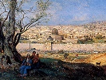

  
[Intangible Textual Heritage](../../index)  [Judaism](../index) 
[Index](index)  [Previous](bata04)  [Next](bata06) 

------------------------------------------------------------------------

[Buy this Book on
Kindle](https://www.amazon.com/exec/obidos/ASIN/B0031574IW/internetsacredte)

------------------------------------------------------------------------

  
*The Babylonian Talmud in Selection*, by Leo Auerbach, \[1944\], at
Intangible Textual Heritage

------------------------------------------------------------------------

p. 54 p. 55

# HOLY DAYS

# MOED

p. 56 p. 57

### Sabbath

### (Tractate Shabbath)

ONE does not sit down before the barber, close to the time of the
afternoon prayer, unless he has already said his prayer. Neither shall
he enter the bath house or a tannery, or sit down to eat or begin a law
suit; but if they have begun it, they need not interrupt it. One
interrupts for the reading of "Hear, O Israel", but not for the prayer.

A tailor should not take his needle on Sabbath eve just before
nightfall; he may forget and go out with it. Nor the scribe take his
pen. One should not begin to clean his clothes, and one does not read at
the lamplight (because he may tilt it) . But the schoolmaster may
supervise the reading of the children, but he himself should not read.

Similarly a man that is in heat should not eat together with a woman
that is in heat, because it may lead them to sin.

(*Mishna*)

p. 58

AFTER all we speak here of the usual haircut. Why may not one sit down
at the beginning? Because the shears may be broken. Thus one may not
enter the bathhouse if only for sweating. Why not at the outset? Because
one may faint. Nor a tannery if only to inspect it. Why not at the
outset? Because one may notice that his goods are being spoiled, and
that will worry him; nor sit down to eat, not even a small meal. Why not
in the first place? Because one may prolong the meal. Nor to a law suit,
even if at the end of it. Why not in the first place? Because he may
find a new plea for changing the decision.

What constitutes the beginning of haircutting? Rabbi Abim says: When the
sheet is spread on one's knee. What constitutes the beginning of a bath?
Rabbi Abim says: When one takes off his coat. And what is the beginning
of tanning? When one tied his apron round his shoulders. When does the
meal begin? Rabbi says: When one washed his hands. Rabbi Hanina says:
When one loosened his girdle. There is no disagreement here. One speaks
of the Babylonians and the other of the Palestinians.

 

SAID the Holy One, blessed be He, to Moses: I have a precious gift in my
treasure and its name is "Sabbath" and I wish to give it to Israel. Go
and inform them of it. From this remark I infer, said Rabbi Simon ben
Gamaliel, that if one gives a piece of bread to a child, he must inform
the mother of it. How does one do it? He dabs him with oil and paints
him with Kohl. But how about these days, when we are afraid of
witchcraft? Rab Pupa says: One does the same.

p. 59

\[paragraph continues\] But it is not so.
For Rabbi Hama ben Rabbi Hanina says: If one makes a gift to his
neighbor one does not have to inform him for it was said: (*Exodus*
xxxiv, 29) *Moses wist not that the skin of his face shone while he
talked with him*. There is no contradiction here. In one instance, the
fact will be evident in any case. In the other instance it may not be
known. The Sabbath, too, was bound to be known. But its reward was not
bound to be known.

Raba ben Mehasia said, in the name of Rabbi Hama ben Goria, in the name
of Raba: One should never single out one of his children. Because Jacob
gave Joseph two Selah weight more of silk than to his other children,
Joseph's brothers became jealous of him, and this finally caused our
forefathers to go to Egypt.

Raba ben Mahasia, also, said in the name of Rabbi Hama ben Goria in the
name of Rab: Any city whose roofs are higher than the Prayer House,
will, at the end, be destroyed. As it was said: (*Ezra* ix, 9) *To set
up the house of our God to repair the desolation thereof*. This refers
only to regular houses, but towers and turrets are different. Rabbi Ashi
said: I saw to it that the city of Mehasia was not destroyed. How so?
But indeed it was destroyed. Well, it was not destroyed because of that
sin.

Said Raba ben Mehasia, in the name of Rabbi bar Goria in the name of
Rab: One should rather be subjected to an Ishmaelite than to a
foreigner; under a stranger but not under a Parsee; under a Parsee, but
not under a scholar; under a scholar but not under an orphan or a widow.

p. 60

Rabbi ben Mehasia, also, said in the name of Rabbi Hama bar Goria in the
name of Rab: Any sickness but not that of the bowels; any pain but not
that of the heart; any ache but not that of the head; anything evil, but
not an evil wife.

Rabbi bar Mehasia, also, said in the name of Rabbi Hama ben Goria in the
name of Rab: If all the seas were ink and all the reeds were pens, and
all the skies were parchment, and all men could write, they would not
suffice to write down all the red tape of government. What in the
*Scriptures* refers to this? Rabbi Meshershia said: (*Proverbs* xxv, 3)
*The heaven for height, the earth for depth, and the heart of Kings is
unsearchable*.

 

RABBI Simon ben Eleazer said in the name of Rabbi Simon ben Gamaliel:
One does not arrange for the betrothal of children; one does not engage
a teacher for his son, nor does he make arrangements to teach him a
trade; one does not comfort mourners, nor does one visit sick people on
the Sabbath. This is according to the House of Shamai, but the house of
Hillel permits it.

The Rabbis taught: When one visits a sick person on the Sabbath, he
says: It is Sabbath; tears are forbidden. A speedy recovery. Rabbi Meir
says: One may have compassion. Rabbi Yehuda says: The Lord may have
mercy on you and on the sick in Israel. Rabbi Yosi says: May the Lord
have mercy on you among the sick of Israel. Shebna, a man of Jerusalem,
said upon entering: Peace, and upon departing, he said: Sabbath. Tears
are forbidden. A speedy recovery. His mercy is abundant; rest in peace.

(*Gemara*)

p. 61

THE House of Shamai says: Ink, dyes and vetches must not be soaked on
Sabbath eve, unless there is time for them to be thoroughly soaked
before the Sabbath sets in. But the House of Hillel permit it. The House
of Shamai says: Nets and traps must not be set to catch fish or birds or
animals, unless they will be caught before sundown. But the House of
Hillel permit it.

The House of Shamai says: One must not sell anything to a Gentile or
help him load his beast, or put a burden on his shoulder, unless he can
reach a nearby place soon, before sundown. But the House of Hillel
permit it.

The House of Shamai says: Hides must not be given to a tanner, nor
clothes to a Gentile launderer, unless they can be done on Sabbath eve
before sundown. But the House of Hillel permit it.

Rabbi Simon ben Gamaliel said: In my father's house they used to give
the linen to a Gentile launderer three days before the Sabbath. Both
houses agree, however, that one may set the beams of the oil press and
the rollers of the wine press.

One must not put bread in the oven on Sabbath eve before darkness, nor
may cakes be put on the coal unless there is time for the crust to form.
Rabbi Eliezer says: In time for the crust to form on the bottom. But the
Passover offering may be put in the oven just before darkness. One may,
also, kindle the fire in the chamber of the hearth, but in the country
only if most of it will catch fire before darkness. Rabbi Yehuda says:
If one burns coal, if any amount at all will catch fire, it is well.

(*Mishna*)

p. 62

THE Rabbis taught: One may open a water canal into the garden on Sabbath
eve, so that the water will flow all day. One may put a perfumed sachet
under the clothing on Sabbath eve so that it will penetrate the clothing
all day. One may put sulphur under utensils on Sabbath eve so that the
process of sulphuring will go on all day. One may put a salve on the
eye, a plaster on a wound so that the healing goes on all day. But one
must not put more wheat in the water mill than can be ground before
sundown. What is the reason?

Said Rabba: Because of the noise that it makes. Rabbi Joseph said to
him: May not the Master say: Because the utensils have to rest too? For
we were taught: (*Exodus* xxiii, 13) *And in all things that I have said
unto you be circumspect*. That means, also, the resting of the utensils.
Rabbi Joseph said: You may say: On account of the resting of the
utensils.

The Rabbis taught: The House of Shamai says: One must not sell anything
to a Gentile, nor lend him money, nor make a loan to him of anything,
nor make a gift of it, unless he can get with it to his house before
sundown. The House of Hillel says: If he can reach a house near the city
wall, it is permitted. Rabbi Akiba says: As long as he can leave the
house of the Jew before sundown. Said Rabbi Yosi ben Rabbi Yehuda: The
words of Rabbi Akiba are the same as the words of the House of Hillel.
Rabbi Akiba came only to amplify the words of the House of Hillel.

The Rabbis taught: A man must not sell his leaven bread to a non-Jew,
unless he knows that the Gentile will eat it before the Passover. This
is the opinion of the

p. 63

\[paragraph continues\] House of Shamai,
but the House of Hillel says: As long as the Jew may eat it, he may sell
it.

The Rabbis taught: A man must not rent his utensils to a non-Jew on
Sabbath eve. However, on the fourth and fifth day of the week he may do
it. One does not send a letter to a Gentile on Sabbath eve, but one
sends it on the fourth or fifth day of the week.

The Rabbis taught: One must not send a letter through a Gentile on
Sabbath eve, though one has arranged to pay him for it, unless he can
reach the house before sundown. This is according to the House of
Shamai. The House of Hillel, however, says: If he can reach a house near
the city wall, it is permitted. But isn't the messenger getting paid for
it? Rabbi Shesheth says: This is the meaning: He must have time to reach
the house. According to the House of Shamai; or according to the House
of Hillel, he must reach a house near the city wall. But we learned in
the first place, that one does not send at all. There is no
contradiction here. One speaks of a town where there is a Post Office
and the other speaks of a town where there is no Post Office.

The Rabbis taught: One must not ship on a boat less than three days
before Sabbath. This refers to a pleasure trip. But if the voyage is
undertaken for a good deed, it is permissible, and one should stipulate
that the ship will rest on the Sabbath; but if it does not rest, it is
well. Thus the word of Rabbi. Rabbi Simon ben Gamaliel says: It is not
necessary. A trip from Tyre to Sidon is permitted even on Sabbath eve.

The Rabbis taught: One must not besiege a city less than three days
before Sabbath, but if the siege has begun,

p. 64

it is not necessary to stop. And thus did Shamai say: (*Deuteronomy* xx,
20) *Until it be subdued even on the Sabbath day*.

Said Rabbi Zadok: Thus was it customary in the House of Rabbi Gamaliel.
The white garments were given to the launderer three days before the
Sabbath, but colored garments even on Sabbath eve. And from this we
learn that white garments are harder to launder than colored garments.

Abaya said: When one gives a garment to a launderer he should give it to
him by measure and take it back by measure. If he finds it larger the
launderer spoiled it by stretching. If he found it smaller, he spoiled
it by shrinking.

(Gemara)  
FROM CHAPTER I

 

WHAT may one use for lighting on the Sabbath, and what must one not use?
One must not use cedar fibre, nor oakum, nor silk, nor a bast wick, nor
a desert wick, nor seaweed, nor pitch, nor wax, nor castor oil, nor
burnt oil, nor tail fat, nor tallow. Nahum the Mede says: One may use
boiled tallow, but the Sages say: Whether boiled or not one may not
light with it.

One does not light on festival days with sanctified oil that has been
defiled. Rabbi Ishmael says: One must not light with tar because of the
respect for Sabbath. The Sages permit all oils: Sesame oil, nut oil,
radish oil; cucumber oil, tar and Naptha. Rabbi Tarfon says: Only olive
oil may be used for lighting.

(*Mishna*)

 

THE Rabbis taught: All the things that we were told are not to be used
for lighting on the Sabbath, one may

p. 65

use them to make a large fire to warm oneself by, or to use for light,
whether it is used on the hearth or in the stove. It was only forbidden
to make a wick of it, nothing else.

Rabbi Huna said: All wicks and oils which are forbidden to be used on
the Sabbath are, also, forbidden to be used on Hanukah whether on the
Sabbath or on a weekday.

The Rabbis taught: The precept of Hanukah demands a light for each man
and his house. The zealous light a candle for each one. And the very
zealous? The House of Shemai says: They light eight candles the first
day and one candle less each day. The House of Hillel says: The first
day they light one candle and each day they add one.

Said Raba ben Bar Hanai, in the name of Rabbi Yahanan: There were two
Elders in Sidon, one acted according to the House of Shamai, and one
acted as the House of Hillel. The first gave his reason that it should
correspond to the offerings of the festival. While the other said: One
progresses in Holy things but one does not retrogress.

The Rabbis taught: It is decreed that the Hanukah light be placed near
the door on the outside, but if one lives in an upper story one puts it
at the window nearest the street. But if there is danger one may put it
on a table. Raba said: An additional candle is needed if it is to be
used for light.

What is Hanukah? The Rabbis taught: On the twenty-eighth day of Kislev
begins the festival of Hanukah. It lasts eight days. On these, no
lamentations for

p. 66

the dead nor fasting is allowed. For when the Greeks entered the Temple
they defiled all the oils. When the Hashmoneans overpowered and defeated
them, they searched and found only one vial of oil which was lying with
the seal of the High Priest, and there was not more in it than enough
for one day, but a miracle was performed, for it burned eight days. The
following year these days were decreed a festival with rejoicing,
Hallelujah and thanksgiving.

It was taught: If a spark from the anvil caused a damage, the smith is
liable for it. If a camel laden with flax passed through the street and
some of the flax got into a store and was ignited by the storekeeper's
lamp and burned the building, the camel driver is liable for the damage.
But if the storekeeper put the lamp on the outside, then the storekeeper
is liable.

Rabbi Yehuda says: If it were a Hanukah light, he is not liable. Rabbina
said in the name of Rab: This shows that a Hanukah lamp must be put ten
feet from the ground. If you think it should be more than ten, then he
could have said: He should put it higher than the camel and its driver.
Yet, if we put one to too much trouble, he may not observe the precept
altogether.

Rabbi Kahana said: Rabbi Nathan bar Minyomi explained in Rabbi Tanhum's
name: A Hanukah lamp that is put higher than twenty ells is unfit, the
same as a Sukah or a marquee over an entrance.

Said Rabbi Yehuda in the name of Rabbi Ashi in the name of Rab: One must
not count money by the light of a Hanukah lamp. When I said this before
Samuel, he answered: Is there any sanctity attached to the lamp?

p. 67

RABBI Joshua ben Levi was asked: May one make use of the decorations of
the Sukah during the seven days of festival? He answered: Indeed, we
were told that one must not count money at the light of the Hanukah
lamp. Said Rabbi Joseph: Lord of Abraham! he makes what was taught hinge
upon what was not taught. As for the *Sukah*, we were explicitly taught,
while as for Hanukah, it was not taught. It was taught: If the roof is
according to the law, decorate it with hangings and rugs and suspend
from it nuts, peaches, almonds, pomegranates, grape-clusters, garlands
of ears of corn, wines, oils and flowers. It is forbidden to use them
before the festival. But if one made a condition, all is in accordance
with the condition.

 

RABBI Joshua ben Levi said: All the oils are fit to be used for a lamp,
but olive oil is the best. Abaya said: At first the Master used to
search for the sesame oil. He would say that the light lasts longer, but
when he heard of what Rabbi Joshua ben Levi taught, he looked only for
olive oil. This, he said, gives a clearer light.

Rabbi Joshua ben Levi, also, said: All oils are good for ink, but the
best is olive oil. Someone asked him: For kneading or for smoking? Come
and hear: Rabbi Samuel ben Zutra discoursed: All oils are good for ink,
but olive oil is the best, also for kneading and for smoking. Rabbi
Samuel ben Zutra taught as follows: All soots are good for ink, but
olive oil is the best. Rabbi Huna said: All resins are good for ink, but
balsam resin is the best.

(*Gemara*)

p. 68

IF A man puts out the light because he is afraid of a stranger, or
robbers, or an evil spirit, or because of a sick person who cannot
sleep; he is exonerated. But if he puts it out because he wants to save
the oil or the wick, he is guilty of transgression. Rabbi Yosi
exonerates him in every case, except if he does it to save the wick,
because he makes charcoal.

(*Mishna*)

 

SAID Rabbi Yehuda, son of Rabbi Samuel ben Shi-lath in the name of Rab:
The sages wished to hide the book of *Ecclesiastes*, because the words
of it contradicted one another. But why didn't they hide it? Because in
its beginning are the words of the *Torah* and in its end are the words
of the *Torah*. In the beginning come the words of the Torah, because it
is written: (*Ecclesiastes* i, 3) *What profit hath a man of all his
labor which he taketh under the sun?* And in the school of Rabbi Yanai
they said: Under the sun he has none, but above the sun, he has it. And
at the end come words of divine teaching. For it is written:
(*Ecclesiastes* xii, 13) *Let us hear the conclusion of the whole
matter. Fear God and keep his commandments for this is the whole duty of
man*. Which are the words that contradict one another? It was written:
(*Ecclesiastes* vii, 3) *Sorrow is better than laughter*, and it is
written: (*Ecclesiastes* viii, 15) *Then I commanded mirth* and it is
written: (*Ecclesiastes* ii, 2) *and of mirth, what doeth it?*

There is no difficulty here. *Sorrow is better than laughter*. This is
the sorrow that the Lord expresses for the righteous in this world,
which is better than the laughter that he laughs over the evil in this
world. *And of laughter I said*, (*ibid*.) which is to be praised,
refers to

p. 69

the laughter the Lord, blessed be He, will enjoy with the righteous in
the world to come. *Then I commanded mirth* refers to the mirth that
ensues from the performance of a precept. *And of mirth, what doeth it?*
Refers to mirth that is not the result of a precept, to teach you that
the *Shekinah* does not rest upon sorrow, nor indolence, nor frivolity,
nor gossip, nor triviality, nor joy, as it was said: (*II Kings* iii,
15) *But now bring me a minstrel. And it came to pass, when the minstrel
played, that the hand of the Lord came upon him*.

And the book of *Proverbs*, too, they wished to hide because its words
contradict one another. And why did they not hide it? They said: We
reflected as to the book of *Ecclesiastes*, and we found a
reconciliation. So here, too, we may find a reconciliation. Let us
search. It is written: (*Proverbs* xxvi, 5) *Answer a fool according to
his folly;* and it is written: (*Proverbs* xxvi, 4) *Answer not a fool
according to his folly*. There is no contradiction here. The first
speaks of matters of Law and the other speaks of matters worldly.

Once a man came before Rabbi and said to him: "Your wife belongs to me
and your children they are mine." "Would you like to drink a glass of
wine?" The man drank and burst. This proved that the man lied.

Rabbi's prayers were effective so that his sons were not declared
bastards. When the Rabbi prayed he used to say: May it be Thy will, O
Lord, our God, that you protect me this day from the insolent and from
insolence.

 

WORDS of learning, what does it mean? For instance: One day Rabbi
Gamaliel lectured: Woman is

p. 70

destined, in the future, to conceive every day, for it was said:
(*Jeremiah* xxxi, 8) *The woman conceived and beareth simultaneously*.
One of his pupils laughed at him and said: (*Ecclesiastes* i, 9) *There
is no new thing under the sun*. Come and I will show you something like
it in this world. He went out and showed him a hen.

The Rabbis taught: A man should always be as patient as Hillel, and not
be hot tempered as Shamai. There is a story that two men made a wager to
the effect that whoever will succeed in making Hillel angry would
receive four hundred *Zuz*. Whereupon one said: I will make him angry.
It was just Sabbath Eve, and Hillel was washing his hair. The man went
to Hillel's house and at the door shouted: Is Hillel in? Is Hillel in?
Hillel dressed himself and confronted the man and said: My son, what
wishest thou? The man answered: I wish to ask you a question. You may
ask it, my son. Why are the heads of Babylonians round? You have asked a
great question, my son, answered Hillel. Because the midwives of the
Babylonians are not very experienced. The man waited an hour and came
back and shouted: Is Hillel in? Is Hillel in? Hillel dressed again and
went out to him: What wishest thou, my son? I wish to ask a question, he
said. Ask, my son, ask. Why are the eyes of the Tadmorenes inflamed?
Thou hast asked a great question. Because they live in sandy places. The
man waited another hour, went back and again shouted: Is Hillel in? Is
Hillel in? Hillel dressed again and went out to him. What wishest thou,
my son? I have t question to ask. Ask, my son, ask. Why are the feet of
the Africans broad? Thou hast asked a great question, my son, answered
Hillel. Because they live in

p. 71

watery marshes. Then the man said, I have many questions to ask of you,
but fear that you will become angry. Whereupon Hillel adjusted his robes
and sat down near him and said: Ask all the questions thou hast to ask.
Then the man said: Art thou the Hillel that is Prince of Israel? If it
is thee, then there should be no more men like thee in Israel. Why?
asked Hillel. Because I lost four hundred *Zuz* through thee. Said
Hillel, Be careful of thy temper. Hillel is worth that because of him
thou shouldst lose four hundred *Zuz* and many times four hundred. But
thou canst not make Hillel lose his patience.

 

THE Rabbis taught: There is the story of a Heathen who came before
Shamai and said: How many *Torahs* have you? Shamai answered: Two, the
written law and the oral law. The Heathen said: I believe you as regards
the written law but not as regards the oral law. Convert me, but on
condition that you teach me the written law only. Shamai scolded him and
sent him away with an insult. He went to Hillel, and Hillel received him
with courtesy. The first day he taught him: Aleph, Beth, Gimmel, Daleth.
The next day Hillel reversed the order. The Heathen said: Yesterday you
did not teach me this way. Hillel replied: You see that you have to rely
on me, so you must rely on me as regards the oral law, too.

There is another story of a heathen who approached Shamai and asked that
he convert him and teach him the law for as long as he could stand on
one foot; he repulsed him with a ruler that was in his hand.

p. 72

The heathen went to Hillel. Hillel said to him: What is not right for
thee, do not unto thy neighbor. This is the whole *Torah*. All the rest
is only a commentary on this; go and learn it. Thus Hillel converted
him.

Then there is the story of a heathen who passed near the Academy and
heard one of the teachers recite: (*Exodus* xxviii, 4) *And these are
the garments which they shall make; a breastplate, and an ephod*. Then
he asked for whom are these garments. He was told that these are for the
High Priest. Then he said: I'll go and become a Jew, so that I shall be
made High Priest. He went to Shamai and said: Convert me to Judaism, so
that I may be appointed High Priest. But he repulsed him with the ruler.
He then went to Hillel. Hillel converted him, and said to him: Does a
man become a King unless he knows the rules and conduct of government?
Go and study the rules and laws of government. He went and read. When he
came to: (*Numbers* i, 51) *And the stranger that cometh nigh shall be
put to death*, he asked, to whom does this refer? Even to King David, he
was answered. So the proselyte reasoned it out for himself. If this
refers to the Jews who are called the children of the Lord, and because
of his love towards them he called them: (*Exodus* iv, 22) *Israel is my
son, even my first born*, and still it is written: *And the stranger
that cometh nigh shall be put to death*. How much more an unworthy
proselyte, who comes from nowhere with his walking stick and his bag. He
came before Shamai and said: Am I fitted to become a High Priest? Isn't
it written in the law: *And the stranger that cometh nigh shall be put
to death?* He came before Hillel and said: Patient Hillel, may blessings
come

p. 73

upon thee, that you brought me under the wings of the *Shekinah*.

Some time later, the three men met in one place and they said: Shamai's
hot temper was ready to drive us out of this world, but Hillel's
patience brought us under the wings of the *Shekinah*.

(*Gemara*)

 

FOR three transgressions women die at childbirth: For laxity during the
period of menstruation, for laxity in the Dough Offering, and for laxity
in lighting of the Sabbath candles.

(*Mishna*)

 

WHY just at childbirth? Raba answered: If the ox fell, then sharpen the
knife. Abaya said: The bond-maid may increase her disobedience, she will
be punished with the same rod. Rab Hisda said: Let the drunkard alone,
he will fall of himself. Mar Ukba said: When the shepherd is lame, and
the sheep run fast, there will be words at the gate, and in the barn
there is the reckoning. At the gate of the shop there are brothers and
friends aplenty, but at the toll gate there are neither brothers nor
friends.

And when are men taken to task? Resh Lakish said: When they pass over a
bridge. Only when they pass a bridge, no other time? Say, instances
similar to a bridge. Rab would never cross a bridge when a pagan was on
it. He said: Perhaps the judgment of the Lord will come upon him at this
moment, and I shall be taken along. Samuel, on the other hand, would
never cross a bridge unless a pagan was on it. He said: Satan has no
power over two nations at one and the same time. Rabbi Yanai would
examine the bridge first, and then

p. 74

he would cross it. Yanai expounded his opinion. He said: A man should
never put himself in a dangerous position and say that a miracle will be
performed for him, lest it be not performed. And if a miracle is
performed, it will be deducted from his merited rewards.

The Rabbis taught: If one becomes ill and is near death, he is told to
make his confession, for all who are sentenced to death are told to make
their confession. If he goes out in the street, he should imagine that
he is given into the custody of an officer. If he has a headache, he
should imagine that he is put in irons. If he is confined to bed, he
should feel as if he is put on a scaffold to be judged. For whoever is
judged at the scaffold, if he has a great advocate he is saved, but if
he has none, he is not saved. And these are a man's advocates:
Repentence and good deeds. And if nine hundred and ninety-nine vote for
his punishment, while one favors him, he is saved. For it was said:
(*Job* xxxiii, 23) *If there be a messenger with him, an interpreter,
one among a thousand, to show unto man his uprightness; Then he is
gracious unto him, and saith, Deliver him from going down to the pit*.

(*Gemara*)  
FROM CHAPTER II

 

WITH what may a woman go out on the Sabbath, and with what may she not
go out? A woman shall not go out with braids of wool or braids of linen,
or with straps on her head. And she must not take a bath with them,
unless she has loosened them. And she must not go out with frontlets or
hair ornaments unless they are sewed on. Nor shall she go into the
street in a hairnet, nor with a gold tiara on her head, nor with
necklaces,

p. 75

nor with earrings or a finger ring without a seal, nor with a needle
that has no eye; but if she did go out with them, she need not bring the
sin offering.

A man shall not go out with a nail-shod sandal, nor with one sandal if
his foot is not injured, nor with phylacteries, nor with an amulet that
has not been made by an expert, nor in armor, nor in a helmet, nor with
greaves; but if he did go out with them, he need not bring a sin
offering.

A woman shall not go out with a needle that has an eye, nor with a ring
that bears a seal, nor with a brooch, nor a compact, nor with a bottle
of perfume; and if she did go out with them, she must bring the sin
offering. This is the opinion of Rabbi Meir, but the Sages say that in
the case of a compact or a bottle of perfume she need not bring the sin
offering.

A man shall not go out with a sword, nor with a bow, nor a shield, nor a
lance, nor a spear; and if he did go out with them, he is guilty and
must bring a sin offering. Rabbi Eleazer says: They are only his
ornaments, but the Sages say these are a disgrace to him. For it was
said: (*Isaiah* ii, 4) *And they shall beat their swords into
plowshares, and their spears into pruning hooks. Nation shall not lift
up sword against nation, neither shall they learn war any more*. A
garter is clean, and one may go out with it on the Sabbath; ankle
bracelets are unclean and one must not go out with them on the Sabbath.

A woman may go out with braids made of hair, whether they are her own or
the hair of another, or made of animal hair, or with frontlets or head
ornaments if they are sewed on; she may go out with a hair net or with

p. 76

false locks if she does not venture beyond the court yard. She may go
out with the wool in her ears or the wool in her sandals, or with the
wool that she prepared for her menstruation, or with a peppercorn or
salt tablet, or anything that is taken in her mouth, but she must put it
in her mouth before the Sabbath, and if it should rail out of her mouth,
she must not put it back. Rabbi permits a false tooth or a gold tooth,
but the Sages forbid it.

She may go out with a coin on her bunion. Young girls may go out with
threads or even chips in their ears. Arabian women may go out veiled and
Medean with their cloaks over their shoulder, and so may anyone. The
Sages had in their mind the customs of the time.

A woman may knot her cloak over a stone or a nut or a coin so long as
she does not knot it on the Sabbath.

Boys may go out with bindings, princes with bells, and so may anyone;
the Sages referred, here, to the customs of the time.

One may go out with a locust's egg, or a fox's tooth, or a nail from the
gallows as a charm. This is the opinion of Rabbi Meir, but the Sages
forbid it even on weekdays because these are the ways of the pagan
Amorites.

(*Mishna*)  
FROM CHAPTER VI

 

THE main labors are forty less one: Sowing, ploughing, reaping, binding
sheaves, threshing, winnowing, sorting, grinding, sifting, kneading,
baking, shearing of wool, or bleaching, or shredding and dyeing,
spinning, weaving, making two lintzen, weaving two threads, splitting
two threads, knotting and unknotting, sewing two

p. 77

stitches, and ripping in order to sew, hunting a deer, slaughtering and
skinning or salting, or curing its skin, scraping or cutting, writing
two letters, erasing in order to write two letters, building or
demolishing, extinguishing and lighting, hammering and carrying out
things from one domain into another. These are the main labors, forty
less one.

(*Mishna*)

 

A TANNA taught: Sowing, pruning, planting, bending, and grafting, all
are one kind of labor.

Ploughing, digging, trenching, they are all one class of work. Rabbi
Shesheth said: If one has a mound and takes it down, if he removes it to
his house, he is guilty of building; if in the field he is guilty of
ploughing. If one fills in a ditch in the house, he is building; if in
'the field, he is ploughing.

We learned: Reaping, wire-making, sheaf-binding, are all one class of
work.

Raba said: He who takes out salt of a salt pit is guilty of
sheaf-binding. Abaya says: Sheaf-binding applies only to produce of the
earth.

Threshing: We learned: Threshing, beating, scattering, they are all one
class of work.

(*Gemara*)  
FROM CHAPTER VII

 

RABBI Yehuda said, in the name of Rab: Of all the things that the Holy
One, blessed be He, created in His world, He did not create a thing for
naught. He created the snail as a cure for a wound, the fly against the
wasp, the mosquito against the snake, the snake against the eruption,
the spider against the scorpion. How do you

p. 78

proceed with it? You take a black one and a white one and cook them
together and you rub with it.

The Rabbis taught: There are five fears that the weak exert on the
strong. The maphgia (an African gnat) over the lion, the gnat over the
elephant, the fear of the scorpion for the spider, the eagle for the
swallow, and the fear of the Leviathan for the Kilbith. Said Rab Yehuda
in the name of Rab: What verse refers to this? (*Amos* v, 9) *That
strengthen the despoiled over the strong*.

Rabbi Zera met Rab Yehuda at the door of his father-in-law and noticed
that he was in a very cheerful mood, and if he would ask him all the
secrets of the world he would be answered. So he asked him: Why do the
goats go in front and the sheep in the rear? He told him: It is
according to creation, first it was darkness and then there was light.
Why is it that one species are covered and the other are not? Those
which cover us are themselves covered, but those that cover not us are
uncovered. Why is the tail of a camel short? Because it eats thorns. Why
is the tail of an ox long? Because it grazes in the meadows and must
beat off the gnats. Why is the proboscis of a locust soft? Because it
lives among the willows, and if it were hard it would break off, and the
locust would be blind.

(*Gemara*)  
FROM CHAPTER VIII

------------------------------------------------------------------------

[Next: Passover (Tractate Pessahim)](bata06)

