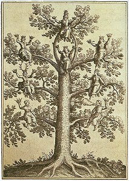

  
[Intangible Textual Heritage](../../index)  [Judaism](../index) 

------------------------------------------------------------------------

[Buy this Book at
Amazon.com](https://www.amazon.com/exec/obidos/ASIN/0766135667/internetsacredte)

------------------------------------------------------------------------

<table width="75%">
<colgroup>
<col style="width: 50%" />
<col style="width: 50%" />
</colgroup>
<tbody>
<tr class="odd">
<td width="50%" data-valign="TOP"> 
The Tree of the Sephiroth, from J.D. Mylius, Anatomia auri [1628] (Public Domain Image)</td>
<td width="50%" data-valign="CENTER"><h1 id="the-cabala" data-align="CENTER">The Cabala</h1>
<h2 id="by-bernhard-pick" data-align="CENTER">by Bernhard Pick</h2>
<h4 id="section" data-align="CENTER">[1913]</h4></td>
</tr>
</tbody>
</table>

------------------------------------------------------------------------

[Contents](#contents)    [Start Reading](cab00)    [Page
Index](pageidx)    [Text \[Zipped\]](cabtxt.zip)

------------------------------------------------------------------------

|                                                                                                                           |
|---------------------------------------------------------------------------------------------------------------------------|
|  |

This is a short monograph on the Kabbalah, written from a purely
academic and somewhat critical point of view. The literature about the
Kabbalah in the public domain in English is very limited. Most of the
key texts and scholarly studies are in Hebrew, German, and other
languages. So this well-crafted review of the literature is a real find.

Pick traces the origins and background of the Kabbalah to Jewish
scholars of mediaeval Spain. He does not attribute any deeper roots to
it historically, nor does he examine the roots of Jewish mysticism
except for a brief mention of the Merkabah. Pick represents the Kabbalah
as a backlash to the rationalism of Maimonides. He also discusses it as
if it were purely of historical interest, ignoring the ongoing and
lively popular interest in this belief system even in his day.

Pick provides a dissenting view to much of the uncritical literature
produced at the turn of the 20th century by more mystically inclined
authors, and as such is worth reading to get a more rounded view of the
subject. If you are looking for an introduction to the subject written
by an advocate of the Kabbalah, it might be better to start with some of
the other books on the subject available at this site. But if you need a
starting point for further academic study, this is a good place to
begin.

------------------------------------------------------------------------

[Title Page](cab00)  
[Contents](cab01)  
[Foreword](cab02)  
[Chapter I. Name and Origin of the Cabala](cab03)  
[Chapter II. The Development of the Cabala in the Pre-Zohar
Period](cab04)  
[Chapter III. The Zohar](cab05)  
[Chapter IV. The Cabala in the Post-Zohar Period](cab06)  
[Chapter V. The Most Important Doctrines of the Cabala](cab07)  
[Chapter VI. The Cabala in Relation to Judaism and
Christianity](cab08)  
[Bibliography](cab09)  
[Index](cab10)  
