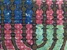

  
[Intangible Textual Heritage](../../index)  [Judaism](../index) 
[Index](index)  [Previous](etm009)  [Next](etm011) 

------------------------------------------------------------------------

[Buy this Book at
Amazon.com](https://www.amazon.com/exec/obidos/ASIN/B0029F21C4/internetsacredte)

------------------------------------------------------------------------

  
*Eighteen Treatises from the Mishna*, by D. A. Sola and M. J. Raphall,
\[1843\], at Intangible Textual Heritage

------------------------------------------------------------------------

p. 12

### CHAPTER IX.

§ 1. He who sees a place wherein wonders were wrought unto Israel, says,
"Blessed be He who wrought wonders unto our ancestors in this place." On
seeing a place from which idolatry has been extirpated, he says,
"Blessed be He who hath extirpated idolatry out of our land."

§ 2. On comets, earthquakes, lightnings, thunder, and tempests, say,
"Blessed be He whose might and omnipotence fill the universe." On seeing
mountains, hills, seas, rivers, and deserts, he says, "Blessed is He who
created the world." R. Jehudah saith, when a man sees the ocean, he is
to say, "Blessed is He who created the great sea;" this blessing he is
to say who sees the ocean at intervals only. On \[genial\] rains and at
the receipt of good news, he says, "Blessed be He who is good and
beneficent." On hearing evil tidings, he says, "Blessed is the true
\[righteous\] judge."

§ 3. He who has built a new house, or bought new furniture, says,
"Blessed is He who has kept us alive," &c. Man is bound to say the
blessing for evil without reference to the good that may accrue from it;
and for good without reference to the evil that may accrue from it. He
who supplicates for that which has already taken place, offers a prayer
in vain. If \[for instance\] a person whose wife is pregnant, prays,
"God grant that my wife bring forth a male child:" or if a person on the
road hears loud lamentations in the town and prays, "God grant that it
may not concern any of my family." Such as these are prayers in vain.

§ 4. Whoever enters a fortified town must say two prayers; one on his
entering, and one on his quitting it. Ben Azai saith four; two on his
entering, and two on his quitting it; viz.—he returns thanks for past
\[mercies\] and prays for \[mercies\] to come.

§ 5. Every man is bound to bless God for evil, as well as he is bound to
thank him for \[the\] good \[he receives from Providence\]; for it is
said, "And thou shalt love the Lord thy God with all thy heart, and all
thy soul, and all thy might." [1](#fn_26) "With
all thy heart" means, with both thy inclinations, the evil as well as
the good. "with all thy soul," means, even should he deprive thee of
life; and "with all thy might" means, with all thy property. According
to another opinion, "with all thy might," signifies with whatever
measure \[or attribute\] he metes out his dispensations unto thee; do

p. 13

thou thank him as much as thy might possibly permits thee. [2](#fn_27) No man is to behave in an irreverent
manner when near the eastern gate \[of the Temple\], for it is in the
direction of the Sanctum Sanctorum. No man is to go on the mountain of
the Temple \[Moriah\] with his stick, his shoes, or with his purse
\[girdle of money\], nor yet with dust-covered feet; nor is he to make
it a thoroughfare \[to lessen the distance\] \[short cut\], much less is
he permitted to spit thereon. All the blessings pronounced in the Temple
concluded with the set form, \[Blessed be the Lord God of Israel\] "from
eternity." But since the Epicureans \[*Atheists*\] perversely taught,
there is but one state of existence, it was directed that men should
close their benedictions with the form \[Blessed be the Lord God of
Israel\] "from eternity to eternity." It was moreover directed that
every man should greet his friend by the name of the Lord, as it is said
"And, behold, Boaz came from Bethlehem, and said unto the reapers, The
Lord be with you: and they answered him, The Lord bless thee;" [3](#fn_28) and it is also said, "The Lord be with
thee, thou mighty man of valour." [4](#fn_29)
Moreover, it is said, "Despise not thy mother, because she is grown
old." [5](#fn_30) And it is also said, "It is
time to be doing for the Lord, they have made void thy law." [6](#fn_31) R. Nathan saith, "They have made void thy
law, because the time is arrived when it becomes necessary to be doing
for the Lord:"

------------------------------------------------------------------------

### Footnotes

[12:1](etm010.htm#fr_26) Deut. vi. 5.

[13:2](etm010.htm#fr_27) In the original, there
is a play upon the words ‏מאד‎, ‏מדה‎, ‏מודד‎, and ‏מודה‎, which cannot
be preserved in any translation.

[13:3](etm010.htm#fr_28) Ruth ii. 4.

[13:4](etm010.htm#fr_29) Judges vi. 12.

[13:5](etm010.htm#fr_30) Prov. xiii. 22.

[13:6](etm010.htm#fr_31) Ps. cxix. 126.

------------------------------------------------------------------------

[Next: Treatises II. Peah to III. Demai \[synopses\]](etm011)
