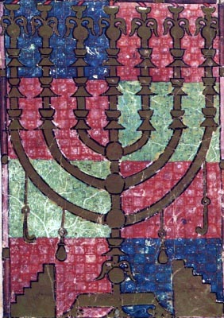

  
[Intangible Textual Heritage](../../index)  [Judaism](../index) 

------------------------------------------------------------------------

[Buy this Book at
Amazon.com](https://www.amazon.com/exec/obidos/ASIN/B0029F21C4/internetsacredte)

------------------------------------------------------------------------

<table width="75%">
<colgroup>
<col style="width: 50%" />
<col style="width: 50%" />
</colgroup>
<tbody>
<tr class="odd">
<td width="50%" data-valign="TOP"></td>
<td width="50%" data-valign="CENTER"><h1 id="eighteen-treatises-from-the-mishna" data-align="CENTER">Eighteen Treatises from the Mishna</h1>
<h2 id="by-d.-a.-sola-and-m.-j.-raphall" data-align="CENTER">by D. A. Sola and M. J. Raphall</h2>
<h4 id="section" data-align="CENTER">[1843]</h4></td>
</tr>
</tbody>
</table>

------------------------------------------------------------------------

[Contents](#contents)    [Start Reading](etm000)    [Page
Index](pageidx)    [Text \[Zipped\]](etm.txt.gz)

------------------------------------------------------------------------

|                                                                                                                           |
|---------------------------------------------------------------------------------------------------------------------------|
|  |

This is one of the earliest substantial English translations of the
Mishna, the core of Jewish law and tradition, and the text at the center
of the Talmud. This abridgement consists of translations of eighteen out
(of about sixty) treatises which make up the Mishna, with synopses of
the rest. The selection includes a few treatises for which we don't have
prior public domain translations of, for instance, Yebamoth (marriage
customs), Gittin (divorce), Chulin (preparing animals for food), and
Yadaim (hands). In any case, this goes a long way towards filling in
some of the gaps in the available public domain translations of the
Mishna and Talmud.

PRODUCTION NOTES: This etext uses Unicode Hebrew extensively, and in
order to view these files, you will need to ensure that your browser is
set up to view Unicode. (refer to [the Unicode help
file](../../unicode))--J. B. Hare, January 12th,
2009.

------------------------------------------------------------------------

 [Title Page](etm000)  
[Preface](etm001)  

### I. Treatise Berachoth

[Chapter I](etm002)  
[Chapter II](etm003)  
[Chapter III](etm004)  
[Chapter IV](etm005)  
[Chapter V](etm006)  
[Chapter VI](etm007)  
[Chapter VII](etm008)  
[Chapter VIII](etm009)  
[Chapter IX](etm010)  

 

[Treatises II. Peah to III. Demai \[synopses\]](etm011)  

### IV. Treatise Kilaim

[Chapter I](etm012)  
[Chapter II](etm013)  
[Chapter III](etm014)  
[Chapter IV](etm015)  
[Chapter V](etm016)  
[Chapter VI](etm017)  
[Chapter VII](etm018)  
[Chapter VIII](etm019)  
[Chapter IX](etm020)  

 

[Treatises V. Shebiith to XI. Bikoorim \[synopses\]](etm021)  

### XII. Treatise Sabbath

[Introduction](etm022)  
[Chapter I](etm023)  
[Chapter II](etm024)  
[Chapter III](etm025)  
[Chapter IV](etm026)  
[Chapter V](etm027)  
[Chapter VI](etm028)  
[Chapter VII](etm029)  
[Chapter VIII](etm030)  
[Chapter IX](etm031)  
[Chapter X](etm032)  
[Chapter IX](etm033)  
[Chapter XII](etm034)  
[Chapter XIII](etm035)  
[Chapter XIV](etm036)  
[Chapter XV](etm037)  
[Chapter XVI](etm038)  
[Chapter XVII](etm039)  
[Chapter XVIII](etm040)  
[Chapter XIX](etm041)  
[Chapter XX](etm042)  
[Chapter XXI](etm043)  
[Chapter XXII](etm044)  
[Chapter XXIII](etm045)  
[Chapter XXIV](etm046)  

### XIII. Treatise Erubin

[Introduction](etm047)  
[Chapter I](etm048)  
[Chapter II](etm049)  
[Chapter III](etm050)  
[Chapter IV](etm051)  
[Chapter V](etm052)  
[Chapter VI](etm053)  
[Chapter VII](etm054)  
[Chapter VIII](etm055)  
[Chapter IX](etm056)  
[Chapter X](etm057)  

### XIV. Treatise Pesachim

[Introduction](etm058)  
[Chapter I](etm059)  
[Chapter II](etm060)  
[Chapter III](etm061)  
[Chapter IV](etm062)  
[Chapter V](etm063)  
[Chapter VI](etm064)  
[Chapter VII](etm065)  
[Chapter VIII](etm066)  
[Chapter IX](etm067)  
[Chapter X](etm068)  

 

[Treatise XV. Shekalim \[synopsis\]](etm069)  

### XVI. Treatise Yomah

[Introduction](etm070)  
[Chapter VIII](etm071)  

### XVII. Treatise Succah

[Introduction](etm072)  
[Chapter I](etm073)  
[Chapter II](etm074)  
[Chapter III](etm075)  
[Chapter IV](etm076)  
[Chapter V](etm077)  

### XVIII. Treatise Yom Tob

[Introduction](etm078)  
[Chapter I](etm079)  
[Chapter II](etm080)  
[Chapter III](etm081)  
[Chapter IV](etm082)  
[Chapter V](etm083)  

### XIX. Treatise Rosh Hashanah

[Introduction](etm084)  
[Chapter I](etm085)  
[Chapter II](etm086)  
[Chapter III](etm087)  
[Chapter IV](etm088)  

### XX. Treatise Taanith

[Introduction](etm089)  
[Chapter I](etm090)  
[Chapter II](etm091)  
[Chapter III](etm092)  
[Chapter IV](etm093)  

### XXI. Treatise Meguillah

[Introduction](etm094)  
[Chapter I](etm095)  
[Chapter II](etm096)  
[Chapter III](etm097)  
[Chapter IV](etm098)  

### XXII. Treatise Moed Katan

[Introduction](etm099)  
[Chapter I](etm100)  
[Chapter II](etm101)  
[Chapter III](etm102)  

 

[Treatise Hagigah \[synopsis\]](etm103)  

### XXIII. Treatise Yebamoth

[Introduction](etm104)  
[Chapter I](etm105)  
[Chapter II](etm106)  
[Chapter III](etm107)  
[Chapter IV](etm108)  
[Chapter V](etm109)  
[Chapter VII](etm110)  
[Chapter IX](etm111)  
[Chapter X](etm112)  
[Chapter XI](etm113)  
[Chapter XII](etm114)  
[Chapter XIII](etm115)  
[Chapter XIV](etm116)  
[Chapter XV](etm117)  
[Chapter XVI](etm118)  

### XXIV. Treatise Ketuboth

[Introduction](etm119)  
[Chapter I](etm120)  
[Chapter II](etm121)  
[Chapter III](etm122)  
[Chapter IV](etm123)  
[Chapter V](etm124)  
[Chapter VI](etm125)  
[Chapter VII](etm126)  
[Chapter VIII](etm127)  
[Chapter IX](etm128)  
[Chapter X](etm129)  
[Chapter XI](etm130)  
[Chapter XII](etm131)  
[Chapter XIII](etm132)  

 

[Treatises XXV. Nedarim to XXVII. Sootah \[synopses\]](etm133)  

### XXVIII. Treatise Gittin

[Introduction](etm134)  
[Chapter I](etm135)  
[Chapter II](etm136)  
[Chapter III](etm137)  
[Chapter IV](etm138)  
[Chapter V](etm139)  
[Chapter VI](etm140)  
[Chapter VII](etm141)  
[Chapter VIII](etm142)  
[Chapter IX](etm143)  

### XXIX. Treatise Kedushin

[Introduction](etm144)  
[Chapter I](etm145)  
[Chapter II](etm146)  
[Chapter III](etm147)  
[Chapter IV](etm148)  

 

[Treatises XXX. Babah Kaman to XLI. Minchoth (synopses)](etm149)  

### XLII. Treatise Cholin

[Introduction](etm150)  
[Chapter I](etm151)  
[Chapter II](etm152)  
[Chapter III](etm153)  
[Chapter IV](etm154)  
[Chapter V](etm155)  
[Chapter VI](etm156)  
[Chapter VII](etm157)  
[Chapter VIII](etm158)  
[Chapter IX](etm159)  
[Chapter X](etm160)  
[Chapter XI](etm161)  
[Chapter XII](etm162)  

 

[Treatises XLIII. Bechoroth to LX. Tebul Yom (synopses)](etm163)  

### LXI. Treatise Yadaim

[Introduction](etm164)  
[Chapter I](etm165)  
[Chapter II](etm166)  
[Chapter III](etm167)  
[Chapter IV](etm168)  

 

[LXII. Treatise Ookezin (synopsis)](etm169)  
