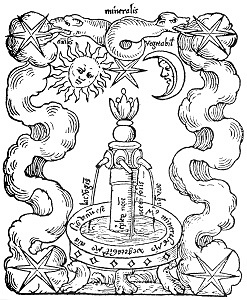

  
[Intangible Textual Heritage](../../index)  [Judaism](../index) 

------------------------------------------------------------------------

<table width="75%">
<colgroup>
<col style="width: 50%" />
<col style="width: 50%" />
</colgroup>
<tbody>
<tr class="odd">
<td width="50%" data-valign="TOP"></td>
<td width="50%" data-valign="CENTER"><h1 id="the-fountain-of-life" data-align="CENTER">The Fountain of Life</h1>
<h2 id="fons-vitae" data-align="CENTER">(Fons Vitae)</h2>
<h2 id="by-solomon-ibn-gabirol" data-align="CENTER">by Solomon Ibn Gabirol</h2>
<h2 id="tr.-by-harry-e.-wedeck" data-align="CENTER">tr. by Harry E. Wedeck</h2>
<h4 id="section" data-align="CENTER">[1962]</h4></td>
</tr>
</tbody>
</table>

------------------------------------------------------------------------

[Contents](#contents)    [Start Reading](fons00)    [Text](fons.txt)

------------------------------------------------------------------------

Solomon ibn Gabirol, also known as Avicebron, was a Spanish-Jewish poet
and philosopher of the eleventh century. This is a translation of a key
extract from his major philosophical work, the Fons Vitae, or Fountain
of Life. In this text, Gabirol uses a Socratic dialog as a framework to
discuss his theory of the 'First Cause.' Written in Arabic, the Fons was
translated into Latin in the 12th century, The work was attributed to
'Avicebron,' who was not identified as Jewish but as Christian or
possibly Muslim. One reason is that Gabirol does not reference the
Tanakh or Talmud, as would be normal for a Jewish intellectual from this
time and place. In addition, his neo-Platonic views seem to place him in
a more Christian intellectual current. However, in 1846, a scholar named
Solomon Munk announced that he had discovered that Avicebron was the
same person as Gabirol.

A volume of [Gabirol's poetry](../sig/index) is also available at this
site.

Production Notes: for technical reasons this text has been broken down
into files at arbitrary positions. These section breaks are not in the
original book.

------------------------------------------------------------------------

 [Title Page](fons00)  
[Introduction](fons01)  

### Demonstration of Simple Substances

[Part I](fons02)  
[Part II](fons03)  
[Part III](fons04)  
[Part IV](fons05)  
[Part V](fons06)  
[Part VI](fons07)  
[Part VII](fons08)  
[Bibliography](fons09)  
