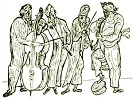

  
[Intangible Textual Heritage](../../index)  [Judaism](../index) 
[Index](index)  [Previous](gm17)  [Next](gm19) 

------------------------------------------------------------------------

  
*The Golden Mountain*, by Meyer Levin, \[1932\], at Intangible Textual
Heritage

------------------------------------------------------------------------

p. 113

### RABBI ISRAEL'S DAUGHTER

The Baal Shem's daughter Udel was a grown
girl. She said to him, "Father, when shall I know my husband?" Rabbi
Israel loved his daughter; he stroked her hair. She said, "Father, shall
I be a mother of children?"

Rabbi Israel told her, "Your husband is hidden among the scholars who
come here to me. You must wait until a sign points him out to you."

 

On Simchas Torah, the feast of the Law, there was joyous dancing in the
house of the Baal Shem Tov.

The students danced, and Israel danced with them, they danced with
wildest ecstasy for love of the holy Torah. And in the midst of their
mad whirling, one

of the students lost his shoe. It flew right off his foot. Then he sang
out a popular verse:

"A maiden will put  
The shoe on my foot,  
A mother will rock  
The babe in her cradle!"

Just then Rabbi Israel cried to his daughter, "Udel!"

Then the girl became so confused she didn't know where to find the
student's slipper. So she sat down and took off both of her own slippers
and gave them to the young man.

And she married that man. And from their union two sons and a daughter
were born. One son grew up to be the Tsadik of Sadilikov, and the other
was Rabbi Baruch of Medzibuz. The daughter was named Feige.

------------------------------------------------------------------------

[Next: Prayer](gm19)
