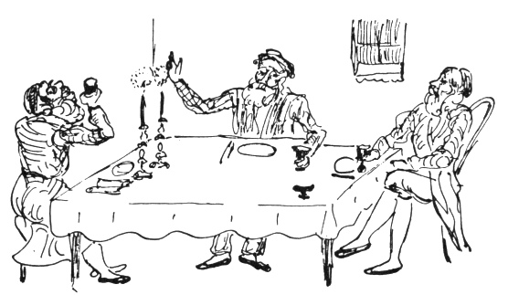

  
[Intangible Textual Heritage](../../index)  [Judaism](../index) 
[Index](index)  [Previous](gm37)  [Next](gm39) 

------------------------------------------------------------------------

  
*The Golden Mountain*, by Meyer Levin, \[1932\], at Intangible Textual
Heritage

------------------------------------------------------------------------

p. 266

### THE SAGE AND THE SIMPLETON

##### WHO WAS NOT SO FOOLISH AS HE SEEMED

In a hamlet in the provinces there lived
two wealthy men, each of whom had a son. One of the children was so
clever that he could make the sun believe it shone at night; the other
boy was a simpleton, he was no fool, but he had only a little common
sense, and could talk only of plain things as they were. Even though
they were of such different natures, the children liked each other, and
were fast friends.

Misfortune overtook the two wealthy men, and they began to lose their
money; with each loss they became more desperate in their commerce,
trying to win back what they had lost, until they had nothing left at
all except the houses in which they lived.

Then the fathers said to the boys, "You will have to find a way to earn
a living."

So the simpleton went and became a shoe-maker's apprentice, and learned
how to make shoes.

But the clever boy would not set himself to so humble a task. "I'll look
around the world a bit," he thought, "and see what I can do." He went to
the market-place; and just then a handsome carriage drawn by four swift
narrow-headed horses whirled into the square and halted. Two merchants
got out of the carriage to refresh themselves at the inn. The clever boy
at once went up to them and asked, "Where are you going?"

"To Warsaw," they told him.

"Take me with you, I'll be your servant on the road," he said.

p. 267

The merchants saw that he was a clever and eager boy, so they took him
to be their servant.

But when they had come to Warsaw he thought, "I'll look around; perhaps
I can find some better thing to do." He went to the market-place and
began to talk with a young man who stood near a stall. First, the clever
boy asked about the merchants who had brought him to Warsaw.

"Oh, they are good honest people," the young man said, "but their trade
keeps them always on the roads."

The clever young man thought he would rather stay in one place and learn
a craft, so he went to his masters and said he could serve them no
longer.

In the market-place he had noticed the elegant caps and fine curved
shoes of the silk merchants, and he thought, "I would like to be one of
them." So he went to a silk merchants' shop and asked if a helper was
needed.

He began to work there, but it was the custom for a beginner to work as
an under-helper, and the under-helpers had to do hard work, carrying
heavy bolts of cloth in their arms and on their backs through the
streets all day, and sometimes up many flights of stairs. This was not
to his taste.

And though his cleverness and quickness of mind had already been
observed by his masters, and they were eager to have him remain with
them, he thought: "What future is there for me here? I may earn a
living, and marry. There is plenty of time for that. First, I'll see if
there is a better place for me in the world." So he became a servant to
some merchants who were going to London. And from London he went to
Paris,

p. 268

and he went to Germany, and Spain. Thus he travelled about for several
years, until he was no longer a youth, but a grown man, much wiser and
cleverer than ever before.

He thought, "It's time I learned a craft, and settled down." Of all the
crafts he had seen, the work of a goldsmith pleased him most, for it
dealt in riches, and required great skill.

So he went to Italy, and became a goldsmith. As he was quick to learn,
he did not have to remain an apprentice for several years, but became a
master goldsmith in three months; and then he became so clever at
spinning slender threads of gold into mysterious and intricate patterns,
into images of birds whose every feather might be counted, and of trees
whose every leaf might be seen, that he was soon famous as a greater
artisan than the master who had taught him, and at last he was master of
all the masters of his craft. But still he was not content.

"Today there is a fashion for delicate ornaments of gold," he thought,
"but tomorrow the fashion may change, and there will be no work for the
goldsmith." So he went to Amsterdam, and learned the craft of cutting
and setting jewels. This, too, he was able to do in a few months; he
became a master jeweller. But still he was not content.

"I will learn a craft that cannot pass from fashion," he thought. "I
will learn to do something that is always needed, and that will employ
the wisdom of my mind as well as the cunning of my eyes and hands." So
he went to Paris, studied medicine, and became a physician.

In a short time he had become a skilful physician

p. 269

and a learned philosopher; then all the world seemed stale to him, and
everything in the world seemed but a trifle; he could do anything, and
nothing seemed worth doing; he could have anything, and nothing seemed
worth having.

Of all the people whom he met, none were clever enough to talk with him,
for beside his skill, and his mastery of so many crafts, and his
philosophy, and his knowledge of medicine, he found all other men
simple. Then he became weary of going about in the world, and he
thought, "I will marry, and live quietly in my own house."

When he had decided to take a wife, he sought in all the courts of
brilliance, but could find no woman who pleased him, for all their talk
seemed foolish, and he was tired of listening.

Then one day a new plan came into his mind. "I will return to the town
of my birth," he thought. "They will see what a great man I have become
though I left the village as a poor boy. And there, among them, I will
live in honour and in peace."

 

Meanwhile the simpleton had become a cobbler. And since he was a
simpleton, he had to remain an apprentice for many years, and even then
he never quite learned how to make shoes; but he set himself up as a
cobbler, and took a wife. It was very difficult for him to earn his
scant living, for he was not a quick or clever workman. He had to labour
so long over each shoe that there was scarcely time for him to eat; but
when he had pushed the needle into the leather, and pulled through the
thread, he would seize a bit of bread, and eat. Nevertheless he was a
cheerful person,

p. 270

always merry, and though he was poor he behaved as though he had every
good thing in the world to eat, and the best of wines to drink, and the
costliest of garments to wear.

As he pulled through his thread he would sing out, "My wife, let us have
dinner! Bring in the lentil soup!" She would give him a piece of dry
bread, and he would eat it and say, "Ah! The soup tastes wonderful
today! Now let's have the roast goose!" His wife would give him another
crust of bread, and he would eat it, and smack his lips and cry, "What a
marvellous goose! What a wonderful cook you are, my beloved! Now give me
my mug of beer!" She would give him a glass of water, and he would drain
it down at a gulp, and wipe his lips with his hand, and his eyes would
dance, and he would say, "Now let us have cakes and wine!" So she would
give him another bit of dry bread and another glass of water, and he
would drink the water as though it were wine out of the king's cellar.
The truth was, that the simpleton really tasted fine lentil soup, and
fish broiled in fat, and roast goose, and all manner of cakes and fruit
in the dry bread that was given him; and the water he drank was like
beer and brandy and wine to his lips.

And so it was with his clothes. He and his wife had but one cloak for
both of them: a ragged, bedraggled old sheepskin. When he had to go to
market he would sing out, "Sweet wife, give me my fur overcoat." Then
she would give him the old sheepskin, and he would put it on his back,
and turn one way and the other saying, "What a marvellous fur coat! The
rich will die of envy!" And so he would go to

p. 271

the market. If he had to go among fine folk, as to a funeral, he would
say, "Dear wife, bring me my frock coat!" Then she would hand him the
ragged cloak, and he would put it on, and cluck his tongue and say,
"What an elegant frock coat!" And off he would go to the fashionable
funeral. And when he had to wear a long coat to the synagogue, he would
ask for his fine long coat, and she would bring him the sheepskin cloak,
and he would put it on, and marvel at its length and beauty.

He was always lively and cheerful over his work, and whenever he had at
last clumsily managed to finish a shoe, he would hold it up and gaze
upon it, and shower praise upon it; even if the toe were where the heel
should be, he would cry out, "What a wonderful work of art! What a
beautiful shoe! A sweet shoe! A perfect shoe! A marvel of a shoe! See,
wife, what a piece of craft it is! What a jewel of a little shoe it is!"

Then she would say, "If your shoes are so wonderful, how is it that the
other cobblers receive three gulden for a pair of shoes, while you get
only a gulden and a half?"

"What have I to do with them?" he would retort. "That's their business,
and this is my business. Let us better find out how much profit I have
made on this shoe!" Then he would say, "Leather cost me so much, and
thread so much, and nails so much and so much," and he would add on his
fingers, and cry, "Why, I've earned ten pence profit on this shoe!" And
he was happy and content, though everyone made a joke of him.

The townspeople would come into his shop just to

p. 272

make fun of him; they would tell him all sorts of tales, for he was
ready to believe anything. When they began to tell him something he
would say, "But—no fooling?" And they would answer solemnly, "No
fooling." Then he would listen and believe, even if they told him that a
fence-post had given forth milk.

And in the end, if he saw that they had indeed made fun of him, he would
say, "Well, everyone knows I am a simpleton. What good does it do you to
prove yourself cleverer than I am? I'm so great a fool that you might be
much wiser than I am, and still be fool enough."

Then one day they came to him and said, "Do you know, your clever friend
is coming home!"

The simpleton cried, "Really? No fooling?" And when they said, "No
fooling!" he called to his wife, "Bring me my finest fur coat!" She
brought him the old cloak, and he put it on, and ran out on the road to
meet the friend of his youth.

The celebrated physician was indeed coming along the road in a great
carriage, and when he saw the simpleton running toward him, the ragged
cloak streaming in the wind, he thought, "The man surely is mad." But
the simpleton greeted the sage with joy, crying, "Praised be God for
bringing you home, and letting me live to see you once more! Beloved
brother!" Then the philosopher, to whom all mankind was as dust, and all
the world as offal, was indeed touched by the friendliness of the
simpleton, and he took him up in his carriage and rode into the town
with him.

During the years of his absence, the wise man's father had died, and his
house had fallen to pieces

p. 273

for lack of care, so that now the philosopher had no home. He went to
the best hostelry in the village, but it was scarcely good enough for
him, and he was troubled by the noise of many people, and the food did
not please him, and he lived in constant torment. His simple friend came
to him every day asking if there were not some comfort he could bring
him. And when the cobbler heard his friend complain so much of his
quarters, he said, "Come to my house! I will give you the best room, and
my wife will take care of your comfort, and you will be able to live as
you choose."

The philosopher thought, "Perhaps it will be well." And he said he would
go.

Then the simpleton ran home and called his wife, and they cleaned the
best room in the house, and put all of their furniture into it, and
spent their last copper so that the room might be as fine as they could
manage. And the philosopher came to live there.

Meanwhile his fame had begun to spread through the kingdom; it was said
that he was a marvellous goldsmith, and unequalled as a cutter of
precious stones, and that his skill as a physician was miraculous. And
people began to come to him, to test his skill.

A neighbouring baron brought gold and asked him to make a gold ring. The
sage set to work and wove a delicate ring of the precious metal, carving
upon it a beautiful orange tree, with every twig and leaf, and each ripe
fruit outlined. He looked upon his finished work and was proud, for he
knew that even in Italy this ring would be acknowledged a masterpiece of

p. 274

the goldsmith's craft. But the baron came, and took the ring, and was
angry because it was so thin and delicate and covered with many
scratches! For the baron was a boorish fellow who could not understand
the beauty of the work, and desired only that the ring be thick with
gold. Then the philosopher was hurt at heart, that his labour should
come to such an end.

Again, a nobleman came to the philosopher with a precious oriental
stone, upon which an image was engraved. And the nobleman brought a
second stone and asked that the philosopher copy the image upon it. The
sage set to work, and copied the image so perfectly that no man could
tell which was the first, and which the second stone. But the
philosopher himself knew that once his hand had slipped less than a
hair's breadth, and there was a jot of difference between one jewel and
the other. And though the nobleman was greatly pleased with what he had
done, the sage had only pain and heartache from his skill, because he
knew that he had erred.

And from his skill as a physician, too, he had only pain and heartache.
For many sick people came to him, and among them was a man near death.
The physician gave him a medicine that he knew was proper for his
disease, but the man was so far gone in weakness that he died. And then
the people all cried out that it was the physician's potion that had
killed him!

And when he came to another sick man and cured him, it was said that the
man would have become well in the natural course of things.

So from all of his skill and knowledge, the sage reaped only trouble and
anguish. Thus, when he desired

p. 275

a new coat, he called the ablest tailor in the town, and took great
pains to teach the man how to make a coat according to the latest
fashion; and the tailor at last understood, and made a fashionable
jacket, except that he sewed one sleeve somewhat crookedly, and though
there was no one in all that region who was enough of a judge of fashion
to see that the sleeve was crooked, the philosopher was tortured with
shame, for he knew that if he were to appear in that coat in the streets
of a Spanish city, the people would at once detect the crooked sleeve,
and laugh behind his back.

So the wise man was always troubled and unhappy. The simpleton would
come to him laughingly and say, "Why is it that you are always so sad?
Here I am a fool, and I have nothing, yet I am cheerful and find joy in
life; and you are so wise and so rich, and so unhappy! If God would only
let us change places so that I would be the sage, and you the simpleton,
then you might be happy, too!"

The philosopher thought that the simpleton was surely mad, and he said,
"A wise man might easily fall sick and lose his mind and become a
simpleton, but it would be impossible for a fool to become a sage."

The simpleton answered, "Everything is possible to God, he can do
anything. In the twinkling of an eye, he might make me wiser than you!"
And he laughed, and the philosopher laughed at the words of his mad
foolish friend.

 

The fame of their friendship had spread far and wide. For though there
are many fools and many wise

p. 276

men in the world, it is a strange thing for a fool and a wise man to be
fast friends through childhood and into manhood. It became known
everywhere that in a certain house in a certain town a fool and a
philosopher lived together. And even their names were changed, and one
was named Fool and the other Philosopher; and so their names were
written in the books of the nation: Mr. Fool, and Mr. Philosopher.

One day the king looked through the books, and he came upon those two
names together, and he laughed. Then he was curious to see the two men
called Fool and Philosopher. But he thought, "If I send suddenly for
them to appear at court, the Philosopher may be so frightened that he
won't know what to answer, and the Fool may go mad with fear. I'll send
a sage to the philosopher, and a simpleton to the fool."

There are plenty of sages in a king's court, but where was he to find a
fool to send as messenger to the fool? It happened, however, that the
king had appointed a simpleton to be his treasurer, for he knew that if
a clever man were made treasurer he might steal the money that was in
his charge, while a simpleton would be foolish enough to be honest. So
the king gave the treasurer letters to take to Mr. Fool. And he also
gave letters to one of his sages, to take to Mr. Philosopher.

The two messengers took the letters and went on their way. They stopped
to see the governor of the province where the strange pair lived, and
from the governor they received more letters to the fool and
philosopher, explaining that the king's message was not a command, but
an invitation, and that they

p. 277

might go before the king or stay at home, as they wished, for the king
did not wish to frighten them. The messengers told the governor of the
great wisdom and riches of the philosopher, and they spoke of the fool
who ran about in his ragged cloak, believing it was a fur coat, and a
frock coat, and all kinds of coats in one.

The governor said, "If he is so poor, it will not look well for him to
come to the king's court." And he took handsome garments and placed them
in the carriage of the fool's messenger, for the fool.

When the king's foolish treasurer came to Mr. Fool with the king's
letter, the fool said at once, "But you know I can't read! Read it for
me!"

"I don't have to read it," the messenger replied. "I can tell you what
is in it."

"Then what does it say?"

"It says that the king wants you to come to visit him."

The fool looked at the fool and said, "No fooling?" And the fool
answered, "No fooling." At once Mr. Fool bubbled over with joy, and ran
to his wife, calling, "My sweet wife, the king has sent for me!"

"What for?" she asked. But he had no time to answer her. He even forgot
to ask for his "gold embroidered cloak," but rushed straight into the
messenger's carriage, and they started for the court of the king.

As he sat in the carriage the simpleton saw the costly garments that the
governor had placed there for him, so he put them on, and as he rode in
the king's carriage, clothed in princely garments, his joy streamed up
to the very heavens.

p. 278

In the meantime the king had received news that the governor of that
province was dishonest and a traitor, so the king decided to remove him
from office at once. He had to choose another governor, and thought, "I
must not choose a clever man, for this man was clever, and see what
trouble he has brought upon me. It does not take much wisdom to make a
good governor, only a good heart, and the will to be just. Any fool can
be a governor." And so he decided that since he had a fool for a
treasurer, who fulfilled his duties well and gave no trouble at all, he
would have another fool for a governor.

And he sent out a decree that the simpleton who was on his way to the
palace should be stopped when he came to the gates of the governor's
city, and be made governor there.

So it was that when the carriage with the two fools came up to the gates
of the governor's city, there were people standing on the walls, and
there were banners hanging in the streets, and the path of the carriage
was strewn with blossoms. The elders of the city came out to meet the
carriage, and they brought a great golden key so heavy that six men
bowed beneath its weight. They presented the key of the city to the
simple cobbler and said, "Hail to our new governor!"

He looked at them, and smiled, and asked, "But, no fooling?"

"No fooling!" they answered. So with great delight he went to the palace
and became governor.

It is said that good fortune makes men wise; then it was revealed that
he had enough wisdom to govern, for he ruled with simple honesty, and
trusted in the

p. 279

judgement of his heart between what was true and what was false. Soon he
became famous throughout the kingdom as the wisest and best of
governors. Each day the king heard tales of the marvellous judgement of
the cobbler who ruled in the provinces. Then the king sent for him to
come and visit the great palace; and when the fool came to the palace,
the king received him with honour, and sat down to converse with him.
They talked of the ways of government, and the king was greatly pleased
with the simple wisdom of the fool. "Tell me," the king asked, "how
would you judge between two men who came before you, if each of them
declared that he owned the same horse?"

"One of them would be lying," said the fool.

"And how would you find out which one was telling the truth?

"When I was a cobbler," said the governor, "everyone knew what a great
fool I was, and they would come and tell me all sorts of tales, because
I believed whatever they told me. But they told so many lies, that it
soon became easy for me to know when a man was lying, and when he spoke
the truth. All I had to do was to ask them, 'No fooling?' and they would
tell me."

The king was so delighted with the governor that he made him his prime
minister, and ordered that a palace be built for him next to the royal
palace. It was second in grandeur and beauty only to the palace of the
king; and there the cobbler lived.

But when the king's wise messenger came to the philosopher with the
king's message, the philosopher

p. 280

was not as quick as the fool to obey. "Remain here overnight," the
philosopher said to the messenger, "while we think about what is written
in the letter."

That evening he made a feast for his guest, and as they sat over their
dinner he thought, "Who am I that the king should send for me? I am only
a little man in a little town, and he is a great king over a vast
domain, what need has he of me? True, I am wise, but his court is filled
with wise men, and he is himself a sage. It cannot be true that the king
has sent for me."

Then he said to the messenger, "Tell me, did you receive this letter
from the hands of the king himself?"

The messenger said, "No. The letter was given to me by a servant of the
king."

Then the philosopher smiled wisely, and asked further, "Tell me, do you
often see the king, face to face?"

The messenger answered, "You cannot be familiar with the customs of the
palace, or you would know that the king is rarely seen face to face. And
when he does appear before the public, he wears ceremonial robes so
elaborate that one can hardly see the king."

"Then," said the philosopher, "have you ever seen the king at all?"

The messenger reflected, and answered, "No, now that you ask, I don't
think I have ever really seen the king."

The philosopher arose. "It is as I thought," he said. "There is no
king."

But the other wise man laughed and asked, "In that case, who rules the
kingdom?"

p. 281

"I knew you would ask me that question," said the philosopher, "and I
can answer you, for I have travelled all over the world and seen many
things. There is no king in all the world. In Italy, for example, I saw
that the kingdom was ruled by seventy lords who came together and
governed as they pleased, and sometimes a new baron would gather an army
and overthrow an old lord, then the upstart would be among the seventy
governors. And so it is among us. There are powerful men who govern this
kingdom, but they hide themselves behind the pretence that we are
governed by a king."

The messenger became very thoughtful, and began to believe in the words
of the philosopher.

"Tomorrow morning," said the philosopher, "I will prove to you that what
I have said is true."

And in the morning the sage said to his guest, "If you will come to the
market-place with me, I shall show you how all the world is in error,
obeying a king who does not exist."

So they went out, and they came to a soldier who stood on guard at the
gate.

"Whom do you serve?" asked the philosopher.

"The king!" the soldier said.

"In all your life, have you ever seen the king?" asked the philosopher.

"Why, no," the soldier said.

Then the philosopher smiled, and whispered to his companion, "See what a
fool he is!"

They went further, and met an officer, and they began to talk with him,
and then the sage asked him, "Whom do you serve?"

The officer answered, "I serve the king!"

p. 282

"And have you ever seen him?"

"Why, no," the officer said.

Now the clever messenger was convinced that the philosopher was right.
"The whole world is in error!" the messenger cried. "There is no king!
Come, let us go out over the world, and show the people how they are
mistaken."

So they purchased horses, and set out upon the roads. Wherever they went
they asked the people whom they served, and everyone answered, "The
king!" The two wise men laughed more and more each day, and told each
other that all the world was in error, and that only they two knew the
truth: that there really was no king!

And so they travelled until their money was spent; then they sold one of
their horses, and then their other horse; they sold their costly
garments, and when they had sold everything they owned that was of
worth, they became beggars. Still they wandered up and down the roads,
begging for scraps of bread and for copper coins, while they whispered
to each other, "See how these fools are in error! They believe there is
a king!"

It so happened that in their wandering they came to that great city
where the cobbler, who was now prime minister, lived in his palace. And
in that city there was a holy man, a true wonder-worker who had the
power of healing the sick, for he was a Baal Shem, which means a master
of the Holy Name.

When the two wise men passed the house of the wonder-worker, they saw
many wagons standing in the courtyard, and they saw sick people being
carried into the house. Then the philosopher thought that

p. 283

this must be the house of a physician; and since he had himself once
been a celebrated physician, he thought, "I will go in and speak with
him." So he asked of the people near the house, "Who lives here?"

"It is the house of a Baal Shem," they told him.

Then he broke out into laughter. "Brother," he said to his companion,
"these people are even greater fools than we found in the rest of the
world, for they believe that a Baal Shem has the power to heal them! But
I, who am a physician, know better!"

Their long walk that day had made the two sages hungry, and as they
still had a few pence that they had begged, they went to the public
kitchen where food can be bought even for a few pence, and they sat down
to eat while they talked of the folly of the people who believed in the
Baal Shem.

The keeper of the kitchen heard them talking, and became enraged, for
the Baal Shem was a very holy man in that city. So the keeper said to
them, "Eat what you have bought, and begone, for you cannot talk here
against the Baal Shem!"

"You are a fool to believe in this Baal Shem," said the philosopher,
"for he is only an imposter who gets gold from the people by mumbling
words over their heads!"

At this the cook became terribly angry, and shouted to them to be still.
But they would not be still. Just then more people came into the
kitchen, and among them was a son of the Baal Shem, and they heard what
the philosopher was saying. The cook could contain his anger no more,
and he seized a great iron ladle and rushed upon the two wise men; he
swung

p. 284

the iron over their heads and shoulders, beating them until their blood
ran, and they rushed from the kitchen, howling with pain.

Then the philosopher cried, "We will seek justice against him for this
beating!" And they went to complain before a magistrate.

"Why were you beaten?" he asked.

"Because we told them the truth about the Baal Shem!"

"And what is the truth?" asked the magistrate, who was a gentile.

"That the Baal Shem is an impostor and a thief!" At this, the magistrate
ordered them to be thrown into jail.

But the philosopher said to his companion, "We will yet go before a
higher court, and receive justice!" So they sat in the jail, and waited.
At last their complaints were heard, and they were brought before a
higher court. And again they declared that they sought retribution
against the cook, who had beaten them because they spoke against a
wonder-worker. And again they were thrown into prison. So they
complained to a still higher official; and they went from one court to
another, until at last they came to the highest court of the land, where
they would be heard by the prime minister.

When the prime minister, who was in truth the cobbler, saw the
philosopher brought before him he recognized him at once as the friend
of his youthful days, though he was no longer dressed in fashionable
clothes, but in rags. The sage, however, did not recognize the
simpleton, who was now in the majestic robes of a prime minister.

p. 285

"Don't you know me?" cried the prime minister. "I am the simpleton, the
cobbler, your own faithful friend! See, the king has made me prime
minister!"

"The king?" said the philosopher. And for the moment he forgot the cause
that had brought him to court, and returned to his old folly. "Don't you
know that there is no king?" he demanded.

"What are you saying?" cried the minister.

"Have you ever seen the king?"

"I see him every day with my own eyes," said the simple man.

But the philosopher only laughed, and said, "How do you know he is
really the king? Do you know him from birth? Did you know his father?
Did you know his grandfather, that you are so certain he is the king?
Fool, people have told you: this is the king! and you have believed
them."

Then the simpleton said, "Remember how we once talked together and you
told me that it would be easy for a sage like yourself to lose his wits
and become as foolish as I was; but that I, the fool, could never attain
wisdom like yours? Now see, I have become very wise, but you have not
yet learned to be simple."

Then he ordered splendid garments to be brought for his friend, and they
sat down to dinner together, and the prime minister said, "Now tell me,
what was the complaint that brought you to the court?"

"I came to seek justice," said the philosopher, "for I was beaten in the
public kitchen."

"And why were you beaten?"

"The simpletons believe in a Baal Shem, and I

p. 286

told them that their wonder-worker was nothing but an impostor, who took
their gold."

Just then someone came into the room and said to them, "The devil has
sent for you."

At these words, the simpleton began to tremble with fright; he ran from
the room, and found his wife, and said, "What shall I do? The devil has
sent for me!"

"Don't be frightened," she told him. "We will ask the wonder-worker to
help us."

The Baal Shem came at once and spoke a prayer over the prime minister,
and purified him. Then the prime minister returned to the room, where
the philosopher had remained.

"Why were you so frightened? Why did you run out of the room?" asked the
sage.

"Didn't you hear him say the devil had sent for us?"

At this, the philosopher broke into laughter. "My friend," he said,
"don't you know that there is no devil?"

The simpleton asked, "Then who was it that sent for us?"

"It must have been my companion," said the wise man. "Perhaps he grew
tired of waiting for me so long, and sent a messenger, and told him in
jest to say that the devil had sent him."

"If that is so, then would you go with him?" asked the simpleton.

"Why not?" said the philosopher, laughing.

And just then the messenger returned, and said, "The devil has sent for
you!" This time the prime minister was not afraid, for he felt the power
of the

p. 287

\[paragraph continues\] Baal Shem
protecting him. And the philosopher said, "He is surely come from my
friend." Then turning to the messenger he asked, "What does he look
like, the one who sent you?"

"He has red hair," said the messenger.

"My friend has red hair," said the philosopher, laughing. And he arose.

"Then you are not afraid to go with him?" asked the simpleton.

"Of course not!" cried the sage. "But perhaps it would be well if you
told two soldiers to go with me, because after all it may be that some
enemies of mine have sent this man, thinking to draw me into harm."

So the prime minister commanded two soldiers to follow them, and the
philosopher went out with the strange messenger.

Soon the soldiers returned, and the prime minister asked them what had
become of his friend.

The soldiers replied, "We don't know." Then they told him how the
strange messenger had led them outside the palace, where the philosopher
had met his companion, and in that moment the philosopher, and his
companion, and the strange messenger had disappeared.

The prime minister was worried for the fate of his friend, and he sent
out searching parties to find the two wise men, but no trace of them
could be found.

Then one day as the prime minister was walking in the city he went by
the house of the Baal Shem, and he thought, "I will ask the Baal Shem,
perhaps he can help me find my friend."

So he went into the house and said to the Baal

p. 288

\[paragraph continues\] Shem, "Do you
remember my friend the philosopher who spoke against you?"

"I remember him," said the wonder-worker.

"He has vanished, and I am afraid the devil has taken him," said the
simpleton. "Perhaps you can show me where he is?"

The Baal Shem said, "I can show you, but no one else must know."

Then they two went out of the city. And they came to a place that was
all loathsome slime filled with crawling beasts and worms. As they
approached the filthy pit they heard the screaming and groaning of the
two wise men.

They came to the edge of the morass, and they saw the two sages
struggling in the oozing mud; their heads would sink below the surface,
and again they would lift their mouths out of the filth, and slime would
drip from their eyes, and they would cry, "Save us!"

The simple man said to them, "See where the devil has brought you!"

But the philosopher shouted, "It is our enemies who have thrown us into
this slime, and they come here and beat us, and set scorpions and snakes
in the mud to torture us! There is no devil! Only our enemies among
mankind have done this thing!"

"Do you still hold to your foolish philosophy," said the prime minister,
"and will you not believe in anything at all?"

"How can we believe in a devil, and a Baal Shem, and a king, when there
are no such things on earth!" cried the philosopher, and his mouth was
filled with mud.

p. 289

"Here is the Baal Shem himself," said the prime minister; "and if he can
take you out of this pit, will you believe?"

"We will believe," they said.

Then the Baal Shem uttered the Name that is the Secret of Secrets, and
no one heard, but in that instant the morass dried, and the mud
hardened, and the beasts and snakes were gone, and the two philosophers
found themselves standing clean and safe on dry earth.

 

------------------------------------------------------------------------

[Next: The King's Son and the Servant's Son](gm39)
