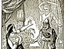

  
[Intangible Textual Heritage](../../index)  [Judaism](../index) 
[Index](index)  [Previous](jftl01)  [Next](jftl03) 

------------------------------------------------------------------------

  
*Jewish Fairy Tales and Legends*, by Aunt Naomi (pseud. Gertrude Landa),
\[1919\], at Intangible Textual Heritage

------------------------------------------------------------------------

p. 13

# CONTENTS

|                                  |                                 |
|----------------------------------|---------------------------------|
|                                  | PAGE |
| THE PALACE OF THE EAGLES         | [15](jftl04.htm#page_15)        |
| THE GIANT OF THE FLOOD           | [27](jftl05.htm#page_27)        |
| THE FAIRY PRINCESS OF ERGETZ     | [35](jftl06.htm#page_35)        |
| THE HIGGLEDY-PIGGLEDY PALACE     | [67](jftl07.htm#page_67)        |
| THE RED SLIPPER                  | [77](jftl08.htm#page_77)        |
| THE STAR CHILD                   | [87](jftl09.htm#page_87)        |
| ABI FRESSAH'S FEAST              | [99](jftl10.htm#page_99)        |
| THE BEGGAR KING                  | [113](jftl11.htm#page_113)      |
| THE QUARREL OF THE CAT AND DOG   | [119](jftl12.htm#page_119)      |
| THE WATER-BABE                   | [127](jftl13.htm#page_127)      |
| SINBAD OF THE TALMUD             | [133](jftl14.htm#page_133)      |
| THE OUTCAST PRINCE               | [151](jftl15.htm#page_151)      |
| THE STORY OF BOSTANAI            | [163](jftl16.htm#page_163)      |
| FROM SHEPHERD-BOY TO KING        | [173](jftl17.htm#page_173)      |
| THE MAGIC PALACE                 | [179](jftl18.htm#page_179)      |
| THE SLEEP OF ONE HUNDRED YEARS   | [187](jftl19.htm#page_187)      |
| KING FOR THREE DAYS              | [195](jftl20.htm#page_195)      |
| THE PALACE IN THE CLOUDS         | [203](jftl21.htm#page_203)      |
| THE POPE'S GAME OF CHESS         | [213](jftl22.htm#page_213)      |
| THE SLAVE'S FORTUNE              | [225](jftl23.htm#page_225)      |
| THE PARADISE IN THE SEA          | [235](jftl24.htm#page_235)      |
| THE RABBI'S BOGEY-MAN            | [243](jftl25.htm#page_243)      |
| THE FAIRY FROG                   | [251](jftl26.htm#page_251)      |
| THE PRINCESS OF THE TOWER        | [259](jftl27.htm#page_259)      |
| KING ALEXANDER'S ADVENTURES      | [277](jftl28.htm#page_277)      |
|      a. THE VISION OF VICTORY    | [277](jftl28.htm#page_277)      |
|      b. THE LAND OF DARKNESS     | [282](jftl28.htm#page_282)      |
|      c. THE WONDERS OF THE WORLD | [288](jftl29.htm#page_288)      |

------------------------------------------------------------------------

[Next: Illustrations](jftl03)
