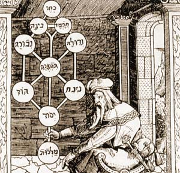

  
[Intangible Textual Heritage](../../index)  [Judaism](../index) 

------------------------------------------------------------------------

[Buy this Book at
Amazon.com](https://www.amazon.com/exec/obidos/ASIN/0812218620/internetsacredte)

------------------------------------------------------------------------

<table width="75%">
<colgroup>
<col style="width: 50%" />
<col style="width: 50%" />
</colgroup>
<tbody>
<tr class="odd">
<td width="50%" data-valign="TOP"> 
Title Page of Portae Lucis, of Joesph Gikatilla [1516] (Public Domain Image)</td>
<td width="50%" data-valign="CENTER"><h1 id="jewish-magic-and-superstition" data-align="CENTER">Jewish Magic and Superstition</h1>
<h2 id="by-joshua-trachtenberg" data-align="CENTER">by Joshua Trachtenberg</h2>
<h4 id="section" data-align="CENTER">[1939]</h4></td>
</tr>
</tbody>
</table>

------------------------------------------------------------------------

[Contents](#contents)    [Start Reading](jms00)    [Page
Index](pageidx)    [Text \[Zipped\]](jmstxt.zip)

------------------------------------------------------------------------

|                                                                                                                           |
|---------------------------------------------------------------------------------------------------------------------------|
|  |

In the background of what has become known as [ceremonial
magic](../../grim/index) is medieval Jewish magic. In turn this was
based on the Kabbalah, the Jewish traditions known as Haggadah, and
other esoteric beliefs. This is a comprehensive review of Jewish magic
from the 10th to the 15th century, including a rich lode of folklore.
Many well-known Jewish traditions are explained, such as why a glass is
broken at a wedding, and how the expression *mazel tov* is related to a
belief in [Astrology](../../astro/index). Trachtenberg deals extensively
with Golems, Succubi, the Lillim, (from Lilith--Adam's first wife), and
other magical creatures, some well known such as werewolves, and others
not so well, such as *estrie*, *mare* and *broxa*. There are detailed
descriptions of talismans, amulets, charms, and other curious magical
objects. There are chapters dealing with dream interpretation, medical
beliefs, necromancy, and other forms of divination. There is also a
short glossary, so if you are having trouble telling the difference
between a Kaddish and a Kiddush, you're in luck.

The author, Joshua Trachtenberg (b. 1904, d. 1959) was a reform rabbi on
the east coast of the US. This is an elaboration of his Columbia
University Ph.D. thesis. Trachtenberg's appreciation of the role of
folk-magic in Jewish culture is important for the study of Judaism, and
also the roots of [modern Pagan](../../pag/index) beliefs and practices.

*Production Notes:* This book contains many quotations in Hebrew. The
shorter passages have been transcribed into [Unicode](../../unicode).
The longer ones are presented in image files.

--J.B. Hare, January 8, 2008.

------------------------------------------------------------------------

 [Title Page](jms00)  
[Table of Contents](jms01)  
[Preface](jms02)  
[1. The Legend of Jewish Sorcery](jms03)  
[2. The Truth Behind The Legend](jms04)  
[3. The Powers of Evil](jms05)  
[4. Man and the Demons](jms06)  
[5. The Spirits of the Dead](jms07)  
[6. The Powers of Good](jms08)  
[7. “In the Name of . . .”](jms09)  
[8. The Bible In Magic](jms10)  
[9. The Magical Procedure](jms11)  
[10. Amulets](jms12)  
[11. The War with the Spirits](jms13)  
[12. Nature and Man](jms14)  
[13. Medicine](jms15)  
[14. Divination](jms16)  
[15. Dreams](jms17)  
[16. Astrology](jms18)  
[Appendix I. The Formation of Magical Names](jms19)  
[Appendix II. Ms. *Sefer Gematriaot*, On Gems](jms20)  
[Abbreviations and Hebrew Titles](jms21)  

### Notes

[Chapter I](jms22)  
[Chapter II](jms23)  
[Chapter III](jms24)  
[Chapter IV](jms25)  
[Chapter V](jms26)  
[Chapter VI](jms27)  
[Chapter VII](jms28)  
[Chapter VIII](jms29)  
[Chapter IX](jms30)  
[Chapter X](jms31)  
[Chapter XI](jms32)  
[Chapter XII](jms33)  
[Chapter XIII](jms34)  
[Chapter XIV](jms35)  
[Chapter XV](jms36)  
[Chapter XVI](jms37)  
[Appendix I](jms38)  

### Bibliography

[A. A Note About The Sources](jms39)  
[B. Hebrew Sources, Printed](jms40)  
[C. Hebrew Sources In Manuscript](jms41)  
[D. Modern Literature](jms42)  

 

[Glossary of Hebrew Terms](jms43)  
[Index](jms44)  
