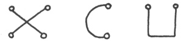
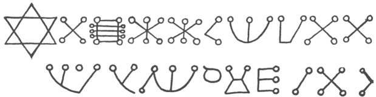
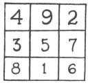
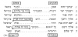
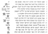
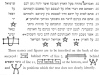

  
[Intangible Textual Heritage](../../index)  [Judaism](../index) 
[Index](index)  [Previous](jms11)  [Next](jms13) 

------------------------------------------------------------------------

[Buy this Book at
Amazon.com](https://www.amazon.com/exec/obidos/ASIN/0812218620/internetsacredte)

------------------------------------------------------------------------

  
*Jewish Magic and Superstition*, by Joshua Trachtenberg, \[1939\], at
Intangible Textual Heritage

------------------------------------------------------------------------

p. 132

### 10

### AMULETS

#### MATERIAL OBJECTS

ONE of the most popular of magical devices was the amulet, worn upon the
person or attached to objects and animals (the Hebrew word for amulet,
*kame‘a*, has the root meaning "to bind") . Even in our supposedly
non-superstitious age the good-luck charm is still quite familiar,
apologetically displayed on watch-chain, or carried furtively in the
recesses of pockets and purses—the rabbit's foot, the horseshoe, lucky
coins, rings engraved with Chinese or Hebrew letters, animal molars. How
much more common, then, are such objects in societies which unashamedly
and openly accept them for what they are, whether in the less
sophisticated regions of our contemporary world, or in the medieval and
ancient worlds, which did not for a moment doubt their efficacy! As a
matter of fact, it has been suggested that all ornaments worn on the
person were originally amulets.

Primitive religions make much of these peculiarly potent objects, and
the Biblical Hebrews were well acquainted with their merits. Their use
was very extensive in the Talmudic period, and, accepted by the rabbinic
authorities, impressed itself strongly upon the habits of later times.
Jewish amulets were of two sorts: written, and objects such as herbs,
foxes’ tails, stones, etc. They were employed to heal or to protect men,
animals, and even inanimate things. We find the same types in use during
the period of the Talmud and in the Middle Ages, though, of course, the
intervening centuries and cultural contacts made for a greater variety.
There was no legal prohibition against the use of such charms. In fact,
the rules which were set up to distinguish proper from improper amulets
lent them a definite degree of acceptance; though some rabbis frowned
upon them, or urged the danger of preparing them, others actually
suggested their use on certain occasions, and the common folk was very

p. 133

much addicted to this particular form of magic. Amulets were the favored
Jewish magical device during the Middle Ages, and the fact that they
were predominantly of the written type, prepared especially for specific
emergencies and particular individuals, enhanced their magical
character.[1](jms31.htm#an_10_1)

The material objects that were employed as amulets because of their
fancied occult power, were no doubt many more in number and variety than
the literature discloses. The Talmud mentions several, and references to
these are frequent in our sources, but it is difficult to determine
whether these remarks reflect a contemporaneous use of the same charms.
In this category were the fox's tail, and the crimson thread which was
hung on the forehead of a horse to protect him against the evil eye. But
a current fable of a too wily fox indicates that the virtues of the
fox's tail, as well as other parts of his body, were known and probably
utilized by medieval Jews. It seems that the fox had invaded a walled
town, and when he was ready to depart found the gates closed. He decided
to play dead in the hope that his carcass would be carted away to the
garbage dump outside the walls. Along came a man who mused, "This fox's
tail will do as a broom for my house, for it will sweep away demons and
evil spirits," and off came the tail. Another man stopped and decided,
"Here! This fox's teeth are just the thing to hang around my baby's
neck," and out came the teeth. When a third passer-by made ready to skin
the poor creature, the game got too strenuous and master Reynard came to
life in a wild dash. The tale has more than one moral, for our purpose.
As to the thread, red is a color regarded everywhere as anti-demonic and
anti-evil eye, and in the Middle Ages we find Jewish children wearing
coral necklaces, just as Christian children did, to protect them against
the malevolent *jettatura*. Herbs and aromatic roots were also mentioned
often as potent amulets. Fennel, for instance, was pressed into service
against hurt of any nature, as this Judeo-German invocation indicates:
"Un’ wer dich treit \[trägt\] unter seinem gewande, der muss sein
behüt’, sein leib un’ sein gemüt, von eisen un’ von stahel, un’ von
stock un’ von stein, un’ vor feuer un’ vor wasser, un’ vor aller
schlimme übel, das da ê \[ehe\] geschaffen wart, sint Adam gemacht wart.
Das sei wahr in Godes namen. Amen." 2

A Talmudic amulet which was widely employed in medieval times—it was
well known to non-Jews also—was the so-called *even tekumah*, the
"preserving stone," which was believed to prevent

p. 134

miscarriage. The Talmud does not tell us just what sort of stone this
was. Several medieval writers were more informative, but unfortunately
they employed one or perhaps several French equivalents whose meanings
in Hebrew transliteration are not altogether clear, but which show that
these were in common use. One writer went into some detail: "This stone
is pierced through the middle, and is round, about as large and heavy as
a medium sized egg, glassy in appearance, and is to be found in the
fields," he explained. The French terms seem to indicate a hollow stone
within which is a smaller one, a sort of rattle (perhaps the eaglestone
or ætites); a later commentator calls it a *Sternschoss*
(meteoroid).[3](jms31.htm#an_10_3)

A man born with a caul was counselled to keep it on his person
throughout his life as a protection against the demons who battle during
a storm. A phallus-shaped stone inscribed with the Hebrew words
"accident of sleep" and the words of Gen. 49:24, "But his bow abode
firm" is to be seen in the Musée Raymond in Toulouse. Its intention is
unmistakable; similar amulets must have been in use in Germany. Toward
the end of the Middle Ages, if not earlier, there arose the custom of
employing a piece of the *Afikomen*, a specially designated cake of
unleavened bread at the Passover *Seder*, as an amulet, hanging it in
the house, or carrying it in a pouch, to protect one against evil
spirits and against evil men. A metal plate inscribed with the letter
*heh* (a sign for the Tetragrammaton), worn about the neck, was no doubt
another such amulet, despite the ritualistic explanation it received;
similar charms are still in use today. In the fifteenth and sixteenth
centuries we find references to charms which, by their nature, and by
virtue of the prominence of German words in the text, seem to have been
borrowed from non-Jews. Among these I may mention the following: To find
favor in people's eyes, carry the right eye or ear of an animal on your
person. To obtain a favorable hearing from a judge, get a straw in which
there are three nodes, and place the middle node under your tongue in
the morning; or else, place henbane (hyoscyamus) seeds, still in their
husks, in your hair above the forehead. A charm that will put an
insomniac to sleep is prepared thus: one must secure a louse from the
head of the patient and induce it to crawl into a bone which has a hole
in it, seal the hole, and hang the imprisoned insect on the patient's
neck. An amulet that gives protection consists of a sprig of fennel over
which an incantation has been recited and which has then been wrapped in
silk, together with some wheat and coins, and

p. 135

then encased in wax. Other amulets, such as rings and medallions of
various sorts, were no doubt similarly employed, for Jews had a
reputation as metal-workers and engravers.[4](jms31.htm#an_10_4)

Objects of this sort were used for more or less esoteric reasons.
Sometimes the reputation for occult virtue outlived the original reason.
Often what was involved was a sympathetic transference of the qualities
and characteristics of the object to the wearer. In the case of the
color red, for instance, it has been suggested that its magical power
derives from its association with the blood of sacrifice, for which it
is a substitute, and therefore it appeases the powers of evil. On the
other hand, parts of an animal convey the special qualities of strength,
or cunning, or courage which distinguish it. The stone within a stone
represents the embryo in the womb; just as the one is securely
imprisoned, so may the other be. This type of sympathetic amulet is well
known and universally employed. Despite the paucity of evidence in our
sources, medieval Jewry must have drawn extensively upon Jewish
tradition and its non-Jewish neighbors for a multitude of such
charms.[5](jms31.htm#an_10_5)

An interesting instance of confidence placed in a non-Jewish talisman is
afforded by a statement in a fifteenth-century work, *Leket Yosher:* "I
recall that when my son Seligmann was born I had my wife make him a
linen shirt, called a *Nothemd* in German, which everybody says protects
the wearer against assault on the highway (but I myself was once
attacked while I was wearing one, though, truth to tell, I'm not certain
that another shirt wasn't substituted for it)." The writer's description
of the *Nothemd* (also called *Sieghemd*, St. George's Shirt) is hardly
satisfying: "It is square, with a hole in the center," is all he says;
but contemporaneous Christian sources fill out his account. It seems
that this type of shirt possessed a host of magical properties—it served
as protection against weapons and accidents and attack, it procured easy
and quick delivery of children, victory in warfare and in courts of law,
immunity from sorcery, etc. One version of its manufacture required that
it be made by girls of undoubted chastity, who must spin the thread from
flax, weave it and sew it in the name of the devil on Christmas night.
Two heads were embroidered on the front, the right with a long beard and
a helmet, the left bristly and crowned with a devil's headdress. On
either side of the figures was a cross. In length the shirt extended
from the head to the waist. According to other accounts (which omit the
diabolic features) it was woven and sewn by a pure

p. 136

girl on Sundays (or on Christmas nights) over a period of seven years,
during which she remained mute all the time. This was the nature
(substituting Jewish forms for the Christian) of the *Nothemd* which our
authority hoped would shield his first-born from the hazards of
life.[5a](jms31.htm#an_10_5a)

#### GEMS

Precious and semi-precious stones, in particular, have been credited
with superior occult powers by many peoples. In medieval Europe this was
an unquestioned dogma of the religion of superstition, as well as a
subject of theological speculation; a heated debate centered about the
question whether their peculiar virtues were divinely implanted, or
simply part of the nature of gems. Jews were the leading importers of
and dealers in gems during the early Middle Ages, and Christian Europe
attributed to them a certain specialization in the magic properties of
precious stones: *Christianos fidem in verbis, Judæos in lapidibus
pretiosis, et Paganos in herbis ponere*, ran the adage.

Indeed, there was good warrant in the Jewish background for such a
specialty. The Bible (Ex. 28:17-20) speaks of the twelve gems, engraved
with the tribal names, which were set into the High Priest's
breastplate, leaving room for much mystical speculation in the later
literature on the various aspects of these gems. But strangely enough
the discussion limited itself to the mystical significance of the twelve
gems, and touched hardly at all upon their magical properties. This
subject seems to have been altogether out of the line of Jewish
tradition and interest—though Jews were acquainted with it. The Talmud,
for instance, remarks that Abraham possessed a gem which could heal all
those who looked upon it. Such comments, however, are comparatively rare
in Jewish literature. Like many other Christian ideas about the Jews,
their reputation as experts in the magic virtues of gems was far wide of
the mark. As Steinschneider remarks, "Hardly a single dissertation on
this subject is to be found in Hebrew literature . . . and the little
that does exist is very insignificant and recent, derived mainly from
non-Jewish sources."[6](jms31.htm#an_10_6) In the Hebrew literature of
Northern Europe I have found only one discussion of the properties of
precious stones, and that in the unpublished fourteenth-century
manuscript, *Sefer Gematriaot*. While it unquestionably drew upon
non-Jewish material, it

p. 137

acquired a definitely Jewish coloration in its cross-cultural journey,
and is built upon the scheme of the twelve tribal gems. I give here a
partial translation of the passage, the complete text of which may be
found in Appendix II.[7](jms31.htm#an_10_7)

"*Odem* \[commonly translated carnelian, ruby\] appertains to Reuben. .
. . This is the stone called *rubino*. Its use is to prevent the woman
who wears it from suffering a miscarriage. It is also good for women who
suffer excessively in child-birth, and, consumed with food and drink, it
is good for fertility. . . . Sometimes the stone *rubino* is combined
with another stone and is called *rubin felsht*. . . .

"*Pitdah* \[commonly, topaz\] the stone of Simeon. This is the
*prasinum* (?) but it seems to me it is the *smeralda* (?); it is
greenish because of Zimri, the son of Salu (Nu. 25:14) who made the
Simeonites green in the face . . . and it is dull in appearance because
their faces paled. Its use is to chill the body. . . . Ethiopia and
Egypt are steeped in sensuality, and therefore it is to be found there,
to cool the body. It is also useful in affairs of the heart. . . .

"*Bareket* \[emerald or smaragd\] This is the carbuncle, which flashes
like lightning \[*barak*\] and gleams like a flame. . . . This is the
stone of Levi. . . . It is beneficial to those who wear it; it makes man
wise, and lights up his eyes, and opens his heart. Taken as a food in
the form of powder with other drugs it rejuvenates the old. . . .

"*Nofech* \[carbuncle\] This is the smaragd. . . . It is green, for
Judah's face was of a greenish hue when he mastered his passion and
acknowledged his relations with Tamar (Gen. 38) . . . . This stone is
clear, and not cloudy like Simeon's, for when he was cleared of the
suspicion of Joseph's death his face grew bright with joy. The function
of this stone is to add strength, for one who wears it will be
victorious in battle; that is why the tribe of Judah were mighty heroes.
It is called *nofech* because the enemy turns (*hofech*) his back to the
one who wears it, as it is written, 'Thy hand shall be on the neck of
thine enemies' (Gen. 49:8) .

"*Sapir* \[sapphire\] the stone of Issachar, who 'had understanding of
the times' (I Chr. 12:32) and of the *Torah*. It is purple-blue in
color, and is excellent to cure ailments, and especially to pass across
the eyes, as it is said, 'It shall be health to thy navel, and marrow to
thy bones' (Prov. 3:8).

"*Yahalom* \[emerald\] This is the stone of Zebulun; it is the jewel
called *perla*. It brings success in trade, and is good to carry along
on

p. 138

a journey, because it preserves peace and increases good-will. And it
brings sleep, for it is written, 'Now will my husband sleep with me
(*yizbeleni*)' (Gen. 30: 20).

"*Leshem* \[jacinth\] This is the stone of Dan, which is the *topaẓiah*.
The face of a man may be seen in it, in reverse, because they overturned
the graven image of the idol (Jud. 18) .

"*Shebo* \[agate\] This is the stone of Naphtali, which is the
*turkiska*. It establishes man firmly in his place, and prevents him
from stumbling and falling; it is especially coveted by knights and
horsemen, it makes a man secure on his mount. . . .

"*Aḥlamah* \[amethyst\] . . . This is the stone called *cristalo;* it is
very common and well known. It is the stone of Gad, because the tribe of
Gad are very numerous and renowned. . . . There is another gem called
*diamanti* which is like the *cristalo*, except that it has a faintly
reddish hue; the tribe of Gad used to carry this with them. It is useful
in war, for it buoys up the heart so that it doesn't grow faint, for Gad
used to move into battle ahead of their brothers. . . . This stone is
good even against demons and spirits, so that one who wears it is not
seized by that faintness of heart which they call *glolir* (?) .

"*Tarshish* \[beryl\] This is the *yakint* \[jacinth\]; the *Targum*
calls it the 'sea-green,' which is its color. It is the stone of Asher.
Its utility is to burn up food. No bad food will remain in the bowels of
one who consumes it, but will be transformed into a thick oil. For it is
written, 'As for Asher, his bread shall be fat' (Gen. 49:20). . . .
Sometimes the sapphire is found in combination with the *yakint*,
because the tribes of Asher and Issachar intermarried. . . . Because the
bread of Asher is fat for all creatures, and the faces of stout people
are ruddy, the *yakint* is sometimes of a reddish hue.

"*Shoham* \[onyx\] This is the stone called *nikli* \[*nichilus*, an
agate\]. It is Joseph's stone and it bestows grace. . . . One who wears
it at a gathering of people will find it useful to make them hearken to
his words, and to win success. . . .

"*Yashfeh* \[jasper\] This is Benjamin's; it is called *diaspi*, and is
found in a variety of colors: green, black, and red, because Benjamin
knew that Joseph had been sold, and often considered revealing this to
Jacob, and his face would turn all colors as he debated whether to
disclose his secret or to keep it hidden; but he restrained himself and
kept the matter concealed. This stone *yashfeh*, because it was a bridle
on his tongue, has also the power to restrain the blood. . . ."

p. 139

#### WRITTEN AMULETS

These charms did not at all contest the far greater popularity of the
written amulets, which contained the most powerful elements of Jewish
magic—the names. Prepared by experts to meet particular needs, those of
which we have a record differed widely in detail, but in general
conformed to the underlying scheme of the incantation. There were some
which consisted exclusively of Biblical quotations with or without the
names that were read into them. Copies of Ps. 126, for instance, with
the addition of the anti-Lilitian names, Sanvi, Sansanvi, Semangelaf,
placed in the four corners of a house, protect children against the
hazards of infancy; Ps. 127, hung about a boy's neck from the moment of
birth, guards him throughout life. Or the inscription might consist
exclusively of angel-names.[8](jms31.htm#an_10_8) But these were
comparatively rare. Most of the written amulets contained the
combination of elements which centuries of usage had impressed upon this
magical form.

The following text of a typical amulet, guaranteed to perform a very
wide range of functions, will serve to illustrate the
species:[9](jms31.htm#an_10_9)

"An effective amulet, tested and tried, against the evil eye and evil
spirits, for grace, against imprisonment and the sword, for
intelligence, to be able to instruct people in Torah, against all sorts
of disease and reverses, and against loss of property: 'In the name of
Shaddai, who created heaven and earth, and in the name of the angel
Raphael, the *memuneh* in charge of this month, and by you, *Smmel*,
*Hngel*, *Vngsursh*, *Kndors*, *Ndmh*, *Kmiel*, *S‘ariel*, *Abrid*,
*Gurid*, *memunim* of the summer equinox, and by your Prince, *Or‘anir*,
by the angel of the hour and the star, in the name of the Lord, God of
Israel, who rests upon the Cherubs, the great, mighty, and awesome God,
yhvh Ẓebaot is His name, and in Thy name,
God of mercy, and by thy name, Adiriron, trustworthy healing-God, in
whose hand are the heavenly and earthly households, and by the name
yhvh, save me by this writing and by this
amulet, written in the name of N son of N \[mother's name\]. Protect him
in all his two hundred and forty-eight organs against imprisonment and
against the two-edged sword. Help him, deliver him, save him, rescue him
from evil men and evil speech, and from a harsh litigant, whether he be
Jew or Gentile. Humble and bring low those who rise against him to do
him evil by deed or by speech, by counsel or by thought. May all who
seek his harm be overthrown, destroyed,

p. 140

humbled, afflicted, broken so that not a limb remains whole; may those
who wish him ill be put to shame. Save him, deliver him from all
sorcery, from all reverses, from poverty, from wicked men, from sudden
death, from the evil effects of passion, from every sort of tribulation
and disease. Grant him grace, and love, and mercy before the throne of
God, and before all beings who behold him. Let the fear of him rest upon
all creatures, as the mighty lion dreads the mightier *mafgi‘a* \[cf.
*Shab*. 77b\]. I conjure N, son of N, in the name of Uriron and Adriron
(sic) . Praised be the Lord forever. Amen and Amen.'"

The elements that stand out in this text are: 1. most important, the
names of God and of angels; 2. the Biblical expressions or phrases,
descriptive of God's attributes, or bespeaking His protection and
healing power, such as "yhvh Ẓebaot is
His name," "who rests upon the Cherubs," etc.—these are more manifest in
other amulet texts than in this one, but in less elaborate texts they
are dropped altogether; 3. the meticulousness with which the various
functions of the amulet are detailed; 4. the name of the person the
amulet is meant to serve, and his mother's name.[10](jms31.htm#an_10_10)

Not all amulets were so long, or so complicated, or so inclusive as this
one, but almost all included these four elements. Where the charm was to
perform a single function, it was, of course, much simpler, but did not
differ essentially from the sample given. As *Sefer Raziel* stressed,
one must be careful to include the names of the angels that are in
control of the immediate situation, and which have the specialized
powers it is desired to call into operation. A charm intended to heal or
ward off a particular ailment should specify the name of the demon that
is responsible, if it is known. As an instance of a much simpler amulet,
which, while omitting the Biblical phrases, fulfills the other
requirements, I may cite the following formula:

"To win favor, write on parchment and carry on your person: 'Ḥasdiel at
my right, Ḥaniel at my left, Raḥmiel at my head, angels, let me find
favor and grace before all men, great and small, and before all of whom
I have need, in the name of Yah Yah Yah Yau Yau Yau Yah Zebaot.
Amen Amen Amen Selah.'"[11](jms31.htm#an_10_11)

In addition to the written inscription amulets were also often adorned
with magical figures. Among these may be singled out the pentagram
(popularly identified as the "Seal of Solomon") and the hexagram. The
hexagram in particular has acquired a special

  [  
Click to enlarge](img/14000.jpg)  
TWO MEDIEVAL AMULET TEXTS  

Courtesy of the Jewish Theological Seminary Library, New York

Two Medieval Amulet
Texts: *Upper Portion*, "For Grace and
Favor"; *Lower Portion*, "To Safeguard A
Man Against All Weapons."—From
*Sefer Raziel*, Amsterdam, 1701.

p. 141

place in Jewish affections, and is regarded as the symbol of Judaism,
under the name "Shield of David." So strong has the connection between
this seal and the Jewish people become that it seems today to have
behind it centuries of traditional usage. It may surprise some readers,
then, to learn that only in the past hundred years or so has the *Magen
David* been widely accepted and used by Jews as symbolic of their faith,
in the sense that the cross and crescent are of Christianity and
Mohammedanism. The hexagram, in fact, has no direct connection with
Judaism. Both these figures are the common property of humankind. The
Pythagoreans attributed great mystical significance to them; they played
a mystical and magical rôle in Peru, Egypt, China, and Japan; they are
to be found in Hellenistic magical papyri; the Hindus used the hexagram
and pentagram as potent talismans; they occur often in Arabic amulets,
and in medieval Christian magical texts; in Germany, where it is called
the *Drudenfuss*, the pentagram may still be seen inscribed on
stable-doors and on beds and cradles as a protection against
enchantments. Their magical virtues were known in Jewish circles at an
early time; they are to be found often in early post-Talmudic
incantations, and occur fairly often in medieval amulets and *mezuzot*.
Names of God and Biblical texts were frequently inscribed within the
triangles of the magical hexagram.[12](jms31.htm#an_10_12)

Of another sort, but equally widely employed in Jewish amulets, was a
series of figures constructed by joining straight and curved lines
tipped with circles, in this manner:

 

\[paragraph continues\] Interspersed among
these are to be found circles, spirals, squares and other geometric
forms. Figures of this order appear in early Aramaic amulets. What their
original purpose or nature was it is difficult at present to determine.
Were they merely intended to mystify, or did they possess some meaning?
Several medieval writers constructed magical alphabets by allotting a
sign to each of the Hebrew letters, but unfortunately no two of these
alphabets correspond, nor are they of any help in deciphering amulet
inscriptions. One must conclude that these alphabets were individual
creations which, instead of being the source of these signs, were
inspired by them. These figures appear in small groups, or in wild
profusion, at the end of amulet

p. 142

texts, depending upon the ingenuity of the magician. Some amulets
consist entirely of such signs, with no written text at all. The
following charm illustrates all the elements:[13](jms31.htm#an_10_13)

"An amulet for grace and favor; write upon deer-skin: 'By Thy universal
name of grace and favor yhvh, set Thy
grace yhvh upon N, son of N, as it rested
upon Joseph, the righteous one, as it is said, "And the Lord was with
Joseph, and showed kindness unto him, and gave him favor" in the sight
of all those who beheld him \[Gen. 39:21\]. In the name of Michael,
Gabriel, Raphael, Uriel, Kabshiel, Yah (repeated eight times), Ehyeh,
Ahah (four times), Yehu (nine times)'

 

Concerning still another amulet type it is difficult to speak with
assurance. The earliest northern Jewish record of it seems to have come
to us from the sixteenth or seventeenth century, though it was mentioned
by Abraham ibn Ezra in the twelfth. Yet there is little doubt that it
must have been known in the North quite as early. This is the
*Zahlenquadrat*, or "magic square," a square figure formed by a series
of numbers in arithmetic progression, so disposed in parallel and equal
rows that the sum of the numbers in each row or line taken
perpendicularly, horizontally, or diagonally, is equal. It looks simpler
than it sounds:

 

\[paragraph continues\] This is the
simplest of these figures; others comprise sixteen boxes, 25, 36, etc.
Agrippa von Nettesheim (1486-1535) in his *De Occulta Philosophia* gave
these number-squares a special astrological significance, associating
each with a planetary deity, in which form they became very popular
among Christian Kabbalists and magicians. The numerals in these
Christian amulets, of which quite a few

p. 143

are in existence, are frequently in Hebrew, and as a result there has
been a tendency to regard them as Jewish. There can be no question,
however, despite the Hebrew (Christian magic often employed Hebrew
characters) that these astrological amulets, if employed by Jews at all,
were so used only after Agrippa had developed his system, and reflected
Christian practice.[14](jms31.htm#an_10_14)

Leaving aside, then, the late astrological aspect of these
number-squares, we find that the simple figure of nine fields, given
above, has had a long and varied career in the history of magic. It was
highly regarded by the ancient Chinese and Hindus, and is frequently
encountered in Arabian magic. For Jews it must have possessed an
especially potent character, for apart from its background in Oriental
magic, and the mystical light which the Pythagorean theories cast upon
its combination of numerals, the Hebrew letters which Jews employed as
numerals had particular magical importance: the heart of the figure, the
number five, is the Hebrew letter heh, which also serves as a symbol of
the Tetragrammaton, while the sum, fifteen, is in Hebrew *Yah*, a
particle of that name, and independently important as a powerful name of
God. An examination of the manuscript material in European collections
should disclose some examples of it.

#### PREPARATION OF AMULETS

Judaism officially countenanced the use of amulets to heal and to
prevent disease, as well as to protect the individual. The presence in
them of mystical names and quotations from the Bible even raised the
difficult issue of their "sacred" character. They were regarded as
sufficiently "sacred" not to be worn in a privy, unless encased in a
leather pouch, and yet not "sacred" enough to warrant being saved from a
fire on the Sabbath. The question arose, furthermore, whether they might
be carried on the Sabbath, when it was forbidden to have on one's person
anything that could be technically included in the category of burdens,
and when it was also forbidden to apply remedies except in cases of
serious illness.

The popular addiction to this form of magic was so strong that it was
futile to prohibit altogether the use of amulets on the Sabbath, and
instead a set of rules was created which distinguished between effective
and "approved" (literally, "expert, experienced") amulets, which might
be worn on that day, and those technically classed as

p. 144

unapproved. According to these rules, an amulet prepared for a specific
function, which had been successfully employed by three different
persons, was "approved" as equally effective for all, and an expert who
had written three different amulets which had been tested by three
individuals was himself "approved," and the products of his skill were
permitted to all. Such amulets might be worn on the Sabbath, others not.
These principles were established in the Talmud, and were frequently
reiterated in the medieval literature. Medieval authorities were willing
to forego a test in the case of recognized physicians: amulets written
by a "rechter doktor, der gewiss is’, un’ gedoktrirt is’" were
automatically "approved" as coming within these provisions. Their
necessity was explained in this wise: were the effectiveness of the
amulet, or the writer, to rest solely upon a test made in a single case,
the cure might be attributable to the "star" of the patient or
physician, rather than to the amulet itself. None the less, however
insistently these rules were repeated by the rabbis, popular observance
was lax. Even the authorities did not forbid the wearing of "unapproved"
amulets on weekdays, though this was the subtle purpose of the
legislation, and the rabbinic responsa indicate that they were freely
worn on the Sabbath as well. The lust for miracles was more compelling
than religious scruple, and rabbinic regulation of the amulet industry
was as often honored in the breach as in the
observance.[15](jms31.htm#an_10_15)

Besides these official regulations there grew up certain generally
accepted rules affecting the writing of amulets. While various materials
are mentioned, such as several types of parchment, metals, clay, etc.,
the one most commonly used and expressly preferred was a parchment made
from deer-skin. The prescription of ritual and physical cleanliness and
purity applied to writers of amulets as well as to other practitioners
of Jewish magic, and the formulas frequently specify that the parchment
must be *kosher*, that is, ritually acceptable. Emphasizing the
religious character of amulets was the benediction, on the order of
those prescribed in the liturgy, to be recited before writing one:
"Praised be Thou, Lord, our God, King of the universe, who hast
sanctified Thy great and revered name, and revealed it to the pious
ones, to invoke Thy power and Thy might by means of Thy name and Thy
word and the words of Thy mouth, oral and written. Praised be Thou,
Lord, King, Holy One; may Thy name be ever
extolled."[16](jms31.htm#an_10_16)

p. 145

Lest the writing of amulets be mistaken for a wholly religious act,
however, a further element interposed to reveal its fundamentally
superstitious character. Not all times were fitting for the task, if
success was to be assured. *Sefer Raziel*[17](jms31.htm#an_10_17)
provides us with a table of hours and days which are most propitious for
this exercise—a table which evidence from other sources proves was
generally accepted: Sunday, the seventh hour (the day began at about six
the preceding evening), Monday, the fifth, Tuesday, the first,
Wednesday, the second, Thursday, the fourth, Friday, the fifth and tenth
hours. As to the days of the month, to give all the information for
those who may have occasion to use it: amulets may be written at any
time during the day on the 1st, 4th, 12th, 10th, 22nd, 25th, 28th; in
the evening only on the 17th; in the morning only on the 2nd, 5th, 7th,
8th, 11th, 14th, 16th, 21st, 24th, 27th, 30th; and not at all on the
remaining days. These times were selected as especially propitious, or
the reverse, because of the astrological and angelic forces which were
then operative.

#### "TEFILLIN" AND "MEZUZOT"

Two ritual objects of ambiguous character, the phylacteries and the
*mezuzah*, played a part in superstitious usage as well as in religious.
The phylacteries undoubtedly developed from some form of amulet or
charm, and while their religious nature was already firmly impressed
upon them, the Talmud still retained reminiscences of their magical
utility in several statements which indicate that they were popularly
believed to drive off demons. A prominent rabbi braved the displeasure
of his colleagues and wore them in the privy, which was believed to be
demon-infested; and in the Middle Ages as well as in Talmudic times they
were placed upon a baby who had been frightened out of his sleep by
demons. But the effect of religious teaching and custom, and perhaps
also the fact that until the thirteenth century the manner of performing
the rite and the composition of the phylacteries were far from
standardized, so that the entire matter was a moot theological issue, in
this case made for a triumph of religion over superstition. During the
medieval period there is hardly a sign that they were still regarded as
anti-demonic (their use to calm restless infants was unquestionably a
reflex of the Talmudic practice) . True, we read at times that the
*tefillin* ward

p. 146

off the unwelcome ministrations of Satan—but the sense is figurative:
the pious man who fulfills the minutiæ of ritual need not fear the
powers of evil.[18](jms31.htm#an_10_18)

The *mezuzah*, on the contrary, retained its original significance as an
amulet despite rabbinic efforts to make it an exclusively religious
symbol. Descended from a primitive charm, affixed to the door-post to
keep demons out of the house, the rabbinic leaders gave it literally a
religious content in the shape of a strip of parchment inscribed with
the Biblical verses, Deut. 6:4-19, 11:13-20, in the hope that it might
develop into a constant reminder of the principle of monotheism—a wise
attempt to re-interpret instead of an unavailing prohibition. But the
whitewash never adhered so thickly as to hide the true nature of the
device. In the Middle Ages it is a question whether its anti-demonic
virtues did not far outweigh its religious value in the public mind.
Even as outstanding an authority as Meir of Rothenburg was unwary enough
to make this damaging admission: "If Jews knew how serviceable the
*mezuzah* is, they would not lightly disregard it. They may be assured
that no demon can have power over a house upon which the *mezuzah* is
properly affixed. In our house I believe we have close to twenty-four
*mezuzot*." Solomon Luria reports that after R. Meir had attached a
*mezuzah* to the door of his study, he explained that "previously an
evil spirit used to torment him whenever he took a nap at noon, but not
any longer, now that the *mezuzah* was up." With such weighty support it
cannot be wondered at that the masses followed R. Meir's way of
thinking. Isaiah Horowitz further dignified the proceeding by making it
emanate from God Himself. "I have set a guardian outside the door of My
sanctuary \[the Jewish home\]," the deity proclaims, "to establish a
decree for My heavenly and earthly households; while it is upon the door
every destroyer and demon must flee from it."[19](jms31.htm#an_10_19)

So potent did the *mezuzah* become in the popular imagination that its
powers were extended to cover even life and death. A Talmudic statement,
expounding the Biblical promise, "that your days may be multiplied," has
it that premature death will visit the homes of those who fail to
observe the law of the *mezuzah* meticulously; in the Middle Ages the
literal-minded took the Talmud at its word, and seized upon the pun in
the *Zohar* which split *mezuzot* into two words, *zaz mavet*, "death
departs," as ample authority for their view that every room in a house
should be guarded by a *mezuzah*.

p. 147

In more recent times, when a community was wasted by plague, its leaders
inspected the *mezuzot* on the doorposts to discover which was
improperly written and therefore responsible for the visitation. The
*mezuzah* has even come off the doorposts; during the World War many of
the Jewish soldiers carried *mezuzot* in their pockets to deflect enemy
bullets; it has today become a popular watch-charm among
Jews.[20](jms31.htm#an_10_20) I have even been told of a nun who dropped
her purse one day, and among its contents, scattered on the ground,
was—a *mezuzah!*

Non-Jewish recognition of the magic powers of the *mezuzah* is not,
however, a modern phenomenon. According to Rashi, pagan rulers long ago
suspected Jews of working magic against them when they affixed the
little capsules to their doors. And, as we have seen, some Christian
prelates in the Middle Ages were eager to place their castles, too,
under the protection of the humble *mezuzah*.[21](jms31.htm#an_10_21)

If we turn now to the *mezuzah* itself,[22](jms31.htm#an_10_22) the
rules relating to its preparation, and its contents, we are confronted
with striking evidence of the extent to which it had become an amulet,
pure and simple, in the Middle Ages. The prescription of a high degree
of cleanliness and ritual purity preparatory to writing it, while
pertinent to its sacred character as an extract from Holy Writ, was none
the less of the same nature as that which appertained to the amulet. It
was to be transcribed preferably on deer parchment, and the hours which
were best suited for its successful preparation correspond with the
amulet table given in *Sefer Raziel*, as well as the astrological and
angelic influences which were called into play at these times. According
to a frequently quoted passage attributed to the Gaon Sherira (tenth
century): "It is to be written only on Monday, in the fifth hour, over
which the Sun and the angel Raphael preside, or on Thursday, in the
fourth hour, presided over by Venus and the angel Anael." This passage,
and many others, lumped together *mezuzot*, *tefillin*, and
amulets—indicating that the three were generally regarded as possessing
the same essential character.

Rashi stated that both *mezuzot* and amulets contained in common a
special type of "large letters," which were peculiar to them. A later
commentator suggested that these were in the ancient Hebrew script, but
we have no text of an amulet or *mezuzah* containing such letters. Rashi
may have meant that certain important demerits of the *mezuzah* were
written in larger characters than the

p. 148

rest, which indeed we find to be the case with the magical names in many
amulets, or he may have referred to the mystical figures, favored in
both amulets and *mezuzot*.[23](jms31.htm#an_10_23) What is more, we
find included in the *mezuzah* verses which speak of God's protection,
names of God and of angels (usually written in large letters), and
various magical figures of the type mentioned. In brief—the *mezuzah*
was actually transformed into an amulet, by embodying in it the features
which we discovered to be characteristic of these charms.

We may discern a gradual process at work here. Originally, according to
Jewish law, the *mezuzah* was to contain only the prescribed verses; the
slightest change, whether of addition or omission, even of a single
letter, invalidated the whole. Then, toward the end of the Geonic period
the first move to introduce amulet features into the *mezuzah* was made.
The face of the *mezuzah* was not invaded, but innovations were
introduced upon the back of the parchment, concerning which there was no
prohibition. The name Shaddai was inscribed there and a tiny window
opened in the case so that the name was visible. This name was
considered especially powerful to drive off demons, and by the method of
*notarikon* it was read as "guardian of the habitations of Israel." The
custom spread rapidly throughout the Jewish world and was adopted
everywhere, without a word of censure from the authorities, even the
mighty Maimonides agreeing that there was no harm in it, since the name
was written on the outside of the parchment.[24](jms31.htm#an_10_24)

At the same time, or perhaps subsequent to this first act of daring,
another name was added to the *mezuzah*, still on its reverse: the
14-letter name of God, *Kozu Bemochsaz Kozu*, a surrogate for the words
*Yhvh Elohenu Yhvh* of the *Shema‘*, with which the text of the
*mezuzah* opens. The earliest reference to this practice was attributed
in a fourteenth-century manuscript, *Sefer Asufot*, to the Gaon Sherira;
the earliest literary occurrence of this name is in *Eshkol HaKofer*, by
the Karaite, Judah Hadassi (middle of the twelfth century) . Maimonides
(in the same century) fails to speak of it, though he refers in detail
to other features of the *mezuzah*. It is likely that he was not
acquainted with the practice, or at least that it was not followed by
southern Jewry, for Asher b. Yeḥiel (1250-1327), an eminent German
scholar who spent the latter part of his life in Spain, stated
specifically that it was observed in France and Germany, but not in
Spain.[25](jms31.htm#an_10_25) From this we may judge that there grew up
in the Orient two distinct traditions; one, which prescribed

p. 149

the addition of the name Shaddai alone, made its way to Southern Europe,
where it was adopted; the second, adding both names, was introduced in
the North (the northern codes all mention both names) . This is not
unlikely, for we know that the Kalonymides brought with them to the
Rhineland a private fund of mystical tradition of Oriental origin, of
which this may well have been a constituent. In time the northern
practice invaded the South as well. The 14-letter name also possessed
highly protective virtues; before leaving on a journey one would place
his hand on the *mezuzah* and say, "In Thy name do I go forth," thus
invoking its guardianship, for the Aramaic word employed equalled
numerically the name *Kozu*.[26](jms31.htm#an_10_26)

The next step marked a decided advance. Despite the stringent
prohibition against altering in any way the face of the *mezuzah*, and
the active and justified opposition of most of the authorities, names,
verses, and figures were added. The original impetus here too seems to
have been Geonic, though the earliest reference to the change was again
in Judah Hadassi's work. During the succeeding two centuries
*mezuzah*-amulets achieved a wide popularity; several examples of them
have been published by Aptowitzer. Some authorities deviated from the
conventional opposition. R. Eliezer b. Samuel of Metz (after 1150 C.E.)
voiced only half-hearted disapproval; the *Maḥzor Vitry* regarded the
innovations not merely as private usage, or even customary (as
distinguished from the legally required form), but as an integral part
of the *mezuzah;* while the *Sefer HaPardes* made the additions
obligatory, as important, even, as the *halachic*
prescriptions.[27](jms31.htm#an_10_27) But most of the rabbinic authors
unanimously seconded Maimonides’ vigorous and uncompromising
condemnation of such tampering with the words of Scripture. By the
fifteenth century this attitude had triumphed, and even the mystics and
Kabbalists of first rank omitted all reference to the magical *mezuzah*,
or expressly rejected it. From then on we hear no more of it.

Aptowitzer distinguishes three main types of *mezuzah*-amulets,
Palestinian, French and German; the last two are so closely alike that
we may regard them as essentially one, but the first is altogether
distinct and different. It is interesting that though such *mezuzot*
were known in Southern Europe and Northern Africa, we have no extant
examples from these regions. Instead of describing these *mezuzot* in
detail I give here the text of two of them from the

p. 150

manuscript work *Sefer Gematriaot*,[28](jms31.htm#an_10_28) which were
unknown to Aptowitzer, and which differ somewhat from those he
published. They illustrate clearly the distinctive features of these
charms.

#### I

  [  
Click to enlarge](img/15000.jpg)

On the back of this *mezuzah*, behind the word ‏והיה‎ of line 3, appears
the name ‏שדי‎.

#### II

  [  
Click to enlarge](img/15001.jpg)

p. 151

  [  
Click to enlarge](img/15100.jpg)

The first, a "Palestinian" *mezuzah*, contains the names of 14 and 22
letters (the former on the face instead of the back of the parchment),
as well as six other names of God (El, Elohim, yhvh, Shaddai, Yah, Ehyeh), seven names of
angels (Michael, Gabriel, ‘Azriel, Zadkiel, Sarfiel, Raphael, ‘Anael),
and the Priestly Benediction. The second, of the "German" type, contains
the same seven angel names and three more at the end (Uriel, Yofiel,
Ḥasdiel), the name Yah, twice, the words of Ps. 121:5, the pentagram and
other mystical signs, with Shaddai and the 14-letter Kozu, and more
figures on the back.

It would take us too far afield to discuss in detail the minor
differences between these versions and those of Aptowitzer, which
similarly vary from one another. These variations are apparently
idiosyncratic, involving the choice and position of the angel-names and
of the names of God, the particular magical figures used, the choice of
pentagram or hexagram, etc. The general outline was fixed, the details
were apparently subject to the whim and esthetic taste of the scribe.
While these two *mezuzot* are less elaborate than some of the others,
they do possess one striking distinction, namely the insertion of
circles and once of a ø in the body of the text. The

p. 152

others were careful at least not to corrupt the Scriptural citation, in
which respect they were more closely observant of the prohibition
against tampering with the *mezuzah*.

*Sefer Gematriaot*[29](jms31.htm#an_10_29) offers also a detailed
mystical apologia for the various unauthorized features, of this nature:
the 22 lines correspond to the 22 letters of the alphabet, the ten
pentagrams to the ten commandments, and their fifty points to the fifty
"gates of understanding" and also to the fifty days between Passover and
Pentecost (the "days of the giving of the Law"), the seven angel-names
to the seven planets and the seven days of the week, the ten circles to
the ten elements of the human body, blood, flesh, bones, etc., five of
them to the five names of the soul, the three at the end to the three
faculties, hearing, sight and speech, or to heaven, earth and
atmosphere, etc. But this rigmarole didn't obscure the true significance
of the innovations.

These features make it sufficiently evident that during the Middle Ages
the *mezuzah* acquired all the trappings of the legitimate amulet,
becoming one in actuality as well as by reputation. No wonder that Jews
regarded it with such respect. No wonder that Gentiles envied them its
possession.

------------------------------------------------------------------------

[Next: 11. The War with the Spirits](jms13)
