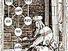
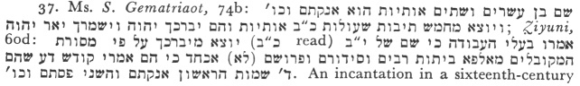
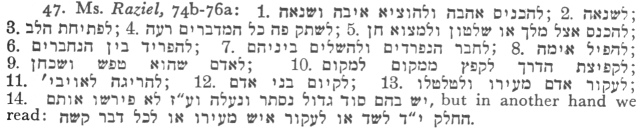

  
[Intangible Textual Heritage](../../index)  [Judaism](../index) 
[Index](index)  [Previous](jms27)  [Next](jms29) 

------------------------------------------------------------------------

[Buy this Book at
Amazon.com](https://www.amazon.com/exec/obidos/ASIN/0812218620/internetsacredte)

------------------------------------------------------------------------

  
*Jewish Magic and Superstition*, by Joshua Trachtenberg, \[1939\], at
Intangible Textual Heritage

------------------------------------------------------------------------

#### CHAPTER VII

#### "IN THE NAME OF . . ."

1. See Prof. Lauterbach's essay, "Naming of
Children," etc., *CCAR Yearbook*, XLII (1932), 356-60; *Ber.* 7b; *Ḥag.*
3b-4a; *S. Ḥas.* 363, 364, 366, 375, 377, 1118, 1551, 1552, 1871; *S.
Ḥas. B* 477; *Testament of Judah*, 26, 28, 61; *Ḥochmat HaNefesh*, 24e;
*Ẓiyuni* 17b; cf. Landshuth, p. xii f., for Biblical and Talmudic
references; also Bischoff, 32 ff.

2. See Jacob, *Im Namen Gottes*, 72, 75 ff.;
Frazer, Golden Bough, 1900, I, 403-47. [Methuselah](errata.htm#2)
advised Lamech, father of Noah, to delay naming his son "because the
people of that generation were sorcerers, and they would have bewitched
him if they had known his name" (*Da‘at Zekenim* on Gen. 5:28).

3. *S. Ḥas. B* 1150; *Ẓiyuni* and *Pa‘aneaḥ
Raza* on Gen. 32:30.

4. *S. Ḥas.* 1452. However, the contrary
opinion is inevitably implied in the practice; cf. *Ẓiyuni*, 22a: ‏ראה
כי אין טוב להשתמש בשמות ומכאן תבין גדול עונש המטריח את קונו‎. Even the
invocation of angels involves a measure of coercion

p. 288

upon God, who is [ultimately](errata.htm#3) responsible for their
actions; cf. *Lebush* on *Oraḥ Ḥayim* 584:1: ‏סגולת ההשבעות האמיתיות כן
היא שהשם ית׳ יתן להם רשות לאותן מלאבים שיעשו דברי המשביעים בלא שום
זבות‎.

5. Montgomery, 59; cf. also M. Gaster, *The
Samaritans*, London 1925, p. 81.

6. Jacob, 73 f.; cf. also Grünbaum, *Ges.
Auf.*, 120 ff.; De Givry, 109.

7. Rashi, *Sotah* 22a.

7a. Bischoff, 192 f., 195, offers an ingenious
Hebrew derivation for this word.

8. *Ber.* 55a; cf. also *Men.* 29b.

9. *Joseph Omeẓ*, 73; *Raziel*, 4a; cf. also
Gaster, *Sword of Moses*, 28, 48; *S. Ḥas.* 1458 (cf. *Kid.* 71a);
*Joseph Omeẓ*, 279. The practice of altering the names of God in one way
or another when writing them, or of substituting shorthand forms, grew
up at a very early time. Eighty-three written substitutes for the
Tetragrammaton have been listed. For fear of writing even the particle
rah proper names were abbreviated, so that Jehudah became Judah, the
final "h" of Elijah and Isaiah was dropped, the number 15 was written
‏ט״ו‎ instead of ‏ט״ה‎, etc. See Lauterbach, *Proc. Amer. Acad. for Jew.
Research*, 1931, 39-67; S. W. Baron, *A Social and Religious History of
the Jews*, N. Y. 1937, III, 48;—*Raziel*, 2a.

10. See Gaster, *Ma’aseh Book*, pp. 357, 366,
370; *HaGan*, ch. 4; *S. Ḥas.* 1444, 1448, 1449. .*Nishmat Ḥayim* III,
28, contains a general discussion of the powers that reside in the holy
names, with quotations and proofs.

11. *San.* 67b and Rashi; Blau 27; *Hadar
Zekenim* on Ex. 8:14, and Rashi on the same verse; cf. Güd. I, 169.

12. *San.* 67b, 65b and Rashi; Thorndike, II,
353, III, 139.

13. N. Brüll, *Jahrbücher*, IX (1889), 27;
*JE*, VI, 37; *EJ*, VII, 501-7; Chayim Bloch, *The Golem*, Vienna 1925;
cf. *Shelah*, III, 65a. In the seventeenth century the question was
raised whether a *Golem* could be counted as one of a *minyan* (*JE*,
loc. cit.).

14. Commentary on *Sefer Yeẓirah*, 4d, 15d
ff.; *EJ*, loc. cit.

15. Steinschneider, *Cat. Munich*, p. 3;
Grünbaum, *Jüdischdeutsche Chrest.*, 566. For a discussion of the Golem
motif in German folklore see B. Rosenfeld, *Die Golemsage and ihre
Verwertung in der deutschen Literatur*, Breslau 1934.

16. See Montgomery, 57 ff.; Gaster, op. cit.,
71f.; Thorndike, I, 14, 360 ff.

17. Gaster, op. cit., 8-9; Blau, 133;
Thorndike, I, 450.

18. The Aggadah has a few references to
invocation of the names of God: Moses killed the Egyptian (Ex. 2:11) by
merely speaking God's name; the name of God, engraved on Moses’ staff,
caused the sea to divide (Blau, 50, 60). The words *ehyeh asher ehyeh
yah YHVH ẓebaot amen amen selah, written on a staff*, caused a stormy
sea to subside (*B.B.* 73a).

19. Montgomery, 95 ff.; Wohlstein, 6-7, 9 ff.;
*Ta‘am Zekenim*, ed. Eliezer Ashkenazi, 54 ff. Cf. also J. Mann, Texts
and Studies, II, 90 ff.

20. Lea, III, 412, 436; Thorndike, I, 729, II,
286 ff., IV, 170.

21. Cf. Lauterbach, loc. cit., 39, n. 1 and 2.
On the meaning of the term ‏שם המפורש‎ concerning which there is
considerable difference of opinion, see Grünbaum, *Ges. Auf.*, 190 and
238 ff.; Blau, 125; Grunwald, *MGJV*, V, 35 and X, 95; *JE*, XI, 262
ff.; L. Geiger, *Kebuẓat Maamarim*, ed. Poznanski, Warsaw 1910, p. 98,
and Ginzberg's note, p. 394; H. H. Schaeder, *Esra der Schreiber*,
Tübingen 1930, 53 ff. This term was applied in post-Talmudic times not
alone to the Tetragrammaton, but also to the longer names; cf. Hai Gaon
in Ashkenazi,

p. 289

loc. cit.; Rashi, San 60a, *Suk.* 45a, *Erub.* 18b, etc. *Raziel*, 7a,
has a *shem hameforash* which altogether defies classification.

22. The 12-letter name is mentioned once, in
*Kid.* 71 a, which also speaks of the name of 42 letters. The only other
reference to this latter name in Talmudic literature is in *Lekaḥ Tov*
to Ex. 3:15, p. 10a, ed. Buber. The name of 72 letters (or elements) is
not mentioned in the Talmud, but does occur in one frequently repeated
passage of the Midrash: *Gen. R.* 44: 19, Lev. R. 23, beg., *Nu. R.*
1:11, etc.: ‏ששמו של הקב״ה שבעים ושתים אותיות‎ *Cant. R.* to 2:2 has:
‏ששמו של הקב״ה ע״ב שמות הן‎. Blau, 137 if., suggests that the oldest
mystical name is that of 12 letters; 42 and 72 developed out of it
later. The name of 72 was known, at the latest, by the first half of the
third century. The Talmudic literature, however, gives us no information
about these names, what they were, what were their component elements,
or how they were constructed.

23. This, in addition to the 4-, 12-, 42-, and
72-letter names, constitutes the list given in the ms. *S. Gematriaot*,
72b ff.

24. See, *e.g.*, *Raziel*, 24b ff.; Jellinek,
40-41.

25. *Raziel*, Sob.

26. *Pesikta R.* ch. 21 (ed. Friedmann, 104a);
see also Ginzberg, *Legends*, V, 5, n. 10. There were several theories
as to just which name of God was responsible for the creation of the
universe. The one most often advanced is that it was the Tetragrammaton
alone, or in conjunction with the particle *yah*, that did the job. See
Eleazar of Worms, *Commentary on S. Yeẓirah*, 1c; Jellinek, 33;
Grunwald, *JJV*, I, 388, n. 4. *Raziel*, 12b, offers an interesting and
original hypothesis: God had 73 of His names inscribed at His right hand
when He was about to commence the work of creation. Out of the first
name there came forth three drops of water which filled the universe;
the second provided light; the third, fire; and so forth. When His task
was completed He set the name of 42 to keep the celestial waters apart
from the terrestrial; it was the removal of this name that caused the
flood (p. 14a).

27. Cf. Thorndike, II, 407.

28. These particles were very popular. *Pes.
R.*, loc. cit.: ‏אפילו אות אחת משמו עושה צבא ככל שמו‎; Blau, 102 f.;
Wohlstein, 30; Montgomery, 60; Jellinek, 33; Grunwald, *MJV*, XIX
(1906), 112; etc.

29. *Ẓiyuni* 11 a, Sob; see also *Raziel*,
24a-b, 33b.

30. An effort has been made by some scholars
to reconstruct the three names known in Talmudic times, those of 12, 42
and 72, on the assumption that they were not the same as those employed
in later times. Bacher (*Agada der babylonischen Amoräer*, 17-20)
suggests that the 12-letter name was based on the three creative
potencies ‏חכמה תבונה דעת‎; and the 42 on the full ten: ‏הכמה תבונה דעת
כח גבורה גערה צדק משפט חסד רחמים‎ with the addition of the
Tetragrammaton. Franck (Kabbalah, 71) derives the name of 42 from the
ten *Sefirot* (cf. also Bischoff, 35 ff., 107 ff.), which, as Ginsburg
(Kabbalah, 183) points out, is an obvious anachronism. Robert Eisler
(*REJ*, LXXXII \[1926\], 157-9) bases the names of 42 and 72 on the
thirteen *Middot* of Ex. 34:6-7. Blau (p. 144), on the analogy of the
Greek magical papyri, in which the seven Greek vowels play a great rôle,
works out a triangular anagram which, beginning with one *YHVH* builds
up by the addition of one letter at a time to three—this, he maintains,
contains the 4-letter name in the first line, the 12 in the last, the 42
in the last four, and the 72 in its totality. Finally, A. Haffer
(*HaẒofeh*, II \[1912\], 127 ff.) derives the 12-letter name from the
first three names of God that occur in the *Shema‘*, ‏אל אלהינו יהוה‎,
and to make up the 42-letter name he adds the final two words of the
*Shema‘* and the doxology ‏ברוך שם כבוד מלכותו לעולם ועד‎. The name of
72 he derives from Deut. 4:34. See also Schwab, *Vocabulaire*, 28 ff.

p. 290

These theories ring false, and certainly bear no relation to what was
considered a potent magic name in the post-Talmudic period; in any
event, such efforts are entirely a matter of conjecture and invention,
which can in no way be substantiated from the available facts. It seems
to me that there is a strong probability that the names of 42 and 72
employed in the Middle Ages were the same as those in use during the
first few centuries of the Common Era. Hai Gaon (10th-11th century)
(*Ta‘am Zekenim*, 57) spoke of them in words which imply that they had
been well known for a long time, and the tenacity of traditional lore,
especially in a field such as that of mysticism and magic, in which
letter-perfection is one of the prime requisites, is a well-known
phenomenon.

31. See Appendix I.

32. Ms. *S. Gematriaot*, 74b: ‏שם בן י״ב
אנתיות הוא יהוה יהוה יהוה יהם ג׳ מאי יברכך ה׳ וישמרך וגו׳ שמו של הקב״ה‎;
*Ẓiyuni*, 60b; ‏שמות של יברכך יאר וישא והוא בן י״ב אותיות י״ד ו״ד י״ד
ו״ד י״ד ו״ד‎ cf. L. Zunz, *Die synagogale Poesie des Mittelalters*,
Berlin 1855, p. 146.

33. Ms. *S. Gematriaot*, 74b: ‏שם בן י״ד
אותיות יוצא משלש תיבות בפסוק שמע ישראל והם יהוה אלהינו יהוה והם י״ד
אותיות מתחלפות באותיות שלפניהם‎.

34. Pp. 42b, 44b, 45a and 41b (in this last
only the word ‏פספסים‎ occurs, intercalated between the second and third
verses of the Priestly Blessing. The other three were probably
originally included in the text, but dropped out before it was printed
in the eighteenth century) .

35. Cf. Bernard Heller, *REJ*, LV (1908), 60
ff., and LVII (1909), 105 f.; J. Perles, *MGWJ*, XXI (1872), 259-60;
ibid., LXXVII (1933), 246; Schwab, op. cit., s. v.; Cordovero's
*Pardes*, 21:14 (ed. Lemberg 1862, p. 113a), vocalizes the name as I
have given it.

36. Cf. Albert Katz, *Allg. Zeit. des Jud.*,
1907, 312; S. Krauss, *REJ*, LVI (1908), 251-2; Nathan Hanover's
*Sha‘are Ẓion*, Vienna 1817, 34b, 35a, 28a, 60a, 63a; *REJ*, LXV (1913),
59-60, where Aptowitzer cites acrostics containing this name which are
somewhat older than those in *Sha‘are Ẓion*.

37. Ms. *S. Gematriaot*, 74b:

 

An incantation in a sixteenth-century manuscript employs "the 22-letter
name of the Priestly Benediction" to conjure a divinatory spirit
(Grunwald, *MJV*, XIX \[1906\], 106). By means of this name the dead
will be recalled from their graves at the resurrection; cf. Gaster,
*Studies and Texts*, III, 230; Gollancz, *Clavic. Sal.*, 42. The
"Jerusalem" type of amulet-*mezuzah* (see p. 150 above) includes both
benediction and name in a manner indicating their close relationship;
cf. Aptowitzer, *REJ*, LXV (1913), 59. An additional item of evidence is
provided by a late Italian ms. entitled *Sefer HaRazim* (Ms. D 146, J.
T. S. Library) which (p. 18a) combines the name and the blessing in an
amulet.

38. *Pardes*, loc. cit.; cf. also Joel, *Allg.
Zeit. des Jud.*, XXXVIII (1874), 246, 351-2.

39. *Ta‘am Zekenim*, 57; B. M. Lewin, *Otzar
HaGaonim*, IV (Jerusalem 1931), *Ḥagigah*, 20 f. In connection with this
name Maimonides launched a bitter denunciation of all these mystical
names of God (cf. More Neb. I, 61, 62) which aroused only the faintest
echo in Northern Europe.

40. Cf. *Raziel*, 24b, 45a-b; Ms. *S.
Gematriaot*, 74b: ‏ומכל אות ואות של זה השם יוצא שם אחד והם מ״ב שמות‎.
There were other versions of the name

p. 291

of 42, such as that which the *Zohar* constructed out of the ten divine
names mentioned in the Bible (see Ginsburg, *Kabbalah*, 186-7), and the
mnemotechnical signs for the ten plagues in the Passover *Haggadah*
which a sixteenth-century ms. designated as this name because their
numerical sum (by *mispar katan*) is 42 (Grunwald, *MJV*, XIX \[1906\],
p. 119; see also *JE*, IX, 164); but these were "sports" which never
challenged the position of the true name.

41. See I. M. Casanowicz, *Jour. Amer. Or.
Soc.*, XXXVI (1917), 159. This prayer was made much of by the
Kabbalists, who also composed other such prayers containing this name in
acrostic; cf. Landshuth, p. xxv; *EJ*, II, 857.

42. Cf. *Tos. Ḥag.* lib, s. v. ‏אין דורשין‎:
\[‏מ״ב‎ read\] ‏פי׳ ר״ת הוא שם ע״ב אותיות היוצא מבראשית ומפסוק של
אחריו‎. (See also Bacher, *REJ* XVIII \[1889\], 292-3, whose
interpretation of this statement is far wide of the mark.) *Raziel*,
24b: ‏זה השם . . . יוצא מן הפסוק הראשין שבתורה הנא מן ב׳ של בראשית עד ב׳
של בוהו‎; *Ẓiyuni*, wc: ‏פסיק בראשית לתיבות שש שש אותיות בשם של מ״ב‎;
Ms. *S. Gematriaot*, 74b: ‏שם בן מ״ב אותיות היוצא מפסיק בראשית עד ה׳ של
בוהו ולא תחשוב ה׳ אחרובה של היתה‎; I may add that while the other works
cited do not specify that the name of 42 to which they refer is the one
of which I have been speaking, *Raziel* makes it clear that this is so.
Cordovero (*Pardes*, 21:13, ed. Lemberg 1862, p. 112b) offers a complete
exposition, through alphabetical permutations, of the derivation of this
name from the opening verses of the Bible.

43. P. 43a: ‏לא יובלו למעבד שום כשוף אלא על
ידי בלי ע״ב‎. Wohlstein, pp. 12 f., woefully misunderstood this passage
when he stopped at the word ‏בלי‎ and translated it literally as
"vessel," thus making the use of a vessel (he had in mind the many clay
vessels that have been found inscribed with Aramaic incantations)
obligatory upon the magician. The sentence quoted, and the context, make
it unmistakably clear that the "vessel" or "tool" referred to is the
name of 72.

44. *Ta‘am Zekenim*, loc. cit.; Rashi, *M.
Sukkah*, 45a; cf. also *Raziel*, 24b, 40b; ms. *S. Gematriaot*, 35a,
74b; Ginsburg, *Kabbalah*, 133 ff.; *JE*, IX, 164.

45. *Raziel*, 40b.

46. Ibid., 30b-31b.

47. Ms. *Raziel*, 74b-76a:

 

48. P. 40b.

49. Ibid. 43a, 52b; on the 70 names of
Metatron, cf. Steinschneider, *HB*, XIV (1874) 6-8, 33; *Kiẓur Shelah*,
*Inyane Limmud*, p. 150. I have not attempted, by any means, to be
exhaustive in this presentation of angelic and godly names, Hebraic and
foreign. The material is far too vast to permit of anything more than a
sampling here. Schwab has made the largest collection of such names, and
if his etymologies are as often as not dubious, he presents a good
survey of the entire field. The purpose of this discussion has been
solely to illustrate the type of material under consideration.

50. See pp. [250](jms18.htm#page_250) f.
above.

51. Cf. *Raziel*, 25b, 34a-35a, 4a ff.

52. Grünbaum, *Ges. Auf.*, 122; *Raziel*, 5b.

53. Cf. *JE*, I, 130; Montgomery, 151, and
Myrhman, *Hilprecht Anniversary Volume*, Leipzig 5909, P. 345; Gaster,
*Sword of Moses*, p. xiv, 1. 25; *Raziel*, 5a; Grunwald, *MJV*, XIX
(1906), 112, and *Jahrb. für jüd. Gesch. and Lit.*, IV (,90,), 130-31.

p. 292

54. Cf. Güd. I, 218.

55. *Raziel*, 42a; *HaGan*, ch. 2, end;
Grunwald, *MGJV*, V (1900), 66, §225; Lauterbach, *Proc. Amer. Acad.
Jew. Research*, 1931, 40, n. 3; M. Gaster, *The Samaritans*, London
1925, p. 67.

56. Eisenstein, *Oẓar Midrashim*, N. Y. 1915,
I, 46; Schwab, *Vocabulaire*, 200, 201; Gaster, *MGWJ*, XXIX (1880), 554
ff., *Folk-Lore*, XI (1900), 157 ff., *Sword of Moses*, 19; cf. however,
Grunwald, *MJV*, XIX (1906), 107, where these three terms are invoked
not against Lilit, but to gain inspiration for the preparation of an
amulet. See also Grunwald, *MGWJ*, LXXVII (1933), 241.

57. See J. Perles, *Etym. Studien*, 78;
Heller, *REJ*, LV (1908), 6g ff.; Krauss, ibid., LVI (1908), 253-4;
Heller, ibid., LVII (1909), 107-8; Brüll, *Jahrbücher*, I (1874), 154
ff.; Gaster, *Studies and Texts*, III, 228; Montgomery, 99.

58. *MGJV*, V (1900), 8r.

59. See Güd. II, 333-4; Perles, *Graetz
Jubelschrift*, 32 ff.; Grunwald, *MGJV*, V (1900), 79-84; E. Lévy,
*REJ*, LXXXII (1926), 401 if.; Steinschneider, *Cat. Munich*, p. 109.

60. Grunwald, *MJV*, XIX (1906), 112.

61. Steinschneider, *HB*, VI (1863), 121.

------------------------------------------------------------------------

[Next: Chapter VIII](jms29)
