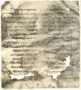
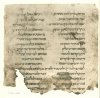
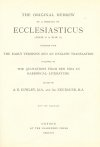

  
[Intangible Textual Heritage](../../index)  [Judaism](../index) 
[Index](index)  [Next](ohpe01) 

------------------------------------------------------------------------

*Original Hebrew of a Portion of Ecclesiasticus*, by A.E. Cowley and A.
Neubauer, \[1897\], at Intangible Textual Heritage

------------------------------------------------------------------------

### THE ORIGINAL HEBREW

###### OF A PORTION OF

# ECCLESIASTICUS

##### (XXXIX. 15 TO XLIX. 11)

###### TOGETHER WITH

##### THE EARLY VERSIONS AND AN ENGLISH TRANSLATION

###### FOLLOWED BY

#### THE QUOTATIONS FROM BEN SIRA IN RABBINICAL LITERATURE

###### EDITED BY

## A. E. COWLEY, M.A., AND AD. NEUBAUER, M.A.

###### WITH TWO FACSIMILES

#### OXFORD

#### AT THE CLARENDON PRESS

#### M DCCC XCVII

\[1897\]

Scanned at Intangible Textual Heritage, November 2006. Proofed and
formatted by John Bruno Hare. This text is in the public domain in the
United States because it was published prior to January 1st, 1923. These
files may be used for any purpose, provided this notice of attribution
is left intact in all copies.

[  
Click to enlarge](img/front.jpg)  
MS. fol. 1 recto (see p. 6)  

[  
Click to enlarge](img/_03700.jpg)  
MS. fol. 9 verso (see p. 40)  

[  
Click to enlarge](img/title.jpg)  
Title Page  

Oxford

PRINTED AT THE CLARENDON PRESS

BY HORACE HART

PRINTER TO THE UNIVERSITY

DEDICATED

TO

PROFESSOR A. H. SAYCE

------------------------------------------------------------------------

[Next: Contents](ohpe01)
