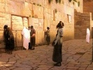

  
[Intangible Textual Heritage](../../index)  [Judaism](../index) 
[Index](index)  [Previous](pol24)  [Next](pol26) 

------------------------------------------------------------------------

[Buy this Book at
Amazon.com](https://www.amazon.com/exec/obidos/ASIN/B002F9NQVE/internetsacredte)

------------------------------------------------------------------------

  
*The Talmud: Selections*, by H. Polano, \[1876\], at Intangible Textual
Heritage

------------------------------------------------------------------------

*The Fear of God*.

The son of Rabbi Hunnah said, "He who possesses a knowledge of God's
law, without the fear of Him, is as one who has been intrusted with the
inner keys of a treasury, but from whom the outer ones are withheld."

Rabbi Alexander said, "He who possesses worldly wisdom and fears not the
Lord, is as one who designs building a house and completes only the
door, for as David wrote in Psalm 111th, 'The beginning of wisdom is the
fear of the Lord."

When Rabbi Jochanan was ill, his pupils visited him and asked him for a
blessing. With his dying voice the Rabbi said, "I pray that you may fear
God as you fear man." "What!" exclaimed his pupils, "should we not fear
God more than man?"

"I should be well content," answered the sage, if your actions proved
that you feared Him as much. When you do wrong you first make sure that
no human eyes see you; show the same fear of God, who sees everywhere,
and everything, at all times."

Abba says we can show our fear of God in our intercourse

p. 239

with one another. "Speak pleasantly and kindly to every one;" he says,
"trying to pacify anger, seeking peace, and pursuing it with your
brethren and with all the world, and by this means you will gain that
'favour and good understanding in the sight of God and man,' which
Solomon so highly prized." (Prov. 3: 9.)

Rabbi Jochanan had heard Rabbi Simon, son of Jochay, illustrate by a
parable that passage of Isaiah which reads as follows: "I, the Lord,
love uprightness; but hate robbery (converted) into burnt-offering."

A king having imported certain goods upon which he laid a duty, bade his
officers, as they passed the custom-house, to stop and pay the usual
tariff.

Greatly astonished, his attendants addressed him thus: "Sire! all that
is collected belongs to your majesty; why then give what must be
eventually paid into thy treasury?"

"Because," answered the monarch, "I wish travellers to learn from the
action I now order you to perform, how abhorrent dishonesty is in my
eyes."

Even so is it regarding the dealings of the Almighty with us, pilgrims
on earth. Though all we possess belongs to Him, yet He adds to it
continually, in order to increase our temporal enjoyment. Should any one
imagine, therefore, that to defraud man in order to present to God, what
is solely His own, might be allowable, he would be rebuked by the
teachings of Holy Writ, for the just God condemns the act, and calls it
hateful.

From this we may then infer, for instance, that palm-branches, stolen in
order to perform therewith the prescribed rites at the Feast of
Tabernacles, are unfit for use by reason of the unlawful manner in which
they were obtained.

Rabbi Eleazer said: "He who is guided by righteousness and justice in
all his doings, may justly be asserted to have

p. 240

copied God in His unbounded beneficence. For of Him (blessed be His
name) we read, 'He loveth righteousness and justice;' that is, 'The
earth is filled with the loving kindness of God.'" Might we think that
to follow such a course is an easy task? No! The virtue of beneficence
can be gained only by great efforts. Will it be difficult, however, for
him that has the fear of God constantly before his eyes to acquire this
attribute? No; he will easily attain it, whose every act is done in the
fear of the Lord.

"A crown of grace is the hoary head; on the way of righteousness can it
be found."

So taught Solomon in his Proverbs. Hence various Rabbis, who had
attained an advanced age, were questioned by their pupils as to the
probable cause that had secured them that mark of divine favour. Rabbi
Nechumah answered that, in regard to himself, God had taken
[cognisance](errata.htm#5) of three principles by which he had
endeavoured to guide his conduct.

First, he had never striven to exalt his own standing by lowering that
of his neighbour. This was agreeable to the example set by Rabbi Hunna,
for the latter, while bearing on his shoulders a heavy spade, was met by
Rabbi Choana Ben Chanilai, who, considering the burden derogatory to the
dignity of so great a man, insisted upon relieving him of the implement
and carrying it himself. But Rabbi Hunna refused, saying, "Were this
your habitual calling I might permit it, but I certainly shall not
permit another to perform an office which, if clone by myself, may be
looked upon by some as menial."

Secondly, he had never gone to his night's rest with a heart harbouring
ill-will against his fellow-man, conformably with the practice of Mar
Zutra, who, before sleeping, offered

p. 241

this prayer: "O Lord! forgive all those who have done me injury."

Thirdly, he was not penurious, following the example of the righteous
Job, of whom the sages relate that he declined to receive the change due
him after making a purchase.

Another Rabbi, bearing also the name of Nechumah, replied to Rabbi
Akiba, that he believed himself to have been blessed with long life
because, in his official capacity, he had invariably set his face
against accepting presents, mindful of what Solomon wrote, "He that
hateth gifts will live." Another of his merits he conceived to be that
of never resenting an offence; mindful of the words of Rabba, "He who is
indulgent towards others' faults, will be mercifully dealt with by the
Supreme Judge."

Rabbi Zera said that the merit of having reached an extreme age was in
his case due, under Providence, to his conduct through life. He governed
his household with mildness and forbearance. He refrained from advancing
an opinion before his superiors in wisdom. He avoided rehearsing the
word of God in places not entirely free from uncleanliness. He wore the
phylacteries all day, that he might be reminded of his religious duties.
He did not make the college where sacred knowledge is taught, a place of
convenience, as, for instance, to sleep there, either occasionally or
habitually. He never rejoiced over the downfall of a fellow-mortal, nor
would he designate another by a name objectionable to the party
personally, or to the family of which he was a member.

------------------------------------------------------------------------

[Next: Honour thy Parents](pol26)
