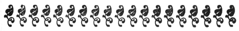

  
[Intangible Textual Heritage](../../index)  [Judaism](../index) 
[Index](index)  [Previous](rio05)  [Next](rio07) 

------------------------------------------------------------------------

[Buy this Book at
Amazon.com](https://www.amazon.com/exec/obidos/ASIN/1417963468/internetsacredte)

------------------------------------------------------------------------

*A Rabbi's Impressions of the Oberammergau Passion Play*, by Joseph
Krauskopf, \[1901\], at Intangible Textual Heritage

------------------------------------------------------------------------

p. 86

 

### IV

### In the Afternoon

"The Lord is merciful and gracious, long-suffering, and abundant in
goodness and in truth; He shows kindness unto the thousandth generation,
forgives sin, yet will He by no means clear the guilty."—[*Exodus*
XXXIV, 6-7](../../bib/kjv/exo034.htm#006).

"Fear thou not, for I am with thee; be not dismayed, for I am thy God: I
strengthen thee, yea, I help thee. . . Behold, ashamed and confounded
shall be all who were incensed against thee."—[*Isaiah* XLI,
10-11](../../bib/kjv/isa041.htm#010).

"And this commandment have we from him (Christ): he who loveth God
loveth his brother also."—[*I. John* IV,
21](../../bib/kjv/jo1004.htm#021).

"Think not that I am come to send peace on earth: I came not to send
peace, but a sword. For I am come to set a man at variance against his
father and the daughter against her mother, and the daughter-in-law
against her mother-in-law. And a man's foes shall be they of his own
household. He that loveth father and mother more than me is not worthy
of me; and he that loveth son or daughter more than me is not worthy of
me." *Words ascribed to Christ*.—[*St. Matthew* x,
34-37](../../bib/kjv/mat010.htm#034).

"These twelve Jesus sent forth, and commanded them saying, Go not into
any way of the Gentiles, and enter not into any city of the
Samaritans."—[*St. Matthew* X, 5](../../bib/kjv/mat010.htm#005).

"And he said unto them: Go ye into all the world and preach the gospel
to every creature. He that believeth and is baptized shall be saved; but
he that believeth not shall be damned." *Words ascribed to Christ in*
[*St. Mark* XVI, 15-16](../../bib/kjv/mar016.htm#015), *but generally
admitted to be spurious*.

NOT far from Oberammergau, almost within sight of it, is the beautiful
town of A mediæval miracle.Ettal. That
little village enjoys a distinction that is accorded to none of the
other mountain hamlets. It is the ancient

p. 87

seat of one of the most celebrated of Benedictine convents. Vast are the
buildings of the Brotherhood, magnificent is the architecture of its
convent-church; yet it is neither the one nor the other that gives Ettal
its proud distinction. Its glory lies in having had a miraculous origin,
in having within the sanctuary of its church the very statuette of the
Virgin Mary which had located that convent-site. When Ludwig, the
Bavarian, some six hundred years ago, was about to start for home from
Rome, where he had been crowned Emperor, an angel, clothed in a
Benedictine garb, presented him with a statuette of the Virgin Mother of
God. This precious treasure the pious Emperor carried in his arms all
the way from Rome to his native lands. When ascending the mountain-road
of Ettal, the statuette suddenly grew heavier and heavier, till at
length neither he nor his powerful charger could carry it any further.
Here was clearly a miracle, and but one interpretation of it: it was at
Ettal where the statuette wished to remain, where the Virgin desired a
convent to be established, and a shrine to be consecrated to her. Upon
the question being directly put to it, the statuette nodded assent; and
to that nod Ettal owes its fame.

Leaving Ettal, and pursuing our road within the Bavarian
mountain-forests, we suddenly light upon an old Germanic hut,

p. 88

the dwelling-place of the *Hundings* of the An
old Germanic myth.*Volsung Saga*, made famous by Wagner's
Nibelung tetralogy. There stood the mighty oak into which Wotan, chief
of the gods, had buried the sword to the hilt, which none but Sigmund,
the brave Volsung's son, could withdraw. There was the starting point of
those marvelous and mythical deeds that are treasured in the rich
storehouses of the Volsung Saga and of the Nibelungenlied.

A convent located by a statuette of the Virgin Mary, a hut and forest
once the trysting-placeBelief in the supernatural
once common. of gods and demi-gods, a town celebrated for its
decennial representations of the sufferings and death of a Son of God
—all three within close proximity of each other—what better theme for a
mind given to meditations on subjects such as these! Here, within a
radius of but a few miles, the Orient and the Occident, the North and
the South, the Christian and the Heathen, are brought together in their
myths and legends, to demonstrate, as it were, how prone man has been in
all ages and in all climes to people the earth with supernatural beings,
to ascribe to men superhuman powers, or to assign miraculous origins to
natural events.

But the age of supernatural happenings has passed, and, in critical
minds, also the beliefNo longer held, except for
Passion Play. in their ever having happened. Wagner has created
widespread interest in the Icelandic

p. 89

\[paragraph continues\] Eddas and in the
Germanic Sagas, but has neither found nor implanted a belief that the
gods and the demi-gods, the valkyrs and the norns, of which he sings,
ever had existence. Poets still find rich themes for their muse in the
quaint lore of the Mediæval Church, but never a trace that the
miraculous with which it teems ever occurred, The Passion Play of
Oberammergau, however, that deals, from first to last, with the
supernatural and the superhuman, with a Heaven-descended,
miracle-working, death-resurrected, Heaven-ascended, Virgin-born Son of
God, this, and this alone of all the three, we are asked to accept as
absolute fact, as holy truth.

Here is, sure enough, a double standard of belief regarding the
supernatural. Only the miraculous of the Scriptures is to beAnd for Scriptural miracles in general. accepted
as truth, that of any or all other literature is to be discarded as
fiction. When we read in the Northern legends of gods appearing in the
guise of men, when we read of heroes conquering, single-handed, whole
legions of evil spirits, making themselves invisible at will, walking
the waters, sailing through the air, passing unscathed through fire,
when we read of a dove descending from the sky to turn a swan into a
beauteous youth, or of a pilgrim-staff bursting into leaves and
blossoms, or of a statue of stone

p. 90

nodding its head in approval of the spot where it desires a sanctuary to
be erected to itself,—when of these we read we are told to class them
with the tales of the Arabian Nights. But when we read of a Holy Ghost
manifesting itself in the form of a dove; of angels appearing in the sky
to intone a song of joy at the birth of a God; of a star showing the way
to the manger in which the newborn Deity lies cradled; of that Deity
performing, in the guise of man, marvelous miracles, such as walking the
water, flying through the air, feeding the thousands on a few loaves and
a few little fishes, withering a tree by a mere curse, expelling devils
out of men and driving them into swine, restoring the dead to life,
ascending in the flesh and blood, after burial, to take his seat in
Heaven as God, the Son, at the right hand of God, the Father,—when of
these we read, we are told that we must believe them as absolute truths,
or take the consequences of being eternally damned, after death, for
disbelieving them, and, if Jews, of being also eternally persecuted
before death.

It was with some such thoughts as these that I made my way back to the
Passion Play After above reflections witnessed
continuation of sufferings of Christ.hall, after the noon recess.
My heart, that had been very heavy at the close of the forenoon part of
the play, looked painfully forward to the afternoon part. I knew what I
had to

p. 91

expect, judging from the viciousness I had seen enacted on the part of
the Jewish hierarchy and the teachers and leaders of Israel, in their
plotting and conspiring against the noble Jewish patriot, against him,
whom deluded zeal had unwisely proclaimed "King of the Jews" in the
capital of a Roman province, at a seditious time; against one, who had
in nowise offended against the Jews, nor against the Law of Israel; all
of whose teaching and preaching and yearning had been Jewish, and solely
for the Jew; who had been animated by but one desire,—a desire, which
not a Jew at that time but wished to see fulfilled,—that of restoring
Israel to its independence, and freeing Palestine from its cruel
oppressor, and sweeping it clean of the Roman heathen, and in which
aspiration and unwise proclamation lay the head and front of all his
offending, for which he was made a Roman prisoner in the dead of the
sacred Passover night, to be speedily despatched in the morning as a
traitor upon the Roman cross, before the Passover pilgrims and the
residents of the capital could learn of the seizure, before they could
run to the rescue of their brother, or rise in revolt against the
Procurator, as had occurred divers times before.

I had not long to wait. The very opening of the afternoon part
represented one of the

p. 92

\[paragraph continues\] High Priests on
the balcony of his house, in Jesus led before
High Priest and abused.the midnight hour, thirsting for the blood
of the patriot of Nazareth, unable to sleep until he shall have feasted
his eyes on the sight of that miscreant in chains. His feverish craving
is soon satisfied. The victim of his hatred is led before him,—not led,
but crowded, pushed, jostled by an infuriated mob of Jews. There is but
one disappointment, that the prisoner's disciples had been permitted to
scatter and escape. Insolent questions are put by the High Priest to
Jesus. He disdains to answer them, excepting the one in which he is
asked to give an account of the pernicious doctrines he had taught: "I
have spoken openly," replies he, "men have heard me; let them tell thee
what I have taught." For this dignified answer, he is cruelly smitten in
the face, to which Jesus righteously answers: "If I have taught wrong,
tell it; if not, why smitest thou me?" This is more than the High Priest
Annas, whose name might more worthily have been Haman, can endure. He
bids them take the culprit out of his sight, and to afford that
delectable treat, of seeing Christ in chains, also to Caiaphas, the
other High Priest.

We see the unfortunate prisoner dragged Representation of High Priest modelled after Roman
Popes.through the streets of Jerusalem, amid mockery and abuse.
We see him brought before Caiaphas and before the assembled Sanhedrin.

p. 93

\[paragraph continues\] Caiaphas is the
younger High Priest of the two, very cleverly acted by the village
beadle of Oberammergau; but not a whit inferior is he to Annas, in
hatred against the unoffending son of his race, faith, nation. If the
picture of the Jew, as represented by fanatics of the early Church, of
the Dark and Middle Ages, of the modern Anti-Semites, served Johann
Zwink as a model for his Judas Iscariot, then the pictures of some of
the Popes of Rome, at and before the dawn of the Reformation, must have
served Sebastian Lang as a model of Caiaphas,—those Popes, whose hands
were red and whose souls were black with the blood and poison of
assassination; those Popes, who inundated the soil of Europe with the
blood of the innocent; those Popes, who founded and operated the
Inquisition and Torture Chambers, and intoned *Te Deums* for such
massacres as that of St. Bartholomew night; those Popes, who sickened
Christianity with the stench of their open voluptuousness and public
immoralities; who made a public jest of the religion of that very Christ
whose apostolic successors they professed to be; who made a traffic of
their religion for the money with which to indulge their luxuries and
riotousness; who kept their iron hands relentlessly on the hearts and
souls and minds of the people; who

p. 94

made of Rome a Babylon and of St. Peter a heathen temple; those Popes,
who tortured and strangled and burnt the prophet Savonarola; who
tortured and burnt the saint Huss and the philosopher Bruno; and who
would have tortured and strangled and burnt the reformer Luther, if his
time had not grown a little too enlightened for mental serfdom, if the
people's spirit, at that time, had not grown a little too bold for
spiritual oppression.

But we must return to Caiaphas, the High Priest, and to the Supreme
Court of the Jesus subjected to mock
trial.nation, which had assembled in the sacred Passover night to
sit in capital judgment upon a Jewish culprit. A mock trial is entered
upon. Witnesses are called, and serious indeed are the charges they
bring against Jesus. He has been heard declare that, if they would tear
down the Temple, he would restore it in three days. He is accused of
having spoken disrespectfully of the Rabbis, and of having taught, in
regard to the ceremonial law, contrary to their teaching. He is accused
of greater crimes still, of having been seen eating with unwashed hands,
and of having associated with publicans and sinners and Samaritans; of
having permitted the hungry to pluck ears on the Sabbath, of having
actually healed the sick on the Day of Rest. He is accused of still
greater crimes, of the greatest of all conceivable crimes, of

p. 95

having arrogated to himself the right of God in forgiving sin, of having
committed blasphemy in calling himself the Messiah of Israel, the Son of
God.

The High Priest is horror-stricken. He rends his clothes as a sign of
the nation's humiliation and contrition at the blasphemyCondemned to death. of one of its sons. "He is
guilty of death!" shouts the High Priest. "He is guilty of death!"
re-echoes the mob. "He is guilty of death!" decrees the Sanhedrin, and
turns him over to a guard for safe-keeping till the break of day, when
the Tribunal is to proceed with him to the Roman Procurator, Pontius
Pilate, for the Roman's execution of the criminal condemned by them.

I have called it a mock trial, and my voice may probably have indicated
somewhat of a tone of amusement while narrating this so-calledNot acted nor witnessed as mock trial in
Oberammergau. judiciary proceeding of the Supreme Court of the
nation, whose president, historically, was the distinguished and
peace-loving Gamaliel, and one of whose foremost members was the noble
Jochanan ben Saccai. But, as for the impersonators of it at
Oberammergau, nothing could have been further from their minds than that
they were enacting a mock trial, or that there was any illegality or no
legality at all in the whole trial, or that it never was, and never
could have been, an historical fact. There was an

p. 96

 

earnestness, a naturalness of malice in their performance that cast a
pall over the thousands of spectators. On the one hand, the calm dignity
of the prisoner—bound but not bowed, silent and yet most eloquent of
innocence; on the other side, the envenomed hierarchy, and the chief
tribunal of the nation, and the mob, raging against him like a maddened
sea against a well-secured lighthouse, it was a spectacle to stir even
the most callous, to move even a heart of stone.

Analyzing my feelings, I found them stirred by two emotions: one was the
pity one The trial a fabrication, like Blue
Grotto.naturally feels for the wronged in any play on any stage;
the other was a curiosity to know how many of that audience could
penetrate that crudely-woven web of falsehood, that had been maliciously
drawn in front of the Roman to conceal the real offender; a curiosity to
know how many could understand that, the offense of Jesus having been
solely a political one against Rome, the Jews had as little cause as
they had right, to proceed judicially or otherwise against him, more
especially as that offense against Rome had had for its intention the
deliverance of the Jew. The preceding afternoon I had seen some of the
spectators in the celebrated Blue Grotto, near Oberammergau, back of the
Linderhof palace of the ill-fated Bavarian King. I had no doubt but that
they

p. 97

had been as profoundly impressed as I had been by the magnificent
naturalness of that stupendous piece of imitation, of that bold
fabrication of fiction. Did these same people, I wondered, perceive that
the whole trial they had just listened to, even though drawn from the
gospels, was, like unto the grotto they had seen the day before, a bold
fabrication of fiction, the machination of malicious Jew-haters, whose
cunning and self-interest had counselled the exculpation of the guilty
and the incrimination of the innocent.

I wondered also whether some of that audience had seen the *Hunding
hut*, and had learned that even that was all imitation, allAnd like Mediæval miracle and Germanic myth.
fabrication, and that the story of the nodding Virgin-statuette at Ettal
was all fiction, the invention of Benedictine monks in the financial
interest of their order and convent. If they had, I wondered whether
they had better reason for believing that trial to have been true,
seeing how the whole procedure, in its ignorance of Jewish law, history
and institution, proves itself a bungling fabrication of a later age,
that had gain for its object, malice for its motive power, vengeance for
its tools.

And I wondered also whether any of them had ever heard the remark Prof.
Huxley had made, when told as a definition of a lobster,A blunder, like that exposed by Huxley. that it
was "a red fish that swam backward,"

p. 98

said he, "the lobster is neither red, nor a fish, nor does it swim
backward—all the rest of the definition is true." If they had, then had
they seen in that trial an illustration of the kind of error Huxley had
so cleverly exposed. With the exception that that trial, from first to
last, was not Jewish; that, being a trial for a capital offense, it
could not, at that time, have been conducted by Jews according to Roman
interdiction; nor that any of the charges brought against the accused
constituted capital offense or any offense at all, according to Jewish
Law,—with these exceptions, all the rest of the trial was true.

We are told of two High Priests; there could never be more than one, at
one time, Every detail of trial false.in
Israel. The one is named Annas; Jewish literature knows of no High
Priest by the name of Annas at the time when Jesus is said to have stood
in trial before him. Of the other, Caiaphas, it has as little knowledge
as High Priest in Israel as has the gospel of Mark, the oldest of the
four gospel stories, or has the gospel of Luke a knowledge of a trial
before Caiaphas. Not until some two hundred years after the death of
Jesus do we find in Jewish literature the name of a Joseph of Caipha.
Josephus mentions a Joseph as High Priest at the time of Pilate. The
addition of the words "who is also called Caiphas" in no wise clears the

p. 99

difficulty, knowing only too well how the work of the Roman-pensioned
Josephus, dedicated to Vespasian and Titus the destroyers of Jerusalem,
written in Rome and for Romans, had additions and subtractions made to
it and from it, by later hands, to suit ulterior purposes. The trial is
held in the High Priest's palace—no penal case in Israel could ever be
tried in any other place than the legal seat of the Sanhedrin, which at
no time in the history of Israel was in the dwelling of the High Priest.
The trial is held, and the verdict of death is pronounced on the
Passover night—according to Jewish Law, no trial could be held in the
night, least of all on the Holy Passover night, nor could a sentence of
death be ever pronounced on the same day on which the trial was held.
Jesus was condemned for having differed from the Rabbis, and for having
spoken disrespectfully of them—a guilt that was one of the commonest and
most harmless occurrences in those days of free speech, of schools and
sects of widest divergence, from the almost atheistical Sadducees to the
extremely orthodox Essenes, both of which had broken with the Rabbinical
Law and had spurned the authority of the Rabbis. He is condemned to
death for irreligious actions and for blasphemous sayings; there is not
in the whole compendium of the Talmudic Law, an

p. 100

enactment, a decision, a decree, that could even by the farthest stretch
of an orthodox imagination construe as heresy or blasphemy anything that
Jesus ever did or said. There is not in the whole history of Israel,
from Moses to Jesus, a single case on record of any one ever having been
put to death because of differing religious views. Only he who cursed
God by the ineffable name of *Jehovah*, and who seduced others into
cursing God, and enticed them to idolatry, was a blasphemer according to
Jewish law, and guilty of death. Unbeliever that Robert Ingersoll was,
not even he, having never cursed God nor enticed men to idolatry, could
have been condemned to death by Jewish law, as a blasphemer, much less
those thousands of godly and valiant thinkers, who were done to death at
the stake, in the torture-chamber, during the Dark and Middle Ages, by
the Christian Inquisition, even for but slightly different opinions on
doctrines and dogmas of the Church.

But what of the gospels in which this trial and the other fabrications
previously touched Is it not so recorded in
inspired Scripture?upon are recorded? What of the phrase "Gospel
Truth "? Are not these accounts given in the New Testament, and has not
the New Testament, as well as the Old Testament, been written by the
hand of God, or by the hand of man under the dilation or inspiration of
God?

p. 101

It is too late a date in the history of our mental progress to postulate
a supernatural origin for either the New or Old Testament. Theory of inspired Scripture no longer
tenable.The very shortcomings of the writings themselves, their
own frequent, flagrant contradictions, their conflict with historic and
scientific facts, their occasional childish, absurd, even pernicious,
teachings, show only too plainly the hand of man with all the
limitations of the age in which it wrote. And when to this we add the
fanatical spirit that characterized the Councils, in which the
canonicity of the New Testament writings was established, the intrigues,
the partisan passions, the bitter feuds, the personal encounters, that
determined which writings should and which should not constitute the
Holy Scripture, and when we consider when and how and by whom and under
what spirit and with what motive some of these Scriptures were composed,
it becomes a matter of scientific and philosophic necessity to
re-emphasize our old-time objection to the old-time teaching with regard
to the gospels that they are divine in origin, supernatural in essence,
miraculous in evidence.

If Jesus himself ever committed any of his sayings and doings to
writing, not a line of it has come down to us or was ever known toNo contemporaneous biography of Jesus. have
existed. If the Disciples ever wrote anything of the life of their
Master, not a line of it has come down to our day. Not one of

p. 102

the manuscripts of the four canonic gospels in our possession dates from
a time earlier than three hundred years after the death of Christ. Not
one of the early church-writings gives evidence that any of these
gospels existed in their present form as early as a century after
Christ. The very names of the authors of these gospels, with the
possible exception of the third, are unknown; the names they bear are
merely the names of the men whose oral traditions have been transmitted
through a number of generations. With the probable exception of one, all
were written far from Palestine, the scene of action,—two in Rome, the
other in Ephesus in Asia Minor, or in Alexandria in Egypt. Final
sanction is not given by Council decree to the New Testament as canonic
Scripture until three hundred years after the death of Jesus. Within
contemporaneous Jewish literature not a line is found of Jesus, nor a
word of him prior to the fourth century. In Josephus, who wrote half a
century after the death of Jesus, and whose writings have come down to
us through the hands of Christian copyists, a reference to Jesus is
contained, which has long since been proven even by Christian scholars
as spurious.

The beginnings of the gospel stories were very unlike their present
form. Founded on tradition, they started as brief and simple

p. 103

memoranda of the life and teachings of aStarted
as brief memoranda of fact—ended as collectanea of fiction.
Jewish patriot, believed by a band of faithful followers to have been
the long-expected Saviour of his nation, and they ended as a detailed
and doctrinal biography of a composite hero-myth and man-God, Jew-enemy,
and Roman-friend. The fate of Jesus has been that of all ancient-day
heroes who have come down to historic times by the vehicle of
tradition,—between the first and last stages of that journey stretch
miles of unconscious fancy and leagues of deliberate invention. Ours are
the days of exact science and of reliable historical data; and yet, if
not a line had been written or published of the life of Washington to
this day, if we had had to depend for our knowledge on tradition, the
Washington of to-day would have been as unlike the Washington of 1776 as
was Jesus, the carpenter's son, unlike the Jesus, the incarnate Son of
God, of a century and a half later.

At first there was no thought of preserving in writing an account of the
life and deeds of Christ. There was no need of it, since heWritten accounts of life of Christ deemed unnecessary
at first. might at any moment make his Second Advent and take his
followers into the Kingdom of Heaven, in the interest of which he had
suffered himself to die, and for the preparation of which he had but
temporarily separated himself from them. But years rolled on, and there
was no Second Advent. The delay

p. 104

could only be due, it was believed, to the fewness of Christians. They
must send out missionaries and spread a knowledge of their Christ. They
must found churches and supply them with literature. Thus arose the
first need of a written account of the Master and of his work.

Different men, differently endowed, penned different versions of
different traditions. With rise and spread of
missionary zeal commenced rise and spread of differing
gospels.Different peoples required different renderings of the
stories the missionaries had to tell. Different copyists incorporated
different marginal comments of others, and opinions of their own into
the texts. There gradually ensued combinations and supplementations and
elaborations to such an extent that Papias, a Bishop of the middle of
the second century, grew suspicious of them and expressed himself as
preferring the old oral traditions to the new writings, the old simple
reminiscences and logia of Christ to the mass of doctrinal and differing
biography that had sprung up.

Time passed. The halo around the head of the now supernatural Christ
widened. Life of Christ made to correspond with
ecclesiasticism of the Church.There was nothing, deemed
ecclesiastically good or doctrinally right, which he was not believed to
have thought or said, or which he might not have thought or said. And so
it was an easy matter, in those days of elastic literary consciences and
deficient historic

p. 105

sense, to credit to Christ whatever they, of their time, thought worthy
of a Christ.

Time passed. Contentions arose among the spreaders of the gospel;
differences of opinions required textual corroborations—andWith differing doctrines and claims of sects and
factions. the teachings of Christ had to be made to corroborate
the opinions of the one and those of the other. Factions sprang up, one
faction regarding Peter the head of the Church; another, Paul; another,
John; another, James, the brother of Jesus—and each had to twist the
story of Christ into confirming his supremacy and policy. Polemics
sprang up between the missionaries of the new religion and the followers
of the old faiths, and the story of Christ had to be made to meet the
objections and requirements of the opposition.

With regard to the Jews, the story had to be made to meet the views of
the ascetic Essenes, of the land- and law-devoted Pharisees,With differing notions of Jews. of the
anti-Rabbinical and pro-Roman Sadducees, of the Neo-Platonic
Alexandrians, of those who believed that the Mosaic dispensation was to
remain intact for ever, of those who believed that the Messiah was
promised to the Jew alone and not to the Gentile as well; that he had to
be born of the Davidian family, and at Bethlehem, the seat of the royal
dynasty; and that he had to fulfil all that the Prophets had foretold of
him in the Old Testament.

p. 106

With regard to the Pagan, the story of Christ had to be made to suit the
Heathen's With differing notions of
Pagans.notion of religion. The real had to be turned into a
fiction, the man into a God, a matter that became all the easier the
more converted Pagans entered upon missionary work. Like unto the Greek
Jove, who, in the form of a swan, had become father of Helen, by Leda,
wife of the Spartan King, the stern, incorporeal, invisible,
incomprehensible Jewish Jehovah, had to be made, in the form of the Holy
Ghost, or dove, Father of Jesus, by Mary, the wife of Joseph. The birth
of Jesus, like unto that of the Pagan demigods, had to be announced by
wondrous signs and visions. Like unto the Pagan mythical heroes, Jesus
had to be shown to them as having performed wonders without number and
as marvelous as numerous. Like unto the mythical heroes of the
Pagans—even like unto some of their Emperors, who were honored with
apotheosis after death, and made to ascend to Olympus to take their
places alongside the gods—Jesus had to be made to resurrect after death,
and to confer with his favorites as the poets had made the gods of the
pantheons do, and to ascend to Heaven to take his seat as God, the Son,
at the right hand of God, the Father.

Time passed. The early close and friendly relationship, between the Jews
of the old

p. 107

faith and the followers of the new, becameThe
nearer story of Christ to life-time of Jesus the friendlier to
Jews. strained. The nearer the story of Christ to the life-time
of Jesus the friendlier the tone toward the Jew. The gospel of Mark—the
oldest of the four extant—knows nothing of a miraculous or Bethlehem
birth of Jesus, nor of many of the other miraculous deeds; in the main
its doctrines are unitarian, its principles Jewish, its spirit friendly,
containing none of the bitter harangues against the scribes and
Pharisees. One of the early Church Fathers even tells us that a sect, in
the middle of the second century, accepted the gospel of Mark only,
because it separated the Jewish Jesus from the Pagan Christ.

The further the story of Christ from the life-time of Jesus the more
bitter its spirit toward the Jew. In the gospel of John—theThe further from life-time of Jesus the more hostile to
Jew and the more friendly to Roman. latest of the four—the Jews
are contemptuously spoken of as an alien, outcast people, as offspring
of the Evil One. This growing hostility was due partly to the poor
success of the missionaries among the Jews, and partly to their desire
to escape being classed as Jews, as they had hitherto been, since the
Emperor Hadrian had, after the Bar Cochban revolution, decreed the
stamping out of all the Jews and their religion.

The friendliness toward Rome was by no means a mere pretext. The
followers of

p. 108

the new faith were by this time far more of The
end to be attained regarded a justification of the means.Pagan
than of Jewish origin, and clearly they recognized that there, among the
Græco-Romans, who at that time had little religion and less morality,
lay the future of the new faith. What if it required paganization of the
Jewish faith and of the Jewish hero? Was it not justified by the end to
be attained? What if it necessitated the incrimination of the Jew, and
the exculpation of the Roman from the guilt of the crucifixion of
Christ? Did not the Jews deserve it for refusing to accept Him as their
Saviour? And was it not a necessity, seeing that it would never do to
tell the Romans that the new God they were asked to worship had been one
of those Jews detested by them? What if it required the surrender of
Mosaic laws and institutions? Did it not mean the conquest of an empire
for the new faith? With such colossal ends to be attained, was it not
worth recasting the story of Jesus so as to meet the necessities of the
Pagan mind?

And recast it was. And when it emerged from the Roman mould, and
displayed its Jesus of Nazareth turned into a God
of the Pantheon.hero in the new guise of a paganized deity, it
required, indeed, a very skilled eye to trace any resemblance between
this new God of the crumbling Pantheon and the gentle preacher and
healer of Nazareth, the noble, self-sacrificing

p. 109

would-be deliverer of his people from the cruel Roman yoke.

Thus it was that the character of Jesus was made to grow step by step,
by accretions and recastings, from man to God, fromAnd the gentle preacher is transformed by missionary
zeal into a Divinity without Humanity. a hater of Rome to a
champion of it; from a condemned by Rome to a defended by it; from a
patriot of Israel to an opponent of it; from a teacher of the Golden
Rule and of the Beatitudes and of the precepts of Non-Resistance, to an
announcer that he had but come to bring the sword and the fire, and to
set brother and brother at variance with each other; from a strengthener
of the family-bond, to a spurner of his own family, refusing to grant
even his own mother's request to see him, saying that those who believed
in him were dearer to him than his blood-relations, bidding all—if they
desired to escape damnation—to forsake their nearest and dearest, to
sever the most sacred home-ties, and follow him; from a commiserator
with the sorrowing and suffering and fallen and ignorant, to a curser of
those who do not believe in him, or who do not assist his disciples.

To such an extent can missionary zeal madden the human mind and pervert
the human heart. To such an extent can propagandic policy transform one
of the simplest and gentlest and most lovable of men, degree by degree,
into a divinity that lacks even

p. 110

humanity, into a God who is wanting even in the virtues of man.

After this brief survey of the simple and natural origin and forced
artificial growth, This survey will make clear
some of the many errors and contradictions.through several
centuries and in several continents, of the gospel stories of the life
of Jesus, you will probably understand why they contain so many errors
and contradictions and falsifications and paganizations; why some of
these gospels know nothing of a miraculous birth of Jesus, and others
trace him, by means of differing lines of ancestries, to King David,
through Joseph as father, and yet assigning the fathership direct to
God; why some know nothing of a *Sermon on the Mount*, or of the *Lord's
Prayer*, or of such a stupendous miracle as that of Christ's restoring
Lazarus from death to life; why, according to some, Jesus had come but
for the benefit of the Jew, and *not to cast his pearls before the
swine*, and according to others he had come for the Gentile as well as
for the Jew, and later, for the Gentile altogether.

After this survey, you will probably understand why in one place the
people are told to obey the Scribes and Pharisees, who teach and judge
in Moses’ stead, and in another place they are denounced in vilest
terms, and the people openly incited to rebellion against them; or why
Peter is now shown to be the discoverer and announcer of Jesus as *the* 

p. 111

\[paragraph continues\] *Christ*, and is
rewarded for it by being told, by Jesus, that the new Church will be
built upon him as upon a rock, and that unto him will be given the keys
of the Kingdom of Heaven,—and then he is branded by Jesus as a Satan, as
a thrice-denier of his Master.

After this survey, you will probably understand why nothing is known of
the end of Judas, the arch-enemy of Jesus, in three gospels, while the
account of it in St. Matthew, that of his hanging himself, even before
the crucifixion of Christ had taken place—the end represented in the
Oberammergau Passion Play—differs entirely from that given in the *Acts
of the Apostles*, that of falling headlong in a field, and bursting
asunder in the midst, with all his bowels gushing out; and both of these
differ from that given by Papias, Bishop of the Church a century and a
half after the death of Jesus, that of his walking about in the world a
great example of impiety, his body being afflicted with running sores
and swollen to enormous size, so much so that, on one occasion, when a
wagon was moving on its way, not being able to pass it, he was crushed
by it, the stench of his mouldering remains making of that whole country
a shunned and howling waste,—each account the more horrible the later
the date of its authorship.

After this survey, the outrage perpetrated

p. 112

 

A Rabbi' s Impressions of the

against the Jews by foisting upon them a trial and condemnation of their
brother and patriot, will reveal itself to you not less monstrous but
probably a little more intelligible. After this survey you will probably
understand the better what I shall have to say in my next discourse, on
the additional trials of Jesus before Pilate and Herod, and on his
Crucifixion, Resurrection, and Ascension.

After this survey you will probably know how much truth there is in the
assertion that It required all of God's mercy to
forgive all the wrong done to the Jew.the gospel stories are
divine in origin, supernatural in essence, miraculous in evidence. You
will probably know how much reliance there is in "gospel truth." Reading
the definition of the word "gospel," you will know how much of "good
news" and of "happy tidings" it has brought to the Jew, and to countless
millions of non-Christians Fortunate it has been for many an one that,
as the Old Testament teaches, "Jehovah is a God of Mercy," for it
certainly required all of God's mercy to forgive those who, in the
interest of policy and in the madness of fanaticism, outraged truth,
falsified history, paganized the religion of Jesus, cleared the guilty
Roman, and condemned the innocent Jew.

------------------------------------------------------------------------

[Next: V. The End](rio07)
