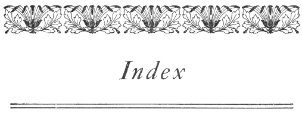

  
[Intangible Textual Heritage](../../index)  [Judaism](../index) 
[Index](index)  [Previous](rio11) 

------------------------------------------------------------------------

[Buy this Book at
Amazon.com](https://www.amazon.com/exec/obidos/ASIN/1417963468/internetsacredte)

------------------------------------------------------------------------

*A Rabbi's Impressions of the Oberammergau Passion Play*, by Joseph
Krauskopf, \[1901\], at Intangible Textual Heritage

------------------------------------------------------------------------

p. 217

Index

 

Actors, see Passion Play

As s of the Apostles, end of Judas in the, [178](rio09.htm#page_178);
historically unreliable, [199](rio11.htm#page_199),
[203](rio11.htm#page_203)

Agrippa, mocked by Alexandrians, [114](rio07.htm#page_114)

Ahaz, king of Judea, [165](rio09.htm#page_165),
[166](rio09.htm#page_166)

Alexandria, Roman mob in, [114](rio07.htm#page_114)

Alexandrians, alluded to, [105](rio06.htm#page_105)

Annas, High Priest, [92](rio06.htm#page_92), [98](rio06.htm#page_98)

Ascension, the, [122](rio07.htm#page_122); disagreement on the, in
Gospels, [146](rio08.htm#page_146)

Assyrian period of Isaiah, [164](rio09.htm#page_164)

Augustine, St., legend concerning, [58](rio05.htm#page_58)

Author's attitude toward the Passion Play, [18](rio03.htm#page_18),
[31](rio03.htm#page_31)-[33](rio03.htm#page_33)

Babylonian period of Isaiah,
[164](rio09.htm#page_164)-[168](rio09.htm#page_168)

 

Barabbas, [119](rio07.htm#page_119)

Bar Cochba, leader of Jewish rebellion, [53](rio04.htm#page_53)

Benedictine Convent at Ettal, [87](rio06.htm#page_87)

Biblical knowledge requisite for criticism of Passion Play,
[18](rio03.htm#page_18)

Biography, of Jesus, [148](rio08.htm#page_148); of St. Paul,
[203](rio11.htm#page_203)-[214](rio11.htm#page_214)

Birth of Jesus, time of the, [173](rio09.htm#page_173)

Blasphemy, according to Jewish law, defined, [99](rio06.htm#page_99)

Blue Grotto, near Oberammergau, [96](rio06.htm#page_96)

Brotherhood of Man, as conceived in the Pauline theology,
[207](rio11.htm#page_207)

Bruno, alluded to, [94](rio06.htm#page_94)

 

Caiaphas, High Priest, [92](rio06.htm#page_92), [98](rio06.htm#page_98)

Calvin, alluded to, [140](rio08.htm#page_140)

Carabbas, mock king, throned at Alexandria, [114](rio07.htm#page_114)

Choragus, of Passion Play, [30](rio03.htm#page_30); part created for
Mayr, [24](rio03.htm#page_24)

Chorus of guardian angels, in Passion Play, [29](rio03.htm#page_29),
[30](rio03.htm#page_30)

Christ, see Jesus

Christian credulity, [59](rio05.htm#page_59)

Christian faith, happiness of believers in, [41](rio04.htm#page_41);
sustained at cost of Jewish honor, [42](rio04.htm#page_42)

Christian, interpretation of Messiah's prophecies,
[156](rio09.htm#page_156); story of Jesus,

p. 218

proof demanded of the, [143](rio08.htm#page_143); teachings, forgiveness
inculcated by, [139](rio08.htm#page_139); vindication of the Jew,
[133](rio07.htm#page_133)

Christianity, as a world religion, [207](rio11.htm#page_207); doctrines
of, [214](rio11.htm#page_214); according to St. Paul,
[206](rio11.htm#page_206); detrimental to its increase,
[213](rio11.htm#page_213); early, pagan tendencies of,
[106](rio06.htm#page_106); Roman tendencies of,
[108](rio06.htm#page_108); established by a Jew,
[212](rio11.htm#page_212); in Asia and Europe at the death of St. Paul,
[211](rio11.htm#page_211); scholarly foundations of, imperfect,
[158](rio09.htm#page_158)

Christians, persecutions by the, [139](rio08.htm#page_139)

Christmas, origin of, [173](rio09.htm#page_173)

Christology, Isaiah the richest source of, [159](rio09.htm#page_159)

Communistic brotherhood of the Nazarenes, [192](rio11.htm#page_192),
[195](rio11.htm#page_195); its permanence impossible,
[196](rio11.htm#page_196)

Compromise, between Jew and Gentile impending,
[215](rio11.htm#page_215); between St. Paul and the Nazarenes, what it
might have effected, [212](rio11.htm#page_212)-[214](rio11.htm#page_214)

Concord, New Hampshire, alluded to, [40](rio04.htm#page_40)

Converts, Paul's new theology attracted many, [209](rio11.htm#page_209)

Credulity, of early ages, [59](rio05.htm#page_59),
[88](rio06.htm#page_88); strengthened by the Passion Play,
[34](rio03.htm#page_34)

Critical research demanded in the present age, [59](rio05.htm#page_59)

Cross, the omnipresence of the, at Oberammergau,
[38](rio04.htm#page_38); story of the, [39](rio04.htm#page_39)
Crucifixion, the, [121](rio07.htm#page_121); a Roman cure for Jewish
patriotism, [127](rio07.htm#page_127); held to be foreshadowed in
Isaiah, [170](rio09.htm#page_170); Jewish responsibility for the,
historically groundless, [141](rio08.htm#page_141); prophecies applied
to the, [178](rio09.htm#page_178)

Crusades, the, [140](rio08.htm#page_140)

Cyrus, believed to have been the Messiah, [169](rio09.htm#page_169)

 

Davidian descent of Jesus denied, [12](rio02.htm#page_12)

Delusions, religious, see Religious delusions

Devoutness of the Jewish nation in the time of Christ,
[67](rio05.htm#page_67)

Disproof of the Jewish story of Jesus demanded,
[143](rio08.htm#page_143)

Divine reason, allegorical interpretations of the,
[205](rio11.htm#page_205); Jesus the incarnation of the,
[206](rio11.htm#page_206)

Divinity of Jesus, [150](rio08.htm#page_150); rejected,
[180](rio09.htm#page_180)

Doctrines of Christianity hinder its increase,
[213](rio11.htm#page_213), [214](rio11.htm#page_214)

Doubt in the pulpit, [147](rio08.htm#page_147)

 

Early Christian Church, factions in the, [105](rio06.htm#page_105)

Early Christian fathers, comments of the, on Pilate,
[125](rio07.htm#page_125)

Easter, [153](rio09.htm#page_153); a season for persecution of the Jews,
[134](rio08.htm#page_134)-[137](rio08.htm#page_137)

Eddas, alluded to, [88](rio06.htm#page_88)

Egypt, flight of Jesus into, [174](rio09.htm#page_174)

Eliot, George, alluded to, [44](rio04.htm#page_44)

p. 219

Emerson, noble life of, [150](rio08.htm#page_150); alluded to,
[40](rio04.htm#page_40)

Enlightenment of the present age, [138](rio08.htm#page_138)

Epistles of St. Paul, value to students of Christianity,
[203](rio11.htm#page_203)

Erasmus, on Luther, quoted, [133](rio07.htm#page_133)

Essenes, a communistic sect, [195](rio11.htm#page_195); alluded to,
[99](rio06.htm#page_99), [105](rio06.htm#page_105)

Eternal damnation, doctrine of, unknown to early Nazarenes,
[192](rio11.htm#page_192)

Ettal, legend of, [86](rio06.htm#page_86); alluded to,
[97](rio06.htm#page_97)

Ezekiel, alluded to, [155](rio09.htm#page_155)

 

Factions in the early Christian Church, [105](rio06.htm#page_105)

Festival of the Birth of the Sun, [173](rio09.htm#page_173)

Flaccus, Roman procurator, [114](rio07.htm#page_114),
[115](rio07.htm#page_115)

Flunger, Anna, [23](rio03.htm#page_23)

Foretelling not a prophetic function, [164](rio09.htm#page_164)

 

Galileans, seditions of the, [50](rio04.htm#page_50)

Galileo, alluded to, [140](rio08.htm#page_140)

Gamaliel, teacher of St. Paul, [204](rio11.htm#page_204); alluded to,
[64](rio05.htm#page_64), [95](rio06.htm#page_95)

Genealogy of Davidian House, [72](rio05.htm#page_72)

Germanic myth, [87](rio06.htm#page_87)

Gethsemane, agony of Jesus in, [84](rio05.htm#page_84); arrest of Jesus
in, [83](rio05.htm#page_83)

Golden Rule, paraphrase of the Talmud, [183](rio10.htm#page_183)

Gospel, accounts of Jesus, too; falsehoods, eradication demanded,
[132](rio07.htm#page_132); miracles, [130](rio07.htm#page_130)

Gospels, character of Pilate as depicted in the,
[125](rio07.htm#page_125); contradictions in the,
[110](rio06.htm#page_110); date of the, [102](rio06.htm#page_102);
development of the, [102](rio06.htm#page_102); differences in the,
concerning the birth of Christ, [174](rio09.htm#page_174); differing
versions of the, [104](rio06.htm#page_104); paganized,
[105](rio06.htm#page_105); resemblance of Isaiah to the,
[161](rio09.htm#page_161)

Gregory XIII, pope, [140](rio08.htm#page_140)

 

Hale, Sir Matthew, alluded to, [55](rio04.htm#page_55)

Helpfulness of Christian faith, [45](rio04.htm#page_45)

Herod Antipas, Jesus before, [118](rio07.htm#page_118); slays John the
Baptist, [65](rio05.htm#page_65)

Herod Archelaus, [65](rio05.htm#page_65)

Herod the Great, massacre of infants by, [175](rio09.htm#page_175);
theatre of, in Jerusalem, [68](rio05.htm#page_68); alluded to,
[174](rio09.htm#page_174)

Hero myth of the Gospels, [42](rio04.htm#page_42),
[103](rio06.htm#page_103), [106](rio06.htm#page_106)

Hezekiah, [166](rio09.htm#page_166); Messianic prophecies referring to,
[167](rio09.htm#page_167), [168](rio09.htm#page_168),
[176](rio09.htm#page_176)

Hiawatha play, alluded to, [31](rio03.htm#page_31)

High Priests, demand the punishment of Jesus, [117](rio07.htm#page_117):
relations of Pilate with the, [124](rio07.htm#page_124); see also Annas,
Caiaphas

Hillel, Rabbi, Golden Rule of, [183](rio10.htm#page_183); alluded to,
[64](rio05.htm#page_64)

p. 220

Hosea, quoted, [175](rio09.htm#page_175)

Humanity of Jesus, [148](rio08.htm#page_148)

Hunding, hut of, [87](rio06.htm#page_87), [97](rio06.htm#page_97)

Huss, alluded to, [94](rio06.htm#page_94), [139](rio08.htm#page_139)

Huxley, Professor, on definition of a lobster, quoted,
[97](rio06.htm#page_97)

 

Imitation of Christ, [149](rio08.htm#page_149)

Immaculate Conception, doctrine of the, unknown to the early Nazarenes,
[192](rio11.htm#page_192)

Immanuel, Jesus not known as, [166](rio09.htm#page_166)

Ingersoll, Robert, alluded to, [100](rio06.htm#page_100)

Inspiration of Scripture denied, [100](rio06.htm#page_100)

Isaiah, Assyrian period of, [164](rio09.htm#page_164),
[171](rio09.htm#page_171); authorship of, [164](rio09.htm#page_164);
Babylonian period of, [164](rio09.htm#page_164),
[171](rio09.htm#page_171); chronology of, [165](rio09.htm#page_165);
fifty-third chapter of, [170](rio09.htm#page_170); Messianic predictions
of; [166](rio09.htm#page_166)-[172](rio09.htm#page_172); quoted,
[159](rio09.htm#page_159); resemblance to Gospels of,
[161](rio09.htm#page_161); alluded to, [155](rio09.htm#page_155),
[156](rio09.htm#page_156)

 

James, St., loyal to Jews, [126](rio07.htm#page_126)

Jehovah, a God of mercy, [112](rio06.htm#page_112)

Jeremiah, quoted, [175](rio09.htm#page_175)

Jerusalem, irresponsive to announcement of a Messiah,
[52](rio04.htm#page_52)-[54](rio04.htm#page_54); represented as plotting
against Jesus, [69](rio05.htm#page_69)

Jesus, agony of, [84](rio05.htm#page_84); a Grecian Christ,
[209](rio11.htm#page_209); a Jewish patriot, [91](rio06.htm#page_91),
[102](rio06.htm#page_102), [128](rio07.htm#page_128),
[142](rio08.htm#page_142), [157](rio09.htm#page_157); a man of peace,
[63](rio05.htm#page_63); arrest of: [83](rio05.htm#page_83), preparation
for the, [76](rio05.htm#page_76); before Herod,
[113](rio07.htm#page_113); before Pilate, [116](rio07.htm#page_116),
[119](rio07.htm#page_119); before the High Priest,
[92](rio06.htm#page_92); birthplace of; [172](rio09.htm#page_172);
character of, paganized by the early Church, [109](rio06.htm#page_109);
condemned to death, [120](rio07.htm#page_120); contemporaneous records
of; wanting, [101](rio06.htm#page_101); deluded into belief in his
Messiahship, [51](rio04.htm#page_51), [125](rio07.htm#page_125),
[142](rio08.htm#page_142); desire of; to save his followers,
[55](rio04.htm#page_55), [76](rio05.htm#page_76); disillusioned,
[55](rio04.htm#page_55); driving money changers from the Temple,
[62](rio05.htm#page_62)-[66](rio05.htm#page_66); entrance on stage of,
[33](rio03.htm#page_33); entry into Jerusalem of;
[44](rio04.htm#page_44), [61](rio05.htm#page_61); prophecy concerning,
[176](rio09.htm#page_176); flight into Egypt of,
[174](rio09.htm#page_174); his early doubt of his Messiah-ship,
[51](rio04.htm#page_51); humanity of; [148](rio08.htm#page_148);
imitation of, [149](rio08.htm#page_149); impersonation of, influence on
spectators, [45](rio04.htm#page_45); influence of, upon civilization,
[43](rio04.htm#page_43); Jewish pride in, [181](rio09.htm#page_181);
Jewish responsibility for the death of; [141](rio08.htm#page_141); last
words of; [128](rio07.htm#page_128), [129](rio07.htm#page_129); life of:
[148](rio08.htm#page_148), earlier versions friendly to Jews,
[106](rio06.htm#page_106); miracles of; [74](rio05.htm#page_74); mission
of; [133](rio07.htm#page_133), [142](rio08.htm#page_142),
[209](rio11.htm#page_209); mocked by the Roman guard,
[114](rio07.htm#page_114); monotheism of; [44](rio04.htm#page_44),
[73](rio05.htm#page_73), [209](rio11.htm#page_209); motive for hatred
of; lacking, [71](rio05.htm#page_71)-[75](rio05.htm#page_75); mystical
doctrines connected with, by St. Paul, [206](rio11.htm#page_206); not an
offender before Jewish law, [99](rio06.htm#page_99); not foretold by
prophets, [179](rio09.htm#page_179); not received as the Messiah in
Jerusalem, [52](rio04.htm#page_52)-[54](rio04.htm#page_54); not yet
arisen, [151](rio08.htm#page_151); offense against Roman law of,
[127](rio07.htm#page_127); prepares

p. 221

for his arrest, [76](rio05.htm#page_76); proclaimed King of the Jews,
[48](rio04.htm#page_48); respect of, for Jewish law:
[210](rio11.htm#page_210), for Rabbis, [64](rio05.htm#page_64); second
advent of, expected by his followers, [194](rio11.htm#page_194);
teachings of: endorsed by Rabbis, [73](rio05.htm#page_73), in harmony
with the Talmud, [182](rio10.htm#page_182), not followed,
[149](rio08.htm#page_149), reverence for the, [151](rio08.htm#page_151);
the Jew transmuted into a mythical Christ, [207](rio11.htm#page_207);
the Judean teacher not the Nicean dogmatist, [148](rio08.htm#page_148);
Thorwaldsen's statue of; [44](rio04.htm#page_44); time of birth of;
[173](rio09.htm#page_173); trial of; before Pilate, a fabrication,
[123](rio07.htm#page_123); trial of; before the Sanhedrin:
[94](rio06.htm#page_94), a fabrication, [96](rio06.htm#page_96),
[98](rio06.htm#page_98), [123](rio07.htm#page_123); written life of;
deemed unnecessary at first, [103](rio06.htm#page_103), developed to
suit ideas of differing sects, [104](rio06.htm#page_104)

Jew and Gentile, compromise between, [215](rio11.htm#page_215); St. Paul
demolishes barriers between, [208](rio11.htm#page_208)

Jew, Christianity established by a, [212](rio11.htm#page_212); defense
of the, [130](rio07.htm#page_130); sculptor of Christianity,
[20](rio03.htm#page_20); the suffering Messiah,
[152](rio08.htm#page_152)

Jewish ceremonials discarded by St. Paul, [208](rio11.htm#page_208),
[210](rio11.htm#page_210); contemporaneous mention of Jesus wanting,
[102](rio06.htm#page_102); desire for the death of Jesus
[117](rio07.htm#page_117); expectation of a political Saviour,
[103](rio06.htm#page_103); gifts to civilization,
[19](rio03.htm#page_19); hatred of Jesus denied,
[75](rio05.htm#page_75); history of the time of Isaiah,
[165](rio09.htm#page_165)-[172](rio09.htm#page_172); hope for a Messiah,
[49](rio04.htm#page_49), [51](rio04.htm#page_51); interpretation of
Messianic prophecies, [156](rio09.htm#page_156); law: contained in the
Talmud, [182](rio10.htm#page_182), punishes blasphemy alone with death,
[99](rio06.htm#page_99), observed by Jesus, [210](rio11.htm#page_210);
monotheism, [32](rio03.htm#page_32), [36](rio03.htm#page_36),
[40](rio04.htm#page_40), [157](rio09.htm#page_157); officials devise
plans to arrest Jesus, [70](rio05.htm#page_70); pride in Jesus,
[181](rio09.htm#page_181); reasons for rejecting the Messiah,
[157](rio09.htm#page_157); responsibility for death of Jesus
historically groundless, [141](rio08.htm#page_141); revolts,
[65](rio05.htm#page_65); story of Jesus, disproof demanded,
[143](rio08.htm#page_143); trials, regulations concerning,
[82](rio05.htm#page_82), [99](rio06.htm#page_99)

Jews, alleged use of Christian blood for Passover bread by the,
[137](rio08.htm#page_137); critical attitude toward their faith of the,
[60](rio05.htm#page_60); defense of the, [34](rio03.htm#page_34),
[36](rio03.htm#page_36); falsely charged with the death of Jesus,
[50](rio04.htm#page_50), [75](rio05.htm#page_75); favorably regarded in
early versions of the life of Jesus, [106](rio06.htm#page_106); high
character of the, [40](rio04.htm#page_40); hostility of the Gospel of
John toward the, [107](rio06.htm#page_107); injustice toward the,
[138](rio08.htm#page_138); intimate knowledge of Scripture of the,
[157](rio09.htm#page_157); misrepresentation of the:
[19](rio03.htm#page_19), [27](rio03.htm#page_27),
[42](rio04.htm#page_42), in the Gospels, [43](rio04.htm#page_43),
[119](rio07.htm#page_119), [123](rio07.htm#page_123); how affected by
the Passion Play, [34](rio03.htm#page_34); influence of play against
the, [33](rio03.htm#page_33); made salvation through Christ possible,
[122](rio07.htm#page_122); persecutions of the: [32](rio03.htm#page_32),
[35](rio03.htm#page_35),
[134](rio08.htm#page_134)-[137](rio08.htm#page_137),
[156](rio09.htm#page_156), under Pilate, [124](rio07.htm#page_124),
alluded to, [151](rio08.htm#page_151), [157](rio09.htm#page_157);
rejection of Jesus as a Messiah by the, [161](rio09.htm#page_161);
sinfulness of continued enmity toward the, [139](rio08.htm#page_139);
story of the, summarized, [142](rio08.htm#page_142); unchristian
sentiments toward the, [141](rio08.htm#page_141); vindication of the,
[57](rio04.htm#page_57)

Jochanan ben Saccai, alluded to, [64](rio05.htm#page_64),
[95](rio06.htm#page_95)

John, Gospel of; hostile to Jews, [107](rio06.htm#page_107); last words
of Jesus in the, [128](rio07.htm#page_128)

John, St., loyal to Jews, [126](rio07.htm#page_126)

p. 222

John the Baptist, [65](rio05.htm#page_65), [118](rio07.htm#page_118)

Josephus, cited, [98](rio06.htm#page_98); spurious reference to Jesus in
the writings of, [102](rio06.htm#page_102)

Judaism, developed into a world religion by St. Paul,
[207](rio11.htm#page_207), [215](rio11.htm#page_215); ethics of,
supplanting Paul's gnosticism, [216](rio11.htm#page_216); Gentiles
impressed by the ethics of, [213](rio11.htm#page_213); refuge of
cultured classes, [213](rio11.htm#page_213)

Judas, bishop of the early Christian Church, [81](rio05.htm#page_81)

Judas of Kariyoth, description of, [77](rio05.htm#page_77); falsity of
Gospel history of, [79](rio05.htm#page_79)-[83](rio05.htm#page_83);
final history of, [11](rio02.htm#page_11); prejudice against the
impersonator of, [26](rio03.htm#page_26); prophecies applied to,
[177](rio09.htm#page_177); origin of name of, [83](rio05.htm#page_83)

Judges, prophecies of the Book of, [172](rio09.htm#page_172)

 

King James version of the Bible used for quotation,
[159](rio09.htm#page_159)

Kofelberg, cross on the summit of the, [38](rio04.htm#page_38),
[39](rio04.htm#page_39)

Kremlin, [69](rio05.htm#page_69)

 

Lang, Anton, [23](rio03.htm#page_23); description of,
[46](rio04.htm#page_46)-[47](rio04.htm#page_47)

Lang, Sebastian, [93](rio06.htm#page_93)

Law, Jewish, contained in the Talmud, [182](rio10.htm#page_182)

Lechner, Gregor, prejudice against, [26](rio03.htm#page_26)

Leda, myth of, [106](rio06.htm#page_106)

Lion and lamb symbol of Isaiah explained, [167](rio09.htm#page_167)

Locket, story of a, [150](rio08.htm#page_150)

Logos, the, Jesus identified by Paul as, [206](rio11.htm#page_206)

Lord's Prayer, paralleled in the Talmud, [183](rio10.htm#page_183)

Ludwig, founder of Ettal, [87](rio06.htm#page_87)

Luke, Gospel of; on birthplace of Jesus, [172](rio09.htm#page_172)

Luke, early MS. of the Gospel of; last words of Jesus in,
[129](rio07.htm#page_129)

Luther, Erasmus on, [133](rio07.htm#page_133); alluded to,
[55](rio04.htm#page_55), [94](rio06.htm#page_94)

 

Mark, Gospel of; friendly to Jews, [107](rio06.htm#page_107); last words
of Jesus in the, [128](rio07.htm#page_128)

Matthew, Gospel of, Judas’ betrayal of Christ in the,
[177](rio09.htm#page_177); last words of Jesus in the,
[128](rio07.htm#page_128); on birth of Jesus, [172](rio09.htm#page_172);
massacre of infants in the, [175](rio09.htm#page_175)

Mayr, Josef; [24](rio03.htm#page_24), [46](rio04.htm#page_46)

Messiah, belief in the, distinguishing mark of Nazarenes,
[193](rio11.htm#page_193); Cyrus hailed as the,
[169](rio09.htm#page_169); Hezekiah believed to be the,
[167](rio09.htm#page_167), [168](rio09.htm#page_168),
[176](rio09.htm#page_176); Old and New Testament references to,
compared, [161](rio09.htm#page_161); reasons for Jewish rejection of
the, [157](rio09.htm#page_157)

Messianic prophecies, differently interpreted by Jew and Christian,
[156](rio09.htm#page_156); examined, [158](rio09.htm#page_158),
[172](rio09.htm#page_172); of Isaiah explained,
[166](rio09.htm#page_166)-[172](rio09.htm#page_172)

Micah, quoted, [42](rio04.htm#page_42)

p. 223

Midnight reverie at Oberammergau,
[37](rio04.htm#page_37)-[42](rio04.htm#page_42)

Miracle of the mediæval age, [87](rio06.htm#page_87)

Miracles of Scripture, [89](rio06.htm#page_89); of the Gospels,
[130](rio07.htm#page_130); of the second century,
[130](rio07.htm#page_130)

Missionaries of the early Christian Church, [104](rio06.htm#page_104),
[126](rio07.htm#page_126)

Monotheism, of Jesus, [209](rio11.htm#page_209); of Jews,
[32](rio03.htm#page_32), [36](rio03.htm#page_36),
[40](rio04.htm#page_40); of Jews forbade belief in Christ's divinity,
[57](rio04.htm#page_57)

Moral excellence without belief in Divinity of Christ,
[150](rio08.htm#page_150)

Moscow, [69](rio05.htm#page_69)

Motive for attributing the persecution of Jesus to Jews,
[126](rio07.htm#page_126)

 

Natural laws, immutability of, [130](rio07.htm#page_130)

Nazarenes, communistic brotherhood of the, [192](rio11.htm#page_192),
[195](rio11.htm#page_195); desirability of compromise between St. Paul
and the, [212](rio11.htm#page_212); differed from other Jews only in
Messiah belief; [193](rio11.htm#page_193), [201](rio11.htm#page_201);
extension of their tenets, [207](rio11.htm#page_207); observers of
Jewish law, [210](rio11.htm#page_210); opposed the theology of St. Paul,
[209](rio11.htm#page_209); truest followers of their Master,
[192](rio11.htm#page_192)

Nazareth, birthplace of Jesus, [172](rio09.htm#page_172)

Nazarite, [172](rio09.htm#page_172), [173](rio09.htm#page_173)

New Testament, canons of the, [101](rio06.htm#page_101); expurgation of
false statements from the, [147](rio08.htm#page_147); last words of
Jesus in Revised Version of; [129](rio07.htm#page_129); mention of
Pilate's cruelty in the, [124](rio07.htm#page_124); narratives of;
written to harmonize with Old Testament prophecies,
[170](rio09.htm#page_170); quoted,
[183](rio10.htm#page_183)-[191](rio10.htm#page_191); story of Jesus’
arrest untrue, [56](rio04.htm#page_56); teachings against Jews,
[60](rio05.htm#page_60); writers of the, [158](rio09.htm#page_158)

Nibelungenlied, alluded to, [88](rio06.htm#page_88)

 

Oberammergau, arrival at, [21](rio03.htm#page_21); few Protestants in,
[26](rio03.htm#page_26); no Jews in, [25](rio03.htm#page_25); statuary
in, [20](rio03.htm#page_20); scenery of; suggestive of Palestine,
[23](rio03.htm#page_23); religious character of villagers in,
[23](rio03.htm#page_23), [41](rio04.htm#page_41); visitors in,
[37](rio04.htm#page_37)

Original sin, doctrine of, unknown to early Nazarenes,
[192](rio11.htm#page_192)

 

Pagan ideas, incorporated in the Gospels, [105](rio06.htm#page_105)

Papias, bishop, Gospels questioned by, [104](rio06.htm#page_104);
alluded to, [111](rio06.htm#page_111)

Paschal, see Passover

Passion's Esel, [39](rio04.htm#page_39)

Passover, belief in a Messiah at time of the, [50](rio04.htm#page_50);
alluded to, [66](rio05.htm#page_66), [133](rio07.htm#page_133),
[134](rio08.htm#page_134)

Passover night, no sessions of the Sanhedrin on the,
[82](rio05.htm#page_82)

Paul, St., account of, in Acts of the Apostles,
[201](rio11.htm#page_201)-[203](rio11.htm#page_203); biography of,
[203](rio11.htm#page_203)-[214](rio11.htm#page_214); Christianity as a
world religion conceived by,

p. 224

\[paragraph continues\]
[207](rio11.htm#page_207); determines to become an Apostle to the
Gentiles, [208](rio11.htm#page_208); description of,
[198](rio11.htm#page_198); education of, [204](rio11.htm#page_204);
Epistles of: reasoning in the, [204](rio11.htm#page_204), value to
students of Christianity, [203](rio11.htm#page_203); joined the Nazarene
sect, [206](rio11.htm#page_206); psychological pen-picture of,
[204](rio11.htm#page_204); responsible for doctrines of the Christian
Church, [214](rio11.htm#page_214); theology of, opposed by Nazarenes,
[209](rio11.htm#page_209)-[211](rio11.htm#page_211)

Peace, Keneseth Israel Temple medallion illustrative of,
[155](rio09.htm#page_155)

Pentecost, Day of, [200](rio11.htm#page_200)

Peter, Saint, alleged miraculous works of, [200](rio11.htm#page_200)

Pharisees, [105](rio06.htm#page_105), [193](rio11.htm#page_193)

Philo, on Pilate's cruelty, quoted, [124](rio07.htm#page_124); on Roman
mob, in Alexandria, quoted, [114](rio07.htm#page_114); propounder of the
Logos, [206](rio11.htm#page_206); alluded to, [64](rio05.htm#page_64),
[214](rio11.htm#page_214)

Philonic-Gnostic, doctrines of St. Paul, [205](rio11.htm#page_205),
[206](rio11.htm#page_206), [208](rio11.htm#page_208)

Pilate, as depicted in the Gospels, [125](rio07.htm#page_125); cruelty
of, toward Jews, [123](rio07.htm#page_123); endeavors to save Jesus,
[117](rio07.htm#page_117), [119](rio07.htm#page_119); Jesus before,
[116](rio07.htm#page_116); alluded to, [50](rio04.htm#page_50),
[61](rio05.htm#page_61), [95](rio06.htm#page_95)

Passion Play, actors in the: characteristics of,
[22](rio03.htm#page_22), occupation of, [22](rio03.htm#page_22),
[25](rio03.htm#page_25); audience at the, [28](rio03.htm#page_28); hours
for performance of the, [28](rio03.htm#page_28); influence on spectators
of the, [23](rio03.htm#page_23); origin of the, [22](rio03.htm#page_22);
prelude to the, [29](rio03.htm#page_29)-[31](rio03.htm#page_31);
prologue to the, [30](rio03.htm#page_30); scenery of the,
[30](rio03.htm#page_30)

Pontius Pilate, see Pilate

Popes of Rome, [93](rio06.htm#page_93)

Proof demanded of Christian story of Jesus, [143](rio08.htm#page_143)

Prophet, meaning of the word, [162](rio09.htm#page_162)

Prophets, did not foretell Jesus, [179](rio09.htm#page_179); foretelling
not a function of, [164](rio09.htm#page_164); functions of the Biblical,
[163](rio09.htm#page_163)

Psalm XXIII, applied to the Crucifixion, [179](rio09.htm#page_179)

Public schools, teachings against Jews in the, [138](rio08.htm#page_138)

 

Quakers, persecuted by Christians, [140](rio08.htm#page_140)

 

Rabbis, endorse the teachings of Jesus, [73](rio05.htm#page_73); visit
with Andreas Lang, [23](rio03.htm#page_23)

Rachel, alluded to, [176](rio09.htm#page_176)

Rain, during performance of Passion Play, [27](rio03.htm#page_27),
[152](rio08.htm#page_152)

Rama, city of, [175](rio09.htm#page_175)

Rationalistic tendencies of present century, [147](rio08.htm#page_147)

Reason, supreme arbiter, [143](rio08.htm#page_143); the foe of
credulity, [59](rio05.htm#page_59)

Reformation, the, [40](rio04.htm#page_40), [136](rio08.htm#page_136)

Religious delusions, [55](rio04.htm#page_55)

Renan, alluded to, [36](rio03.htm#page_36)

Rendl, Peter, alluded to, [47](rio04.htm#page_47)

Resurrection, the, [122](rio07.htm#page_122)

p. 225

Resurrection Day, dawning, [151](rio08.htm#page_151)

Revised Version of New Testament, last words of Jesus in the,
[129](rio07.htm#page_129)

"Righteous Child," of Isaiah, explained, [167](rio09.htm#page_167)

Roman: Empire, a field for propagation of Christianity,
[56](rio04.htm#page_56), [126](rio07.htm#page_126); hatred of
Christians, [124](rio07.htm#page_124); mob in Alexandria,
[114](rio07.htm#page_114); mockery of Jesus, [113](rio07.htm#page_113);
popes, see Popes of Rome; punishment, of treason,
[54](rio04.htm#page_54); responsibility for death of Jesus,
[75](rio05.htm#page_75), [125](rio07.htm#page_125); rule, in Palestine,
[49](rio04.htm#page_49); suppression, of Jewish agitators,
[65](rio05.htm#page_65), [127](rio07.htm#page_127); tax collection at
time of Jesus’ birth, [174](rio09.htm#page_174); tendencies of early
Christianity, [108](rio06.htm#page_108), [126](rio07.htm#page_126)

 

Sadducees, [99](rio06.htm#page_99), [105](rio06.htm#page_105),
[193](rio11.htm#page_193)

St. Bartholomew, Massacre of, [93](rio06.htm#page_93),
[140](rio08.htm#page_140)

Salvation by faith, doctrine of, unknown to early Nazarenes,
[192](rio11.htm#page_192) Samson the giant, alluded to,
[172](rio09.htm#page_172)

Sanhedrin, Jesus brought before the, [62](rio05.htm#page_62); no
sessions of the, on Passover night, [82](rio05.htm#page_82),
[99](rio06.htm#page_99); alluded to, [57](rio04.htm#page_57),
[71](rio05.htm#page_71), [86](rio06.htm#page_86),
[120](rio07.htm#page_120)

Savonarola, alluded to, [55](rio04.htm#page_55),
[94](rio06.htm#page_94), [139](rio08.htm#page_139)

Scriptures, the inspiration of, denied, [101](rio06.htm#page_101);
invoked to decide Messianic claims, [158](rio09.htm#page_158)

Second Advent, in the person of Paul, [197](rio11.htm#page_197); of
Jesus expected by his followers, [194](rio11.htm#page_194),
[195](rio11.htm#page_195); alluded to, [103](rio06.htm#page_103),
[212](rio11.htm#page_212)

Sermon on the Mount, paralleled in the Talmud, [183](rio10.htm#page_183)

Servetus, alluded to, [140](rio08.htm#page_140)

Stage of Passion Play, description of the, [30](rio03.htm#page_30)

Statuary at Oberammergau, [20](rio03.htm#page_20)

Strabo, on schools of Tarsus, cited, [204](rio11.htm#page_204)

Strauss, "Life of Jesus," alluded to, [44](rio04.htm#page_44)

Summary, of arguments drawn from Passion Play,
[132](rio07.htm#page_132); of arguments against Old Testament prophecies
of Christ, [180](rio09.htm#page_180)

Supernatural, belief in the, [88](rio06.htm#page_88),
[130](rio07.htm#page_130); double standard of belief regarding the,
[89](rio06.htm#page_89)

Supernatural Christ, [40](rio04.htm#page_40); a mythological fiction,
[42](rio04.htm#page_42); effect of unbelief in a,
[40](rio04.htm#page_40); Jews calumniated in the name of the,
[42](rio04.htm#page_42)

 

Tacitus, death of Jesus mentioned by, [124](rio07.htm#page_124)

Talmud, dates of the, [182](rio10.htm#page_182); declares Hezekiah to
have been the Messiah, [168](rio09.htm#page_168); ethical teachings of,
in the New Testament, [182](rio10.htm#page_182); purpose of the,
[182](rio10.htm#page_182); quoted,
[183](rio10.htm#page_183)-[191](rio10.htm#page_191)

Tarsus, schools of, [204](rio11.htm#page_204)

Taylor, Father, on Emerson, quoted, [150](rio08.htm#page_150)

Temple, infamous charge of corruption of the, [67](rio05.htm#page_67);
sale of sacrificial offerings allowed in the, [64](rio05.htm#page_64);
robbed by Pilate, [124](rio07.htm#page_124) Theatre,
[21](rio03.htm#page_21); covered, [27](rio03.htm#page_27)

p. 226

Thorwaldsen's Christ, alluded to, [44](rio04.htm#page_44)

Treason, Roman punishment for, [54](rio04.htm#page_54)

Trial: scene before Pilate declared untrue, [123](rio07.htm#page_123);
of Jesus inconsistent with Jewish criminal procedure,
[82](rio05.htm#page_82)

Transcendental philosophers, [40](rio04.htm#page_40)

Trinity, doctrine of the, unknown to early Nazarenes,
[192](rio11.htm#page_192); legend of the, [58](rio05.htm#page_58)

 

Unbelief, among students, [41](rio04.htm#page_41); in the Church,
[147](rio08.htm#page_147)

Unitarian denial of supernatural Christ, [40](rio04.htm#page_40)

 

Vicarious Atonement, [76](rio05.htm#page_76); doctrine of, unknown to
early Nazarenes, [192](rio11.htm#page_192)

Virgin, legend of the, [86](rio06.htm#page_86); alluded to,
[97](rio06.htm#page_97)

"Virgin Child," of Isaiah, explained, [166](rio09.htm#page_166)

Volsung-saga, alluded to, [88](rio06.htm#page_88)

 

Wagner, alluded to, [88](rio06.htm#page_88)

Way of the cross, [120](rio07.htm#page_120), [152](rio08.htm#page_152)

Wars of Christian nations, [32](rio03.htm#page_32)

William Tell, play, [31](rio03.htm#page_31)

 

Zechariah, prophecies of, applied to Judas, [178](rio09.htm#page_178)

Zwink, Johann, [93](rio06.htm#page_93); impersonator of Judas,
[78](rio05.htm#page_78)

 

 

 

 

 
