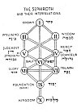

  
[Intangible Textual Heritage](../../index)  [Judaism](../index) 
[Index](index)  [Previous](rph02)  [Next](rph04) 

------------------------------------------------------------------------

 

[  
Click to enlarge](img/sephdiag.jpg)  
THE SEPHIROTH AND THEIR INTERRELATIONS  

 

------------------------------------------------------------------------

[Next: Summary of Contents](rph04)
