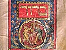

  
[Intangible Textual Heritage](../../index)  [Judaism](../index) 
[Index](index)  [Previous](spb28)  [Next](spb30) 

------------------------------------------------------------------------

  
*The Standard Prayer Book*, tr. by Simeon Singer, \[1915\], at
Intangible Textual Heritage

------------------------------------------------------------------------

p. 333

### KIDDUSH FOR FESTIVALS

------------------------------------------------------------------------

*To be said on Passover, Pentecost and Tabernacles*.

*When the Festival occurs on Sabbath begin here:—*

And it was evening and it was morning,—the sixth day.

And the heaven and the earth were finished and all their host. And on
the seventh day God had finished his work which he had made: and he
rested on the seventh day from all his work which he had made. And God
blessed the seventh day, and he hallowed it, because he rested thereon
from all his work which God had created and made.

Blessed art thou, O Lord our God, King of the universe, who createst the
fruit of the vine.

*On Sabbath add the words in brackets*.

Blessed art thou, O Lord our God, King of the universe, who hast chosen
us from all peoples, and exalted us above all tongues, and sanctified us
by thy commandments. And thou hast given us in love, O Lord our God,
\[Sabbaths for rest,\] appointed times for gladness, festivals and
seasons for joy; \[this Sabbath day and\] this day of—

*On Passover say:—*

The Feast of Unleavened Bread, the season of our Freedom;

*On Pentecost:—*

The Feast of Weeks, the season of the Giving of our Law;

p. 334

*On Tabernacles:—*

The Feast of Tabernacles, the season of our Gladness;

*On the Eighth Day of Solemn Assembly and on the Rejoicing of the Law*.

The Eighth-day Feast of Solemn Assembly, the season of our Gladness.

\[in love\]; an holy convocation, as a memorial of the departure from
Egypt; for thou hast chosen us, and sanctified us above all peoples, and
thy holy \[Sabbath and\] appointed times thou hast caused us to inherit
\[in love and favor\] in joy and gladness. Blessed art thou, O Lord, who
sanctifiest \[the Sabbath,\] Israel and the festive seasons.

*On Saturday night the following is added:—*

Blessed art thou, O Lord our God, King of the universe, who createst the
light of the fire.

Blessed art thou, O Lord our God, King of the universe, who makest a
distinction between holy and profane, between light and darkness,
between Israel and other nations, between the seventh day and the six
working days. Thou hast made a distinction between the holiness of the
Sabbath and that of the festival, and hast hallowed the seventh day
above the six working days; thou hast distinguished and sanctified thy
people Israel by thy holiness. Blessed art thou, O Lord, who makest a
distinction between holy and holy.

Blessed art thou, O Lord our God, King of the universe, who hast kept us
in life, and hast preserved us, and enabled us to reach this season.

*The last Blessing is said on the following occasions:—The first two
nights of Passover; the two nights of Pentecost; the first two nights of
Tabernacles; on the night of the Eighth Day of Solemn Assembly, and on
that of the Rejoicing of the Law*.

------------------------------------------------------------------------

------------------------------------------------------------------------

[Next: Meditation in the Tabernacle](spb30)

