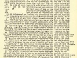

  
[Intangible Textual Heritage](../../index)  [Judaism](../index) 
[Talmud](../talmud)  [Index](index)  [Previous](edu04)  [Next](edu06) 

------------------------------------------------------------------------

  
*Babylonian Talmud, Book 9: Tracts Maccoth, Shebuoth, Eduyoth, Abuda
Zara, and Horioth*, tr. by Michael L. Rodkinson, \[1918\], at Intangible
Textual Heritage

------------------------------------------------------------------------

p. 18

# CHAPTER V.

MISHNA *I*.: R. Jehudah attested six cases where the decisions of the
Beth Shamai are lenient, and those of Beth Hillel rigorous. The blood of
a carcass is, according to the former, clean, but unclean, according to
Beth Hillel. The egg of a fowl carcass, if it looks like the ordinary
egg sold in market, is allowed by Beth Shamai, but not otherwise, while
the Beth Hillel prohibit it in all cases. However, both prohibit the egg
of an internally injured, for it was formed in a prohibited stage. The
menses of a heathen woman as well as the clean blood of a leprous woman
in confinement, Beth Shamai declare clean and Beth Hillel consider it to
be like her spittle or urine. The fruit of the Sabbathic year one may
enjoy with or without reward, according to Beth Shamai, the Beth Hillel
hold that one may eat it and reward somehow the owner. A leather bag is
subject to defilement, according to Beth Shamai, if it is bound and
fastened, and the Beth Hillel hold so even when it is not bound.
(Shebieth, IV.)

MISHNA *II*.: R. Jose quotes also similar decisions of six cases. Beth
Shamai allow to serve on the table, but not to eat, poultry together
with cheese, while Beth Hillel forbid the one as well as the other.
Likewise allow the former to separate Terumah from olives for their oil
and for the wine from grapes, and the latter prohibit it. According to
Beth Shamai he who sows seeds within four ells in the vineyard has
thereby sanctified one row, while according to Beth Hillel, two rows
(*i.e.*, the rows in question must not be sown). Flour put into boiling
water is, Beth Shamai say, free from Chalah, and the Beth Hillel say it
is not. The Beth Shamai allow to use rain-water (running down hill) as a
legal bath, the Beth Hillel do not. Finally, Beth Shamai allow a
proselyte, who underwent circumcision on the eve of Passover, to immerse
himself and then partake in the Passover-offering, while Beth Hillel
declare that he who parts with his prepuce is like one returning from
the grave.

MISHNA *III*.: R. Ismael cites to the same effect the decisions of the
following three cases: The book Ecclesiastæ does

p. 19

not, according to Beth Shamai, render unclean the hands, while it does
so according to Beth Hillel. Sin-cleansing water that has already
performed its destination is declared clean by former and unclean by
latter. The same divergence of opinion the two schools show with regard
to the cleanness and uncleanness of black cumin and its tithe. (Negaim,
Mishna III. Chapter V.)

MISHNA *IV*.: R. Elazar quotes two cases to the same effect. The blood
of a woman lying-in, who has not bathed (as prescribed) is considered by
Beth Shamai as her spittle and urine, while Beth Hillel declare it
defiling always, moist or dry. The former agree, however, with the
latter view when the woman in question bore in a state of running issue,
then the issue defiles immaterial whether dry or moist. (Tract Nidah
II., Mishna VI.)

MISHNA *V*.: If of four brothers two who are married to two sisters die,
the latter perform Chalitzah but cannot enter the levirate marriage; and
if such marriage has been hastily concluded, divorce must follow. R.
Eliezar quotes the Beth Shamai as declaring this marriage to remain, and
Beth Hillel as requiring divorce.

MISHNA *VI*.: Aqavia b. Mehallalel testified four things, which the
sages persuaded him to retract, promising him therefor the chair of
presiding justice in Israel, to this he responded: I shall prefer to
hear the name fool all my life to becoming a wicked even for one hour
before the Omnipresent; but let nobody say "He retracted for the sake of
an office!" Here are his rules: He declared unclean the white hair (left
from a previous case of leprosy) as well as the yellow blood (of a
woman), both which the sages declare clean; he allowed to make use of
the faded hair of a blemished first-born cattle slaughtered immediately
after the hair has been put into a (wall) niches, while the sages forbid
it; finally, he prohibited to give the jealousy-water to a female
proselyte or to a freed maid-slave, which the sages allow.

The following episode was thereupon presented to him: A certain
Karkmith, a freed maid-slave in Jerusalem, was made to drink the
aforesaid water by Shmaia and Ahtalion, to which he replied: They did it
only in a "make-believe" way. (They, being themselves proselytes, did
it.) And they placed him under ban, and when he died the court stoned
his coffin. R. Jehudah remonstrated: That Aqavia b. Mehallalel, who
among all Israel on whom the doors of the temple court-yard closed, was
unequalled in both erudition and piety, should have been placed

p. 20

under ban? Impossible! It was Eliezar b. 'Hanoch that was excommunicated
for his trifling with the rule concerning hand-cleaning; and when he
died the court sent to put a stone on his coffin; whence it may be
inferred that the coffin of him who dies while under ban is to be
stoned.

MISHNA *VII*.: While on his death-bed he (Aqavia b. Mehallalel) thus
spoke to his son: Reject the four rules I have been teaching; I adhered
to them because I had received them from a majority, and the others
likewise had them from a similar source; we both, therefore, remained
true to our traditions; but you have learned them of an individual and
then of a majority, now it is more advisable to abandon the opinion of
the individual and to follow that of the majority. Then the son's
request to commend him to his friends he refused, saying: It is not
because I find fault with you, but let your own conduct be your
recommendation. (Explained at length in Pessachim. V., Mishna IV.)

------------------------------------------------------------------------

[Next: Chapter VI](edu06)
