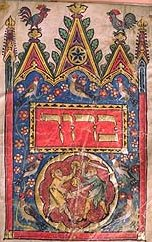

  
[Intangible Textual Heritage](../../index)  [Judaism](../index) 

------------------------------------------------------------------------

<table width="75%">
<colgroup>
<col style="width: 50%" />
<col style="width: 50%" />
</colgroup>
<tbody>
<tr class="odd">
<td width="50%" data-valign="TOP"></td>
<td width="50%" data-valign="CENTER"><h1 id="tractate-berakoth" data-align="CENTER">Tractate Berakoth</h1>
<h2 id="by-a.-lukyn-williams" data-align="CENTER">by A. Lukyn Williams</h2>
<h4 id="section" data-align="CENTER">[1921]</h4></td>
</tr>
</tbody>
</table>

------------------------------------------------------------------------

[Contents](#contents)    [Start Reading](tbr00)

------------------------------------------------------------------------

This is a translation of Tractate Berakoth, a portion of the Mishna
which deals with prayer: specifically when, where and how to pray. It
includes the Mishna and the Tosephta commentary. This translation was
produced by a Christian scholar in the early 20th century. While
Williams is not hesitant to reference Christian texts, he is primarily
interested in how the rules expressed in this Mishna influenced the
early Christians, not in making a sectarian point. This adds some
comparative interest. In addition, the extensive scholarly apparatus
increases the value of this edition, the only complete public domain
translation of this part of the Mishna.

------------------------------------------------------------------------

 [Title Page](tbr00)  
[Editor's Preface](tbr01)  
[Contents](tbr02)  

### Introduction

[1. The Nature of the Tractate in General](tbr03)  
[2. Its Relation to the Teaching of the New Testament](tbr04)  
[3. The Relation of the Mishna and the Tosephta](tbr05)  
[4. The Authorities for the Text in Each Case](tbr06)  
[5. Bibliographical](tbr07)  
[6. Synopsis of Contents](tbr08)  
[Index to the Tosephta as Arranged in this Volume](tbr09)  

### Berakoth

### I. On Reciting the Shma‘

[M. I. 1-3; T. I. 1. The Time of Reciting the Shma‘ in the
Evening](tbr10)  
[M. I. 4; T. I. 2. The Time of Reciting the Shma‘ in the
Morning](tbr11)  
[M. I. 5-6; T. I. 4. Posture in Reciting the Shma‘](tbr12)  
[M. I. 7; T. I. 5-9. The Benedictions connected with the Shma‘](tbr13)  
[M. I. 8; T. I. 10-15, II. 1. The Going forth from Egypt](tbr14)  
[M. II. 1; T. II. 2. On Reciting the Shma‘ with Intention, and on
Saluting between the Sections](tbr15)  
[M. II. 2-3. The Sections of the Shma‘ and their Order](tbr16)  
[M. II. 4; T. II. 3-7. On Reciting the Shma‘ inaudibly or
irregularly](tbr17)  
[M. II. 5; T. II. 8-9. Where Workmen may Recite the Shma‘](tbr18)  
[M. II. 6; T. I. 3, II. 10. A Bridegroom and the Shma‘.
Gamaliel](tbr19)  
[M. II. 7-8. Gamaliel: Other Incidents of his Infraction of Traditional
Teaching](tbr20)  
[M. II. 9. A Bridegroom and the Shma‘ (continued)](tbr21)  
[M. III. 1. The Recitation of the Shma‘ if a Relation is Dead, and at
the Burial](tbr22)  
[M. III. 2; T. II, 11. After the Burial](tbr23)  
[M. III. 3. The Case of Women, Slaves, and Children](tbr24)  
[M. III. 4-6; T. II, 12-21. The Shma‘, etc., in cases of Sexual
Uncleanness](tbr25)  

### II.—The Eighteen Benedictions

[M. IV. 1; T. III. 1-3. The Three Times of Prayer](tbr26)  
[M. IV. 2. Parenthesis: A Rabbi's Prayers on Entering and Leaving His
School.](tbr27)  
[M. IV. 3. The Eighteen Prayers and their Abstract](tbr28)  
[M. IV. 4; T. III. 7. The Prayer not to be Mechanical: Prayer when in
Danger](tbr29)  
[M. IV. 5; T. III. 18. Prayer when riding on an Ass](tbr30)  
[M. IV. 6; T. III. 19. Prayer on a Ship or on a Raft](tbr31)  
[M. IV. 7; T. III. 10-13. The Additional Prayers—Whether to be said only
in a Congregation](tbr32)  
[M. V. 1; T. III. 4-21. The Posture and Attention in Prayer](tbr33)  
[M. V. 2; T. III. 9. The Mention of, and the Petition for, Rain, also
the Habdalah, in the Prayer](tbr34)  
[M. V. 3-4. Three Examples of Benedictions at Wrong Times. On Mistakes
made by the Leader](tbr35)  
[M. V. 5. On Mistakes (continued). R. Chanina's Knowledge of the Effect
of His Prayers](tbr36)  
[T. III. 22-25. Additional Matter](tbr37)  

### III.—Benedictions at Meals, etc.

[M. VI. 1-4; T. IV. 1-7. The Proper Forms for the Different
Foods](tbr38)  
[M. VI. 5. On One Benediction exempting Another](tbr39)  
[M. VI. 6-8; T. IV. 8-13, V. 5-9, IV. 14-21. Various Regulations
respecting Benedictions at Meals](tbr40)  
[T. V. 1-4. The Entrance on the Sabbath, the Meal, and the
Benedictions](tbr41)  
[M. VII. 1-2; T. V, 10. Who may be invited to partake in the Benediction
alter Meals](tbr42)  
[M VIII. 3; T. V. 14-20, 11-13. Women Slaves and Children excluded. The
Quantity of Food over which Grace must be said](tbr43)  
[M. VII. 4-6. The Words of the Invitation depend on the Number
Present](tbr44)  
[M. VII. 7; T. V. 19. Companies, how to be divided](tbr45)  
[M. VII. 8. On Companies joining for the Benediction at the End of a
Meal. The Benediction over Wine—Whether Water should be added
first](tbr46)  
[M. VIII. 1; T. VI. 1, III. 8. Points in Dispute between the Schools of
Shammai and Hillel: The Order of the Benedictions](tbr47)  
[M. VIII. 2, T. VI. 2. The Order of Washing Hands, and Mixing the
Cup](tbr48)  
[M. VIII. 3, T. VI. 4. Tidying the Room](tbr49)  
[M. VIII. 4; T. VI. 3-5. On Wiping one's Hands](tbr50)  
[M. VIII. 5; T. VI. 6. The Order of the Benedictions about Various
Objects at the End of Sabbath](tbr51)  
[M. VIII. 6. The Wording of the Benediction over the Lamp](tbr52)  
[M. VIII. 7; T. VI. 7-8. Parenthesis: When the Benediction must not be
said](tbr53)  
[M. VIII. 8. If the Benediction after a Meal has been
forgotten](tbr54)  
[M. VIII. 9, T. III. 26, V. 21-24. The Order of the Benedictions over
Wine and Food: When Amen may not be said](tbr55)  
[M. IX. 1; T. VII. 2. Benedictions at Scenes of Miracles, or of Past
Idolatry](tbr56)  
[M. IX 2; T. VII. 1-6. At Various Natural Phenomena, and at Good or Bad
Tidings](tbr57)  
[M. IX. 3. On Other Occasions](tbr58)  
[M. IX. 4-5; T. VII. 7-15. Parenthesis:—Prayers in Vain](tbr59)  
[M. IX. 6; T. VII. 16-18. On Praying when Entering and when Leaving a
Town](tbr60)  
[M. IX. 7. On Saying a Benediction for Evil: Deut. 6:5
expounded](tbr61)  
[M. IX. 8a; T. VII. 19. Against Irreverence for the Temple](tbr62)  
[M. IX. 8b; T. VII. 21-22, 20. The Closing Words of the
Benedictions](tbr63)  
[M. IX. 8c; T. VII. 23-25. Salutations in the Name](tbr64)  

### Indices

[I. The Names of Rabbis](tbr65)  
[II. General](tbr66)  
[III. Scripture References](tbr67)  
